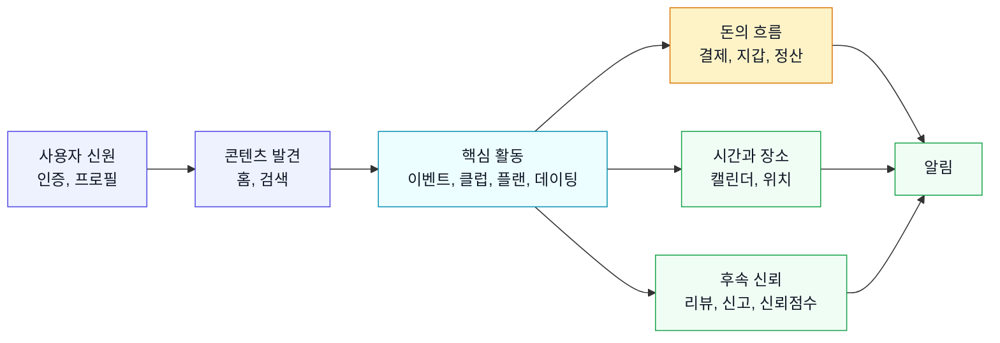

# Start Here: 서비스 큰 그림

community는 오프라인 모임, 클럽, 데이팅, 플랜 마켓을 하나의 사용자 계정과 지갑, 알림, 리뷰 체계로 연결한 플랫폼이다. 사용자는 관심사를 기반으로 콘텐츠를 발견하고, 실제 오프라인 활동에 참여하고, 결제나 정산을 마친 뒤 리뷰와 신뢰점수로 다음 활동의 품질을 높인다.

## 한 문장 정의

사용자가 관심사 기반 오프라인 활동을 발견하고, 참여하고, 관계를 이어가며, 돈과 신뢰가 필요한 후속 절차까지 앱 안에서 처리하는 서비스.

## 주요 사용자 유형

| 사용자 | 주된 목적 | 자주 쓰는 영역 |
|---|---|---|
| 참가자 | 이벤트나 클럽을 찾아 참여한다 | 홈, 검색, 이벤트, 클럽, 결제, 리뷰 |
| 호스트 | 모임을 만들고 참가자를 관리한다 | 이벤트, 클럽, 정산, 알림, 리뷰 |
| 클럽 운영자 | 멤버, 게시판, 정기모임, 기금을 관리한다 | 클럽, 이벤트, 정산, 결제 |
| 플랜 크리에이터 | 코스나 모임 계획을 상품화한다 | 플랜 마켓, 결제, 리뷰 |
| 플랜 구매자 | 검증된 코스를 구매해 활용한다 | 플랜 마켓, 이벤트, 리뷰 |
| 데이팅 사용자 | 인증된 사용자와 매칭하고 만남을 조율한다 | 프라이빗 데이팅, 캘린더, 위치, 리뷰 |

## 14개 업무 영역

| 번호 | 영역 | 비개발자용 설명 |
|---|---|---|
| 01 | 인증 & 온보딩 | 사용자가 가입하고, 이메일/소셜 인증을 마치고, 추천에 필요한 기본 정보를 채우는 영역 |
| 02 | 홈 피드 | 로그인 후 처음 보는 추천 콘텐츠 입구 |
| 03 | 이벤트 | 오프라인 모임을 발견, 생성, 신청, 참석, 체크인, 사진 공유하는 핵심 영역 |
| 04 | 클럽 | 같은 관심사의 사람들이 모인 장기 커뮤니티와 운영 기능 |
| 05 | 검색 | 이벤트, 클럽, 플랜, 사용자, 장소를 키워드와 필터로 찾는 영역 |
| 06 | 결제 & 지갑 | 포인트 충전, 결제수단, 자동충전, 구독, 거래내역, 호스트 정산금 확인 |
| 07 | 모임 정산 | 모임 후 비용을 참가자에게 나누고 납부/확인/이의제기를 처리하는 영역 |
| 08 | 플랜 마켓 | 데이트/모임 코스를 상품처럼 만들고 구매하는 영역 |
| 09 | 프라이빗 데이팅 | 본인 인증 기반 1:1 매칭, 채팅, 만남 제안, 차단 |
| 10 | 캘린더 | 내 일정, 참석 모임, 가용시간, 데이팅 만남을 시간축으로 보는 영역 |
| 11 | 리뷰 & 신고 | 활동 후 평가, 신고, 신뢰점수, 취향 데이터가 쌓이는 영역 |
| 12 | 알림 | 푸시, 알림함, 카테고리별 수신 설정, 방해금지, 기기 관리 |
| 13 | 프로필 & 설정 | 내 프로필, 주소, 선호태그, 데이터 내보내기, 계정 삭제/비활성화 |
| 14 | 위치 & 길찾기 | 장소, 경로 안내, 이벤트 참석자 위치 공유와 프라이버시 관리 |

## 업무 영역을 묶어 보는 법



## 처음 파악할 때의 관점

이 서비스는 화면 단위보다 사용자 여정 단위로 이해하는 편이 쉽다.

```
가입한다
  -> 관심사를 등록한다
  -> 홈/검색에서 활동을 찾는다
  -> 신청하거나 구매한다
  -> 실제로 만난다
  -> 돈을 정리한다
  -> 평가와 신뢰가 다음 추천에 반영된다
```

기획자가 기능을 검토할 때는 "이 화면이 어떤 화면인가"보다 "사용자가 어떤 상태에서 들어와서 어떤 상태로 나가는가"를 먼저 확인하는 것이 좋다.
