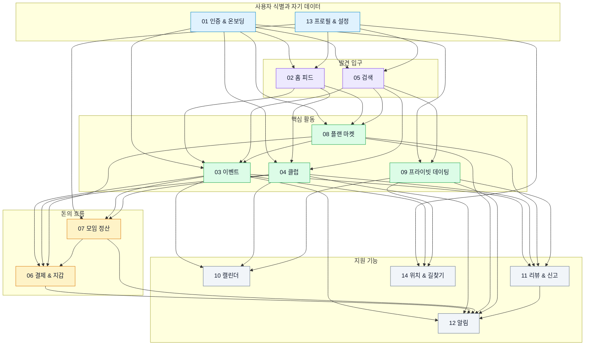
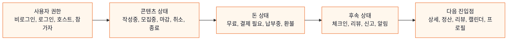

# 전체 서비스 지도

이 문서는 14개 업무 영역이 서로 어떻게 기대고 있는지 보여준다. 새 기능을 기획할 때는 해당 기능이 단일 화면에서 끝나는지, 결제/알림/리뷰/위치 같은 보조 영역까지 건드리는지 먼저 확인해야 한다.

## 전체 구조

## 의존 관계를 읽는 방법

| 연결 | 의미 | 기획 시 확인할 것 |
|---|---|---|
| 인증/프로필 -> 모든 영역 | 대부분의 개인화와 권한 판단의 출발점 | 비로그인 허용 여부, 온보딩 미완료 상태 처리 |
| 홈/검색 -> 핵심 활동 | 사용자가 콘텐츠로 진입하는 입구 | 카드 노출 기준, 필터, 정렬, 빈 상태 |
| 이벤트/클럽/플랜/데이팅 -> 결제 | 유료 참여, 구매, 구독, 기금, 티켓이 발생 | 잔액 부족, 자동충전, 결제 실패, 환불 |
| 이벤트/클럽 -> 정산 | 모임 후 비용 분담이 발생 | 누가 생성하고, 누가 납부하고, 언제 완료되는지 |
| 핵심 활동 -> 캘린더/위치 | 시간과 장소가 필요한 활동 | 일정 등록 기준, 위치 공유 동의, 외부 지도 연결 |
| 핵심 활동 -> 리뷰/신고 | 활동 후 신뢰 데이터가 쌓임 | 리뷰 작성 자격, 신고 중복, 신뢰점수 반영 |
| 여러 영역 -> 알림 | 상태 변화가 사용자에게 전달됨 | 누가 받는지, 언제 받는지, 끌 수 있는지 |

## 화면보다 먼저 봐야 할 축

## 기능 변경 영향도 체크

새 기능을 넣거나 기존 기능을 바꿀 때 아래 질문을 순서대로 확인한다.

| 질문 | 예시 |
|---|---|
| 이 기능은 누가 쓸 수 있는가? | 참가자만, 호스트만, 로그인 사용자 전체, 비로그인 포함 |
| 어떤 상태에서 버튼이 보이는가? | 모집중일 때만, 정산 ACTIVE일 때만, 리뷰 미작성일 때만 |
| 돈이 움직이는가? | 포인트 차감, 자동충전, 환불, 호스트 정산금 |
| 알림이 나가는가? | 신청 승인, 대기열 승격, 정산 독촉, 결제 실패 |
| 시간/장소와 연결되는가? | 캘린더 등록, 길찾기, 위치 공유 |
| 리뷰/신뢰에 반영되는가? | 참석 후 리뷰, 노쇼, 신고, 신뢰점수 변동 |
| 설정에서 끌 수 있는가? | 알림 카테고리, 위치 공유, 매칭 노출 |
