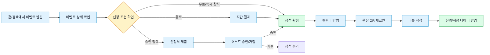
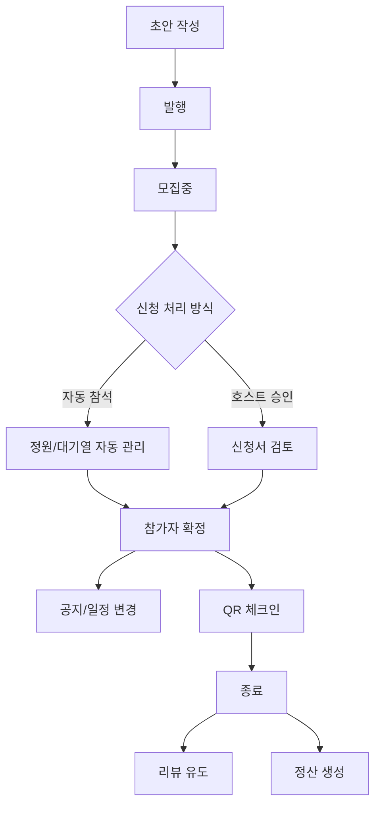
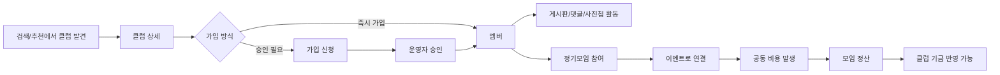
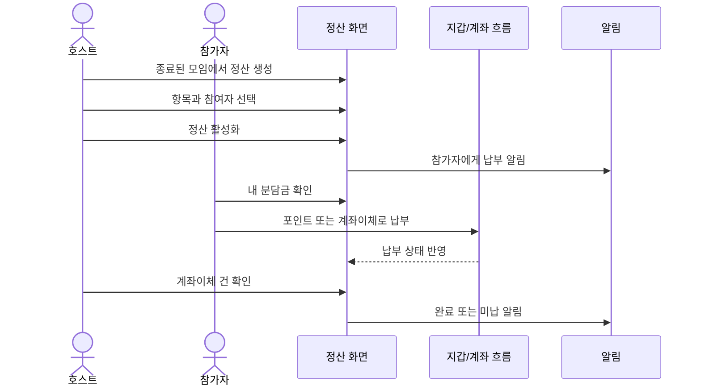
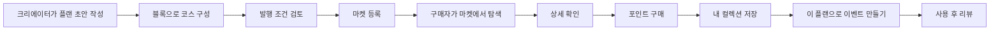
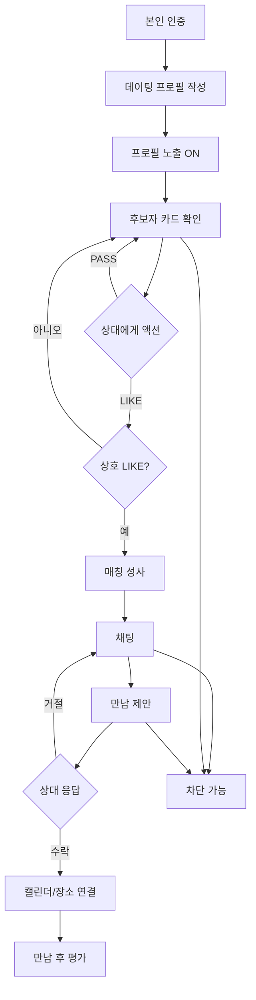
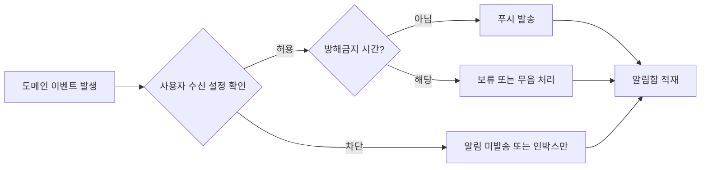

# 대표 사용자 여정

이 문서는 새 기획자가 서비스 흐름을 기능 목록이 아니라 실제 사용자 행동으로 이해하기 위한 문서다. 각 여정은 "시작 상태 -> 사용자가 하는 일 -> 시스템 판단 -> 종료 상태"로 읽는다.

## 여정 1. 모임 발견에서 리뷰까지



기획 체크포인트:

| 단계 | 확인할 것 |
|---|---|
| 발견 | 추천/검색 결과에 왜 노출되는가 |
| 상세 | 비로그인, 호스트, 참가자에게 CTA가 어떻게 달라지는가 |
| 신청 | 승인 필요, 정원 초과, 대기열, 유료 조건이 어떻게 갈라지는가 |
| 참석 | 캘린더, 알림, 위치/길찾기 연결이 필요한가 |
| 체크인 | 체크인 가능한 시간과 권한은 무엇인가 |
| 리뷰 | 실제 참석자만 작성 가능한가, 중복 작성은 막히는가 |

## 여정 2. 호스트가 이벤트를 만들고 운영한다

```
이벤트 초안 작성
  -> 장소/시간/정원/승인 방식 설정
  -> 발행
  -> 참가 신청 수신
  -> 승인/거절 또는 대기열 관리
  -> 일정 변경/공지/취소 가능
  -> 현장 체크인 관리
  -> 종료 후 리뷰와 정산으로 이동
```



기획 체크포인트:

| 주제 | 질문 |
|---|---|
| 생성 | 필수 입력값을 다 채우기 전 발행을 막는가 |
| 모집 | 승인제/선착순/대기열 정책을 어떻게 보여주는가 |
| 운영 | 일정 변경이나 취소 시 누구에게 어떤 알림이 가는가 |
| 종료 | 정산, 리뷰, 사진첩으로 어떻게 이어지는가 |

## 여정 3. 클럽 가입에서 공동 정산까지



기획 체크포인트:

| 단계 | 확인할 것 |
|---|---|
| 가입 | 공개 클럽과 승인제 클럽의 CTA 차이 |
| 멤버 권한 | 소유자, 관리자, 일반 멤버, 차단 사용자의 액션 차이 |
| 커뮤니티 | 게시글/댓글/사진첩 신고와 삭제 권한 |
| 재무 | 기금, 후원, 출금, 공동 정산이 어디서 갈라지는가 |

## 여정 4. 정산 생성과 납부



정산의 핵심은 돈을 나누는 방식보다 상태다.

```
DRAFT: 호스트가 만들고 편집하는 단계
ACTIVE: 참가자에게 납부 요청이 열린 단계
COMPLETED: 모든 납부/확인이 끝난 단계
CANCELLED: 정산이 취소된 단계
```

## 여정 5. 플랜 작성, 판매, 구매, 활용



기획 체크포인트:

| 주제 | 질문 |
|---|---|
| 작성 | 초안 상태에서만 편집 가능한 항목은 무엇인가 |
| 발행 | 가격, 커버, 설명, 블록 등 발행 요건은 무엇인가 |
| 구매 | 이미 구매한 상품, 잔액 부족, 번들 일부 중복은 어떻게 처리하는가 |
| 활용 | 구매한 플랜을 이벤트 생성으로 넘길 때 어떤 정보가 복사되는가 |

## 여정 6. 데이팅 매칭과 안전 흐름



기획 체크포인트:

| 단계 | 확인할 것 |
|---|---|
| 인증 | 미인증 사용자는 어디까지 볼 수 있는가 |
| 프로필 | 노출 ON/OFF, 사진 개수, 소개 입력 조건 |
| 스와이프 | 일일 LIKE 한도, 매칭 성사 모달, 후보자 없음 상태 |
| 채팅 | 차단 시 채팅방과 매칭 상태가 어떻게 바뀌는가 |
| 만남 | 제안, 수락/거절, 장소, 일정, 안전 기능의 노출 기준 |

## 여정 7. 알림과 설정의 공통 흐름



알림은 기능의 주인공이 아니라 다른 기능에서 생긴 상태 변화를 사용자에게 전달하는 보조 흐름이다. 기획할 때는 "알림 화면에 무엇을 보여줄지"보다 "어떤 사건이 발생했을 때 누구에게 어떤 문구로 알려야 하는지"를 먼저 정해야 한다.
