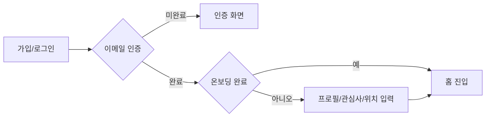
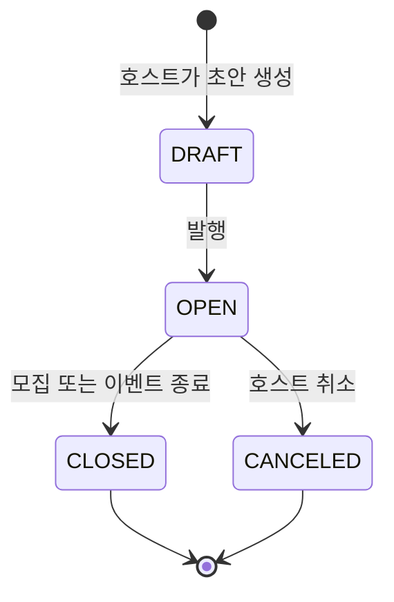
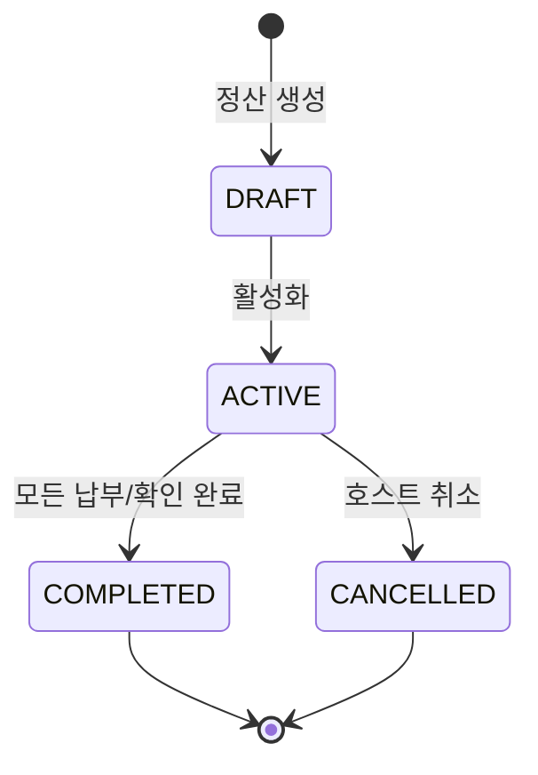

# 14개 업무 영역 플레이북

각 영역은 기획자가 빠르게 훑을 수 있도록 같은 형식으로 정리했다.

## 01. 인증 & 온보딩

목적: 사용자가 서비스에 들어올 자격을 얻고, 추천 가능한 기본 정보를 채운다.

| 항목 | 내용 |
|---|---|
| 주요 사용자 | 신규 사용자, 기존 사용자 |
| 핵심 행동 | 이메일/소셜 로그인, 이메일 인증, 비밀번호 재설정, 토큰 갱신, 온보딩, 관심태그 설정 |
| 종료 상태 | 로그인 토큰 보유, 이메일 인증 완료, 프로필/관심사/위치 정보 확보 |
| 연결 영역 | 홈 피드, 프로필, 검색/추천 |
| 기획 주의점 | 미인증, 온보딩 미완료, 토큰 만료, 소셜 계정 해제 후 재로그인 흐름 |

## 02. 홈 피드

목적: 사용자가 가장 먼저 콘텐츠를 발견하는 개인화 입구를 제공한다.

| 항목 | 내용 |
|---|---|
| 주요 사용자 | 로그인 사용자, 일부 비로그인 사용자 |
| 핵심 행동 | 추천 이벤트/클럽/플랜 확인, 트렌딩 확인, 더보기, 새로고침, 검색/알림 진입 |
| 종료 상태 | 특정 이벤트/클럽/플랜 상세로 이동하거나 홈 상태 유지 |
| 연결 영역 | 이벤트, 클럽, 플랜 마켓, 검색, 알림 |
| 기획 주의점 | 섹션별 실패, 빈 섹션, 새로고침, 추천 기준 설명의 과노출 방지 |

## 03. 이벤트

목적: 오프라인 모임을 만들고, 발견하고, 신청하고, 실제 참석까지 완수한다.

| 항목 | 내용 |
|---|---|
| 주요 사용자 | 참가자, 호스트 |
| 핵심 행동 | 이벤트 목록/상세, 생성, 수정/취소, 신청, 승인/거절, 대기열, 체크인, 사진첩, 위시리스트 |
| 종료 상태 | 참석 확정, 대기, 신청 심사중, 취소, 체크인 완료, 리뷰 가능 |
| 연결 영역 | 결제, 정산, 캘린더, 위치, 알림, 리뷰, 플랜 |
| 기획 주의점 | 호스트와 참가자의 CTA가 다르며, 정원/승인/결제 조건이 섞일 수 있음 |

## 04. 클럽

목적: 장기 커뮤니티 운영을 위한 멤버, 게시판, 정기모임, 재무 흐름을 제공한다.

| 항목 | 내용 |
|---|---|
| 주요 사용자 | 일반 멤버, 관리자, 클럽 소유자 |
| 핵심 행동 | 클럽 탐색, 가입/승인, 멤버 관리, 게시글/댓글, 사진첩, 클럽 이벤트, 기금, 후원, 출금, 구독 |
| 종료 상태 | 멤버가 되거나, 대기/거절/차단 상태가 되거나, 클럽 활동 데이터가 쌓임 |
| 연결 영역 | 이벤트, 정산, 결제, 리뷰, 알림 |
| 기획 주의점 | 소유자/관리자/멤버 권한 차이, 클럽 기금과 개인 지갑 구분 |

## 05. 검색

목적: 사용자가 원하는 콘텐츠를 빠르게 찾고, 검색 행동을 저장/재사용한다.

| 항목 | 내용 |
|---|---|
| 주요 사용자 | 탐색 중인 사용자 |
| 핵심 행동 | 키워드 검색, 자동완성, 필터, 최근 검색어, 저장된 검색 |
| 종료 상태 | 검색 결과 상세 진입, 최근 검색어 저장, 저장 검색 등록 |
| 연결 영역 | 이벤트, 클럽, 플랜, 데이팅, 프로필 |
| 기획 주의점 | 입력 전/입력 중/검색 후 화면 상태가 다르며 필터 초기화 정책이 중요 |

## 06. 결제 & 지갑

목적: 포인트 잔액 기반 결제와 거래내역, 결제수단, 자동충전, 구독, 정산금 조회를 제공한다.

| 항목 | 내용 |
|---|---|
| 주요 사용자 | 결제 사용자, 호스트, 구독 사용자 |
| 핵심 행동 | 지갑 조회, 충전, 거래내역, 결제수단 등록, 자동충전, 환불, 티켓/구독 구매, 수익/정산 조회 |
| 종료 상태 | 잔액 증가/감소, 결제 성공/실패, 환불, 거래내역 생성 |
| 연결 영역 | 이벤트, 클럽, 플랜 마켓, 모임 정산, 알림 |
| 기획 주의점 | 잔액 부족, 결제 실패, 자동충전 재시도, 환불 조건, 정산 상태 구분 |

## 07. 모임 정산

목적: 모임 후 비용을 참가자에게 나누고 납부/확인/이의제기까지 처리한다.

| 항목 | 내용 |
|---|---|
| 주요 사용자 | 호스트, 참가자 |
| 핵심 행동 | 정산 생성, 항목 추가, 활성화, 분담금 납부, 이체 확인, 독촉, 마감 연장, 이의제기, 환불 규정 |
| 종료 상태 | 정산 초안, 납부 진행, 완료, 취소 |
| 연결 영역 | 이벤트, 결제/지갑, 알림, 프로필 계좌 |
| 기획 주의점 | DRAFT와 ACTIVE에서 허용 액션이 다르며, 호스트 확인이 필요한 계좌이체가 있음 |

## 08. 플랜 마켓

목적: 사용자가 코스나 모임 계획을 상품으로 만들고, 다른 사용자가 구매해 활용한다.

| 항목 | 내용 |
|---|---|
| 주요 사용자 | 크리에이터, 구매자 |
| 핵심 행동 | 플랜 작성, 블록 편집, 발행, 마켓 등록, 검색, 상세 확인, 구매, 컬렉션, 이벤트 생성, 리뷰 |
| 종료 상태 | DRAFT/PUBLISHED 플랜, 판매중 상품, 구매 완료, 컬렉션 보관 |
| 연결 영역 | 결제, 이벤트, 리뷰, 검색 |
| 기획 주의점 | 크리에이터 화면과 구매자 화면이 같은 플랜을 서로 다른 관점으로 보여줌 |

## 09. 프라이빗 데이팅

목적: 본인 인증된 사용자 간 매칭, 채팅, 만남 제안, 안전 보호 흐름을 제공한다.

| 항목 | 내용 |
|---|---|
| 주요 사용자 | 데이팅 사용자 |
| 핵심 행동 | 본인 인증, 프로필 작성, 후보자 스와이프, 매칭 목록, 채팅, 만남 제안, 차단, 프로필 조회 이력 |
| 종료 상태 | 인증 완료, 프로필 활성, 매칭 성사, 채팅 진행, 만남 제안 수락/거절, 차단 |
| 연결 영역 | 캘린더, 위치, 리뷰, 알림 |
| 기획 주의점 | 안전 기능은 보조가 아니라 필수 전제이며, 차단은 여러 화면에서 발생할 수 있음 |

## 10. 캘린더

목적: 사용자 일정, 이벤트 참석, 데이팅 만남, 가용시간을 하나의 시간축으로 보여준다.

| 항목 | 내용 |
|---|---|
| 주요 사용자 | 일정 관리가 필요한 사용자 |
| 핵심 행동 | 월/일 뷰, 일정 상세 라우팅, 단일 가용시간, 반복 가용시간, 타인 가용시간 조회 |
| 종료 상태 | 일정 조회, 가용성 등록/수정/삭제, 다른 도메인으로 일정 정보 전달 |
| 연결 영역 | 이벤트, 클럽, 데이팅 |
| 기획 주의점 | 캘린더는 보통 상태를 직접 바꾸기보다 다른 기능의 일정 정보를 모아 보여줌 |

## 11. 리뷰 & 신고

목적: 활동 후 평가, 신고, 신뢰점수, 취향 데이터로 서비스 품질을 높인다.

| 항목 | 내용 |
|---|---|
| 주요 사용자 | 참석자, 신고자, 프로필 방문자 |
| 핵심 행동 | 리뷰 작성/조회/수정/삭제, 신고, 신뢰점수 조회, 취향 평가, 취향 프로필 |
| 종료 상태 | 리뷰 생성, 신고 접수, 신뢰점수 변동, 취향 데이터 누적 |
| 연결 영역 | 이벤트, 클럽, 플랜, 데이팅, 프로필 |
| 기획 주의점 | 공개 리뷰와 비공개 취향 평가는 목적과 노출 범위가 다름 |

## 12. 알림

목적: 여러 도메인에서 발생한 상태 변화를 사용자가 인지하고 통제할 수 있게 한다.

| 항목 | 내용 |
|---|---|
| 주요 사용자 | 모든 로그인 사용자 |
| 핵심 행동 | 알림 목록, 읽음 처리, 그룹 보기, 카테고리 설정, 방해금지, 기기 토큰 관리, 권한 배너 |
| 종료 상태 | 읽음 상태 변경, 수신 설정 변경, 기기 등록/삭제, OS 권한 복구 |
| 연결 영역 | 이벤트, 클럽, 결제, 정산, 플랜, 데이팅, 리뷰 |
| 기획 주의점 | 알림은 개별 기능의 결과물이므로 트리거와 수신자를 먼저 정의해야 함 |

## 13. 프로필 & 설정

목적: 사용자가 자기 데이터와 계정 생명주기를 직접 관리한다.

| 항목 | 내용 |
|---|---|
| 주요 사용자 | 로그인 사용자 |
| 핵심 행동 | 프로필 허브, 프로필 편집, 주소 관리, 선호태그, 데이터 내보내기, 계정 삭제 예약, 즉시 비활성화 |
| 종료 상태 | 프로필/주소/태그 갱신, 데이터 추출 진행, 삭제 예약, 계정 비활성화 |
| 연결 영역 | 인증, 홈 추천, 위치, 정산 계좌, 리뷰 신뢰점수 |
| 기획 주의점 | 삭제 예약과 즉시 비활성화는 사용자 영향이 다르며 안내 문구가 중요 |

## 14. 위치 & 길찾기

목적: 장소, 경로 안내, 위치 공유와 프라이버시 통제를 제공한다.

| 항목 | 내용 |
|---|---|
| 주요 사용자 | 이벤트 참석자, 데이팅 사용자, 길찾기 사용자 |
| 핵심 행동 | 이벤트 위치 공유 opt-in/out, 공유 시간 연장, 프라이버시 대시보드, 길찾기, 역지오코딩 |
| 종료 상태 | 위치 공유 활성/비활성, 경로 안내, 주소 변환 |
| 연결 영역 | 이벤트, 데이팅, 프로필 주소 |
| 기획 주의점 | 위치 공유는 반드시 사용자의 명시적 동의와 중지 동선을 함께 가져야 함 |
