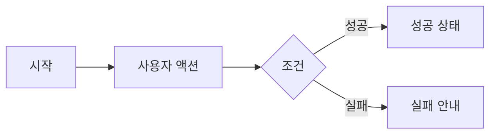
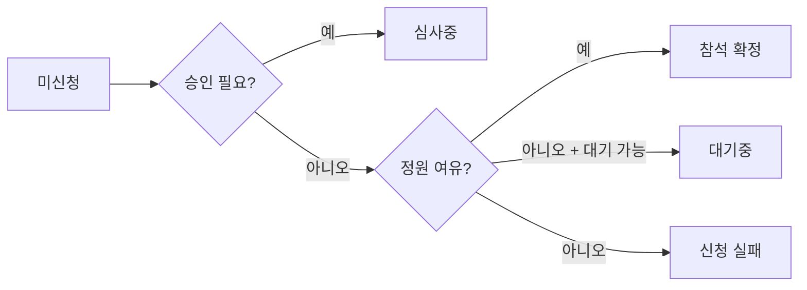
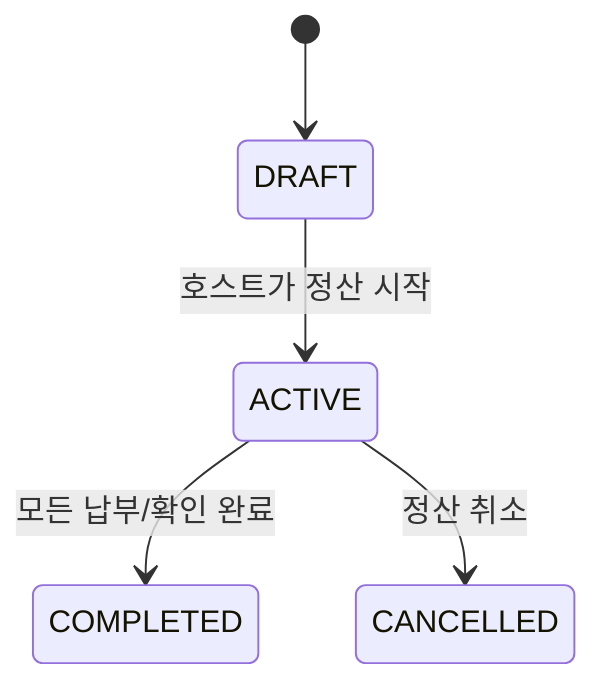

# 기능 카드 템플릿

이 템플릿은 117개 세부 기능을 Notion 카드로 옮길 때 사용한다. 원문 링크 없이도 기획자가 기능의 목적, 상태, 예외를 빠르게 파악하도록 설계했다.

## 카드 기본 형식

````markdown
# FXX-YY. 기능명

## 한 줄 설명
사용자가 어떤 목적을 달성하는 기능인지 한 문장으로 적는다.

## 사용자
- 주 사용자:
- 보조 사용자:

## 시작 조건
- 로그인 필요 여부:
- 필요한 사전 상태:
- 진입 화면/상황:

## 기본 흐름
1. 사용자가 ...
2. 화면은 ...
3. 시스템은 ...
4. 성공하면 ...

## 분기와 예외
| 상황 | 사용자에게 보이는 결과 | 정책 메모 |
|---|---|---|
|  |  |  |

## 상태 변화
Before -> After 형태로 적는다.

## 알림/돈/위치/리뷰 영향
| 영향 영역 | 있음/없음 | 내용 |
|---|---|---|
| 알림 |  |  |
| 결제/정산 |  |  |
| 캘린더 |  |  |
| 위치 |  |  |
| 리뷰/신뢰 |  |  |

## 간단 도식

````

## 예시 1. 이벤트 참석 신청 카드

# F03-05. 이벤트 신청 & 참석

## 한 줄 설명
참가자가 이벤트 상세에서 참석 의사를 제출하고, 조건에 따라 참석 확정, 심사중, 대기중 상태로 진입한다.

## 사용자

- 주 사용자: 이벤트 참가자
- 보조 사용자: 호스트

## 시작 조건

- 사용자가 이벤트 상세 화면에 있다.
- 이벤트가 신청 가능한 상태다.
- 사용자가 호스트 본인이 아니어야 한다.

## 기본 흐름

1. 사용자가 "참석 신청"을 누른다.
2. 시스템이 승인 필요 여부, 가격, 정원, 대기열 가능 여부를 확인한다.
3. 승인 필요 이벤트면 신청서 작성 흐름으로 이동한다.
4. 무료/즉시 참석 이벤트면 참석 상태가 바로 확정된다.
5. 정원이 찬 경우 대기열이 가능하면 대기 상태로 들어간다.
6. 성공 후 상세 화면의 CTA와 상태 배지가 바뀐다.

## 분기와 예외

| 상황 | 사용자에게 보이는 결과 | 정책 메모 |
|---|---|---|
| 승인 필요 | 신청이 접수되었고 호스트 검토를 기다림 | 신청서 상태는 PENDING |
| 정원 여유 | 참석 확정 | 참석 상태는 ATTENDING |
| 정원 초과 + 대기열 가능 | 대기 순번 표시 | 참석 상태는 WAITING |
| 정원 초과 + 대기열 불가 | 신청 불가 안내 | CTA 비활성 또는 실패 토스트 |
| 유료 이벤트 | 결제 확인 후 참석 처리 | 지갑 잔액 부족 분기 필요 |

## 상태 변화



## 알림/돈/위치/리뷰 영향

| 영향 영역 | 있음/없음 | 내용 |
|---|---|---|
| 알림 | 있음 | 승인 필요 신청은 호스트에게 알림, 대기 승격은 참가자에게 알림 |
| 결제/정산 | 조건부 있음 | 유료 이벤트는 지갑 결제가 선행될 수 있음 |
| 캘린더 | 있음 | 참석 확정 후 일정에 나타날 수 있음 |
| 위치 | 조건부 있음 | 장소/길찾기 흐름으로 이어질 수 있음 |
| 리뷰/신뢰 | 나중에 있음 | 체크인/참석 이후 리뷰 작성 가능 |

## 예시 2. 정산 활성화 카드

# F07-03. 정산 활성화

## 한 줄 설명
호스트가 초안 정산을 참가자에게 실제 납부 요청 가능한 상태로 전환한다.

## 사용자

- 주 사용자: 호스트
- 보조 사용자: 참가자

## 시작 조건

- 정산이 DRAFT 상태다.
- 최소 1개 이상의 정산 항목과 참가자별 분담금이 준비되어 있다.
- 사용자는 해당 이벤트의 호스트 또는 정산 생성자다.

## 기본 흐름

1. 호스트가 정산 현황에서 "정산 시작"을 누른다.
2. 시스템이 항목과 참여자 상태를 검증한다.
3. 정산 상태가 ACTIVE로 바뀐다.
4. 참가자에게 납부 요청 알림이 전송된다.
5. 참가자는 본인 분담금을 확인하고 포인트 또는 계좌이체로 납부할 수 있다.

## 분기와 예외

| 상황 | 사용자에게 보이는 결과 | 정책 메모 |
|---|---|---|
| 항목 없음 | 정산을 시작할 수 없음 | 항목 추가 안내 |
| 권한 없음 | 접근 또는 실행 불가 | 참가자는 활성화할 수 없음 |
| 이미 활성화됨 | 현재 납부 진행중 상태 표시 | 중복 실행 방지 |

## 상태 변화



## 알림/돈/위치/리뷰 영향

| 영향 영역 | 있음/없음 | 내용 |
|---|---|---|
| 알림 | 있음 | 참가자에게 납부 요청 발송 |
| 결제/정산 | 있음 | 참가자 납부 가능 상태가 됨 |
| 캘린더 | 없음 | 일정 변화 없음 |
| 위치 | 없음 | 위치 변화 없음 |
| 리뷰/신뢰 | 조건부 있음 | 미납/분쟁 정책이 신뢰 정책과 연결될 수 있음 |
