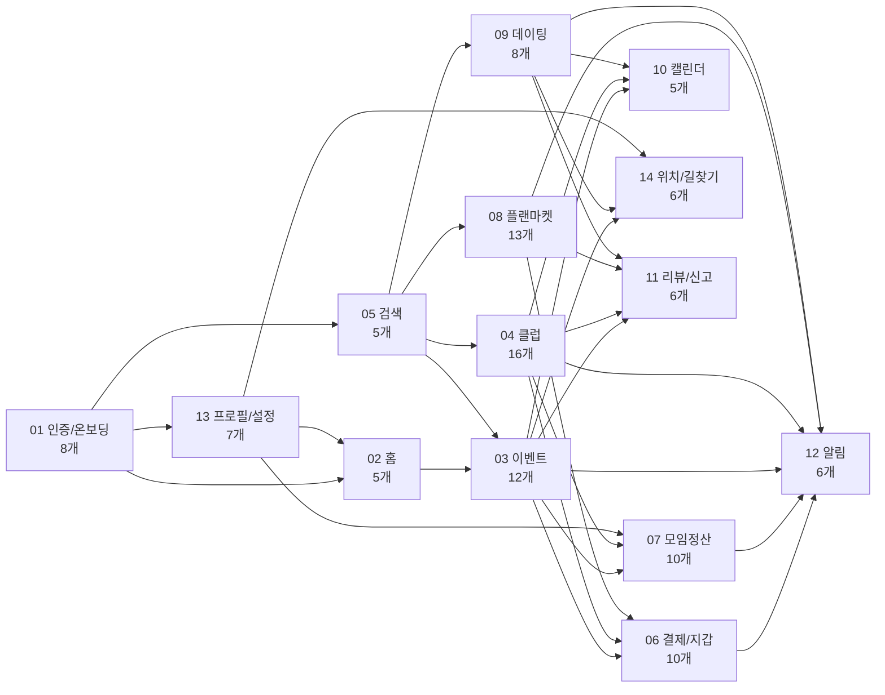

# 전체 기능 인벤토리

이 문서는 새 기획자가 놓치는 기능이 없도록 14개 업무 영역의 실제 기능 단위 117개를 모두 펼쳐 놓은 검산표다. 각 기능의 세부 정책은 별도 기능 카드로 확장하되, Notion 최상위 인덱스에는 이 표를 그대로 두는 것을 권장한다.

## 커버리지 요약

| 영역 | 기능 수 | 원문 시나리오 수 | 원문 도식 수 |
|---|---:|---:|---:|
| 01 인증 & 온보딩 | 8 | 82 | 34 |
| 02 홈 피드 | 5 | 38 | 21 |
| 03 이벤트 | 12 | 111 | 55 |
| 04 클럽 | 16 | 189 | 62 |
| 05 검색 | 5 | 41 | 20 |
| 06 결제 & 지갑 | 10 | 71 | 45 |
| 07 모임 정산 | 10 | 84 | 53 |
| 08 플랜 마켓 | 13 | 107 | 58 |
| 09 프라이빗 데이팅 | 8 | 70 | 32 |
| 10 캘린더 | 5 | 40 | 26 |
| 11 리뷰 & 신고 | 6 | 39 | 27 |
| 12 알림 | 6 | 38 | 25 |
| 13 프로필 & 설정 | 7 | 35 | 26 |
| 14 위치 & 길찾기 | 6 | 42 | 24 |
| 합계 | 117 | 987 | 508 |

## 전체 기능 흐름

## 01. 인증 & 온보딩

| ID | 기능 | 주 사용자 | 기획 검산 포인트 |
|---|---|---|---|
| F01-01 | 이메일 회원가입 & 로그인 | 신규/기존 사용자 | 미성년자, 중복 이메일, 비밀번호 정책, 차단/탈퇴 상태 |
| F01-02 | 소셜 로그인 | 신규/기존 사용자 | 신규 추가정보, SDK 취소, provider 오류, 차단 사용자 |
| F01-03 | 이메일 인증 | 신규 사용자 | 재발송 제한, 만료/위조 토큰, 이미 인증된 사용자 |
| F01-04 | 비밀번호 재설정 | 비로그인 사용자 | 미가입 이메일 보안 응답, 토큰 만료/재사용, 약한 비밀번호 |
| F01-05 | 토큰 갱신 & 로그아웃 | 로그인 사용자 | 동시 401, refresh 만료, 로그아웃 실패 시 로컬 처리, 계정 상태 변화 |
| F01-06 | 온보딩 | 첫 로그인 사용자 | 건너뛰기, 중간 재개, 사진/태그/위치 실패, 추천 가능 상태 |
| F01-07 | 관심사 태그 관리 | 로그인 사용자 | 태그 한도, 중복, 가중치, 추천 품질 영향 |
| F01-08 | 소셜 계정 연결 해제 | 로그인 사용자 | 마지막 로그인 수단 보호, 미연동 provider, 멀티 디바이스 |

## 02. 홈 피드

| ID | 기능 | 주 사용자 | 기획 검산 포인트 |
|---|---|---|---|
| F02-01 | 홈 피드 메인 조회 | 로그인/게스트 | 섹션별 부분 실패, 캐시, 빈 섹션, 비로그인 노출 |
| F02-02 | 홈 피드 새로고침 | 로그인/게스트 | 강제 새로고침, 네트워크 실패, 스크롤 위치 |
| F02-03 | 섹션 카드 진입 | 로그인/게스트 | 카드별 라우팅, 잘못된 ID, 백버튼 복귀 |
| F02-04 | 추천 이벤트 더보기·필터·무한스크롤 | 로그인 사용자 | 필터 초기화, 마지막 페이지, 빈 결과, 추천 배지 |
| F02-05 | 검색·알림 진입점 | 로그인/게스트 | 알림 로그인 가드, 미읽음 배지, 탭 복귀 |

## 03. 이벤트

| ID | 기능 | 주 사용자 | 기획 검산 포인트 |
|---|---|---|---|
| F03-01 | 이벤트 발견 & 탐색 | 참가자/게스트 | 검색/필터, 비로그인, 무한스크롤, 결과 없음 |
| F03-02 | 이벤트 상세 조회 | 참가자/게스트/호스트 | 호스트 CTA, DRAFT 접근, 종료/취소/비공개 상태 |
| F03-03 | 이벤트 생성 | 호스트 | 4단계 입력, 초안/발행, 유료/사전결제, 반복, 프라이빗 |
| F03-04 | 이벤트 수정/생명주기 관리 | 호스트 | 일정 변경, 취소/환불, 공지 throttle, 삭제 제한 |
| F03-05 | 이벤트 신청 & 참석 | 참가자 | 승인제, 유료, 유료 승인제, 정원, 대기열, 취소, 자동 승격 |
| F03-06 | 신청서 승인/거절 | 호스트 | 정원 초과 승인, 유료 승인제 결제 대기, 일괄 승인, 거절 사유, 알림 |
| F03-07 | 정원 & 대기열 관리 | 호스트/참가자 | 정원 변경, 수동 승격, 강제 제거, 모집 마감/재개 |
| F03-08 | QR 체크인 | 참가자/호스트 | QR 발급, 스캔, 단축코드, 수동 체크인, 시간 게이트 |
| F03-09 | 이벤트 사진첩 | 참석자/호스트 | 업로드 권한, 삭제 권한, 앨범 상태, 파일 실패 |
| F03-10 | 이벤트-플랜 연결 | 호스트 | 플랜 추가/순서/활성화, 권한, 연결 해제 |
| F03-11 | 위시리스트 | 참가자 | 낙관적 토글, 비로그인, 숨김/삭제 이벤트 |
| F03-12 | 내 이벤트 관리 & 참석 로그 | 참가자/호스트 | 주최/참석/지난 탭, 로그 페이지네이션, 상태별 카드 |

## 04. 클럽

| ID | 기능 | 주 사용자 | 기획 검산 포인트 |
|---|---|---|---|
| F04-01 | 클럽 발견 & 탐색 | 게스트/사용자 | 공개/비공개, 멤버십 상태, 빈 결과 |
| F04-02 | 클럽 상세 보기 & 가입 액션 | 게스트/사용자/멤버 | 가입/탈퇴/대기/차단/소유자 CTA |
| F04-03 | 클럽 생성·수정·삭제·소유권 이전 | 소유자 | 삭제 보상, 멤버 존재, 이전 수락/거절 |
| F04-04 | 멤버 관리 | 관리자/소유자 | 역할 변경, 추방, 자기 자신/소유자 보호 |
| F04-05 | 가입 대기열 승인/거절 & 초대 | 관리자/소유자 | 초대 만료, 중복 신청, 승인 알림 |
| F04-06 | 차단 관리 | 관리자/소유자 | 차단 시 자동 추방/환불, 해제, 자기 차단 방지 |
| F04-07 | 내 클럽 / 멤버 통계 | 멤버/관리자 | 내 클럽 탭, 통계 빈 상태, 권한 |
| F04-08 | 게시판 & 게시글 CRUD | 멤버/관리자 | 이미지 업로드, 고정, 삭제, 권한 |
| F04-09 | 게시글 댓글 & 대댓글 | 멤버/관리자 | 답글, 삭제, soft delete, 권한 |
| F04-10 | 공지사항 | 관리자/소유자 | 작성 권한, 고정, 멤버 알림 |
| F04-11 | 사진첩 | 멤버/관리자 | 앨범 CRUD, 사진 업로드, 삭제 권한 |
| F04-12 | 클럽 이벤트 & 캘린더 | 멤버/관리자 | 이벤트 발행, 자동 참가, 대기 승격, 통계 |
| F04-13 | 기금 현황 & 거래 차트 | 멤버/관리자 | 잔액/거래 차트, 인출 가능액 |
| F04-14 | 기부하기 & 기부 내역 | 멤버 | 지갑 차감, 취소, 기금 반영, 잔액 부족 |
| F04-15 | 기금 인출 요청 | 소유자 | 가용 잔액, pending 중복, 승인 위임 |
| F04-16 | 클럽 구독 | 멤버/관리자/소유자 | 시작/해지/재활성, 결제 실패, 만료 혜택 |

## 05. 검색

| ID | 기능 | 주 사용자 | 기획 검산 포인트 |
|---|---|---|---|
| F05-01 | 키워드 검색 | 탐색 사용자 | 영역별 결과, 정렬, 무한스크롤, 결과 없음 |
| F05-02 | 자동완성 서제스트 | 탐색 사용자 | 입력 전/입력 중, 디바운스, 최근/트렌딩 조합 |
| F05-03 | 검색 필터 적용 | 탐색 사용자 | 필터 칩, 미리보기 카운트, GPS 권한 |
| F05-04 | 최근 검색어 | 로그인 사용자 | 개별 삭제, 전체 삭제, 재검색 |
| F05-05 | 저장된 검색 | 로그인 사용자 | 저장/수정/삭제, 알림 연동, 중복 |

## 06. 결제 & 지갑

| ID | 기능 | 주 사용자 | 기획 검산 포인트 |
|---|---|---|---|
| F06-01 | 지갑 메인 조회 | 결제 사용자 | 잔액 숨김, 최근 거래, 바로가기 |
| F06-02 | 포인트 충전 | 결제 사용자 | 결제수단 없음, PG 실패, 승인/취소, 금액 범위 |
| F06-03 | 거래 내역 조회·필터·내보내기 | 결제 사용자 | 기간 제한, 내보내기, 상세 진입, 빈 결과 |
| F06-04 | 결제 수단 관리 | 결제 사용자 | 최대 5개, 기본 수단, 삭제 영향 |
| F06-05 | 자동 충전 설정 | 결제 사용자 | 임계값, 충전 금액, 결제 실패, 원래 결제 재시도 |
| F06-06 | 포인트 결제·환불 | 결제 사용자 | 잔액 부족, 자동충전, 유료 승인제 승인 후 결제, 환불 조건, 거래내역 |
| F06-07 | 호스팅 티켓 구매 | 호스트 | 보유 티켓, 만료, 잔액 부족 |
| F06-08 | 개인 구독 관리 | 구독 사용자 | 가입, 자동갱신 해지, 재활성, 결제 실패 |
| F06-09 | 수익 대시보드 조회 | 호스트 | 기간 차트, 수익 없음, 이벤트별 Top |
| F06-10 | 정산 조회·요약·이의 제기 | 호스트 | 상태 필터, REJECTED 이의제기, 재심사 |

## 07. 모임 정산

| ID | 기능 | 주 사용자 | 기획 검산 포인트 |
|---|---|---|---|
| F07-01 | 모임 정산 생성 | 호스트 | 중복 정산, 복제, 참가자 선택, Quick-add |
| F07-02 | 정산 항목 관리 | 호스트 | DRAFT 편집, 항목/분담금, 최근 항목, 영수증 |
| F07-03 | 정산 활성화/취소 | 호스트 | DRAFT->ACTIVE, 납부 알림, 취소/환불 |
| F07-04 | 정산 현황/요약/영수증 조회 | 호스트/참가자 | 요약, 참여자 상태, 영수증 권한 |
| F07-05 | 분담금 납부 | 참가자 | 포인트, 계좌이체, 혼합 결제, 재발행/환불 |
| F07-06 | 이체 확인/일괄 확인/상각 | 호스트 | 수동 확인, 일괄 처리, 완료 전이, 회수불가 |
| F07-07 | 미납자 리마인드/마감 연장 | 호스트 | 독촉 대상, 연장 제한, 이력 |
| F07-08 | 이의제기/처리/감사로그 | 참가자/호스트 | 이의 상태, 처리 권한, 감사로그 |
| F07-09 | 선입금/환불/환불규정 | 호스트/참가자 | 사전 결제, 확인, 환불률, webhook |
| F07-10 | 정산 계좌/이력/호스트 신뢰도 | 호스트/참가자 | 기본 계좌, 월별 요약, 신뢰도 노출 |

## 08. 플랜 마켓

| ID | 기능 | 주 사용자 | 기획 검산 포인트 |
|---|---|---|---|
| F08-01 | 내 플랜 목록 관리 | 크리에이터/구매자 | 만든 플랜/구매 플랜 탭, 새 플랜 |
| F08-02 | 플랜 상세/작성자용 미리보기 | 크리에이터 | DRAFT/PUBLISHED, 복사, 숨김 |
| F08-03 | 블록 에디터 | 크리에이터 | 블록 CRUD, 자동저장, 삭제/복구, 타입 변환 |
| F08-04 | 블록 드래그 재정렬 | 크리에이터 | 순서/계층 이동, 저장 실패 복구 |
| F08-05 | 플랜 발행 | 크리에이터 | 발행 요건, 중복 발행, 체크리스트 |
| F08-06 | 마켓 아이템 관리 | 크리에이터 | 등록/수정/판매중지/재개/삭제 |
| F08-07 | 크리에이터 프로필/통계 | 크리에이터/구매자 | 공개 프로필과 본인 통계 구분 |
| F08-08 | 마켓 메인 탐색 | 구매자 | 카테고리, 인기/최신, 빈 결과 |
| F08-09 | 마켓 검색 | 구매자 | 키워드, 정렬, 필터 |
| F08-10 | 마켓 아이템 상세 | 구매자 | 커버, 설명, 리뷰, 번들, 자기 상품 |
| F08-11 | 아이템·번들·플랜 구매 | 구매자 | 잔액 부족, 이미 구매, 부분 중복 |
| F08-12 | 내 컬렉션 | 구매자 | 활성/비활성, 만료 임박, 미리보기 |
| F08-13 | 구매 플랜 -> 이벤트 생성/리뷰 | 구매자 | 소유권, 이벤트 정보 복사, 리뷰 중복 |

## 09. 프라이빗 데이팅

| ID | 기능 | 주 사용자 | 기획 검산 포인트 |
|---|---|---|---|
| F09-01 | 본인 인증 | 데이팅 사용자 | 인증 요청/검증, 미성년/실패, 재인증 |
| F09-02 | 데이팅 프로필 관리 | 데이팅 사용자 | 사진, 소개, active 토글, 미인증 차단 |
| F09-03 | 후보자 스와이프 & 매칭 액션 | 데이팅 사용자 | LIKE/PASS, 상호 매칭, 일일 한도 |
| F09-04 | 매칭 목록 조회 | 데이팅 사용자 | 새매칭/대화중, 차단/만료 상태 |
| F09-05 | 채팅 | 매칭 사용자 | 메시지, 읽음, 중복 전송, 차단 |
| F09-06 | 만남 제안 & 안전 흐름 | 매칭 사용자 | 제안/수락/거절, 일정/장소, 안전 기능 |
| F09-07 | 사용자 차단/해제 | 데이팅 사용자 | 후보/매칭/채팅 어디서든 차단, cascade |
| F09-08 | 내 프로필 조회 이력 | 데이팅 사용자 | 조회자 목록, 차단/비활성 사용자 필터 |

## 10. 캘린더

| ID | 기능 | 주 사용자 | 기획 검산 포인트 |
|---|---|---|---|
| F10-01 | 월간/일간 통합 캘린더 조회 | 로그인 사용자 | 이벤트/가용성/데이팅 합산, 오늘, 캐시 |
| F10-02 | 일정 항목 라우팅 | 로그인 사용자 | itemType별 상세 이동, referenceId 없음 |
| F10-03 | 단일 가용 시간 CRUD | 로그인 사용자 | 시간 검증, 충돌, force delete |
| F10-04 | 반복 가용 시간 규칙 관리 | 로그인 사용자 | 주기/요일, 미리보기, 인스턴스 충돌 |
| F10-05 | 타 사용자 가용성 공개 조회 | 로그인/게스트 | 공개/친구 범위, 자기 자신, 빈 결과 |

## 11. 리뷰 & 신고

| ID | 기능 | 주 사용자 | 기획 검산 포인트 |
|---|---|---|---|
| F11-01 | 이벤트 리뷰 작성 | 참석자 | 참석자 자격, 중복, 부적절 콘텐츠 |
| F11-02 | 리뷰 목록 조회 | 사용자 | 이벤트별/사용자별, 평균/분포, 신고 진입 |
| F11-03 | 리뷰 수정 & 삭제 | 작성자 | 수정 한도, 타인 리뷰 차단, 삭제 후 점수 |
| F11-04 | 신고 | 로그인 사용자 | 대상 유형, 자기 신고, 중복 신고, 운영 접수 |
| F11-05 | 신뢰점수 & 변동 이력 | 사용자 | 본인/타인 노출 차이, 등급 임계, 이력 |
| F11-06 | 취향 평가 & 취향 프로필 | 로그인 사용자 | 비공개 평가, 태그 가중치, 데이터 부족 |

## 12. 알림

| ID | 기능 | 주 사용자 | 기획 검산 포인트 |
|---|---|---|---|
| F12-01 | 알림 목록 조회 & 읽음 관리 | 로그인 사용자 | 딥링크, 모두 읽음, 삭제, 무한스크롤 |
| F12-02 | 알림 그룹 보기 & 미읽음 배지 | 로그인 사용자 | 그룹 토글, 배지 감소, 빈 인박스 |
| F12-03 | 카테고리별 알림 설정 | 로그인 사용자 | 카테고리와 내부 타입 매핑, 실패 원복 |
| F12-04 | 방해금지 시간 설정 | 로그인 사용자 | 자정 넘김, 요일, 카테고리 설정과 중첩 |
| F12-05 | FCM 디바이스 토큰 등록 & 기기 관리 | 로그인 사용자 | 다중 기기, 토큰 갱신, 로그아웃 해제 |
| F12-06 | 알림 권한 인라인 안내 배너 | 로그인 사용자 | OS 권한, 설정 진입, lifecycle 재확인 |

## 13. 프로필 & 설정

| ID | 기능 | 주 사용자 | 기획 검산 포인트 |
|---|---|---|---|
| F13-01 | 내 프로필 조회 | 로그인 사용자 | 요약 카드, 삭제 배너, 하위 메뉴 |
| F13-02 | 프로필 수정 | 로그인 사용자 | 닉네임/사진, 변경사항 이탈, 중복 |
| F13-03 | 다중 주소 관리 | 로그인 사용자 | 기본 주소, 주소 한도, 중복 라벨 |
| F13-04 | 선호 태그 관리 | 로그인 사용자 | 추천 태그, 삭제, 20개 한도 |
| F13-05 | 데이터 내보내기 | 로그인 사용자 | 처리중/완료/실패/만료, 다운로드 |
| F13-06 | 계정 삭제 요청 | 로그인 사용자 | 30일 유예, 배너, 취소, 스케줄러 |
| F13-07 | 계정 즉시 비활성화 | 로그인 사용자 | 사전 점검, 미정산 차단, 강제 로그아웃 |

## 14. 위치 & 길찾기

| ID | 기능 | 주 사용자 | 기획 검산 포인트 |
|---|---|---|---|
| F14-01 | 이벤트 참석자 위치 공유 | 참석자/호스트 | opt-in, 30초 갱신, 시간 게이트, 권한 |
| F14-02 | 위치 공유 중지 | 참석자 | opt-out, 데이터 제거, 자동 만료, 재개 |
| F14-03 | 위치 공유 만료 연장 | 참석자 | 연장 한도, 만료 후 시도, 알림 |
| F14-04 | 위치 프라이버시 대시보드 | 참석자/호스트 | 이벤트별 토글, 호스트 분기, 실패 롤백 |
| F14-05 | 이벤트 길찾기 | 참석자/호스트 | 현재 위치/저장 주소, 외부 지도, 참석자 거리 |
| F14-06 | 역지오코딩 | 위치 입력 사용자 | 캐시, 좌표 오류, 외부 API 장애 |
