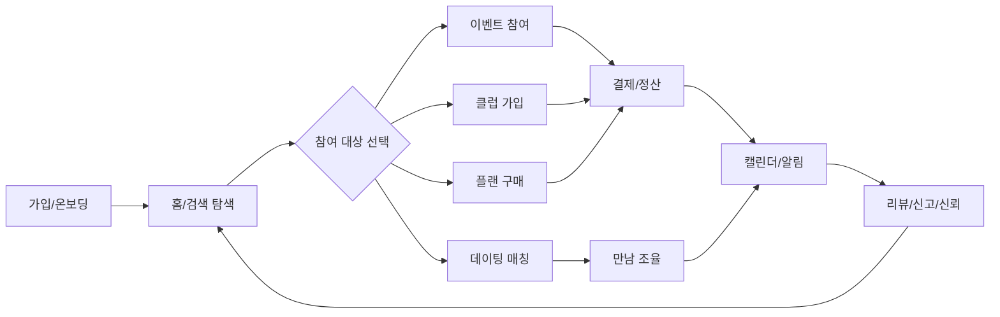

# 서비스 개요

<!-- supporting-doc-status: 2026-05-18 -->

> 문서 상태: **보조 문서**. 기능별 현재 계약, source trace, Gap/Risk 판단은 [PRD_MIGRATION_STATUS.md](../PRD_MIGRATION_STATUS.md)와 각 기능 PRD를 우선한다. 이 문서는 인벤토리, 정책, QA, 기획 운영 기준을 보조하며, 기능 세부 판단은 [FEATURE_PRD_STANDARD.md](../FEATURE_PRD_STANDARD.md) 기준으로 재확인한다.

## 문서 설명

| 항목 | 내용 |
|---|---|
| 목적 | 제품을 한 문장과 큰 흐름으로 설명해 새 기획자가 서비스의 문제, 대상, 범위를 먼저 잡게 한다. |
| 보는 시점 | 프로젝트 온보딩, 외부 공유용 개요 작성, 제품 방향 재정의 시점 |
| 이 문서로 정할 것 | 제품이 해결하는 문제, 전체 기능 범위, 별도 의사결정이 필요한 영역 |
| 같이 볼 문서 | 00_product_prd.md, 03_information_architecture.md, 05_planning_artifacts/mvp_scope_matrix.md |

## 1. 한 줄 정의

community는 관심사 기반 오프라인 활동을 발견하고 참여한 뒤, 관계 유지, 결제, 정산, 리뷰, 신뢰 관리까지 하나의 흐름으로 처리하는 커뮤니티 플랫폼이다.

## 2. 제품이 해결하는 문제

| 문제 | 제품 내 해결 방식 |
|---|---|
| 모임 발견이 흩어져 있음 | 홈 피드, 검색, 이벤트/클럽 탐색을 통합한다. |
| 참여 전 신뢰 판단이 어려움 | 리뷰, 신고, 신뢰점수, 데이팅 인증, 차단 정책을 제공한다. |
| 모임 운영이 수작업에 의존함 | 생성, 신청, 승인, 정원/대기열, 체크인, 알림을 연결한다. |
| 돈 흐름이 불명확함 | 지갑, 결제, 환불, 정산, 기금, 구독을 상태 기반으로 구분한다. |
| 활동 이후 관계가 끊김 | 클럽, 캘린더, 알림, 리뷰, 플랜 마켓으로 재참여 동선을 만든다. |

## 3. 전체 제품 흐름

## 4. 제품 범위

| 항목 | 값 |
|---|---:|
| 도메인 | 14개 |
| 기능 | 117개 |
| 시나리오 | 987개 |
| 도식 | 508개 |

## 5. 별도 결정이 필요한 영역

- 사업 KPI와 목표 수치
- 릴리즈 우선순위와 MVP 범위
- 법무 최종 문구
- 운영 SLA
- 최종 UX 카피
