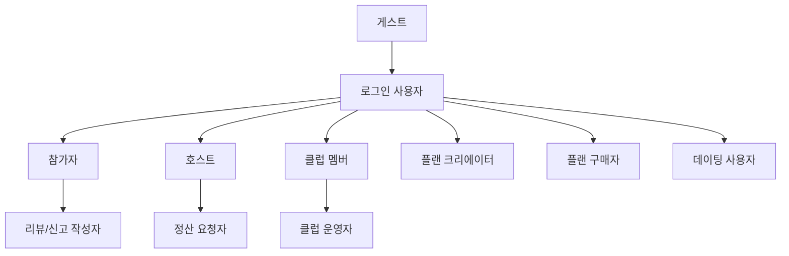

# 사용자 유형과 Persona

<!-- supporting-doc-status: 2026-05-18 -->

> 문서 상태: **보조 문서**. 기능별 현재 계약, source trace, Gap/Risk 판단은 [PRD_MIGRATION_STATUS.md](../PRD_MIGRATION_STATUS.md)와 각 기능 PRD를 우선한다. 이 문서는 인벤토리, 정책, QA, 기획 운영 기준을 보조하며, 기능 세부 판단은 [FEATURE_PRD_STANDARD.md](../FEATURE_PRD_STANDARD.md) 기준으로 재확인한다.

## 문서 설명

| 항목 | 내용 |
|---|---|
| 목적 | 서비스 안의 주요 사용자를 역할과 기대 경험 기준으로 나눠 기능별 주 사용자를 명확히 한다. |
| 보는 시점 | 신규 기능 기획, 화면 CTA 정의, 권한/접근 정책 검토 시점 |
| 이 문서로 정할 것 | 사용자 유형, 역할별 목표, 민감 기능 사용자의 기대 통제권 |
| 같이 볼 문서 | 07_role_action_matrix.md, 06_user_journeys.md |

## 1. 사용자 유형

| 사용자 | 주요 목표 | 핵심 관심사 | 대표 기능 |
|---|---|---|---|
| 게스트 | 서비스를 둘러보고 가입 여부를 판단한다 | 공개 정보, 가입 유도, 접근 제한 | 홈, 검색, 이벤트 상세, 클럽 상세 |
| 참가자 | 모임을 발견하고 안전하게 참여한다 | 신청, 결제, 일정, 위치, 리뷰 | 이벤트, 결제, 캘린더, 길찾기, 리뷰 |
| 호스트 | 이벤트를 만들고 참가자를 관리한다 | 모집, 승인, 정원, 체크인, 정산 | 이벤트 생성, 신청 검토, 정원/대기열, 정산 |
| 클럽 멤버 | 장기 커뮤니티에 참여한다 | 공지, 게시판, 이벤트, 기금 | 클럽 상세, 게시판, 댓글, 사진첩 |
| 클럽 운영자 | 클럽을 운영하고 멤버를 관리한다 | 가입 승인, 권한, 차단, 기금 | 멤버 관리, 초대, 차단, 구독, 출금 |
| 플랜 크리에이터 | 코스/모임 계획을 상품화한다 | 작성, 발행, 판매, 통계 | 플랜 에디터, 마켓 등록, 프로필 통계 |
| 플랜 구매자 | 검증된 계획을 구매하고 활용한다 | 탐색, 구매, 보관, 이벤트 생성 | 플랜 마켓, 구매, 내 컬렉션 |
| 데이팅 사용자 | 인증 기반으로 매칭하고 만남을 조율한다 | 안전, 프로필, 매칭, 차단 | 인증, 후보자, 채팅, 만남 제안, 차단 |
| 운영자 | 분쟁과 안전 이슈를 처리한다 | 신고, 환불, 이의제기, 정책 | 신고, 정산 이의, 계정 상태 |

## 2. Persona별 기대 경험

| Persona | 기대 경험 |
|---|---|
| 처음 온 사용자 | 어떤 활동이 있는지 빠르게 이해하고 가입 필요 시점을 납득한다. |
| 반복 참가자 | 관심 있는 이벤트를 빠르게 찾고 신청/결제/일정 등록이 자연스럽게 이어진다. |
| 숙련 호스트 | 모집 상태, 참가자 상태, 결제/정산 상태를 한눈에 확인한다. |
| 커뮤니티 운영자 | 멤버 권한과 게시글/공지/기금을 안정적으로 관리한다. |
| 민감 기능 사용자 | 데이팅, 위치 공유, 신고/차단에서 자신의 통제권을 명확히 가진다. |

## 3. 사용자 관계 도식

