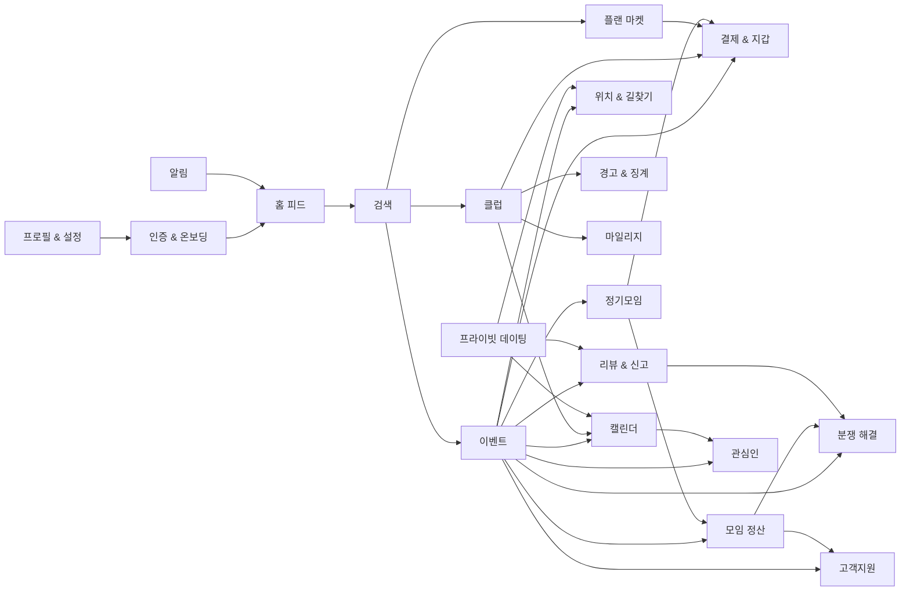

# 20개 도메인별 목적

<!-- supporting-doc-status: 2026-05-18 -->

> 문서 상태: **보조 문서**. 기능별 현재 계약, source trace, Gap/Risk 판단은 [PRD_MIGRATION_STATUS.md](../PRD_MIGRATION_STATUS.md)와 각 기능 PRD를 우선한다. 이 문서는 인벤토리, 정책, QA, 기획 운영 기준을 보조하며, 기능 세부 판단은 [FEATURE_PRD_STANDARD.md](../FEATURE_PRD_STANDARD.md) 기준으로 재확인한다.

## 문서 설명

| 항목 | 내용 |
|---|---|
| 목적 | 각 도메인의 존재 이유와 책임 범위를 정의해 기능 추가/이동/보류 판단 기준으로 쓴다. |
| 보는 시점 | 기능을 어느 영역에 둘지 정하거나 도메인별 PRD를 리뷰할 때 |
| 이 문서로 정할 것 | 도메인 목적, 기능 수, 도메인 간 의존 관계 |
| 같이 볼 문서 | 01_domain_prds/, 03_information_architecture.md |

> 2026-06-05: 도메인은 7개 줄기로 묶인다(`03_information_architecture.md` §1) — 시작·발견(01/02/05), 모임 줄기(03+17·07), 클럽 줄기(04+16·15), 돈(06/08), 사람·관계(09/19/10/13), 신뢰·운영 횡단(11/18/20), 기반 횡단(12/14). 16 마일리지·15 경고는 클럽 단위로 설정·운영되는 클럽 줄기 위성, 17 정기모임·07 모임 정산은 모임 줄기 위성이다. 번호·ID는 안정 식별자라 유지.

| 번호 | 도메인 | 목적 | 기능 수 |
|---:|---|---|---:|
| 01 | 인증 & 온보딩 | 사용자가 가입, 인증, 온보딩, 관심사 설정을 거쳐 추천 가능한 상태로 진입한다. | 8 |
| 02 | 홈 피드 | 로그인 후 첫 화면에서 추천 콘텐츠와 주요 진입점을 제공한다. | 5 |
| 03 | 이벤트 | 오프라인 모임을 발견, 생성, 신청, 참석, 체크인, 리뷰까지 연결한다. (선입금·이동수단·인구통계·일정변경 합의·노쇼 관리 포함) | 20 |
| 04 | 클럽 | 장기 커뮤니티의 가입, 운영, 게시판, 이벤트, 기금 흐름을 제공한다. (인구통계·레퓨테이션 포함) | 18 |
| 05 | 검색 | 이벤트, 클럽, 플랜 등 주요 콘텐츠를 키워드와 필터로 탐색한다. | 5 |
| 06 | 결제 & 지갑 | 포인트 잔액, 충전, 결제수단, 자동충전, 거래내역, 구독과 수익을 관리한다. | 10 |
| 07 | 모임 정산 | 모임 후 비용을 나누고 납부, 확인, 이의제기, 환불 규정을 처리한다. | 10 |
| 08 | 플랜 마켓 | 코스/모임 플랜을 작성, 발행, 구매, 보관, 활용, 리뷰한다. (환불·매출 귀속 보정 포함) | 15 |
| 09 | 프라이빗 데이팅 | 본인 인증 기반 매칭, 채팅, 만남 제안, 차단과 안전 흐름을 제공한다. | 8 |
| 10 | 캘린더 | 이벤트, 가용시간, 데이팅 만남을 시간축으로 통합해 보여준다. | 5 |
| 11 | 리뷰 & 신고 | 활동 후 리뷰, 신고, 신뢰점수, 취향 데이터를 관리한다. (호스트 리뷰 모더레이션 포함) | 7 |
| 12 | 알림 | 상태 변화를 푸시와 알림함으로 전달하고 수신 설정을 제공한다. | 6 |
| 13 | 프로필 & 설정 | 내 프로필, 주소, 선호태그, 데이터 내보내기, 계정 삭제/비활성화를 관리한다. | 7 |
| 14 | 위치 & 길찾기 | 장소, 경로 안내, 참석자 위치 공유와 프라이버시 통제를 제공한다. | 6 |
| 15 | 경고 & 징계 | 신고·이의제기·경고 원장·제재로 이어지는 클럽 거버넌스를 운영한다. | 9 |
| 16 | 마일리지 | 클럽 활동 적립·차감·정정 원장, 등급·배지·랭킹·시즌, 호스트 제안을 운영한다. | 8 |
| 17 | 정기모임 | 호스트가 코스(FIXED) 또는 비정기 세션(VARIABLE)으로 다회 모임을 운영한다. flow-through 정산·pro-rata 환불·FIXED 멤버 8 상태. | 10 |
| 18 | 분쟁 해결 | 신고·이의·환불분쟁·노쇼항소·정산이의·콘텐츠 모더레이션 등 원천 도메인 분쟁을 단일 케이스 뷰(UnifiedDisputeStatus)로 union한다. 사용자 자발 분쟁 접수(USER_DISPUTE), 이의제기(DisputeAppeal), 증빙 첨부 및 visibility 제어, legal hold·evidence 1년 보존, 호스트 운영 인박스(8-source)를 포함한다. 원천 도메인 resolution endpoint는 각 도메인이 소유하며, 통합 케이스 조회와 이의제기만 이 도메인이 담당한다. | 5 |
| 19 | 관심인 | 관심 있는 사용자를 등록·해제하고, 등록된 관심인의 새 이벤트 발행 시 알림(FAVORITE_PERSON_NEW_EVENT)을 수신한다. 관심인의 월간 캘린더를 조회해 일정을 조율할 수 있으며, 본인 캘린더·클럽 활동의 공개범위를 설정(PrivacySettingController)한다. 관심인 최대 등록 수는 구독 플랜(BASIC/PREMIUM)에 따라 차등 적용되는 프리미엄 게이팅 기능이다. | 3 |
| 20 | 고객지원 | 사용자가 계정·결제·이벤트·클럽·신고 관련 1:1 문의(InquiryController, sourceType: NONE/EVENT/CLUB/SETTLEMENT)를 접수하고 운영팀 답변을 받는다. 운영 이슈 접수(OperationalIssueController)로 플랫폼 오류·정책 위반·분쟁 관련 문제를 보고하며, SupportFaqController를 통해 자주 묻는 질문을 조회한다. | 3 |

## 도메인 간 의존 관계

## 기획 검토 원칙

- 도메인 목적은 기능 추가 여부를 판단하는 기준이다.
- 목적에 맞지 않는 기능은 별도 도메인으로 이동하거나 보류한다.
- 하나의 기능이 여러 도메인에 영향을 주면 정책 PRD를 먼저 확인한다.
