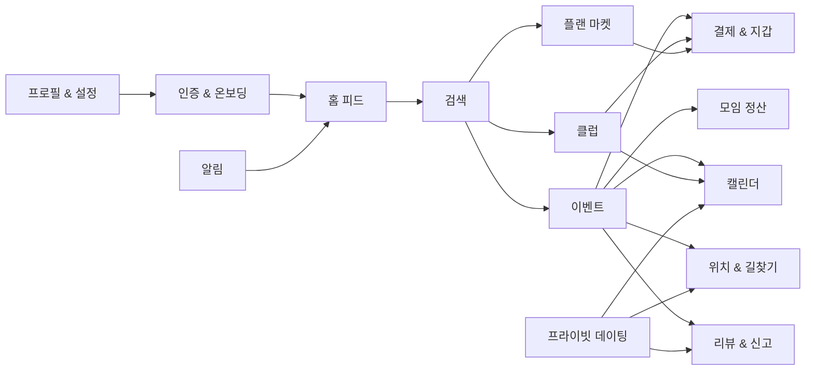

# 17개 도메인별 목적

<!-- supporting-doc-status: 2026-05-18 -->

> 문서 상태: **보조 문서**. 기능별 현재 계약, source trace, Gap/Risk 판단은 [PRD_MIGRATION_STATUS.md](../PRD_MIGRATION_STATUS.md)와 각 기능 PRD를 우선한다. 이 문서는 인벤토리, 정책, QA, 기획 운영 기준을 보조하며, 기능 세부 판단은 [FEATURE_PRD_STANDARD.md](../FEATURE_PRD_STANDARD.md) 기준으로 재확인한다.

## 문서 설명

| 항목 | 내용 |
|---|---|
| 목적 | 각 도메인의 존재 이유와 책임 범위를 정의해 기능 추가/이동/보류 판단 기준으로 쓴다. |
| 보는 시점 | 기능을 어느 영역에 둘지 정하거나 도메인별 PRD를 리뷰할 때 |
| 이 문서로 정할 것 | 도메인 목적, 기능 수, 도메인 간 의존 관계 |
| 같이 볼 문서 | 01_domain_prds/, 03_information_architecture.md |

| 번호 | 도메인 | 목적 | 기능 수 |
|---:|---|---|---:|
| 01 | 인증 & 온보딩 | 사용자가 가입, 인증, 온보딩, 관심사 설정을 거쳐 추천 가능한 상태로 진입한다. | 8 |
| 02 | 홈 피드 | 로그인 후 첫 화면에서 추천 콘텐츠와 주요 진입점을 제공한다. | 5 |
| 03 | 이벤트 | 오프라인 모임을 발견, 생성, 신청, 참석, 체크인, 리뷰까지 연결한다. (선입금·이동수단·인구통계 포함) | 18 |
| 04 | 클럽 | 장기 커뮤니티의 가입, 운영, 게시판, 이벤트, 기금 흐름을 제공한다. (인구통계 포함) | 17 |
| 05 | 검색 | 이벤트, 클럽, 플랜 등 주요 콘텐츠를 키워드와 필터로 탐색한다. | 5 |
| 06 | 결제 & 지갑 | 포인트 잔액, 충전, 결제수단, 자동충전, 거래내역, 구독과 수익을 관리한다. | 10 |
| 07 | 모임 정산 | 모임 후 비용을 나누고 납부, 확인, 이의제기, 환불 규정을 처리한다. | 10 |
| 08 | 플랜 마켓 | 코스/모임 플랜을 작성, 발행, 구매, 보관, 활용, 리뷰한다. (환불·매출 귀속 보정 포함) | 15 |
| 09 | 프라이빗 데이팅 | 본인 인증 기반 매칭, 채팅, 만남 제안, 차단과 안전 흐름을 제공한다. | 8 |
| 10 | 캘린더 | 이벤트, 가용시간, 데이팅 만남을 시간축으로 통합해 보여준다. | 5 |
| 11 | 리뷰 & 신고 | 활동 후 리뷰, 신고, 신뢰점수, 취향 데이터를 관리한다. | 6 |
| 12 | 알림 | 상태 변화를 푸시와 알림함으로 전달하고 수신 설정을 제공한다. | 6 |
| 13 | 프로필 & 설정 | 내 프로필, 주소, 선호태그, 데이터 내보내기, 계정 삭제/비활성화를 관리한다. | 7 |
| 14 | 위치 & 길찾기 | 장소, 경로 안내, 참석자 위치 공유와 프라이버시 통제를 제공한다. | 6 |
| 15 | 경고 & 징계 | 신고·이의제기·경고 원장·제재로 이어지는 클럽 거버넌스를 운영한다. | 9 |
| 16 | 마일리지 | 클럽 활동 적립·차감·정정 원장, 등급·배지·랭킹·시즌, 호스트 제안을 운영한다. | 8 |
| 17 | 정기모임 | 호스트가 코스(FIXED) 또는 비정기 세션(VARIABLE)으로 다회 모임을 운영한다. flow-through 정산·pro-rata 환불·FIXED 멤버 8 상태. | 10 |

## 도메인 간 의존 관계

## 기획 검토 원칙

- 도메인 목적은 기능 추가 여부를 판단하는 기준이다.
- 목적에 맞지 않는 기능은 별도 도메인으로 이동하거나 보류한다.
- 하나의 기능이 여러 도메인에 영향을 주면 정책 PRD를 먼저 확인한다.
