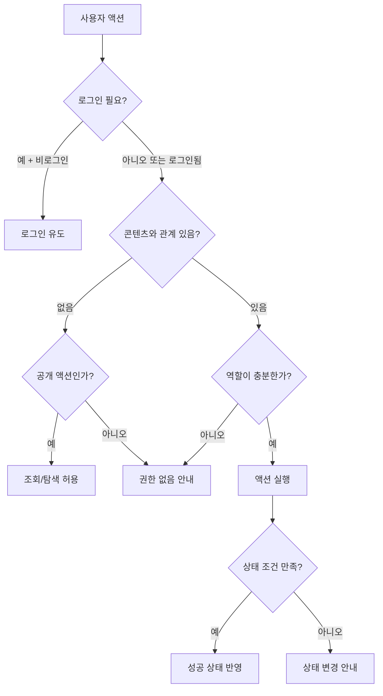
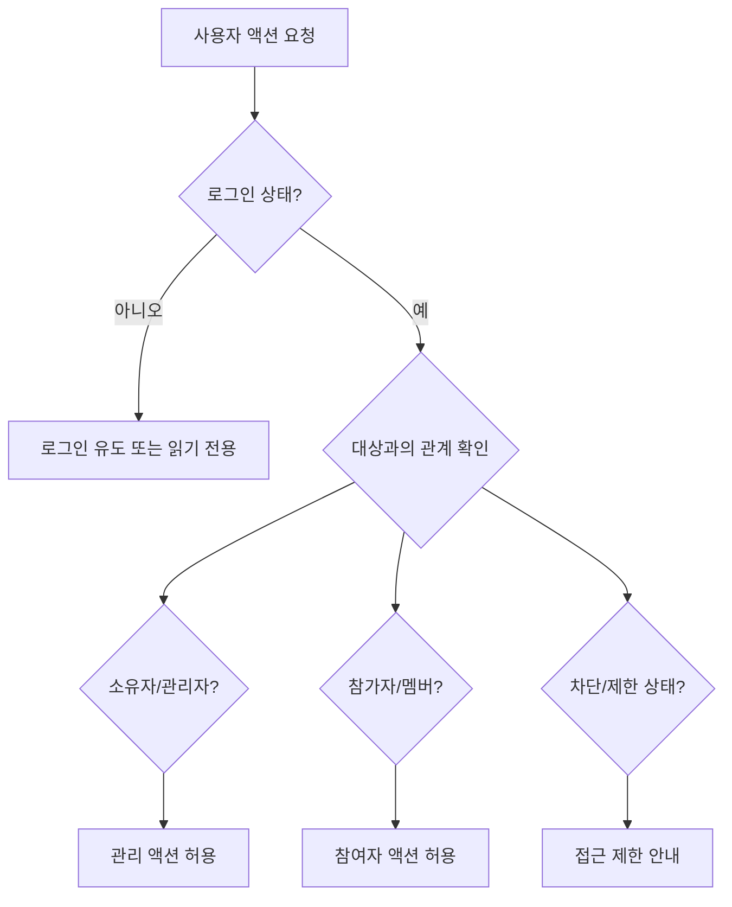

# 권한/역할별 액션

<!-- supporting-doc-status: 2026-05-18 -->

> 문서 상태: **보조 문서**. 기능별 현재 계약, source trace, Gap/Risk 판단은 [PRD_MIGRATION_STATUS.md](../PRD_MIGRATION_STATUS.md)와 각 기능 PRD를 우선한다. 이 문서는 인벤토리, 정책, QA, 기획 운영 기준을 보조하며, 기능 세부 판단은 [FEATURE_PRD_STANDARD.md](../FEATURE_PRD_STANDARD.md) 기준으로 재확인한다.

## 문서 설명

| 항목 | 내용 |
|---|---|
| 목적 | 역할별로 어떤 액션을 허용하거나 제한해야 하는지 정리해 CTA와 접근 정책의 기준으로 쓴다. |
| 보는 시점 | 화면 버튼 정의, 접근 제한 문구 작성, 관리자/소유자 권한 검토 시점 |
| 이 문서로 정할 것 | 역할별 허용 액션, 차단 방식, 다중 역할 우선순위 |
| 같이 볼 문서 | 02_user_personas.md, 03_policy_prds/permission_policy_prd.md |

이 문서는 기능을 빠뜨리지 않는 것만큼 중요한 "누가 할 수 있는가"를 검산하기 위한 문서다. 같은 화면이라도 비로그인, 일반 사용자, 참가자, 호스트, 클럽 관리자, 크리에이터에게 보이는 버튼과 허용 액션이 다르다.

## 역할 정의

| 역할 | 설명 | 대표 진입 |
|---|---|---|
| 게스트 | 로그인하지 않은 사용자 | 홈, 검색, 일부 상세 공유 링크 |
| 로그인 사용자 | 인증은 되었지만 특정 콘텐츠와 관계가 없는 사용자 | 홈, 검색, 프로필, 지갑 |
| 참가자 | 이벤트에 신청/참석/대기 중인 사용자 | 이벤트 상세, 체크인, 리뷰, 정산 |
| 호스트 | 이벤트를 만든 사용자 | 이벤트 생성/관리, 신청 승인, 정산 |
| 클럽 비회원 | 클럽에 아직 속하지 않은 사용자 | 클럽 발견/상세 |
| 클럽 멤버 | 클럽에 가입한 사용자 | 게시판, 댓글, 사진첩, 클럽 이벤트 |
| 클럽 관리자 | 멤버 관리 권한을 가진 사용자 | 멤버, 공지, 게시판 관리 |
| 클럽 소유자 | 클럽의 최상위 책임자 | 삭제, 소유권 이전, 기금 인출 |
| 플랜 크리에이터 | 플랜을 작성하고 판매하는 사용자 | 플랜 에디터, 마켓 아이템 관리 |
| 플랜 구매자 | 플랜을 구매해 보유한 사용자 | 컬렉션, 플랜 미리보기, 이벤트 생성 |
| 데이팅 사용자 | 본인 인증 후 데이팅을 이용하는 사용자 | 후보자, 매칭, 채팅, 만남 |
| 신고자 | 부적절한 대상에 신고를 접수하는 사용자 | 리뷰/프로필/콘텐츠의 신고 액션 |

## 권한 판단 흐름



## 영역별 권한 요약

| 영역 | 게스트 | 로그인 사용자 | 관계자/소유자 | 관리자급 |
|---|---|---|---|---|
| 인증 & 온보딩 | 가입/로그인 | 온보딩/태그/로그아웃 | 본인 계정 관리 | 해당 없음 |
| 홈 피드 | 일부 조회 | 추천/카드 진입 | 동일 | 해당 없음 |
| 이벤트 | 목록/상세 일부 | 신청/위시 | 참가자 체크인, 호스트 관리 | 해당 없음 |
| 클럽 | 발견/상세 일부 | 가입 신청 | 멤버 활동 | 관리자/소유자 운영 |
| 검색 | 일부 검색 | 기록/저장 검색 | 동일 | 해당 없음 |
| 결제 & 지갑 | 불가 | 본인 지갑/결제 | 호스트 수익 | 해당 없음 |
| 모임 정산 | 불가 | 본인 관련 조회 | 참가자 납부, 호스트 생성/확인 | 해당 없음 |
| 플랜 마켓 | 탐색 일부 | 구매/컬렉션 | 크리에이터 작성/판매 | 해당 없음 |
| 데이팅 | 불가 | 인증 전 제한 | 매칭/채팅/차단 | 해당 없음 |
| 캘린더 | 제한적 공개 조회 | 본인 일정/가용성 | 타인 공개 가용성 | 해당 없음 |
| 리뷰 & 신고 | 일부 조회 | 작성/신고 | 본인 리뷰 수정/삭제 | 운영 검토는 별도 |
| 알림 | 불가 | 본인 알림/설정 | 동일 | 해당 없음 |
| 프로필 & 설정 | 불가 | 본인 데이터 관리 | 동일 | 해당 없음 |
| 위치 & 길찾기 | 제한적 | 길찾기 일부 | 참석자 위치 공유 | 호스트 이벤트 단위 제어 |

## 이벤트 권한 매트릭스

| 액션 | 게스트 | 로그인 사용자 | 신청자 | 참석자 | 대기자 | 호스트 |
|---|:-:|:-:|:-:|:-:|:-:|:-:|
| 이벤트 목록/공개 상세 보기 | O | O | O | O | O | O |
| 비공개/작성중 상세 보기 |  |  |  |  |  | O |
| 참석 신청 |  | O |  |  |  |  |
| 신청 취소 |  |  | O |  |  |  |
| 참석 취소 |  |  |  | O | O |  |
| 신청 승인/거절 |  |  |  |  |  | O |
| 정원/대기열 관리 |  |  |  |  |  | O |
| QR 토큰 표시 |  |  |  | O |  |  |
| QR 스캔/수동 체크인 |  |  |  |  |  | O |
| 사진 업로드 |  |  |  | O |  | O |
| 이벤트 수정/취소/공지 |  |  |  |  |  | O |
| 리뷰 작성 |  |  |  | O |  | 조건부 |

## 클럽 권한 매트릭스

| 액션 | 게스트 | 비회원 | 대기자/초대자 | 멤버 | 관리자 | 소유자 |
|---|:-:|:-:|:-:|:-:|:-:|:-:|
| 클럽 발견/공개 상세 | O | O | O | O | O | O |
| 가입 신청 |  | O |  |  |  |  |
| 초대 수락/거절 |  |  | O |  |  |  |
| 게시글/댓글 작성 |  |  |  | O | O | O |
| 자기 글/댓글 수정·삭제 |  |  |  | O | O | O |
| 게시판/공지 관리 |  |  |  |  | O | O |
| 멤버 역할 변경/추방 |  |  |  |  | O | O |
| 차단 관리 |  |  |  |  | O | O |
| 클럽 수정 |  |  |  |  | O | O |
| 클럽 삭제/소유권 이전 |  |  |  |  |  | O |
| 기금 조회 |  |  |  | O | O | O |
| 기금 인출 |  |  |  |  |  | O |

## 결제와 정산 권한 매트릭스

| 액션 | 일반 사용자 | 이벤트 참가자 | 호스트 | 클럽 소유자 |
|---|:-:|:-:|:-:|:-:|
| 본인 지갑 조회 | O | O | O | O |
| 포인트 충전/결제수단 관리 | O | O | O | O |
| 이벤트 참가비 결제 | 조건부 | O | 조건부 |  |
| 환불 요청/결과 확인 | O | O | O | O |
| 모임 정산 생성 |  |  | O |  |
| 정산 항목 편집 |  |  | O |  |
| 분담금 납부 |  | O | 조건부 |  |
| 계좌이체 확인/상각 |  |  | O |  |
| 미납자 리마인드 |  |  | O |  |
| 정산 이의제기 |  | O | O |  |
| 클럽 기금 인출 |  |  |  | O |

유료 승인제 이벤트에서 일반 사용자의 참가비 결제는 "호스트 승인 후 결제 대기 상태"일 때만 허용한다. 승인 전 결제, 거절 후 결제, 결제 기한 만료 후 결제는 모두 차단해야 한다.

## 플랜 마켓 권한 매트릭스

| 액션 | 게스트 | 로그인 사용자 | 크리에이터 | 구매자 |
|---|:-:|:-:|:-:|:-:|
| 마켓 탐색 | O | O | O | O |
| 아이템 상세 보기 | O | O | O | O |
| 플랜 작성/편집 |  | O | O |  |
| 플랜 발행 |  |  | O |  |
| 마켓 상품 등록/수정/중지 |  |  | O |  |
| 아이템/번들 구매 |  | O | O | O |
| 컬렉션 보기 |  | O | O | O |
| 구매 플랜으로 이벤트 생성 |  |  | 조건부 | O |
| 구매 후 리뷰 작성 |  |  | 조건부 | O |

## 데이팅 권한 매트릭스

| 액션 | 비로그인 | 로그인 미인증 | 인증 완료 | 매칭 사용자 | 차단 관계 |
|---|:-:|:-:|:-:|:-:|:-:|
| 데이팅 진입 |  | 제한 | O | O | 제한 |
| 프로필 작성 |  |  | O | O | 제한 |
| 후보자 보기 |  |  | O | O | 제외 |
| 좋아요/패스 |  |  | O | O |  |
| 매칭 목록 보기 |  |  | O | O | 제한 |
| 채팅 |  |  |  | O | 차단 |
| 만남 제안 |  |  |  | O | 차단 |
| 차단/해제 |  |  | O | O | O |

## 위치 권한 매트릭스

| 액션 | 비참석자 | 참석자 | 호스트 | OS 위치 권한 없음 |
|---|:-:|:-:|:-:|:-:|
| 이벤트 장소 보기 | 조건부 | O | O | O |
| 길찾기 | 조건부 | O | O | 저장 주소만 가능 |
| 위치 공유 켜기 |  | O | 조건부 | 불가 |
| 위치 공유 중지 |  | O | O | O |
| 참석자 위치 조회 |  | O | O | 제한 |
| 이벤트 단위 위치 공유 비활성화 |  |  | O | O |

## 권한 검토 체크리스트

```text
[ ] 비로그인 사용자가 이 화면을 볼 수 있는가?
[ ] 로그인했지만 관계 없는 사용자가 할 수 있는 액션은 무엇인가?
[ ] 소유자/작성자/호스트 본인이 대상일 때 금지해야 할 액션이 있는가?
[ ] 관리자급 권한과 소유자 권한을 구분했는가?
[ ] 차단/탈퇴/삭제/비활성 사용자 상태를 고려했는가?
[ ] 같은 사용자가 여러 역할을 동시에 가질 때 우선순위가 있는가?
[ ] 화면 진입 후 권한이 바뀌면 어떻게 갱신하는가?
[ ] 권한 없음은 버튼 숨김, 비활성, 에러 중 무엇으로 표현하는가?
```

## 역할 판단 흐름



## 기획 체크

- 같은 화면이라도 역할에 따라 CTA가 달라질 수 있다.
- 버튼을 숨길지, 비활성화할지, 클릭 후 안내할지 기능별로 정한다.
- 여러 역할을 동시에 가진 사용자의 우선순위를 정한다.
