# 상태 전이

<!-- supporting-doc-status: 2026-05-18 -->

> 문서 상태: **보조 문서**. 기능별 현재 계약, source trace, Gap/Risk 판단은 [PRD_MIGRATION_STATUS.md](../PRD_MIGRATION_STATUS.md)와 각 기능 PRD를 우선한다. 이 문서는 인벤토리, 정책, QA, 기획 운영 기준을 보조하며, 기능 세부 판단은 [FEATURE_PRD_STANDARD.md](../FEATURE_PRD_STANDARD.md) 기준으로 재확인한다.

## 문서 설명

| 항목 | 내용 |
|---|---|
| 목적 | 주요 객체의 상태 변화를 정리해 상태별 버튼, 문구, 알림, 결제/정산 영향을 판단한다. |
| 보는 시점 | 상태 기반 기능, 취소/만료/차단/환불 정책, QA 케이스 작성 시점 |
| 이 문서로 정할 것 | 상태 전이 조건, 상태별 허용 액션, 예외/복구 정책 |
| 같이 볼 문서 | 03_policy_prds/state_policy_prd.md, 10_impact_matrix.md |

이 문서는 화면 설명보다 상태 판단이 중요한 기능만 모은다. 기획자가 버튼 노출, 문구, 알림, 예외 처리를 결정할 때 먼저 확인해야 하는 문서다.

## 1. 이벤트 상태

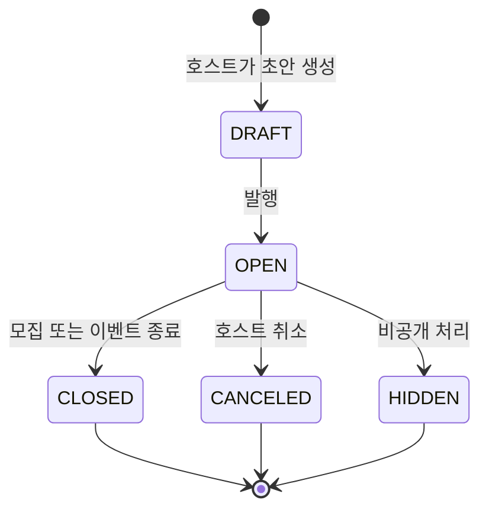

| 상태 | 사용자에게 보이는 의미 | 주요 허용 액션 |
|---|---|---|
| `DRAFT` | 아직 공개되지 않은 작성중 이벤트 | 호스트 편집, 발행 |
| `OPEN` | 모집 또는 참여 가능한 이벤트 | 참가자 신청/취소, 호스트 운영 |
| `CLOSED` | 모집 또는 이벤트가 종료된 상태 | 리뷰, 사진첩, 정산 등 후속 흐름 |
| `CANCELED` | 취소된 이벤트 | 취소 안내, 환불/알림 후속 처리 |
| `HIDDEN` | 일반 노출에서 제외된 이벤트 | 관리자/호스트 정책에 따름 |

## 2. 이벤트 신청과 참석 상태

이벤트에는 "신청 심사"와 "참석 확정/대기"가 함께 존재할 수 있다.

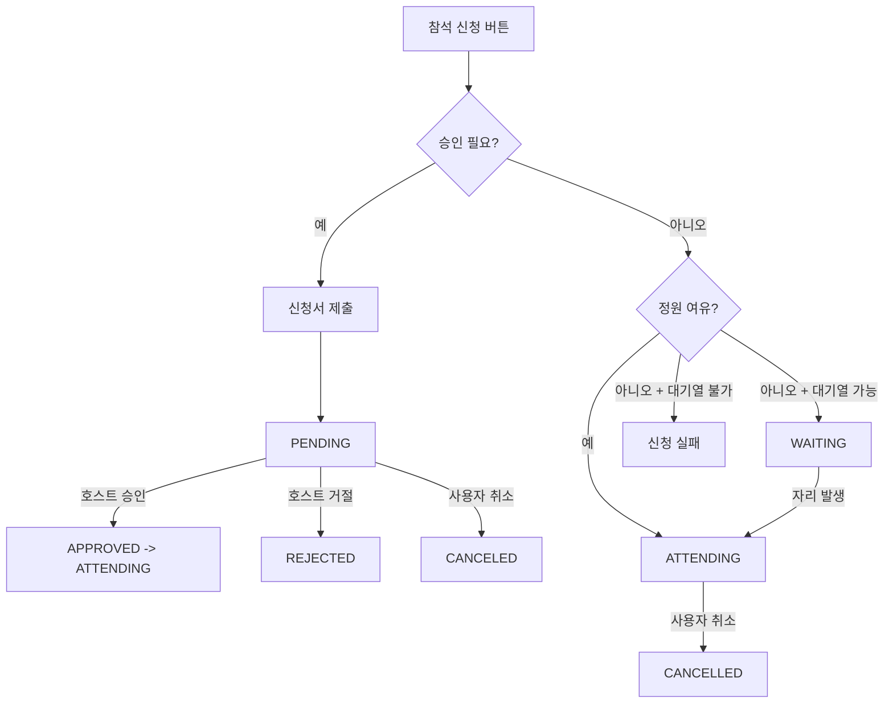

| 구분 | 상태 | 의미 |
|---|---|---|
| 신청서 | `PENDING` | 호스트 검토 전 |
| 신청서 | `APPROVED` | 신청 승인 |
| 신청서 | `REJECTED` | 신청 거절 |
| 신청서 | `CANCELED` | 신청자가 취소 |
| 참석 | `ATTENDING` | 참석 확정 |
| 참석 | `WAITING` | 대기열에 있음 |
| 참석 | `CANCELLED` | 참석이 취소됨 |

기획 주의점:

- `CANCELED`와 `CANCELLED`가 함께 등장한다. 신청서 상태는 `CANCELED`, 참석 상태는 `CANCELLED`로 다룬다.
- 사용자는 "신청 완료", "심사중", "대기중", "참석 확정"을 구분해서 봐야 한다.
- 대기열 승격은 사용자 행동 없이 시스템이 바꿀 수 있으므로 알림이 필요하다.
- 유료 승인제 이벤트는 "승인됨"과 "참석 확정"이 다르다. 승인 후 결제 대기 상태를 별도 표시하고, 결제 성공 후에만 참석 확정으로 보아야 한다.

### 유료 승인제 권장 상태

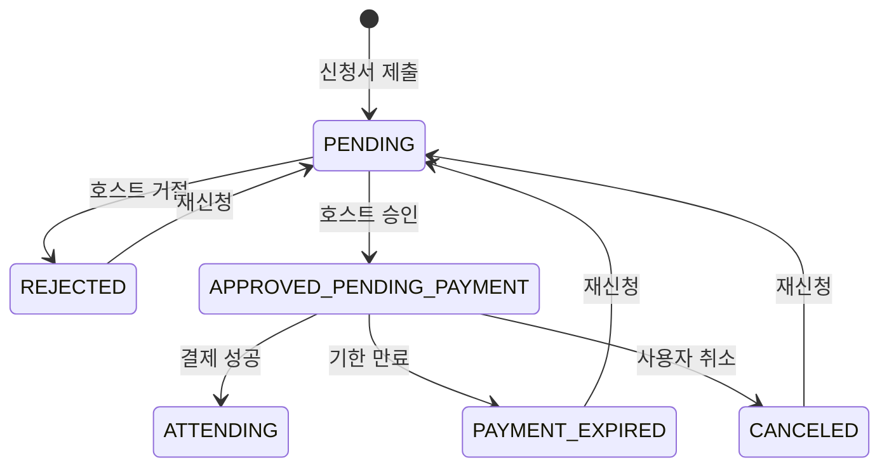

| 상태 | 의미 | 허용 액션 |
|---|---|---|
| `APPROVED_PENDING_PAYMENT` | 호스트는 승인했지만 결제 전 | 참가자 결제, 사용자 취소, 기한 만료 |
| `PAYMENT_EXPIRED` | 승인 후 결제 기한 만료 | 재신청, 상세 안내 |
| `ATTENDING` | 결제까지 완료된 참석 확정 | 취소/환불, 체크인, 위치 공유, 리뷰 |

현재 서버 enum에는 `APPROVED_PENDING_PAYMENT`, `PAYMENT_EXPIRED`가 없다. 구현 전까지는 이 조합을 "정책 보강 필요"로 표시해야 한다.

## 3. 프라이빗 모임 단계

프라이빗 이벤트는 일반 이벤트와 별도 단계가 있다.

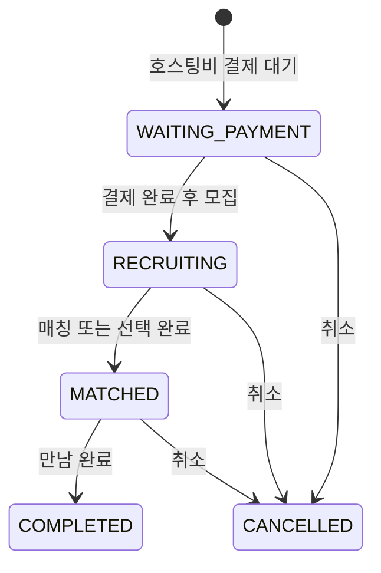

기획 주의점:

| 단계 | 확인할 것 |
|---|---|
| 결제 대기 | 결제 실패/이탈 시 재진입 문구 |
| 모집중 | 신청자 노출, 선택 기준, 마감 기준 |
| 매칭됨 | 상대에게 어떤 정보가 공개되는지 |
| 완료 | 리뷰, 신고, 신뢰점수와의 연결 |

## 4. 모임 정산 상태

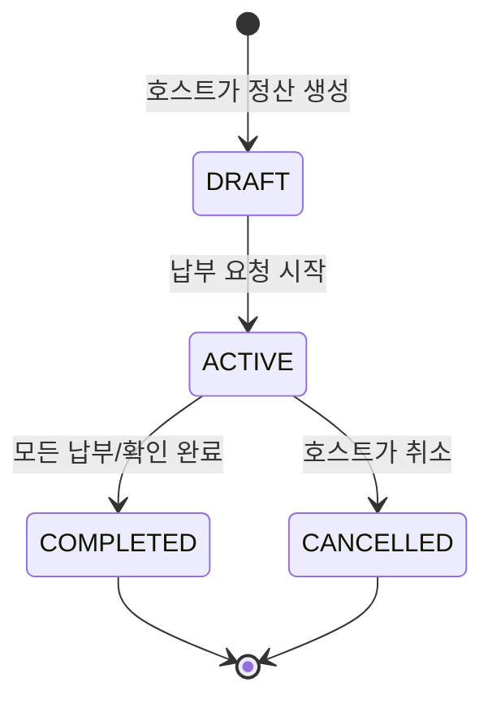

| 상태 | 사용자에게 보이는 의미 | 호스트 액션 | 참가자 액션 |
|---|---|---|---|
| `DRAFT` | 아직 참가자에게 요청하지 않은 정산 | 항목 편집, 참여자 조정, 활성화 | 보통 노출 없음 |
| `ACTIVE` | 납부 진행중 | 독촉, 마감 연장, 이체 확인, 취소 | 분담금 확인, 납부, 이의제기 |
| `COMPLETED` | 정산 완료 | 내역 조회 | 내역 조회 |
| `CANCELLED` | 정산 취소 | 내역 조회 | 환불/취소 안내 확인 |

기획 주의점:

- 정산 생성만으로 참가자에게 알림이 가면 안 된다. 일반적으로 진행중 전환 시 납부 알림이 의미 있다.
- 포인트 납부는 즉시 반영되지만, 계좌이체는 호스트 확인이 필요하다.
- 이의제기와 감사로그는 돈의 분쟁을 줄이기 위한 장치다.

## 5. 호스트 정산금 상태

호스트가 받을 수익/정산금은 모임 정산과 별개로 다음 흐름을 가진다.

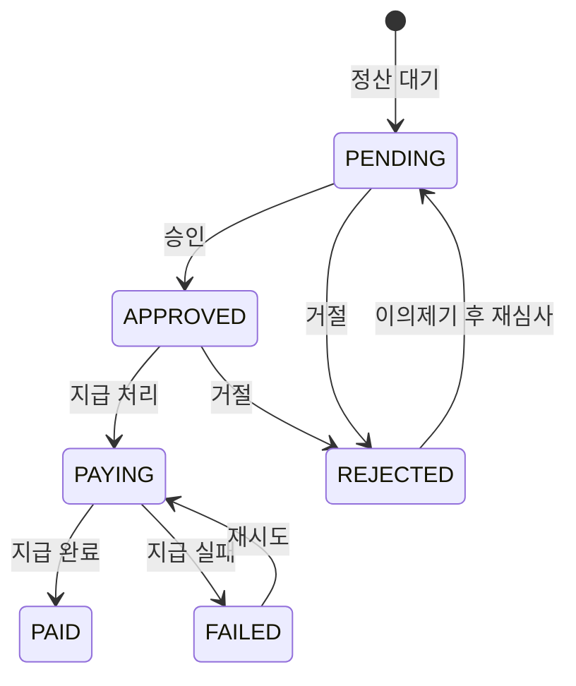

| 상태 | 의미 | 사용자 액션 |
|---|---|---|
| `PENDING` | 검토 또는 대기 중 | 기다림 |
| `APPROVED` | 지급 승인됨 | 상태 확인 |
| `PAYING` | 실제 지급 처리 중 | 상태 확인 |
| `PAID` | 지급 완료 | 상세/영수 확인 |
| `FAILED` | 지급 실패 | 재시도 또는 고객센터 |
| `REJECTED` | 지급 거절 | 이의제기 가능 |

## 6. 플랜과 마켓 상품 상태

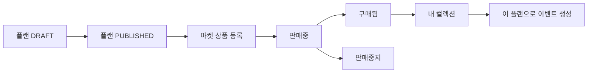

기획 주의점:

- 플랜 초안은 크리에이터의 편집 대상이고, 마켓 상품은 구매자의 구매 대상이다.
- 구매자는 구매 후 컬렉션에서 활용한다.
- 이미 구매한 상품, 일부 중복 번들, 잔액 부족은 구매 바텀시트에서 명확히 분기해야 한다.

## 7. 데이터 내보내기와 계정 삭제

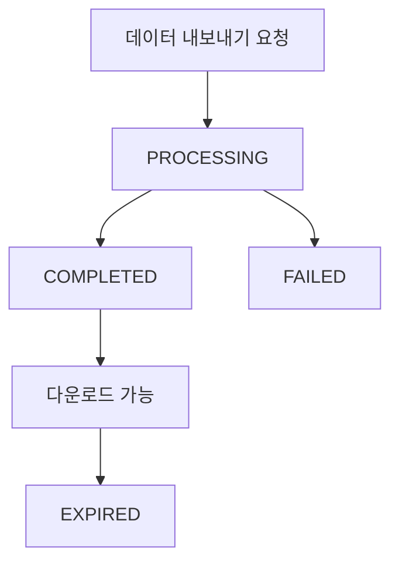

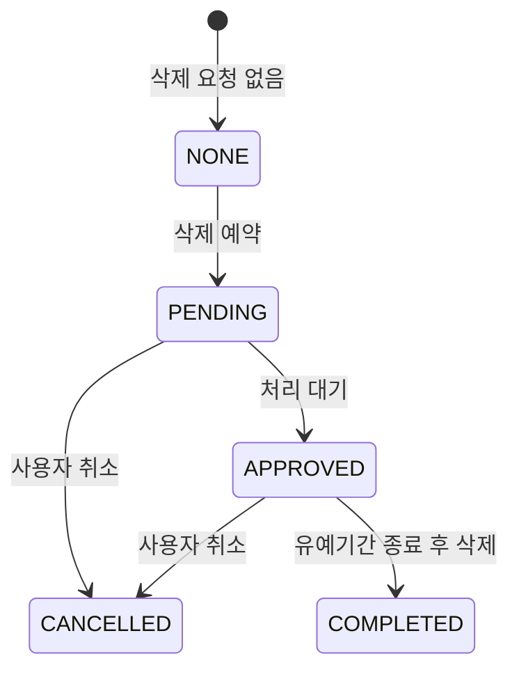

기획 주의점:

- 데이터 내보내기는 즉시 파일을 주는 기능이 아니라 비동기 요청이다.
- 계정 삭제 예약은 유예기간과 취소 동선이 중요하다.
- 즉시 비활성화는 삭제 예약과 사용자 영향이 다르므로 별도 문구가 필요하다.

## 8. 위치 공유 상태

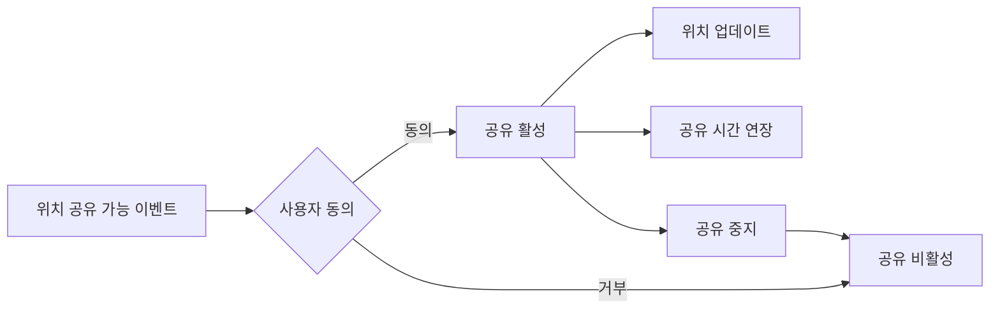

기획 주의점:

- 위치 공유는 항상 opt-in으로 다뤄야 한다.
- 중지 버튼과 프라이버시 대시보드가 함께 있어야 사용자가 통제권을 가진다.
- 이벤트 종료 후 위치 데이터 보관/삭제 정책을 화면 문구와 맞춰야 한다.

## 9. 알림 수신 정책

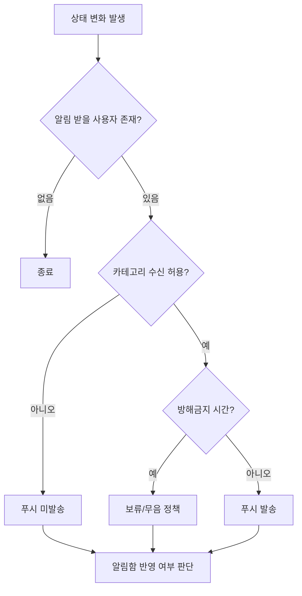

기획 주의점:

- 알림은 "무엇을 보낼까"보다 "누가 받아야 하는가"가 먼저다.
- 결제/정산 알림은 마케팅 알림보다 중요도가 높다.
- OS 권한 거부 상태에서는 인앱 알림함과 권한 회복 배너를 함께 고려해야 한다.

## 상태 전이 PRD 원칙

- 상태 이름만 정의하지 말고 사용자가 보는 문구와 가능한 액션까지 같이 정의한다.
- 상태 변경은 알림, 캘린더, 결제, 리뷰 자격에 영향을 줄 수 있다.
- 취소, 만료, 삭제, 차단은 성공 상태와 다른 복구 동선을 가져야 한다.
