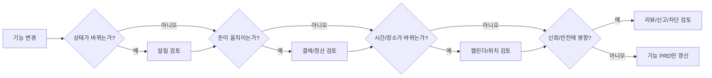

# 알림/결제/정산/위치 영향 매트릭스

<!-- supporting-doc-status: 2026-05-18 -->

> 문서 상태: **보조 문서**. 기능별 현재 계약, source trace, Gap/Risk 판단은 [PRD_MIGRATION_STATUS.md](../PRD_MIGRATION_STATUS.md)와 각 기능 PRD를 우선한다. 이 문서는 인벤토리, 정책, QA, 기획 운영 기준을 보조하며, 기능 세부 판단은 [FEATURE_PRD_STANDARD.md](../FEATURE_PRD_STANDARD.md) 기준으로 재확인한다.

## 문서 설명

| 항목 | 내용 |
|---|---|
| 목적 | 기능 변경이 알림, 돈, 캘린더, 위치, 리뷰/신뢰에 어떤 부수효과를 만드는지 전수 확인한다. |
| 보는 시점 | 기능 변경 영향 분석, 릴리즈 회귀 검토, 정책 PRD 업데이트 시점 |
| 이 문서로 정할 것 | 기능별 영향 영역, 함께 검토할 정책/화면, 회귀 위험 |
| 같이 볼 문서 | 03_policy_prds/, 04_qa_acceptance/release_readiness_checklist.md |

## 1. 영향 판단 기준

| 영향 영역 | 봐야 할 것 |
|---|---|
| 알림 | 수신자, 트리거, 딥링크, 수신 설정, 방해금지 |
| 결제/정산 | 잔액, 결제수단, 환불, 이체 확인, 거래내역 |
| 캘린더 | 일정 생성, 반복, 가용 시간, 상세 이동 |
| 위치 | 권한, 공유 동의, opt-out, 길찾기, 주소 |
| 리뷰/신뢰 | 리뷰 자격, 신고, 차단, 노쇼, 신뢰점수 |

## 2. 기능별 영향

| ID | 도메인 | 기능 | 알림 | 결제/정산 | 캘린더 | 위치 | 리뷰/신뢰 |
|---|---|---|---|---|---|---|---|
| F01-01 | 인증 & 온보딩 | 이메일 회원가입 & 로그인 | - | - | - | - | 있음 |
| F01-02 | 인증 & 온보딩 | 소셜 로그인 | - | - | - | - | 있음 |
| F01-03 | 인증 & 온보딩 | 이메일 인증 | - | - | - | - | - |
| F01-04 | 인증 & 온보딩 | 비밀번호 재설정 | - | - | - | - | - |
| F01-05 | 인증 & 온보딩 | 토큰 갱신 & 로그아웃 | - | - | - | - | - |
| F01-06 | 인증 & 온보딩 | 온보딩 | - | - | - | 있음 | - |
| F01-07 | 인증 & 온보딩 | 관심사 태그 관리 | - | - | - | - | - |
| F01-08 | 인증 & 온보딩 | 소셜 계정 연결 해제 | - | - | - | - | - |
| F02-01 | 홈 피드 | 홈 피드 메인 조회 | - | - | - | - | - |
| F02-02 | 홈 피드 | 홈 피드 새로고침 | - | - | - | 있음 | - |
| F02-03 | 홈 피드 | 섹션 카드 진입 | - | - | - | - | - |
| F02-04 | 홈 피드 | 추천 이벤트 더보기·필터·무한스크롤 | - | - | - | - | - |
| F02-05 | 홈 피드 | 검색·알림 진입점 | 있음 | - | - | - | - |
| F03-01 | 이벤트 | 이벤트 발견 & 탐색 | - | - | - | - | - |
| F03-02 | 이벤트 | 이벤트 상세 조회 | - | - | - | - | - |
| F03-03 | 이벤트 | 이벤트 생성 | - | 있음 | 있음 | - | - |
| F03-04 | 이벤트 | 이벤트 수정/생명주기 관리 | - | 있음 | 있음 | - | - |
| F03-05 | 이벤트 | 이벤트 신청 & 참석 | 있음 | 있음 | 있음 | - | - |
| F03-06 | 이벤트 | 신청서 승인/거절 | 있음 | 있음 | - | - | - |
| F03-07 | 이벤트 | 정원 & 대기열 관리 | 있음 | - | - | - | - |
| F03-08 | 이벤트 | QR 체크인 | - | - | 있음 | - | - |
| F03-09 | 이벤트 | 이벤트 사진첩 | 있음 | - | - | - | - |
| F03-10 | 이벤트 | 이벤트-플랜 연결 | 있음 | - | - | - | - |
| F03-11 | 이벤트 | 위시리스트 | - | - | - | - | - |
| F03-12 | 이벤트 | 내 이벤트 관리 & 참석 로그 | - | - | 있음 | - | - |
| F04-01 | 클럽 | 클럽 발견 & 탐색 | - | - | - | - | - |
| F04-02 | 클럽 | 클럽 상세 보기 & 가입 액션 | - | - | - | - | 있음 |
| F04-03 | 클럽 | 클럽 생성·수정·삭제·소유권 이전 | - | - | - | - | - |
| F04-04 | 클럽 | 멤버 관리 | - | - | - | - | - |
| F04-05 | 클럽 | 가입 대기열 승인/거절 & 초대 | 있음 | - | - | - | - |
| F04-06 | 클럽 | 차단 관리 | - | 있음 | - | - | 있음 |
| F04-07 | 클럽 | 내 클럽 / 멤버 통계 | 있음 | - | - | - | - |
| F04-08 | 클럽 | 게시판 & 게시글 생성/수정/삭제 | 있음 | - | - | - | - |
| F04-09 | 클럽 | 게시글 댓글 & 대댓글 | 있음 | - | - | - | - |
| F04-10 | 클럽 | 공지사항 | 있음 | - | - | - | - |
| F04-11 | 클럽 | 사진첩 | 있음 | - | - | - | - |
| F04-12 | 클럽 | 클럽 이벤트 & 캘린더 | - | - | 있음 | - | - |
| F04-13 | 클럽 | 기금 현황 & 거래 차트 | - | 있음 | - | - | - |
| F04-14 | 클럽 | 기부하기 & 기부 내역 | - | 있음 | - | - | - |
| F04-15 | 클럽 | 기금 인출 요청 | 있음 | 있음 | 있음 | - | - |
| F04-16 | 클럽 | 클럽 구독 | - | 있음 | - | - | - |
| F05-01 | 검색 | 키워드 검색 | - | - | - | - | - |
| F05-02 | 검색 | 자동완성 서제스트 | - | - | - | - | - |
| F05-03 | 검색 | 검색 필터 적용 | 있음 | - | - | - | - |
| F05-04 | 검색 | 최근 검색어 | - | - | - | - | - |
| F05-05 | 검색 | 저장된 검색 | 있음 | - | - | - | - |
| F06-01 | 결제 & 지갑 | 지갑 메인 조회 | - | 있음 | - | - | - |
| F06-02 | 결제 & 지갑 | 포인트 충전 | 있음 | 있음 | - | - | - |
| F06-03 | 결제 & 지갑 | 거래 내역 조회·필터·내보내기 | - | - | - | - | - |
| F06-04 | 결제 & 지갑 | 결제 수단 관리 | - | 있음 | - | - | - |
| F06-05 | 결제 & 지갑 | 자동 충전 설정 | - | 있음 | - | - | - |
| F06-06 | 결제 & 지갑 | 포인트 결제·환불 | 있음 | 있음 | - | - | - |
| F06-07 | 결제 & 지갑 | 호스팅 티켓 구매 | - | 있음 | - | - | - |
| F06-08 | 결제 & 지갑 | 개인 구독 관리 | - | 있음 | - | - | - |
| F06-09 | 결제 & 지갑 | 수익 대시보드 조회 | - | - | - | - | - |
| F06-10 | 결제 & 지갑 | 정산 조회·요약·이의 제기 | - | 있음 | - | - | - |
| F07-01 | 모임 정산 | 모임 정산 생성 | - | 있음 | - | - | - |
| F07-02 | 모임 정산 | 정산 항목 관리 | - | 있음 | - | - | - |
| F07-03 | 모임 정산 | 정산 활성화/취소 | 있음 | 있음 | - | - | - |
| F07-04 | 모임 정산 | 정산 현황/요약/영수증 조회 | 있음 | 있음 | - | - | - |
| F07-05 | 모임 정산 | 분담금 납부 | - | 있음 | - | - | - |
| F07-06 | 모임 정산 | 이체 확인/일괄 확인/상각 | - | - | - | - | - |
| F07-07 | 모임 정산 | 미납자 리마인드/마감 연장 | 있음 | - | - | - | - |
| F07-08 | 모임 정산 | 이의제기/처리/감사로그 | 있음 | - | - | - | - |
| F07-09 | 모임 정산 | 선입금/환불/환불규정 | - | 있음 | - | - | - |
| F07-10 | 모임 정산 | 정산 계좌/이력/호스트 신뢰도 | - | 있음 | - | - | 있음 |
| F08-01 | 플랜 마켓 | 내 플랜 목록 관리 | - | 있음 | - | - | - |
| F08-02 | 플랜 마켓 | 플랜 상세/작성자용 미리보기 | - | - | - | - | - |
| F08-03 | 플랜 마켓 | 블록 에디터 | - | - | - | - | - |
| F08-04 | 플랜 마켓 | 블록 드래그 재정렬 | - | - | - | - | - |
| F08-05 | 플랜 마켓 | 플랜 발행 | - | - | - | - | - |
| F08-06 | 플랜 마켓 | 마켓 아이템 관리 | - | - | - | - | - |
| F08-07 | 플랜 마켓 | 크리에이터 프로필/통계 | - | - | - | - | - |
| F08-08 | 플랜 마켓 | 마켓 메인 탐색 | - | - | - | - | - |
| F08-09 | 플랜 마켓 | 마켓 검색 | - | - | - | - | - |
| F08-10 | 플랜 마켓 | 마켓 아이템 상세 | - | - | - | - | 있음 |
| F08-11 | 플랜 마켓 | 아이템·번들·플랜 구매 | - | 있음 | - | - | - |
| F08-12 | 플랜 마켓 | 내 컬렉션 | - | - | - | - | - |
| F08-13 | 플랜 마켓 | 구매 플랜 -> 이벤트 생성/리뷰 | - | 있음 | - | - | 있음 |
| F09-01 | 프라이빗 데이팅 | 본인 인증 | - | - | - | - | - |
| F09-02 | 프라이빗 데이팅 | 데이팅 프로필 관리 | - | - | - | - | 있음 |
| F09-03 | 프라이빗 데이팅 | 후보자 스와이프 & 매칭 액션 | - | - | - | - | - |
| F09-04 | 프라이빗 데이팅 | 매칭 목록 조회 | - | - | - | - | 있음 |
| F09-05 | 프라이빗 데이팅 | 채팅 | - | - | - | - | 있음 |
| F09-06 | 프라이빗 데이팅 | 만남 제안 & 안전 흐름 | - | - | 있음 | 있음 | - |
| F09-07 | 프라이빗 데이팅 | 사용자 차단/해제 | - | - | - | - | 있음 |
| F09-08 | 프라이빗 데이팅 | 내 프로필 조회 이력 | - | - | - | - | 있음 |
| F10-01 | 캘린더 | 월간/일간 통합 캘린더 조회 | - | - | 있음 | - | - |
| F10-02 | 캘린더 | 일정 항목 라우팅 | - | - | 있음 | - | - |
| F10-03 | 캘린더 | 단일 가용 시간 생성/수정/삭제 | - | - | 있음 | - | - |
| F10-04 | 캘린더 | 반복 가용 시간 규칙 관리 | - | - | 있음 | - | - |
| F10-05 | 캘린더 | 타 사용자 가용성 공개 조회 | - | - | 있음 | - | - |
| F11-01 | 리뷰 & 신고 | 이벤트 리뷰 작성 | - | - | 있음 | - | 있음 |
| F11-02 | 리뷰 & 신고 | 리뷰 목록 조회 | - | - | - | - | 있음 |
| F11-03 | 리뷰 & 신고 | 리뷰 수정 & 삭제 | - | - | - | - | 있음 |
| F11-04 | 리뷰 & 신고 | 신고 | - | - | - | - | 있음 |
| F11-05 | 리뷰 & 신고 | 신뢰점수 & 변동 이력 | - | - | - | - | 있음 |
| F11-06 | 리뷰 & 신고 | 취향 평가 & 취향 프로필 | - | - | - | - | 있음 |
| F12-01 | 알림 | 알림 목록 조회 & 읽음 관리 | 있음 | - | - | - | - |
| F12-02 | 알림 | 알림 그룹 보기 & 미읽음 배지 | 있음 | - | - | - | - |
| F12-03 | 알림 | 카테고리별 알림 설정 | 있음 | - | - | - | - |
| F12-04 | 알림 | 방해금지 시간 설정 | - | - | - | - | - |
| F12-05 | 알림 | 푸시 기기 관리 | 있음 | - | - | - | - |
| F12-06 | 알림 | 알림 권한 인라인 안내 배너 | 있음 | - | - | - | - |
| F13-01 | 프로필 & 설정 | 내 프로필 조회 | - | - | - | - | - |
| F13-02 | 프로필 & 설정 | 프로필 수정 | - | - | - | - | - |
| F13-03 | 프로필 & 설정 | 다중 주소 관리 | - | - | - | 있음 | - |
| F13-04 | 프로필 & 설정 | 선호 태그 관리 | - | - | - | - | - |
| F13-05 | 프로필 & 설정 | 데이터 내보내기 | - | - | - | - | - |
| F13-06 | 프로필 & 설정 | 계정 삭제 요청 | - | - | - | - | - |
| F13-07 | 프로필 & 설정 | 계정 즉시 비활성화 | - | 있음 | - | - | 있음 |
| F14-01 | 위치 & 길찾기 | 이벤트 참석자 위치 공유 | 있음 | - | 있음 | 있음 | - |
| F14-02 | 위치 & 길찾기 | 위치 공유 중지 | - | - | - | 있음 | - |
| F14-03 | 위치 & 길찾기 | 위치 공유 만료 연장 | 있음 | - | - | 있음 | - |
| F14-04 | 위치 & 길찾기 | 위치 프라이버시 대시보드 | - | - | - | 있음 | - |
| F14-05 | 위치 & 길찾기 | 이벤트 길찾기 | - | - | 있음 | 있음 | - |
| F14-06 | 위치 & 길찾기 | 역지오코딩 | - | - | - | 있음 | - |

> 갱신: 2026-06-05. 신규 기능 15개 영향 행 추가.

| F03-13 | 이벤트 | 이벤트 참가 선입금 | 있음 | 있음 | - | - | - |
| F03-14 | 이벤트 | 이동수단 공통 베이스 | - | - | - | - | - |
| F03-15 | 이벤트 | 이벤트 카풀 | 있음 | - | - | - | 있음 |
| F03-16 | 이벤트 | 이벤트 버스대절 | 있음 | - | - | - | - |
| F03-17 | 이벤트 | 차량 레이아웃 카탈로그 | - | - | - | - | - |
| F03-18 | 이벤트 | 구성인원 인구통계 | - | - | - | - | 있음 |
| F03-19 | 이벤트 | 일정 변경 제안·참가자 합의 | 있음 | 있음 | 있음 | - | - |
| F03-20 | 이벤트 | 이벤트 노쇼 관리 | 있음 | 있음 | - | - | 있음 |
| F04-17 | 클럽 | 구성인원 인구통계 | - | - | - | - | 있음 |
| F04-18 | 클럽 | 클럽 레퓨테이션 점수 | - | - | - | - | 있음 |
| F08-14 | 플랜 마켓 | 플랜 마켓 환불 | 있음 | 있음 | - | - | - |
| F08-15 | 플랜 마켓 | 크리에이터 매출 귀속 보정 | - | 있음 | - | - | - |
| F11-07 | 리뷰 & 신고 | 호스트 리뷰 모더레이션 | - | - | - | - | 있음 |
| F17-01 | 정기모임 | 정기모임 발견·탐색 | - | - | - | - | - |
| F17-02 | 정기모임 | 정기모임 상세 조회 | - | - | - | - | - |
| F17-03 | 정기모임 | 정기모임 생성 | - | 있음 | 있음 | - | - |
| F17-04 | 정기모임 | 생명주기 | 있음 | 있음 | 있음 | - | - |
| F17-05 | 정기모임 | 세션 관리 | - | - | 있음 | - | - |
| F17-06 | 정기모임 | FIXED 등록·승인·대기열 | 있음 | 있음 | - | - | - |
| F17-07 | 정기모임 | FIXED 결제 | 있음 | 있음 | - | - | - |
| F17-08 | 정기모임 | 환불 | 있음 | 있음 | - | - | - |
| F17-09 | 정기모임 | 세션 출석 확정·노쇼 | 있음 | - | - | - | 있음 |
| F17-10 | 정기모임 | 호스트 정산 | - | 있음 | - | - | - |
| F18-01 | 분쟁 해결 | 통합 분쟁 케이스 조회 | 있음 | 있음 | - | - | 있음 |
| F18-02 | 분쟁 해결 | 분쟁 직접 접수 | 있음 | - | - | - | 있음 |
| F18-03 | 분쟁 해결 | 분쟁 이의제기 | 있음 | - | - | - | 있음 |
| F18-04 | 분쟁 해결 | 분쟁 증빙·공개범위·보존 | 있음 | - | - | - | 있음 |
| F18-05 | 분쟁 해결 | 호스트 운영 인박스 | 있음 | - | - | - | - |
| F19-01 | 관심인 | 관심인 등록·관리 | 있음 | - | - | - | 있음 |
| F19-02 | 관심인 | 관심인 캘린더·알림 | 있음 | - | 있음 | - | - |
| F19-03 | 관심인 | 공개범위(프라이버시) 설정 | - | - | 있음 | - | 있음 |
| F20-01 | 고객지원 | 1:1 문의 | 있음 | - | - | - | - |
| F20-02 | 고객지원 | 운영 이슈 접수 | 있음 | - | - | - | 있음 |
| F20-03 | 고객지원 | 지원 FAQ | - | - | - | - | - |

## 3. 검토 순서

