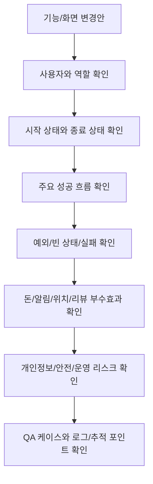
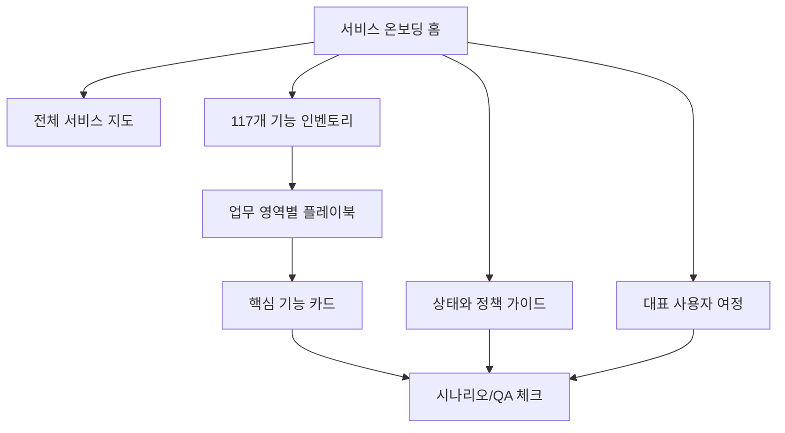

# QA Acceptance Criteria

<!-- supporting-doc-status: 2026-05-18 -->

> 문서 상태: **보조 문서**. 기능별 현재 계약, source trace, Gap/Risk 판단은 [PRD_MIGRATION_STATUS.md](../PRD_MIGRATION_STATUS.md)와 각 기능 PRD를 우선한다. 이 문서는 인벤토리, 정책, QA, 기획 운영 기준을 보조하며, 기능 세부 판단은 [FEATURE_PRD_STANDARD.md](../FEATURE_PRD_STANDARD.md) 기준으로 재확인한다.

## 문서 설명

| 항목 | 내용 |
|---|---|
| 목적 | 기능이 “동작한다”를 넘어 사용자가 이해 가능한 결과와 복구 동선을 갖췄는지 판정한다. |
| 보는 시점 | 개발 착수 전 수용 기준 합의, QA 케이스 작성, 릴리즈 승인 시점 |
| 이 문서로 정할 것 | 공통 수용 기준, 릴리즈 차단 조건, QA 검토 범위 |
| 같이 볼 문서 | 09_exceptions_edge_cases.md, 04_qa_acceptance/acceptance_criteria_matrix.md |

이 문서는 새 화면, 새 정책, 기존 기능 변경을 검토할 때 사용하는 마지막 점검표다. 기능이 많을수록 "주 흐름"은 기억하지만 상태, 돈, 알림, 권한, 개인정보, 외부 실패를 놓치기 쉽다.

## 전체 점검 흐름



## 1. 사용자와 역할

| 체크 | 질문 |
|---|---|
| 주 사용자 | 이 기능을 가장 자주 쓰는 사람은 누구인가 |
| 보조 사용자 | 같은 기능의 결과를 받는 사람은 누구인가 |
| 금지 사용자 | 버튼을 보거나 실행하면 안 되는 사람은 누구인가 |
| 복합 역할 | 호스트이면서 참가자, 클럽 관리자이면서 일반 멤버 같은 경우가 있는가 |
| 비정상 계정 | 차단, 탈퇴 예약, 비활성, 미인증 상태 사용자는 어떻게 되는가 |

## 2. 시작 상태와 종료 상태

| 체크 | 질문 |
|---|---|
| 시작 상태 | 사용자가 이 화면에 들어오기 전에 반드시 만족해야 하는 조건은 무엇인가 |
| 성공 종료 | 성공 후 어떤 상태/화면/데이터가 바뀌는가 |
| 실패 종료 | 실패 후 사용자가 다시 시도할 수 있는가 |
| 중간 이탈 | 입력 중 뒤로가기, 앱 종료, 네트워크 끊김 후 재진입은 어떻게 되는가 |
| 상태 갱신 | 다른 기기나 다른 사용자의 액션으로 상태가 바뀌면 어떻게 반영하는가 |

## 3. 빈 상태와 에러 상태

| 화면 상태 | 반드시 정해야 할 것 |
|---|---|
| 최초 로딩 | 스켈레톤, 스피너, 빈 화면 중 무엇을 쓰는가 |
| 데이터 없음 | 사용자가 다음에 할 수 있는 액션이 있는가 |
| 일부 실패 | 다른 섹션은 보여줄 수 있는가 |
| 전체 실패 | 재시도 버튼이 있는가 |
| 권한 없음 | 로그인 유도, 접근 불가, 이전 화면 복귀 중 무엇인가 |
| 만료/삭제 | 대상이 사라졌거나 만료되었을 때 문구는 무엇인가 |

## 4. 돈이 움직이는 기능

| 체크 | 질문 |
|---|---|
| 잔액 부족 | 충전으로 보낼 것인가, 자동충전을 시도할 것인가 |
| 결제수단 없음 | 결제수단 등록 화면으로 보낼 것인가 |
| 결제 성공 | 거래내역, 잔액, 원래 기능 상태가 모두 갱신되는가 |
| 결제 실패 | 사용자에게 PG 실패인지 잔액 부족인지 구분해서 보이는가 |
| 환불 | 환불 조건, 환불 시점, 환불 금액, 원거래 연결이 명확한가 |
| 중복 결제 | 같은 버튼을 여러 번 누르거나 콜백이 중복 도착해도 안전한가 |
| 정산 | 호스트 돈과 참가자 돈, 클럽 기금이 섞이지 않는가 |

## 5. 알림이 나가는 기능

| 체크 | 질문 |
|---|---|
| 수신자 | 누가 받아야 하는가 |
| 제외자 | 본인에게도 보내는가, 보내지 않는가 |
| 트리거 | 어떤 상태 전이에 알림이 나가는가 |
| 문구 | 사용자가 다음 행동을 바로 이해할 수 있는가 |
| 설정 반영 | 카테고리 꺼짐나 방해금지 시간에 걸리면 어떻게 되는가 |
| 딥링크 | 알림을 눌렀을 때 어디로 가는가 |
| 실패 | 푸시 실패해도 앱 내 알림함에는 남는가 |

## 6. 위치와 개인정보

| 체크 | 질문 |
|---|---|
| 명시적 동의 | 위치, 프로필, 데이터 내보내기, 삭제는 사용자가 명확히 동의했는가 |
| 중지 동선 | 위치 공유, 알림, 노출, 구독을 끄는 경로가 있는가 |
| 보관 기간 | 위치나 데이터 추출 파일은 언제까지 보관되는가 |
| 노출 범위 | 타인에게 보이는 정보와 본인에게만 보이는 정보가 구분되는가 |
| 민감 상태 | 차단, 신고, 신뢰점수, 데이팅 인증 상태가 과도하게 노출되지 않는가 |

## 7. 리뷰, 신고, 신뢰점수

| 체크 | 질문 |
|---|---|
| 작성 자격 | 실제 참석자, 구매자, 매칭 사용자 등 자격을 확인했는가 |
| 중복 방지 | 같은 대상에 여러 번 리뷰/신고할 수 있는가 |
| 수정/삭제 | 작성자가 바꿀 수 있는 범위와 횟수는 무엇인가 |
| 운영 접수 | 신고 후 사용자가 결과를 어떻게 인지하는가 |
| 신뢰 영향 | 리뷰, 노쇼, 신고, 차단이 점수에 반영되는가 |
| 공개/비공개 | 공개 리뷰와 비공개 취향 평가를 구분했는가 |

## 8. 외부 시스템 의존

| 외부 시스템 | 실패 시 확인할 것 |
|---|---|
| 소셜 로그인 앱 연동 모듈 | 사용자가 취소, 토큰 검증 실패, 연동 제공자 오류 |
| 이메일 발송 | 발송 실패, 만료 링크, 재발송 제한 |
| PG/결제 | 결제 중 이탈, 콜백 지연, 중복 콜백, 승인 실패 |
| 푸시 알림 | OS 권한 거부, 토큰 만료, 다중 기기 |
| 지도/지오코딩 | 권한 거부, 시스템 연동 장애, 주소 없음, 외부 지도 앱 미설치 |
| 파일 업로드 | 업로드용 임시 주소 실패, 업로드 실패, 삭제 실패 |

## 9. 중복, 동시성, 멀티 디바이스

| 상황 | 예시 | 검토 포인트 |
|---|---|---|
| 중복 클릭 | 신청 버튼 연타, 결제 버튼 연타 | 버튼 잠금, 멱등 처리, 실패 복구 |
| 동시 상태 변경 | 정원 마지막 자리, 대기열 승격 | 최신 상태 재조회, 안내 문구 |
| 멀티 디바이스 | 한 기기에서 로그아웃, 다른 기기에서 호출 | 토큰/세션 상태 동기화 |
| 관리자와 사용자 동시 액션 | 호스트가 취소하는 중 참가자가 결제 | 우선순위, 환불, 알림 |
| 외부 콜백 지연 | PG 성공 후 앱 복귀 전 서버 처리 지연 | pending 화면, 재조회 |

## 10. 기능별 레드 플래그

| 영역 | 레드 플래그 |
|---|---|
| 인증 | 마지막 로그인 수단 제거, 미인증 사용자 홈 진입, 토큰 갱신 무한 루프 |
| 홈/검색 | 비로그인과 로그인 결과 차이, 부분 실패, 캐시로 오래된 CTA 노출 |
| 이벤트 | 정원/대기열/승인/결제가 한 버튼에 섞이는 경우 |
| 클럽 | 관리자와 소유자 권한 혼동, 차단 시 환불/멤버십 정리 누락 |
| 결제 | 결제 성공과 기능 성공이 분리되는 경우 |
| 정산 | 작성중 상태인데 참가자에게 납부 요청이 보이는 경우 |
| 플랜 | 작성물, 판매상품, 구매 보유물이 섞이는 경우 |
| 데이팅 | 차단 후 채팅/매칭이 남아 있는 경우 |
| 캘린더 | 반복 일정 일부만 삭제하는 UI가 있는데 서버 정책이 단일 삭제인 경우 |
| 리뷰 | 미참석자 리뷰, 자기 신고, 중복 신고 |
| 알림 | 푸시 권한이 없는데 앱 내 알림도 없는 것처럼 보이는 경우 |
| 프로필 | 삭제 예약과 즉시 비활성화 문구 혼동 |
| 위치 | opt-in 없이 위치가 보이거나, opt-out 후 마커가 남는 경우 |

## 11. PRD 작성 전 최종 질문

```text
1. 이 기능은 어느 14개 업무 영역 중 어디에 속하는가?
2. 117개 기능 인벤토리 중 기존 기능의 확장인가, 신규 기능인가?
3. 주 사용자와 금지 사용자는 누구인가?
4. 시작 상태와 성공 종료 상태는 무엇인가?
5. 실패했을 때 사용자는 다음에 무엇을 할 수 있는가?
6. 돈, 알림, 위치, 캘린더, 리뷰/신뢰 중 움직이는 것이 있는가?
7. 빈 상태와 권한 없음 상태를 정의했는가?
8. 외부 시스템 실패를 정의했는가?
9. 중복 클릭과 멀티 디바이스를 정의했는가?
10. QA가 바로 테스트할 수 있는 시나리오 이름을 5개 이상 썼는가?
```

## 12. Notion 운영 권장 구조



처음부터 117개 기능 카드를 모두 상세화할 필요는 없다. 다만 117개 인벤토리는 반드시 유지하고, 실제 PRD나 QA가 시작되는 기능부터 카드 상세를 채우는 방식이 누락을 가장 적게 만든다.

## 전체 수용 기준

| 범주 | 수용 기준 |
|---|---|
| 기능 커버리지 | 117개 기능이 모두 PRD와 QA 대상에 포함되어야 한다. |
| 시나리오 커버리지 | 정상, 빈 상태, 권한, 상태 변화, 입력 검증, 외부 실패, 중복/동시성, 부수효과를 검토해야 한다. |
| 역할 커버리지 | 게스트, 로그인 사용자, 관계자, 소유자/관리자 역할별 CTA가 정의되어야 한다. |
| 상태 커버리지 | 생성, 진행, 완료, 취소, 만료, 삭제, 차단 상태를 구분해야 한다. |
| 회귀 방지 | 홈/검색 진입, 알림 딥링크, 결제/환불, 위치 권한 흐름이 깨지지 않아야 한다. |
