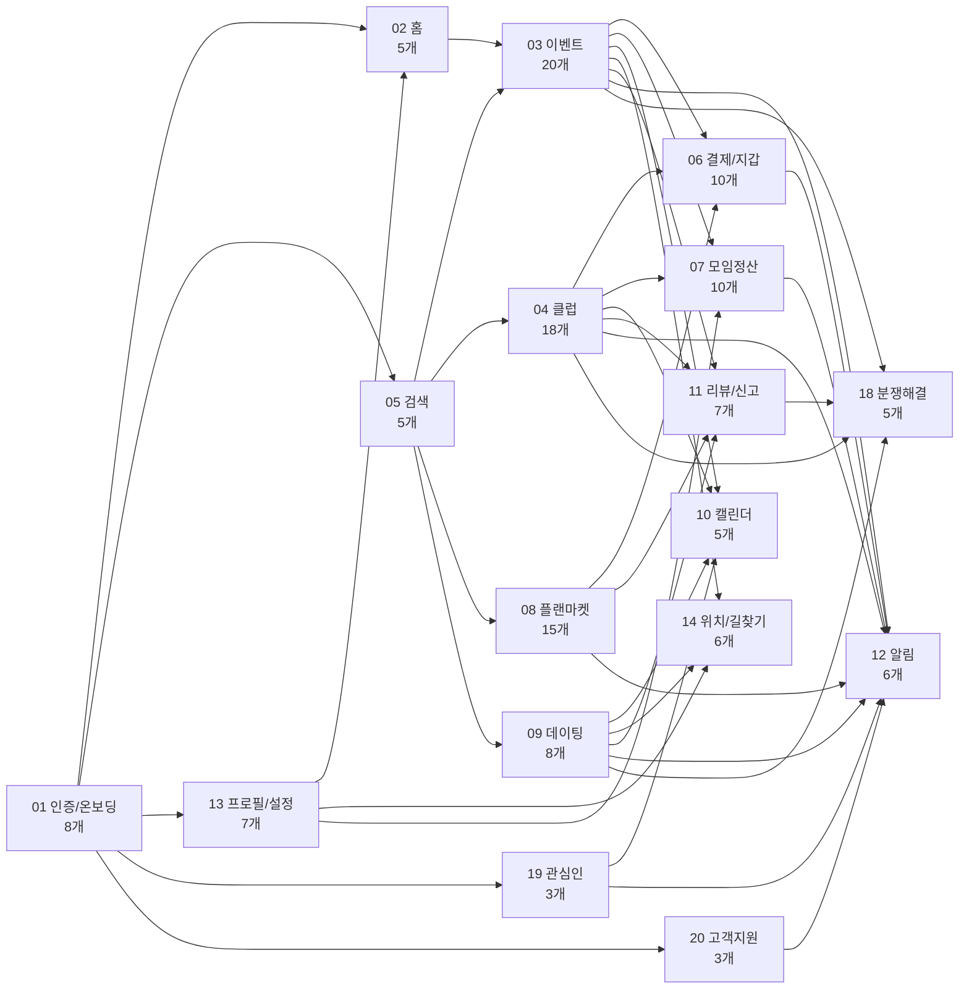
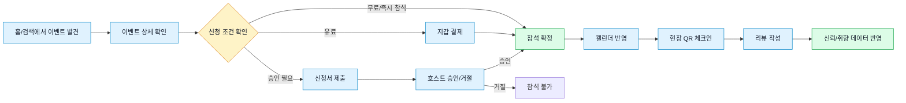
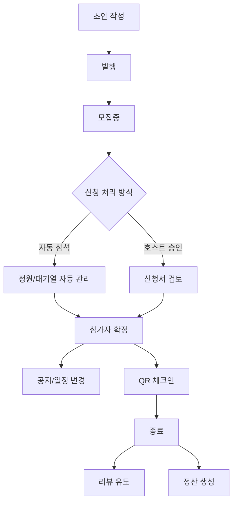
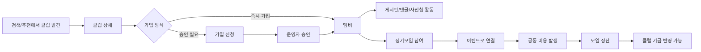
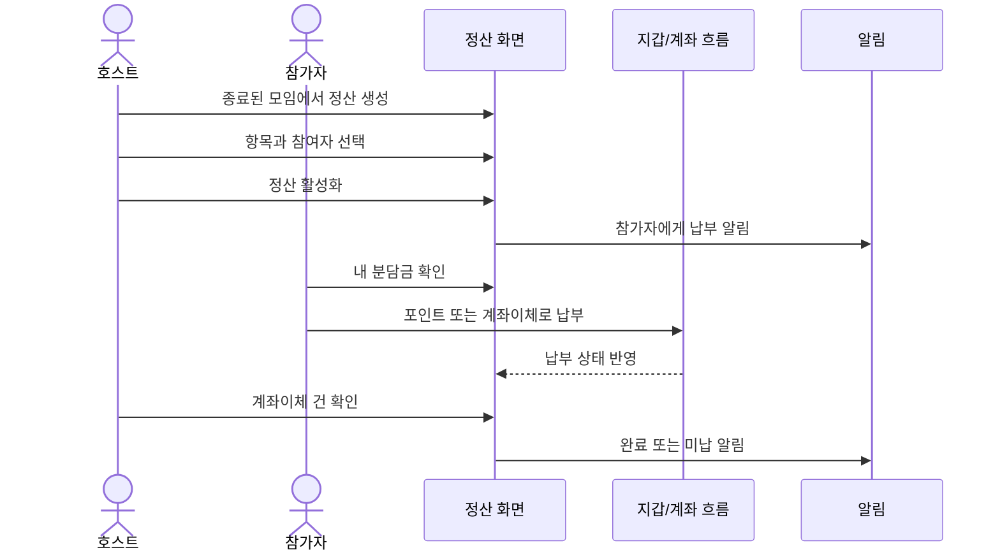
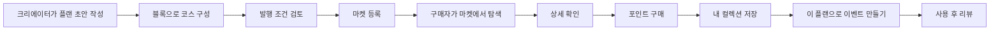
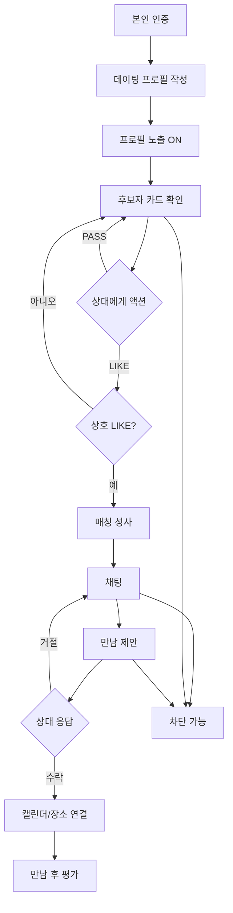
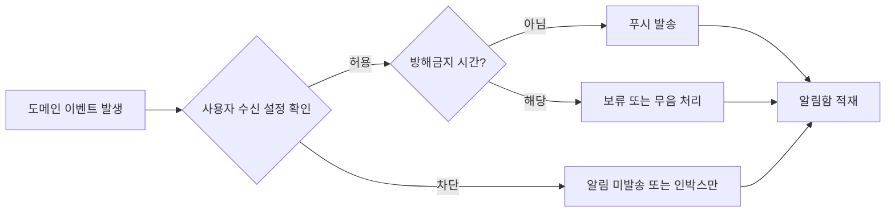

# community 전체 제품 요구사항 문서(PRD)

> 문서 상태: **제품 개요 문서**. 기능별 현재 계약, source trace, Gap/Risk 판단은 `PRD_MIGRATION_STATUS.md`와 `02_feature_prds/`의 기능 PRD를 우선한다. 이 문서는 제품 범위와 전체 구조를 잡는 입구다.

## 변경 이력

| 버전 | 일자 | 요약 |
|---|---|---|
| v4.5 W1~W7 | 2026-05-22 | 정원 초과 허용, 참가 선입금(WALLET/BANK_TRANSFER), 카풀, 버스대절 4개 기능 추가 (이벤트 도메인 신규 PRD F03-13~17, 마스터 플랜 `docs/plan/event-extensions/PLAN.md`) |
| v5.0 delta | 2026-06-05 | 도메인 17→20 (18 분쟁 해결·19 관심인·20 고객지원 신설), 기능 153→168 (+15: F03-19/20, F04-18, F11-07, F18-01~05, F19-01~03, F20-01~03) |

## 1. 문서 목적

이 문서는 community 플랫폼의 전체 기능형 PRD다. 현재 코드와 비즈니스 로직 정리에서 확인 가능한 범위만 작성한다. 사업 KPI, 출시 일정, 법무 최종 문구, 운영 SLA처럼 코드와 기존 명세만으로 확정할 수 없는 항목은 별도 결정 필요 항목으로 분리한다.

## 2. 제품 정의

community는 사용자가 관심사 기반 오프라인 활동을 발견하고, 참여하고, 관계를 이어가며, 결제·정산·리뷰·신뢰 관리까지 앱 안에서 처리하는 플랫폼이다.

## 3. 사용자 유형

| 사용자 | 주된 목적 | 핵심 기능 |
|---|---|---|
| 참가자 | 이벤트나 클럽을 찾아 참여한다 | 홈, 검색, 이벤트, 클럽, 결제, 리뷰 |
| 호스트 | 모임을 만들고 참가자를 관리한다 | 이벤트 생성/관리, 신청 승인, 체크인, 정산 |
| 클럽 운영자 | 장기 커뮤니티와 기금을 운영한다 | 멤버 관리, 게시판, 정기모임, 기금, 구독 |
| 플랜 크리에이터 | 코스나 모임 계획을 상품화한다 | 플랜 작성, 발행, 마켓 등록, 통계 |
| 플랜 구매자 | 검증된 코스를 구매해 활용한다 | 마켓 탐색, 구매, 컬렉션, 이벤트 생성 |
| 데이팅 사용자 | 인증된 사용자와 매칭하고 만남을 조율한다 | 인증, 프로필, 스와이프, 채팅, 만남, 차단 |

## 4. 제품 범위

| 구분 | 포함 |
|---|---|
| 업무 영역 | 20개 |
| 기능 단위 | 168개 |
| 검증 시나리오 | 1134개 |
| 주요 도식 | 534개 |

## 5. 전체 기능 구조

## 전체 기능 흐름



## 6. 대표 사용자 여정

## 여정 1. 모임 발견에서 리뷰까지



기획 체크포인트:

| 단계 | 확인할 것 |
|---|---|
| 발견 | 추천/검색 결과에 왜 노출되는가 |
| 상세 | 비로그인, 호스트, 참가자에게 CTA가 어떻게 달라지는가 |
| 신청 | 승인 필요, 정원 초과, 대기열, 유료 조건이 어떻게 갈라지는가 |
| 참석 | 캘린더, 알림, 위치/길찾기 연결이 필요한가 |
| 체크인 | 체크인 가능한 시간과 권한은 무엇인가 |
| 리뷰 | 실제 참석자만 작성 가능한가, 중복 작성은 막히는가 |

## 여정 2. 호스트가 이벤트를 만들고 운영한다

```
이벤트 초안 작성
  -> 장소/시간/정원/승인 방식 설정
  -> 발행
  -> 참가 신청 수신
  -> 승인/거절 또는 대기열 관리
  -> 일정 변경/공지/취소 가능
  -> 현장 체크인 관리
  -> 종료 후 리뷰와 정산으로 이동
```



기획 체크포인트:

| 주제 | 질문 |
|---|---|
| 생성 | 필수 입력값을 다 채우기 전 발행을 막는가 |
| 모집 | 승인제/선착순/대기열 정책을 어떻게 보여주는가 |
| 운영 | 일정 변경이나 취소 시 누구에게 어떤 알림이 가는가 |
| 종료 | 정산, 리뷰, 사진첩으로 어떻게 이어지는가 |

## 여정 3. 클럽 가입에서 공동 정산까지



기획 체크포인트:

| 단계 | 확인할 것 |
|---|---|
| 가입 | 공개 클럽과 승인제 클럽의 CTA 차이 |
| 멤버 권한 | 소유자, 관리자, 일반 멤버, 차단 사용자의 액션 차이 |
| 커뮤니티 | 게시글/댓글/사진첩 신고와 삭제 권한 |
| 재무 | 기금, 후원, 출금, 공동 정산이 어디서 갈라지는가 |

## 여정 4. 정산 생성과 납부



정산의 핵심은 돈을 나누는 방식보다 상태다.

```
DRAFT: 호스트가 만들고 편집하는 단계
ACTIVE: 참가자에게 납부 요청이 열린 단계
COMPLETED: 모든 납부/확인이 끝난 단계
CANCELLED: 정산이 취소된 단계
```

## 여정 5. 플랜 작성, 판매, 구매, 활용



기획 체크포인트:

| 주제 | 질문 |
|---|---|
| 작성 | 초안 상태에서만 편집 가능한 항목은 무엇인가 |
| 발행 | 가격, 커버, 설명, 블록 등 발행 요건은 무엇인가 |
| 구매 | 이미 구매한 상품, 잔액 부족, 번들 일부 중복은 어떻게 처리하는가 |
| 활용 | 구매한 플랜을 이벤트 생성으로 넘길 때 어떤 정보가 복사되는가 |

## 여정 6. 데이팅 매칭과 안전 흐름



기획 체크포인트:

| 단계 | 확인할 것 |
|---|---|
| 인증 | 미인증 사용자는 어디까지 볼 수 있는가 |
| 프로필 | 노출 ON/OFF, 사진 개수, 소개 입력 조건 |
| 스와이프 | 일일 LIKE 한도, 매칭 성사 모달, 후보자 없음 상태 |
| 채팅 | 차단 시 채팅방과 매칭 상태가 어떻게 바뀌는가 |
| 만남 | 제안, 수락/거절, 장소, 일정, 안전 기능의 노출 기준 |

## 여정 7. 알림과 설정의 공통 흐름



알림은 기능의 주인공이 아니라 다른 기능에서 생긴 상태 변화를 사용자에게 전달하는 보조 흐름이다. 기획할 때는 "알림 화면에 무엇을 보여줄지"보다 "어떤 사건이 발생했을 때 누구에게 어떤 문구로 알려야 하는지"를 먼저 정해야 한다.

## 7. PRD 문서 구성

| 폴더 | 내용 |
|---|---|
| 01_domain_prds | 20개 업무 영역별 PRD (18 분쟁 해결·19 관심인·20 고객지원 신설, dir: 18_dispute_resolution/19_favorite/20_support) |
| 02_feature_prds | 168개 기능별 PRD |
| 03_policy_prds | 상태, 권한, 알림, 결제/정산, 개인정보/안전 정책 PRD |
| 04_qa_acceptance | 전체 수용 기준, 시나리오 커버리지, 릴리즈 체크리스트 |

## 8. 현재 문서로 확정 가능한 것

| 항목 | 상태 |
|---|---|
| 기능 구조 | 확정 가능 |
| 주요 사용자와 역할 | 확정 가능 |
| 기능별 기본/예외 시나리오 | 확정 가능 |
| 상태 전이와 권한 분기 | 확정 가능 |
| 알림/결제/위치/리뷰 영향 | 1차 확정 가능 |
| QA 수용 기준 | 기능형 기준 작성 가능 |

## 9. 별도 의사결정이 필요한 것

| 항목 | 필요한 결정 |
|---|---|
| 사업 KPI | 가입 전환율, 이벤트 신청률, 결제 전환율, 리텐션 등 |
| 출시 우선순위 | MVP/P0/P1/P2 범위 |
| 운영 SLA | 신고 처리 시간, 환불 처리 기준, CS 대응 기준 |
| 법무 문구 | 개인정보, 위치 공유, 데이팅 안전 고지, 데이터 삭제 |
| 최종 UX 카피 | 버튼, 토스트, 빈 상태, 에러 문구의 제품 톤 |
