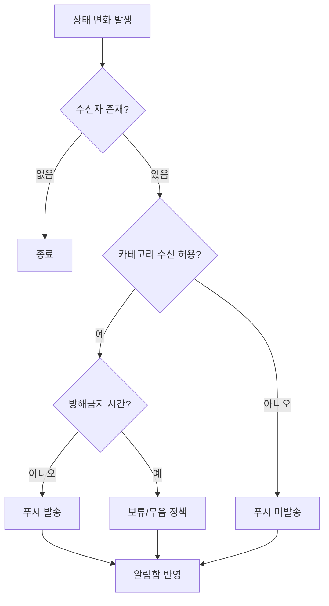

# 알림 정책 PRD

<!-- supporting-doc-status: 2026-05-22 -->

> 문서 상태: **보조 문서**. 기능별 현재 계약, source trace, Gap/Risk 판단은 [PRD_MIGRATION_STATUS.md](../PRD_MIGRATION_STATUS.md)와 각 기능 PRD를 우선한다. 이 문서는 인벤토리, 정책, QA, 기획 운영 기준을 보조하며, 기능 세부 판단은 [FEATURE_PRD_STANDARD.md](../FEATURE_PRD_STANDARD.md) 기준으로 재확인한다.

## 1. 목적

알림은 도메인 이벤트의 결과를 사용자에게 전달하는 보조 기능이다. 기획 시 알림 화면 자체보다 "누가, 언제, 왜 받아야 하는지"를 먼저 확정한다.

## 2. 알림 트리거

| 트리거 유형 | 예시 | 검토 기준 |
|---|---|---|
| 참여 상태 변경 | 이벤트 승인/거절, 대기열 승격 | 대상자와 호스트 모두 필요한지 확인 |
| 돈 상태 변경 | 결제 성공/실패, 환불, 정산 독촉 | 중요 알림으로 분류할지 확인 |
| 커뮤니티 활동 | 클럽 공지, 댓글, 초대 | 그룹핑과 배지 정책 확인 |
| 데이팅/안전 | 매칭, 채팅, 만남 제안, 차단 | 민감 정보 노출 최소화 |
| 계정/설정 | 데이터 내보내기 완료, 권한 회복 | 사용자가 다음 행동을 할 수 있어야 함 |

## 3. 발송 판단 흐름

## 4. 수용 기준

- 알림에는 사용자가 다음에 할 수 있는 행동이 명확해야 한다.
- 알림 딥링크 대상이 삭제/만료/권한 없음 상태일 때의 fallback이 있어야 한다.
- OS 권한 거부 상태에서도 앱 내 알림함 정책을 분리해서 정의해야 한다.

## 5. v4.5 W1~W7 신규 NotificationType (2026-05-22)

> updated: 2026-05-22. 본 절은 `docs/plan/event-extensions/PLAN.md` v4.5와 `docs/plan/event-extensions/ENUM_RESERVATIONS.md`에서 예약된 NotificationType 13개 (71~83)를 추적한다. 실제 enum 추가는 `community_api/src/main/java/com/endside/community/notification/constants/NotificationType.java` 파일에서 머지된다.

### 5.1 전송 인프라 결정 (D15 — AFTER_COMMIT)

선입금/카풀/버스 알림은 모두 결제·취소·할당 트랜잭션과 함께 발생한다. 알림이 발송된 후 트랜잭션이 롤백되면 사용자에게 잘못된 정보가 가므로 다음 규칙을 강제한다.

- 모든 결제 facade(`EventPrepaymentService`, `EventPaymentRefundService`, `EventCancellationRefundCoordinator` 등)와 운송 facade(`EventCarpoolService`, `EventBusService`)는 알림을 직접 호출하지 않는다.
- 대신 `ApplicationEventPublisher`로 도메인 이벤트(`EventPrepaymentRequiredEvent`, `CarpoolOfferConfirmedEvent` 등)만 발행한다.
- `@TransactionalEventListener(phase = TransactionPhase.AFTER_COMMIT)`를 단 리스너가 `NotificationService.send(...)`를 호출한다.
- 결제 트랜잭션이 롤백되면 알림은 발송되지 않는다. (P2#8, D15 결정)

### 5.2 신규 알림 매트릭스 (71~83)

| # | NotificationType | 트리거 (발신 조건) | 수신자 | Payload | 결제/취소 도메인 이벤트 |
|---:|---|---|---|---|---|
| 71 | `EVENT_PREPAYMENT_REQUIRED` | application 상태가 `APPROVED_PENDING_PAYMENT`로 진입 | 신청자 본인 | `{"eventId":N}` | `ApplicationApprovedPendingPaymentEvent` |
| 72 | `EVENT_PREPAYMENT_BANK_DECLARED` | 참가자가 BANK_TRANSFER 입금 신고 (`event_payment.declared_at` 갱신) | 이벤트 호스트 + 공동호스트 fan-out | `{"eventId":N,"applicationId":M}` | `BankTransferDeclaredEvent` |
| 73 | `EVENT_PREPAYMENT_BANK_CONFIRMED` | 호스트가 입금 확인 (`event_payment.status=PAID`) | 신청자 본인 | `{"eventId":N}` | `BankTransferConfirmedEvent` |
| 74 | `EVENT_PREPAYMENT_BANK_REJECTED` | 호스트가 입금 미확인 처리 (`event_payment.status=CANCELED`, reason 기록) | 신청자 본인 | `{"eventId":N,"reason":"..."}` | `BankTransferRejectedEvent` |
| 75 | `EVENT_PREPAYMENT_EXPIRED` | 결제 마감 시간 만료 — `event_payment.status` PENDING→CANCELED | 신청자 본인 | `{"eventId":N}` | `PrepaymentExpiredEvent` (만료 스케줄러) |
| 76 | `EVENT_PREPAYMENT_REFUNDED` | WALLET 환불 완료 (`event_payment.status=REFUNDED`) | 신청자 본인 | `{"eventId":N,"amount":N}` | `PrepaymentRefundedEvent` |
| 77 | `CARPOOL_OFFER_CONFIRMED` | 호스트가 운전자 offer 확정 (`event_carpool_offer.status=CONFIRMED`) | offer 작성자(운전자) | `{"eventId":N,"offerId":M}` | `CarpoolOfferConfirmedEvent` |
| 78 | `CARPOOL_OFFER_REJECTED` | 호스트가 운전자 offer 거절 | offer 작성자(운전자) | `{"eventId":N,"offerId":M}` | `CarpoolOfferRejectedEvent` |
| 79 | `CARPOOL_PASSENGER_ASSIGNED` | 호스트가 탑승자를 운전자에 배정 (`event_carpool_passenger.offer_id` 설정) | 탑승자 본인 | `{"eventId":N,"offerId":M}` | `CarpoolPassengerAssignedEvent` |
| 80 | `CARPOOL_PASSENGER_UNASSIGNED` | 호스트가 탑승자 배정 해제 | 탑승자 본인 | `{"eventId":N}` | `CarpoolPassengerUnassignedEvent` |
| 81 | `BUS_SEAT_ASSIGNED` | 좌석 배정 (호스트 또는 자동 first-come) | 좌석 배정 대상자 | `{"eventId":N,"busId":M,"seatNo":"1A"}` | `BusSeatAssignedEvent` |
| 82 | `BUS_SEAT_CHANGED` | 호스트가 좌석 변경 (allow_self_swap=false 또는 host override) | 좌석 변경 대상자 | `{"eventId":N,"busId":M,"oldSeat":"1A","newSeat":"2B"}` | `BusSeatChangedEvent` |
| 83 | `EVENT_PREPAYMENT_REFUND_REQUESTED` | BANK_TRANSFER 결제 후 참가취소/이벤트취소 → 호스트 수동 환불 필요 | 이벤트 호스트 (+ 공동호스트 fan-out) | `{"eventId":N,"applicationId":M,"amount":N}` | `BankTransferRefundRequestedEvent` |

### 5.3 Flutter 라우팅 반영

- `community_app/lib/core/utils/notification_router.dart`에 13개 case 추가.
- 71/73/74/75/76 → 이벤트 신청 상세 페이지(`/event/{id}/application`)
- 72/83 → 호스트 결제 관리 페이지(`/event/{id}/host/payments`)
- 77/78 → 운전자 offer 관리 페이지(`/event/{id}/carpool/my-offer`)
- 79/80 → 탑승자 카풀 배정 페이지(`/event/{id}/carpool/me`)
- 81/82 → 버스 좌석 페이지(`/event/{id}/bus/{busId}/seat`)

### 5.4 카테고리 수신 설정

| NotificationType 그룹 | 카테고리 | 사용자 토글 가능 여부 |
|---|---|---|
| 71/75/76 (선입금 진행/만료/환불) | `payment` | 가능 (단, 75/76은 가능하면 강제 발송 권장 — 돈 관련) |
| 72/73/74/83 (계좌이체 운영) | `payment` | 가능 |
| 77~80 (카풀 운영) | `event` | 가능 |
| 81/82 (버스 좌석) | `event` | 가능 |

방해금지 시간에는 1~80은 보류, 75/76/83은 즉시 발송 (금전 영향). 최종 정책은 운영 SLA로 별도 결정 필요.

### 5.5 후속 (별도 PRD/슬라이스)

- WalletRefundExecutor 분리 시 76 페이로드에 `transactionId` 추가 가능성 검토.
- 환불 비율 정책(시간대별 100/50/0%) 결정 후 76 payload에 `refundRatio` 필드 추가.
- 카풀 swap 로그(`event_carpool_assignment_log`) 기반 운영 리포트는 알림 대상 외 (이메일 리포트 후속).
