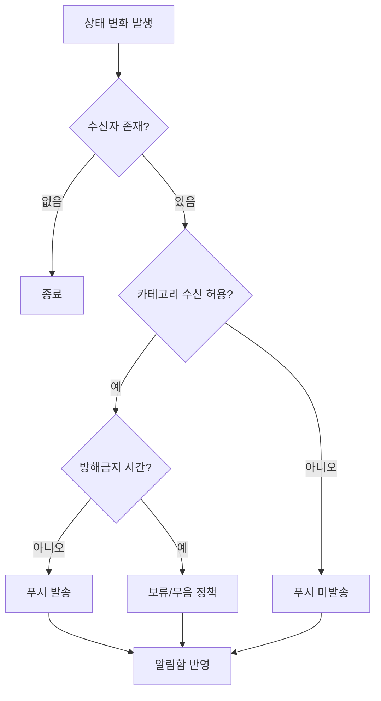

# 알림 정책 PRD

<!-- supporting-doc-status: 2026-05-18 -->

> 문서 상태: **보조 문서**. 기능별 현재 계약, source trace, Gap/Risk 판단은 [PRD_MIGRATION_STATUS.md](../PRD_MIGRATION_STATUS.md)와 각 기능 PRD를 우선한다. 이 문서는 인벤토리, 정책, QA, 기획 운영 기준을 보조하며, 기능 세부 판단은 [FEATURE_PRD_STANDARD.md](../FEATURE_PRD_STANDARD.md) 기준으로 재확인한다.

## 1. 목적

알림은 도메인 이벤트의 결과를 사용자에게 전달하는 보조 기능이다. 기획 시 알림 화면 자체보다 "누가, 언제, 왜 받아야 하는지"를 먼저 확정한다.

## 2. 알림 트리거

| 트리거 유형 | 예시 | 검토 기준 |
|---|---|---|
| 참여 상태 변경 | 이벤트 승인/거절, 대기열 승격 | 대상자와 호스트 모두 필요한지 확인 |
| 돈 상태 변경 | 결제 성공/실패, 환불, 정산 독촉 | 중요 알림으로 분류할지 확인 |
| 커뮤니티 활동 | 클럽 공지, 댓글, 초대 | 그룹핑과 배지 정책 확인 |
| 데이팅/안전 | 매칭, 채팅, 만남 제안, 차단 | 민감 정보 노출 최소화 |
| 계정/설정 | 데이터 내보내기 완료, 권한 회복 | 사용자가 다음 행동을 할 수 있어야 함 |

## 3. 발송 판단 흐름

## 4. 수용 기준

- 알림에는 사용자가 다음에 할 수 있는 행동이 명확해야 한다.
- 알림 딥링크 대상이 삭제/만료/권한 없음 상태일 때의 fallback이 있어야 한다.
- OS 권한 거부 상태에서도 앱 내 알림함 정책을 분리해서 정의해야 한다.
