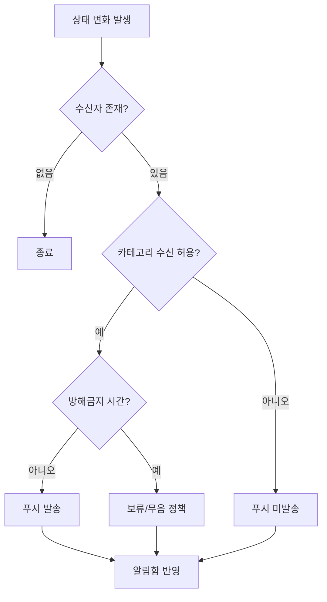

# 알림 정책 PRD

<!-- supporting-doc-status: 2026-05-22 -->

> 문서 상태: **보조 문서**. 기능별 현재 계약, source trace, Gap/Risk 판단은 [PRD_MIGRATION_STATUS.md](../PRD_MIGRATION_STATUS.md)와 각 기능 PRD를 우선한다. 이 문서는 인벤토리, 정책, QA, 기획 운영 기준을 보조하며, 기능 세부 판단은 [FEATURE_PRD_STANDARD.md](../FEATURE_PRD_STANDARD.md) 기준으로 재확인한다.

## 1. 목적

알림은 도메인 이벤트의 결과를 사용자에게 전달하는 보조 기능이다. 기획 시 알림 화면 자체보다 "누가, 언제, 왜 받아야 하는지"를 먼저 확정한다.

## 2. 알림 트리거

| 트리거 유형 | 예시 | 검토 기준 |
|---|---|---|
| 참여 상태 변경 | 이벤트 승인/거절, 대기열 승격 | 대상자와 호스트 모두 필요한지 확인 |
| 돈 상태 변경 | 결제 성공/실패, 환불, 정산 독촉 | 중요 알림으로 분류할지 확인 |
| 커뮤니티 활동 | 클럽 공지, 댓글, 초대 | 그룹핑과 배지 정책 확인 |
| 데이팅/안전 | 매칭, 채팅, 만남 제안, 차단 | 민감 정보 노출 최소화 |
| 계정/설정 | 데이터 내보내기 완료, 권한 회복 | 사용자가 다음 행동을 할 수 있어야 함 |

## 3. 발송 판단 흐름

```mermaid
flowchart TD
    A["상태 변화 발생"] --> B{"수신자 존재?"}
    B -->|"없음"| C["종료"]
    B -->|"있음"| D{"카테고리 수신 허용?"}
    D -->|"아니오"| E["푸시 미발송"]
    D -->|"예"| F{"방해금지 시간?"}
    F -->|"예"| G["보류/무음 정책"]
    F -->|"아니오"| H["푸시 발송"]
    H --> I["알림함 반영"]
    G --> I
    E --> I
```

## 4. 수용 기준

- 알림에는 사용자가 다음에 할 수 있는 행동이 명확해야 한다.
- 알림 딥링크 대상이 삭제/만료/권한 없음 상태일 때의 fallback이 있어야 한다.
- OS 권한 거부 상태에서도 앱 내 알림함 정책을 분리해서 정의해야 한다.

## 5. NotificationType 71~83 실제 생산 배선 (2026-07-29)

> enum 선언과 production publisher/listener/send, 수신자 fanout, payload, Flutter route를 각각 실측한다. 삭제된 event-extensions 계획은 현재 전송 계약이 아니다.

### 5.1 현재 인프라

- 선입금 71~74·76은 서비스가 domain event를 발행하고 `EventExtensionNotificationListener`가 `AFTER_COMMIT`에 전송한다.
- 75 listener는 있으나 `ApplicationPaymentExpiredEvent` production publisher가 없다.
- 83은 결제 facade event가 아니라 `RefundRequestEscalationScheduler`가 직접 전송한다.
- 카풀·버스 서비스는 77~82 domain event를 발행하지 않으며 listener도 없다.

### 5.2 신규 알림 매트릭스 (71~83)

| # | NotificationType | 실제 생산 상태 | 수신자 | 실제 Payload | 근거 |
|---:|---|---|---|---|---|
| 71 | `EVENT_PREPAYMENT_REQUIRED` | 연결됨 | 신청자 본인 | `{"eventId":N}` | `ApplicationPendingPaymentEvent` → AFTER_COMMIT listener |
| 72 | `EVENT_PREPAYMENT_BANK_DECLARED` | 연결됨 | **주 호스트 한 명** | `{"eventId":N}` | `EventPaymentBankDeclaredEvent`; CoHost fanout 없음 |
| 73 | `EVENT_PREPAYMENT_BANK_CONFIRMED` | BANK PAID에 연결됨 | 신청자 본인 | `{"eventId":N}` | `EventPaymentPaidEvent`; WALLET PAID는 기존 `PAYMENT_COMPLETED` |
| 74 | `EVENT_PREPAYMENT_BANK_REJECTED` | 연결됨 | 신청자 본인 | `{"eventId":N}` | `EventPaymentBankRejectedEvent`; reason은 본문 문구이지 payload 아님 |
| 75 | `EVENT_PREPAYMENT_EXPIRED` | **dead wiring** | — | — | listener는 있으나 production publisher 없음 |
| 76 | `EVENT_PREPAYMENT_REFUNDED` | 연결됨 | 신청자 본인 | `{"eventId":N}` | `EventPaymentRefundedEvent`; amount는 본문 문구 |
| 77 | `CARPOOL_OFFER_CONFIRMED` | **enum only** | — | — | publisher/listener/send 없음 |
| 78 | `CARPOOL_OFFER_REJECTED` | **enum only** | — | — | publisher/listener/send 없음 |
| 79 | `CARPOOL_PASSENGER_ASSIGNED` | **enum only** | — | — | publisher/listener/send 없음 |
| 80 | `CARPOOL_PASSENGER_UNASSIGNED` | **enum only** | — | — | publisher/listener/send 없음 |
| 81 | `BUS_SEAT_ASSIGNED` | **enum only** | — | — | publisher/listener/send 없음 |
| 82 | `BUS_SEAT_CHANGED` | **enum only** | — | — | publisher/listener/send 없음 |
| 83 | `EVENT_PREPAYMENT_REFUND_REQUESTED` | 지연 escalation만 연결 | 주 호스트 한 명 | `{"eventId":N}` | 최초 환불요청 즉시가 아니라 기본 3일 후 `RefundRequestEscalationScheduler` 직접 send |

### 5.3 Flutter 라우팅 반영

- `community_app/lib/core/utils/notification_router.dart`에는 71~83 case가 **하나도 없다**.
- 이 값들은 현재 `_ => null`로 처리되며 `isNavigable` 목록에도 없다.
- 위에서 과거에 제시한 결제·카풀·버스 경로들은 현재 Routes/Screen으로 존재하지 않는다.

### 5.4 카테고리 수신 설정

| NotificationType 그룹 | 카테고리 | 사용자 토글 가능 여부 |
|---|---|---|
| 71/73/74/76 | `payment` | 실제 전송 경로에 수신 설정 적용 여부를 통합 테스트로 검증 필요 |
| 72/83 | `payment` | 주 호스트 한 명에게만 실제 전송 |
| 75 | `payment` | publisher 없음 |
| 77~80 | `event` | enum only |
| 81/82 | `event` | enum only |

방해금지 시간 즉시/보류 규칙은 이 enum 존재만으로 확정할 수 없다. 실제 전송 경로와 사용자 설정 서비스를 함께 검증해야 한다.

### 5.5 후속 (별도 PRD/슬라이스)

- 75 생산 publisher와 application/payment 원자적 만료 정리
- 77~82 생산 event/listener/send 및 Flutter 화면·라우팅
- 71~76·83 Flutter fallback/deep link
- 72/83의 CoHost fanout 여부를 정책으로 결정
- `RefundRequestEscalationScheduler`는 대상 row를 잠그지 않고 `EventPayment`/DDL에도 version이 없어, 동시 환불 완료가 일어난 경우 stale `REFUND_REQUESTED` 저장이 `REFUNDED`를 되살릴 경쟁 위험이 있다. locking/version 또는 조건부 update가 필요하다.

## 6. 2026-06-05 신규 NotificationType (60~96번 추가분 및 딥링크 정책)

> updated: 2026-06-05. 소스: `NotificationType.java` 전수 확인 (dossier 09 §2-8). 60~96번 전체 36종을 추적한다.

### 6.1 60~96번 알림 유형 표

| # | NotificationType | 트리거 | 수신자 | 비고 |
|---:|---|---|---|---|
| 60 | `EVENT_ANNOUNCE` | 호스트 참석자 일괄 공지 발송 | 이벤트 ATTENDING 참가자 전원 | — |
| 61 | `SAFETY_CHECKIN_REMINDER` | 안전 체크인 트리거 | 해당 사용자 | 데이팅 안전 흐름 |
| 62 | `EVENT_MESSAGE_CREATED` | 이벤트 채팅 메시지 신규 | 이벤트 참가자 | — |
| 63 | `EVENT_MESSAGE_REPLIED` | 이벤트 채팅 메시지 답변 | 원 메시지 작성자 | — |
| 64 | `MEETING_SETTLEMENT_APPEAL_CREATED` | 모임 정산 이의제기 생성 | 호스트 | 정산 신청(ACTIVE) 이후 생성된 이의만 — DRAFT 이의는 서버 차단으로 미발생(2026-06-05, DEC-V4) |
| 65 | `MEETING_SETTLEMENT_APPEAL_RESOLVED` | 모임 정산 이의제기 처리 완료 | 이의제기자(참가자) | — |
| 66 | `SUPPORT_ISSUE_UPDATED` | 운영 문의(1:1 문의/이슈) 답변 | 문의 접수자 | F20-01/02 딥링크 필요 |
| 67 | `EVENT_PHOTO_GRACE_ENTERED` | 이벤트 사진 유예 기간 진입 | 업로더 | — |
| 68 | `EVENT_PHOTO_EXPIRY_FINAL` | 이벤트 사진 만료 최종 경고 | 업로더 | — |
| 69 | `EVENT_PHOTO_CLEANUP_IMMINENT` | 이벤트 사진 정리 임박 | 업로더 | — |
| 70 | `EVENT_PHOTO_AUTO_HIDDEN` | 이벤트 사진 자동 숨김 처리 | 업로더 | — |
| 71 | `EVENT_PREPAYMENT_REQUIRED` | 연결됨 | 신청자 본인 | payload eventId only |
| 72 | `EVENT_PREPAYMENT_BANK_DECLARED` | 연결됨 | 주 호스트 1명 | CoHost fanout 없음 |
| 73 | `EVENT_PREPAYMENT_BANK_CONFIRMED` | BANK PAID에 연결됨 | 신청자 본인 | WALLET은 기존 PAYMENT_COMPLETED |
| 74 | `EVENT_PREPAYMENT_BANK_REJECTED` | 연결됨 | 신청자 본인 | reason은 payload가 아닌 message |
| 75 | `EVENT_PREPAYMENT_EXPIRED` | listener only, publisher 없음 | — | dead wiring |
| 76 | `EVENT_PREPAYMENT_REFUNDED` | 연결됨 | 신청자 본인 | amount는 message |
| 77 | `CARPOOL_OFFER_CONFIRMED` | enum only | — | 생산 배선 없음 |
| 78 | `CARPOOL_OFFER_REJECTED` | enum only | — | 생산 배선 없음 |
| 79 | `CARPOOL_PASSENGER_ASSIGNED` | enum only | — | 생산 배선 없음 |
| 80 | `CARPOOL_PASSENGER_UNASSIGNED` | enum only | — | 생산 배선 없음 |
| 81 | `BUS_SEAT_ASSIGNED` | enum only | — | 생산 배선 없음 |
| 82 | `BUS_SEAT_CHANGED` | enum only | — | 생산 배선 없음 |
| 83 | `EVENT_PREPAYMENT_REFUND_REQUESTED` | 기본 3일 후 escalation | 주 호스트 1명 | 최초 요청 즉시 발송 아님 |
| 84~95 | `REFUND_*` (12종) | 마켓 환불 플로우 상태 변화 | 환불 당사자 | F08-14 환불 관련 알림 |
| 96 | `FAVORITE_PERSON_NEW_EVENT` | 관심인이 새 이벤트 발행 | 해당 관심인을 등록한 사용자 | `FavoriteService.isEffectiveFavorite()` 팬아웃 (F19-01) |

### 6.2 EVENT_UPDATED 서브타입 라우팅 정책 (RS-002)

`NotificationType.EVENT_UPDATED(11)` 알림은 `dataJson.type` 서브값으로 동작이 분기된다.

| dataJson.type | 트리거 | 클라이언트 딥링크 |
|---|---|---|
| `"RESCHEDULE_PROPOSAL"` | MAJOR 변경 제안 생성 시 참가자별 발송. `proposalId` 포함 | `Routes.myRescheduleProposalPath(proposalId)` → 참가자 응답화면 직행 |
| `"RESCHEDULE_APPLIED"` | batch apply 후 ACCEPTED+AUTO_ACCEPTED 참가자에게 발송. `batchId` 포함 | 이벤트 상세 fallback (전용 화면 미구현 — Gap) |
| `"RESCHEDULE"` | AUTO 즉시 반영 시. `proposalId` 없음 | 이벤트 상세 fallback |

> **Gap**: `"RESCHEDULE_APPLIED"` 알림 전용 라우팅 미구현. `notification_router.dart`에서 이벤트 상세 fallback으로만 처리됨.

### 6.3 분쟁 알림 딥링크 Gap

**부분 해소(2026-06-06, W14 S1)** — `REFUND_DISPUTE_CREATED(92)/UPHELD(93)/OVERTURNED(94)` 3종은 **배선 완료**: `data.disputeId`로 `REFUND_DISPUTE:{id}` caseId 조립 후 `/me/disputes/:caseId`로 이동(앱 `NotificationType` enum에도 3종 등재, community_app `3cb12ac`). **사실 정정**: 그 외 분쟁 케이스 도메인(USER_DISPUTE/CLUB_MEMBERSHIP_ACTION/DATE_BLOCK 등)은 서버 분쟁 caseId prefix로만 존재하며 **사용자 알림 NotificationType(분쟁 계열은 92~94 REFUND_DISPUTE 3종뿐)·발송 경로 자체가 서버에 없다** — `DomainOutboxEventMapper`가 `case DISPUTE -> unsupported()`로 skip 처리하고, SLA 스캐너는 `OperatorAlertService`로 운영자 경보만 발행한다. 즉 클라이언트 `notification_router.dart`에 라우팅이 빠진 "잔존 미배선 딥링크"가 아니라, **애초에 그 분쟁들에 대한 사용자 알림이 발화되지 않는다**.

해결 필요: 라우팅 추가에 **선행하여** 서버에 해당 분쟁 사용자 알림 타입·발송 경로를 신설해야 한다. 그 후 `notification_router.dart`에 dispute case 딥링크 라우팅(`/me/disputes/:caseId`, `/host/disputes/:caseId`)을 연결한다.

### 6.4 카테고리 수신 설정 보완 (60~96)

| NotificationType 그룹 | 카테고리 | 사용자 토글 가능 여부 |
|---|---|---|
| 60 EVENT_ANNOUNCE | `event` | 가능 |
| 61 SAFETY_CHECKIN_REMINDER | `event` | 가능 (안전 기능이므로 강제 권장) |
| 62/63 EVENT_MESSAGE_* | `event` | 가능 |
| 64/65 MEETING_SETTLEMENT_APPEAL_* | `payment` | 가능 |
| 66 SUPPORT_ISSUE_UPDATED | `notification` | 가능 (답변 알림이므로 강제 권장) |
| 67~70 EVENT_PHOTO_* | `event` | 가능 |
| 71~83 선입금/카풀/버스 | `payment`/`event` | 생산 연결 여부가 혼재하므로 §5.2 실측표 우선 |
| 84~95 REFUND_* | `payment` | 가능 (금전 관련 강제 권장) |
| 96 FAVORITE_PERSON_NEW_EVENT | `event` | 가능 |
