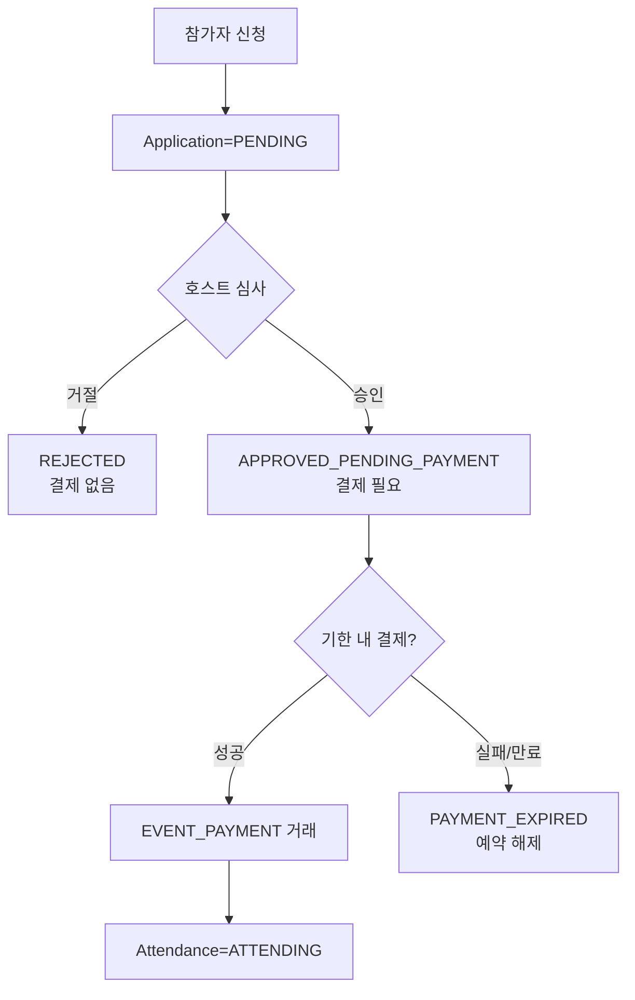

# 결제·정산 정책 PRD

<!-- supporting-doc-status: 2026-05-18 -->

> 문서 상태: **보조 문서**. 기능별 현재 계약, source trace, Gap/Risk 판단은 [PRD_MIGRATION_STATUS.md](../PRD_MIGRATION_STATUS.md)와 각 기능 PRD를 우선한다. 이 문서는 인벤토리, 정책, QA, 기획 운영 기준을 보조하며, 기능 세부 판단은 [FEATURE_PRD_STANDARD.md](../FEATURE_PRD_STANDARD.md) 기준으로 재확인한다.

## 1. 목적

포인트 충전, 결제, 환불, 호스트 정산금, 모임 정산, 클럽 기금을 서로 구분해 사용자와 운영자가 돈의 상태를 오해하지 않게 한다.

## 2. 돈의 흐름 구분

| 흐름 | 주체 | 의미 |
|---|---|---|
| 포인트 충전 | 사용자 -> 지갑 | 외부 결제로 잔액 증가 |
| 포인트 결제 | 지갑 -> 서비스 | 이벤트, 플랜, 구독 등 비용 지불 |
| 환불 | 서비스 -> 지갑/원수단 | 기존 결제 취소 또는 보상 |
| 모임 정산 | 참가자 -> 호스트 | 모임 비용 분담 |
| 호스트 정산금 | 플랫폼 -> 호스트 | 수익 지급 |
| 클럽 기금 | 멤버/운영 -> 클럽 | 공동 자금 |

## 3. 결제 실패 처리

| 상황 | 사용자 안내 |
|---|---|
| 잔액 부족 | 충전 또는 자동충전 안내 |
| 결제수단 없음 | 결제수단 등록 안내 |
| PG 실패 | 결제가 완료되지 않았고 재시도 가능함을 안내 |
| 콜백 지연 | 처리중 상태와 재조회 동선 제공 |
| 중복 클릭 | 한 번의 결제만 유효하도록 안내 |

## 4. 유료 승인제 이벤트 정책

유료 이벤트와 승인제 이벤트는 동시에 존재할 수 있다. 이 조합은 결제와 참석 확정이 분리되므로 별도 상태 계약을 둔다.

| 정책 | 설명 |
|---|---|
| 승인 전 결제 금지 | 승인되지 않은 사용자의 돈을 먼저 받지 않는다. |
| 승인 후 결제 필요 | 호스트 승인은 결제 권한 부여이며 참석 확정이 아니다. |
| 결제 전 참석 권한 제한 | 체크인, 위치 공유, 리뷰 자격은 결제 성공 후 열린다. |
| 기한 만료 처리 | 결제 대기 상태에는 기한이 있고 만료 시 예약 정원을 반환한다. |
| 서버 검증 | `WalletService.pay`는 승인 대기 상태, 기한, 중복 결제를 검증해야 한다. |

현재 서버에는 `APPROVED_PENDING_PAYMENT`/`PAYMENT_EXPIRED` 상태와 결제 후 attendance 생성 계약이 없다. 따라서 이 조합은 구현 보강 대상이며, 임시로 결제를 승인 전에 받거나 승인 즉시 ATTENDING으로 만드는 방식은 PRD 정책과 맞지 않는다.

## 5. 수용 기준

- 결제 성공과 기능 성공이 분리되는 경우 처리중/재조회 상태가 있어야 한다.
- 환불은 원거래, 환불 금액, 환불 상태가 추적 가능해야 한다.
- DRAFT 정산은 참가자에게 납부 요청으로 노출되지 않아야 한다.
- 계좌이체 납부는 호스트 확인 전까지 사용자가 완료로 오해하지 않게 표시해야 한다.
- 유료 승인제 이벤트는 승인 전 결제, 결제 전 참석 확정, 기한 만료 후 결제가 모두 차단되어야 한다.
