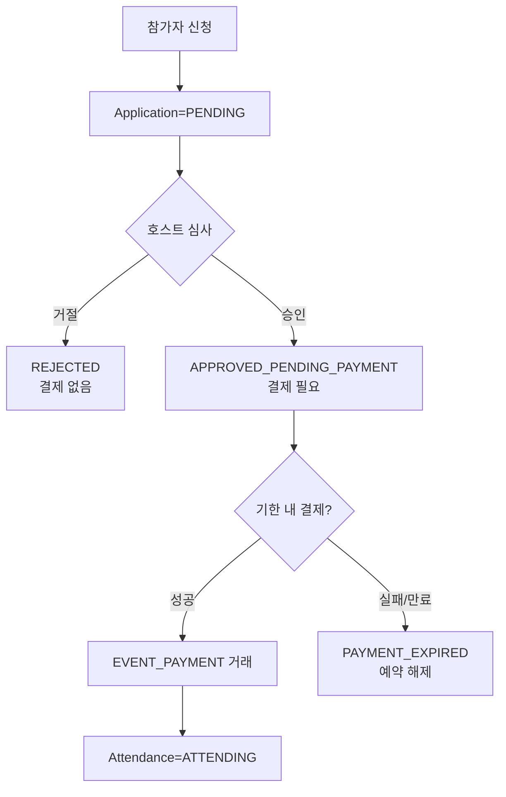

# 결제·정산 정책 PRD

<!-- supporting-doc-status: 2026-05-22 -->

> 문서 상태: **보조 문서 + W2/W3 정책 결정 사항 통합 (2026-05-22)**. 기능별 현재 계약, source trace, Gap/Risk 판단은 [PRD_MIGRATION_STATUS.md](../PRD_MIGRATION_STATUS.md)와 각 기능 PRD를 우선한다. 이 문서는 인벤토리, 정책, QA, 기획 운영 기준을 보조하며, 기능 세부 판단은 [FEATURE_PRD_STANDARD.md](../FEATURE_PRD_STANDARD.md) 기준으로 재확인한다.

## 1. 목적

포인트 충전, 결제, 환불, 호스트 정산금, 모임 정산, 클럽 기금을 서로 구분해 사용자와 운영자가 돈의 상태를 오해하지 않게 한다.

## 2. 돈의 흐름 구분

| 흐름 | 주체 | 의미 |
|---|---|---|
| 포인트 충전 | 사용자 -> 지갑 | 외부 결제로 잔액 증가 |
| 포인트 결제 | 지갑 -> 서비스 | 이벤트, 플랜, 구독 등 비용 지불 |
| 환불 | 서비스 -> 지갑/원수단 | 기존 결제 취소 또는 보상 |
| 모임 정산 | 참가자 -> 호스트 | 모임 비용 분담 |
| 호스트 정산금 | 플랫폼 -> 호스트 | 수익 지급 |
| 클럽 기금 | 멤버/운영 -> 클럽 | 공동 자금 |

> 모든 잔액·정산·인출은 **유료(paid)/무료(free) 포인트를 분리**해서 다룬다. 상세는 §2.5.

## 2.5 유료/무료 포인트 분리정산 정책 (Point Split Flow-Through)

<!-- 2026-05-24: 포인트 정책 디커플링 구현 반영 -->

> 구현 근거: `community_api/docs/plan/POINT_POLICY_DECOUPLING_PLAN.md` §3.5. 무료 포인트로 프로모션을 운영하되 **무료가 절대 현금이 되지 않도록** 유료/무료를 잔액·결제·정산·인출 전 구간에서 분리한다.

### 핵심 원리

- 지갑·클럽 기금 잔액을 **유료(paid)** / **무료(free)** 로 분리 관리한다.
  - 유료 = 충전·현금 환불로 들어온 **인출 가능** 잔액
  - 무료 = 프로모션 지급분. **사용 가능하나 현금 인출 불가**
- 결제 시 유료/무료 split이 발생한다. 단, split이 수취자까지 전파되는지는 **사용처 분류(아래 3분류)에 따라 다르다**.
  - **flow-through**(무료 수취자 존재): split이 **수취자(창작자/호스트/기금)까지 그대로 전파(flow-through)** 된다. 무료로 결제하면 수취자도 무료로 받아 플랫폼 안에서만 쓸 수 있고 현금화되지 않는다.
  - **free-burn**(플랫폼 매출, 수취자 없음): 수취자가 없으므로 전파 대상이 없다. 무료분은 **지갑에서 차감(소각)** 된다.
  - **PAID_ONLY**(순수 P2P 채무): **무료 결제 자체를 허용하지 않는다**.
  - 이벤트 참가비는 정책상 flow-through 목표이나 **현재 legacy 경로 미이관(EVENT 결제/환불의 `spend()` 미이관 — followup)**.
- 모든 입금(충전/적립/정산/환불)은 `charge_lot`을 만들고, 모든 차감(결제/만료)은 FIFO로 lot을 소비해 잔액-lot 정합을 유지한다.

### 사용처 3분류

| 분류 | 정의 | 사용처 | 무료 처리 |
|---|---|---|---|
| flow-through | 무료 수취자 존재 | 마켓 구매, 플랜 직접 구매, 프라이빗 미팅비, 클럽 기부·가입비(→기금), 이벤트 참가비 *(정책 목표, 현재 legacy 미이관 — followup)* | opt-in 시 무료 허용. split이 수취자/기금에 free로 적립, 유료분만 정산·인출 |
| free-burn | 플랫폼 매출(수취자 없음) | 개인 구독, 클럽 구독, 프라이빗 호스팅비, 호스팅 티켓 | opt-in 시 무료 허용. 무료분은 지갑에서 차감(소각). **spend 시점 프로모션 비용(PROMOTION_EXPENSE) 분개는 현재 미구현 — followup** |
| PAID_ONLY | 순수 P2P 채무 정산/회수 | 모임 정산 송금·회수·선입금, 충전 취소 | 무료 불가(실제 채무를 프로모션 포인트로 갚게 두지 않는다) |

### 차등 가격 (콘텐츠 생산자 opt-in)

무료 허용 여부를 결정하는 필드는 도메인별로 다르다(`PricingDecision` 참조).

| 도메인 | 무료 허용 결정 필드 | 무료 전용 가격 |
|---|---|---|
| 마켓 아이템/번들 | `currencyType`(PAID_POINT/FREE_POINT/ANY_POINT) + 구매자 `fundingMode` | `freePointPrice`(nullable) |
| 플랜 직접 구매 | `allowFreePoints` + 구매자 `fundingMode` | `freePointPrice`(nullable) |

| 정책 | 설명 |
|---|---|
| 무료 전용 가격 | `freePointPrice`(nullable). 무료 결제 시 이 가격 적용(미설정 시 기본가) |
| 단일 결제수단 | 차등가 콘텐츠는 전액 무료(freePointPrice 또는 기본가) 또는 전액 유료(기본가) 중 택1. `ANY_POINT + freePointPrice==null`은 PAID_FIRST 혼합 허용 |
| 미허용 거부 | 무료 미허용 콘텐츠(마켓 `PAID_POINT`, 플랜 `allowFreePoints=false`)에 무료(`fundingMode=FREE`) 결제 요청 시 `INVALID_REQUEST` |
| ANY_POINT 기본가 무료 금지 | 마켓 `ANY_POINT + freePointPrice==null + fundingMode=FREE` → `INVALID_REQUEST`(차등 무료가 미설정 시 기본가를 무료로 결제할 수 없음) |

### 인출(현금화) 정책

| 정책 | 설명 |
|---|---|
| 유료만 인출 | 사용자·클럽 외부 출금은 **유료(paid) 잔액만** 대상. 무료 잔액은 현금 인출 불가 |
| 탈퇴 처리 | 탈퇴 시 유료는 환불, 무료는 소멸(forfeit) |
| 클럽 기금 인출 | 가용액 = paid 잔액 − 예비금/미수금. 수수료(5%)·원천징수(3.3%)는 유료(현금)분에만 부과. 폐쇄 인출도 유료만 현금화, 무료 기금은 소멸 |

### 창작자 정산 split

창작자 수익(`CreatorEarning`)은 유료/무료를 분리 기록한다. 수수료·원천징수는 **유료분에만** 적용하고, 무료분은 무수수료 `free_credit`으로 정산한다. 무료로 결제된 매출은 창작자에게 free로 적립되어(인출 불가) 무료→현금 전환을 차단한다.

### 후속(미완) 항목

- `refundToWallet`(클럽 기부·가입비·구독 환불)의 원결제 split 보존 — `refundByTransaction` 전환 필요(ClubMember/ClubSubscription 결제 txId 스키마 보강 동반).
- EVENT 결제/환불 경로(`WalletService.pay`/`RefundService` PG-queue)의 `spend()` 이관.
- 마켓 번들 차등가 admin 설정 배선(`community_admin_api`).

## 3. 결제 실패 처리

| 상황 | 사용자 안내 |
|---|---|
| 잔액 부족 | 충전 또는 자동충전 안내 |
| 결제수단 없음 | 결제수단 등록 안내 |
| PG 실패 | 결제가 완료되지 않았고 재시도 가능함을 안내 |
| 콜백 지연 | 처리중 상태와 재조회 동선 제공 |
| 중복 클릭 | 한 번의 결제만 유효하도록 안내 |

## 4. 유료 승인제 이벤트 정책

유료 이벤트와 승인제 이벤트는 동시에 존재할 수 있다. 이 조합은 결제와 참석 확정이 분리되므로 별도 상태 계약을 둔다.

| 정책 | 설명 |
|---|---|
| 승인 전 결제 금지 | 승인되지 않은 사용자의 돈을 먼저 받지 않는다. |
| 승인 후 결제 필요 | 호스트 승인은 결제 권한 부여이며 참석 확정이 아니다. |
| 결제 전 참석 권한 제한 | 체크인, 위치 공유, 리뷰 자격은 결제 성공 후 열린다. |
| 기한 만료 처리 | 결제 대기 상태에는 기한이 있고 만료 시 예약 정원을 반환한다. |
| 서버 검증 | 선입금 승인제 흐름의 검증 주체는 `WalletService.payForApplication`/결제 facade다(§5 D8) — 승인 대기 상태·기한·중복 결제를 검증한다. legacy 비선입금 경로 `WalletService.pay`(referenceType=`EVENT_PAYMENT`)는 별도 경로로 구분한다. |

현재 서버에는 `APPROVED_PENDING_PAYMENT`/`PAYMENT_EXPIRED` 상태와 결제 후 attendance 생성 계약이 없다. 따라서 이 조합은 구현 보강 대상이며, 임시로 결제를 승인 전에 받거나 승인 즉시 ATTENDING으로 만드는 방식은 PRD 정책과 맞지 않는다.

> **2026-05-22 W2/W3 정책 결정**: 위 "현재 서버에 상태가 없다" 문구는 **선입금 활성 이벤트(`EventPrepayment.prepaymentRequired=true`)에 한해서 해결됨**. `ApplicationStatus.APPROVED_PENDING_PAYMENT, PAYMENT_EXPIRED`가 서버 enum에 추가되었고, `Application.paymentDueAt`가 자동 설정된다. 결제 흐름과 환불·취소·탈퇴 통합은 §5의 D-시리즈 결정으로 명문화한다. 선입금 미활성 유료 이벤트의 미해결 흐름은 별도 후속 슬라이스로 추적.

## 5. W2/W3 결정 사항 (Event Extensions v4.5)

본 절은 `docs/plan/event-extensions/PLAN.md` v4.5에서 결정된 8개 정책 결정을 정책 문서에 고정한다. 본 결정은 이벤트 참가 선입금 흐름(F03-13, F06-06)에 한해 적용되며, 모임 정산 선입금(F07-09)·하스팅 티켓(F06-07)·구독(F06-08)에는 적용되지 않는다.

### D1. 단방향 price 동기화

선입금 활성 시 `Event.price = EventPrepayment.prepaymentAmount` 단방향 동기화.

- 활성 + price 불일치 → 400 `PRICE_PREPAYMENT_MISMATCH`
- 활성 + `amount <= 0` → 400 `INVALID_PREPAYMENT_AMOUNT`
- 비활성 → `Event.price` 자체값 사용
- ON → OFF 전환 (Q2 사용자 확정): `event.price = 0` 무료 이벤트로 자동 전환. 사용자에게 price 재입력 받지 않음.

### D4. `APPROVED_PENDING_PAYMENT` 좌석 미점유

호스트 승인 또는 자동 승인 이후 `APPROVED_PENDING_PAYMENT` 상태에 진입한 application은 **capacity를 점유하지 않는다**. 결제 facade(`payByWallet` 성공, `bankConfirm` 성공)가 `confirmPaymentAndAttend`를 호출한 시점에만 `currentCapacity++`. 정원 race는 결제 확정 시점 `CapacityPolicy.decide` 매트릭스로 단일 판정(F03-07).

### D5. 계좌이체 호스트 직접 수취

BANK_TRANSFER 결제·환불은 호스트 계좌로 직접 처리되어 플랫폼 회계 분개를 발생시키지 않는다.

- `bankConfirm/bankReject/refundByBankConfirm` → `AccountingLedgerService` 호출 없음
- audit 데이터(`event_payment.method, status, amount, host_confirmed_at, host_confirmed_by, refunded_at, refund_amount, refund_reason`)만 기록
- 호스트 정산 보고서에 6 섹션 별도 노출 (F06-10 §5.1) — 플랫폼 정산금과 명확히 구분
- 1차 출시는 호스트 직접 수취만 (Q3 가정). 가상계좌 등 PG 자동화는 후속 슬라이스.

### D6. application당 active payment 1건

`event_payment.active_application_id` STORED generated column + `UNIQUE KEY`로 application당 active(PENDING/PAID/REFUND_REQUESTED) 결제 1건만 허용.

- DDL: `active_application_id BIGINT GENERATED ALWAYS AS (CASE WHEN status IN ('PENDING','PAID','REFUND_REQUESTED') THEN application_id ELSE NULL END) STORED, UNIQUE KEY uk_event_payment_active (active_application_id)`
- 동일 application에 대해 두 번째 결제 시도 시 `DataIntegrityViolationException` → service에서 `DUPLICATE_PAYMENT`로 변환
- 환불 완료(`REFUNDED`)·취소(`CANCELED`) 후에는 generated column이 NULL이 되어 재신청·재결제 가능

### D7. 1차 환불 정책 단순화

이벤트 참가 선입금의 1차 환불 정책은 **단일 deadline 100% / 마감 후 0%** 만 지원.

- `RefundDeadlinePolicy.isWithinDeadline(eventId)` 단일 분기
- `EventPrepayment.refundDeadlineHours` (없으면 이벤트 시작 시각 기준 0h)
- 시간 비율 정책(GRADUATED 24h/12h 등)은 **후속 슬라이스로 분리**. 1차 PRD에 포함됐다고 작성 금지.
- 호스트 이벤트 취소(`refundByHostCancel`) 시에는 정책 무시하고 항상 100% 환불 (`EventPaymentRefundService.refundByHostCancel`)
- 사용자 자가 취소·BANK 호스트 환불은 정책 통과 시에만 환불 진행

### D8. 신규 결제 경로 분리

기존 `WalletService.pay`(`:73-178`, referenceType=`EVENT_PAYMENT`)는 **변경 없음**.

신규 `WalletService.payForApplication`(`:189`)만 추가:
- referenceType=`EVENT_PREPAYMENT`
- referenceId=`eventPaymentId` (기존 `eventId` 기준 중복차단의 false-positive 회피)
- 중복 차단: `existsByUserIdAndReferenceTypeAndReferenceId(userId, "EVENT_PREPAYMENT", eventPaymentId)`
- 14단계 (자동충전·FIFO·분개·metric·log·도메인 이벤트 발행 위임)
- 환불은 신규 `TransactionType.EVENT_PREPAYMENT_REFUND(26)` 사용

### D15. 알림은 도메인 이벤트 + AFTER_COMMIT

선입금 흐름의 모든 알림(71~76, 83)은 facade가 `ApplicationEventPublisher.publishEvent`로 도메인 이벤트만 발행하고, `EventExtensionNotificationListener`가 `@TransactionalEventListener(phase=AFTER_COMMIT)`로 `NotificationService`를 호출한다. 결제 트랜잭션 롤백 시 알림은 발송되지 않는다.

### D16. Pending count 단건 lazy

`EventVo.reservedPaymentPendingCount`는 단건 응답(`GET /events/{id}`)에서만 lazy 조회로 채워진다. `EventSimpleVo`와 목록 응답은 항상 0. N+1 회피.

## 6. 미완 정책 (후속 슬라이스 운영 결정 필요)

### 6.1 WalletRefundExecutor 공통 헬퍼 추출

`RefundService.doRefund`(14단계)와 `EventPaymentRefundService.refundByWallet`은 lot 처리·PG queue·Settlement adjustment에서 공통 패턴을 가진다. 1차 W2/W3 슬라이스에서는 회귀 위험을 줄이기 위해 두 경로를 별도로 두었다. 후속 슬라이스에서 `WalletRefundExecutor`로 추출 시 다음 운영 정책 결정 필요:

- 환불 실패 시 `FailedRefund` 레코드의 처리 SLA (현재 inline handling)
- PG queue refund 통합 — 본 facade에서 PG 환불 비동기 처리 시 우선순위 정책
- Settlement adjustment 트리거 — 신규 환불도 기존 settlement에 음수 adjustment를 만들어야 하는지 회계 정합성 점검

### 6.2 환불 정책 비율 계산 (GRADUATED)

D7 단순화로 1차에서 제외. 후속 슬라이스에서 `EventPrepayment.refundPolicyType` enum + 시간 비율 분기를 도입할 때 운영 정책 결정 필요.

### 6.3 BANK_TRANSFER PAID 사용자 취소 SLA

S2-7/S2-9 흐름에서 BANK PAID → `REFUND_REQUESTED` 전환 후 호스트 수동 환불까지의 SLA·알림 빈도가 미정. 호스트 정산 보고서에 미정리 row가 누적되는 경우의 모니터링 정책 결정 필요.

## 7. 수용 기준

- 결제 성공과 기능 성공이 분리되는 경우 처리중/재조회 상태가 있어야 한다.
- 환불은 원거래, 환불 금액, 환불 상태가 추적 가능해야 한다.
- DRAFT 정산은 참가자에게 납부 요청으로 노출되지 않아야 한다.
- 계좌이체 납부는 호스트 확인 전까지 사용자가 완료로 오해하지 않게 표시해야 한다.
- 유료 승인제 이벤트는 승인 전 결제, 결제 전 참석 확정, 기한 만료 후 결제가 모두 차단되어야 한다.
- 무료 포인트는 외부 출금·현금 환불·탈퇴 환불 어느 경로로도 현금화되지 않아야 한다(인출은 유료분만).
- 무료로 결제된 금액은 수취자(창작자/호스트/기금)에게 무료로 적립되어 인출 불가 상태로 유지되어야 한다.
- 차등가 콘텐츠는 전액 무료 또는 전액 유료 중 하나로만 결제되며, 무료 미허용 콘텐츠의 무료 결제 요청은 거부되어야 한다.
