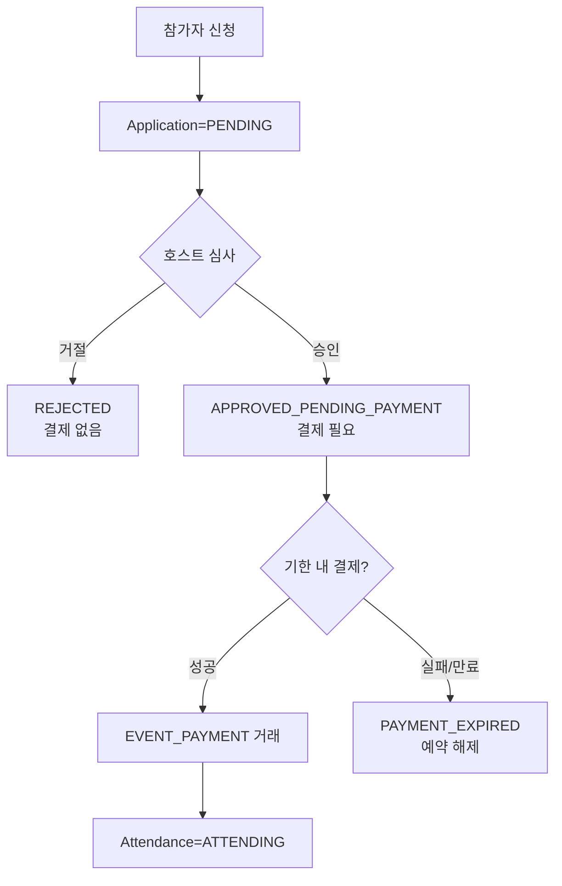

# 결제·정산 정책 PRD

<!-- supporting-doc-status: 2026-05-22 -->

> 문서 상태: **보조 문서 + W2/W3 정책 결정 사항 통합 (2026-05-22)**. 기능별 현재 계약, source trace, Gap/Risk 판단은 [PRD_MIGRATION_STATUS.md](../PRD_MIGRATION_STATUS.md)와 각 기능 PRD를 우선한다. 이 문서는 인벤토리, 정책, QA, 기획 운영 기준을 보조하며, 기능 세부 판단은 [FEATURE_PRD_STANDARD.md](../FEATURE_PRD_STANDARD.md) 기준으로 재확인한다.

## 1. 목적

포인트 충전, 결제, 환불, 호스트 정산금, 모임 정산, 클럽 기금을 서로 구분해 사용자와 운영자가 돈의 상태를 오해하지 않게 한다.

## 2. 돈의 흐름 구분

| 흐름 | 주체 | 의미 |
|---|---|---|
| 포인트 충전 | 사용자 -> 지갑 | 외부 결제로 잔액 증가 |
| 포인트 결제 | 지갑 -> 서비스 | 이벤트, 플랜, 구독 등 비용 지불 |
| 환불 | 서비스 -> 지갑 복원(기본); 원수단(PG) 환불은 조건부(`refund.pg-queue.enabled` 활성화 + PG 결제건) | 기존 결제 취소 또는 보상. 조건 미충족 시 paidRefund도 지갑으로 즉시 복원. |
| 모임 정산 | 참가자 -> 호스트 | 모임 비용 분담 |
| 호스트 정산금 | 플랫폼 -> 호스트 | 수익 지급 |
| 클럽 기금 | 멤버/운영 -> 클럽 | 공동 자금 |

> 모든 잔액·정산·인출은 **유료(paid)/무료(free) 포인트를 분리**해서 다룬다. 상세는 §2.5.

## 2.5 유료/무료 포인트 분리정산 정책 (Point Split Flow-Through)

<!-- 2026-05-24: 포인트 정책 디커플링 구현 반영 -->

> 구현 근거: `community_api/docs/plan/POINT_POLICY_DECOUPLING_PLAN.md` §3.5. 무료 포인트로 프로모션을 운영하되 **무료가 절대 현금이 되지 않도록** 유료/무료를 잔액·결제·정산·인출 전 구간에서 분리한다.

### 핵심 원리

- 지갑·클럽 기금 잔액을 **유료(paid)** / **무료(free)** 로 분리 관리한다.
  - 유료 = 충전·현금 환불로 들어온 **인출 가능** 잔액
  - 무료 = 프로모션 지급분. **사용 가능하나 현금 인출 불가**
- 결제 시 유료/무료 split이 발생한다. 단, split이 수취자까지 전파되는지는 **사용처 분류(아래 3분류)에 따라 다르다**.
  - **flow-through**(무료 수취자 존재): split이 **수취자(창작자/호스트/기금)까지 그대로 전파(flow-through)** 된다. 무료로 결제하면 수취자도 무료로 받아 플랫폼 안에서만 쓸 수 있고 현금화되지 않는다.
  - **free-burn**(플랫폼 매출, 수취자 없음): 수취자가 없으므로 전파 대상이 없다. 무료분은 **지갑에서 차감(소각)** 된다.
  - **PAID_ONLY**(순수 P2P 채무): **무료 결제 자체를 허용하지 않는다**.
  - 이벤트 참가비도 flow-through로 **완성**되었다(2026-06-06, §2.6). 무료로 결제된 참가비는 호스트에게 **무료 포인트(현금화 불가)로 적립**되고, 유료분만 정산·인출 대상이 된다. 무료 결제만 모인 이벤트도 수수료·세금 0의 정산이 생성되어 호스트가 무료 포인트를 받는다.
- 모든 입금(충전/적립/정산/환불)은 `charge_lot`을 만들고, 모든 차감(결제/만료)은 FIFO로 lot을 소비해 잔액-lot 정합을 유지한다.

### 사용처 3분류

| 분류 | 정의 | 사용처 | 무료 처리 |
|---|---|---|---|
| flow-through | 무료 수취자 존재 | 마켓 구매, 플랜 직접 구매, 프라이빗 미팅비, 클럽 기부·가입비(→기금), **이벤트 참가비**(2026-06-06 이관 완료) | opt-in 시 무료 허용. split이 수취자/기금/호스트에 free로 적립, 유료분만 정산·인출. 무료만 모인 경우도 수수료·세금 0 정산 생성 |
| free-burn | 플랫폼 매출(수취자 없음) | 개인 구독, 클럽 구독, 프라이빗 호스팅비, 호스팅 티켓 | opt-in 시 무료 허용. 무료분은 지갑에서 차감(소각). **결제(spend) 시점의 프로모션 비용(PROMOTION_EXPENSE) 분개는 여전히 미구현 — followup**(이벤트의 정산·환불 흡수 경로에서는 PROMOTION_EXPENSE가 사용되나, free-burn 결제 시점 인식은 별개) |
| PAID_ONLY | 순수 P2P 채무 정산/회수 | 모임 정산 송금·회수·선입금, 충전 취소 | 무료 불가(실제 채무를 프로모션 포인트로 갚게 두지 않는다) |

### 차등 가격 (콘텐츠 생산자 opt-in)

무료 허용 여부를 결정하는 필드는 도메인별로 다르다(`PricingDecision` 참조).

| 도메인 | 무료 허용 결정 필드 | 무료 전용 가격 |
|---|---|---|
| 마켓 아이템/번들 | `currencyType`(PAID_POINT/FREE_POINT/ANY_POINT) + 구매자 `fundingMode` | `freePointPrice`(nullable) |
| 플랜 직접 구매 | `allowFreePoints` + 구매자 `fundingMode` | `freePointPrice`(nullable) |

| 정책 | 설명 |
|---|---|
| 무료 전용 가격 | `freePointPrice`(nullable). 무료 결제 시 이 가격 적용(미설정 시 기본가) |
| 단일 결제수단 | 차등가 콘텐츠는 전액 무료(freePointPrice 또는 기본가) 또는 전액 유료(기본가) 중 택1. `ANY_POINT + freePointPrice==null`은 PAID_FIRST 혼합 허용 |
| 미허용 거부 | 무료 미허용 콘텐츠(마켓 `PAID_POINT`, 플랜 `allowFreePoints=false`)에 무료(`fundingMode=FREE`) 결제 요청 시 `INVALID_REQUEST` |
| ANY_POINT 기본가 무료 금지 | 마켓 `ANY_POINT + freePointPrice==null + fundingMode=FREE` → `INVALID_REQUEST`(차등 무료가 미설정 시 기본가를 무료로 결제할 수 없음) |

### 인출(현금화) 정책

| 정책 | 설명 |
|---|---|
| 유료만 인출 | 사용자·클럽 외부 출금은 **유료(paid) 잔액만** 대상. 무료 잔액은 현금 인출 불가 |
| 탈퇴 처리 | 탈퇴 시 유료는 환불, 무료는 소멸(forfeit) |
| 클럽 기금 인출 | 가용액 = paid 잔액 − 예비금/미수금. 수수료(5%)·원천징수(3.3%)는 유료(현금)분에만 부과. 폐쇄 인출도 유료만 현금화, 무료 기금은 소멸 |

### 창작자 정산 split

창작자 수익(`CreatorEarning`)은 유료/무료를 분리 기록한다. 수수료·원천징수는 **유료분에만** 적용하고, 무료분은 무수수료 `free_credit`으로 정산한다. 무료로 결제된 매출은 창작자에게 free로 적립되어(인출 불가) 무료→현금 전환을 차단한다.

### 후속(미완) 항목

- ~~`refundToWallet`(클럽 기부·가입비·구독 환불)의 원결제 split 보존~~ — **해소 (2026-06-06 돈 흐름 무결성, §2.6)**. 전 경로가 `WalletRefundService.refundByTransaction`로 전환되었고 `refundToWallet` 본체는 차단됨.
- ~~EVENT 결제/환불 경로의 표준 결제·환불 이관(결제 측 flow-through화)~~ — **해소 (2026-06-06, §2.6)**. 이벤트 참가비 결제가 표준 차감 경로로 통합되어 flow-through가 완성됐고, 환불도 표준 환불 경로로 통합됐다. 구식 결제 통로 2개는 차단됨.
- ~~마켓 번들 차등가 admin 설정 배선(`community_admin_api`)~~ — **종결 (2026-06-05 감사)**. 이미 정상 배선되어 있었음(followup 자체가 stale).
- (잔여) 미사용 legacy 차감 메서드 4종 정리(호출처 0, cleanup 대상), 사용자·클럽 외부 출금 시 충전 단위(lot) 소비 추적, 마켓/번들 무료 전용 가격(`freePointPrice`) 명시적 해제(clear) 기능 — 비-blocker.

## 2.6 돈 흐름 무결성 정책 (2026-06-06)

> 2026-06-05 돈·포인트 흐름 전수 감사(`docs/audit/money-flow-2026-06-05/REPORT.md`)에서 확정된 CRITICAL 6·HIGH 20·MED 11·LOW 3을 라운드 1·2 + MED 백로그로 처리했다. 근본 원인은 wallet/lot/ledger/admin이 하나의 원자적 회계 facade로 묶이지 않은 것이었으며, **돈 변이지점부터 점진적으로** facade(`WalletRefundService.refundByTransaction`, internal 위임)를 도입해 닫았다. 커밋 범위: community_api `a7876aa..2e0ba2a`, community_admin_api `9eafc0e..aba730e`.

### 정책 결정 (확정)

| 영역 | 정책 |
|---|---|
| 환불 split 복원 | 모든 환불(이벤트/마켓/플랜/클럽 기부·가입비·구독/모임정산 역분개)은 원결제 PointTransaction을 역참조해 유료/무료 split을 복원한다. 전액 paid 복원(`refundToWallet`)은 **금지**(본체 `@Deprecated`+즉시 throw). 무료→유료 현금화 세탁을 코드 레벨에서 차단. |
| admin 환불 위임 | 운영(admin) 환불 4경로(구독·클럽구독·adminRefund·실패환불 보상)는 community_api internal endpoint(`/api/internal/wallet/refunds/by-transaction`)로 위임한다. admin이 공유 DB에 직접 분개하지 않는다(split·lot·원장 단일 기록). 원거래 미해석 보상은 **무료 포인트(현금화 불가) grant**가 기본값. |
| 멱등 | admin 환불·정산보정·구독갱신·원천세 납부에 멱등키(AdminIdempotency/reserve-before-execute) + 락 적용. 운영자 더블클릭/재시도/동시요청 이중지급 차단. |
| 출금 자격 | 외부출금 가능액 = 원장 RECEIVABLE-leg 누계(Σ진성 수취 − Σ회수). PointTransaction referenceType 누계 미사용(selfRefund/선입금환불 credit 오인 차단). 출금 요청 시 지갑 paidBalance·lot reserve spend(SETTLEMENT-lot 우선소비), 터미널 실패 시 `RESTORE_RESERVE` 복원. |
| 원천세 | 예수금(`WITHHOLDING_TAX_PAYABLE`, 부채)은 정방향 적립(DR PLATFORM_CASH/CR WITHHOLDING) 후 운영자 납부 액션으로 소거(DR WITHHOLDING/CR PLATFORM_CASH). 납부는 admin 멱등 액션(전 기간 누적 초과 거부 가드 + `accounting_remit_lock` 직렬화). |
| 정산 회계 | 정산 완료 분개는 `CREATOR_PAYABLE`를 gross 전액(net+fee+tax)으로 소거(triple-entry). admin 운영 정산도 community_api에 위임해 동일 분개. |
| 이벤트 결제 표준화 (2026-06-06) | 이벤트 참가비 결제·환불이 **표준 결제·환불 경로로 통합**되었다. 결제는 충전 단위(lot)를 정확히 추적하며, 잔액-추적 정합이 깨지면 결제가 진행되지 않고 거부된다(이전: 경고만 남기고 진행). 환불도 충전 단위까지 복원하고, 같은 결제에 대한 유료/무료 각각의 누적 환불 한도를 강제한다. 구식 결제 통로 2개는 완전 차단(호출 시 거부). |
| 이벤트 무료 매출 호스트 전달 | 이벤트도 무료 포인트 매출이 호스트에게 전달된다(flow-through 완성). 유료분은 정산·인출 가능, 무료분은 호스트의 무료 포인트(현금화 불가)로 적립. **무료 결제만 모인 이벤트도 정산이 생성**된다(수수료·세금 0). 정산 완료 후의 무료분 환불은 호스트에게서 회수하지 않고 **플랫폼 비용으로 흡수**(정책). 운영(admin) 정산 완료도 동일 규칙(무료분 지급 포함). |
| 대사(reconciliation) | 8축 대사(SQL1~8: wallet=ΣPointTransaction=원장 USER_WALLET, lot drift, CREATOR_PAYABLE=Σ미지급 CreatorEarning, CLUB_FUND, RECEIVABLE dangling/clearing, REFUND_PAYABLE, 원천세 누적, 계정별 분개단위 차대)를 일배치 스케줄러로 자동 실행. |
| 감시(limbo) | 멈춘 돈 3지점(REVERSAL 회수 소진·BANK 환불요청 무응답·정산 FAILED 장기)에 limbo 패턴 감시탑(N일 임계 → 당사자 재알림 → 2회 후 운영자 경보, 멱등 키). **자동 만료·자동 회수 금지** — 돈 in-flight는 사람이 움직인다. |
| 동시성 | 구독 자동갱신·마켓 구매·구독 만료에 분산락(Redisson) 또는 비관락. 이중과금·한도우회·중복 알림 차단. |

### 잔여 (PG 계약 의존, release-gate 05_pg 등재)

- 충전취소(cancelCharge) 응답유실 보정·출금 provider 멱등 검증 — 실 PG(Toss)/출금 provider 연동 후에만 검증 가능(현재 NOOP). 가상계좌 webhook TODO와 동일 게이트. 코드 무변경, 체크리스트 등재만.

## 3. 결제 실패 처리

| 상황 | 사용자 안내 |
|---|---|
| 잔액 부족 | 충전 또는 자동충전 안내 |
| 결제수단 없음 | 결제수단 등록 안내 |
| PG 실패 | 결제가 완료되지 않았고 재시도 가능함을 안내 |
| 콜백 지연 | 처리중 상태와 재조회 동선 제공 |
| 중복 클릭 | 한 번의 결제만 유효하도록 안내 |

## 4. 유료 승인제 이벤트 정책

유료 이벤트와 승인제 이벤트는 동시에 존재할 수 있다. 이 조합은 결제와 참석 확정이 분리되므로 별도 상태 계약을 둔다.

| 정책 | 설명 |
|---|---|
| 승인 전 결제 금지 | 승인되지 않은 사용자의 돈을 먼저 받지 않는다. |
| 승인 후 결제 필요 | 호스트 승인은 결제 권한 부여이며 참석 확정이 아니다. |
| 결제 전 참석 권한 제한 | 체크인, 위치 공유, 리뷰 자격은 결제 성공 후 열린다. |
| 기한 만료 처리 | 결제 대기 상태에는 기한이 있고 만료 시 예약 정원을 반환한다. |
| 서버 검증 | 선입금 승인제 흐름의 검증 주체는 이벤트 선입금 결제 facade다(§5 D8) — 승인 대기 상태·기한·중복 결제를 검증한다. 2026-06-06 이관으로 결제는 표준 차감 경로를 직접 호출하며, 구식 비선입금 결제 통로는 차단되었다. |

현재 서버에는 `APPROVED_PENDING_PAYMENT`/`PAYMENT_EXPIRED` 상태와 결제 후 attendance 생성 계약이 없다. 따라서 이 조합은 구현 보강 대상이며, 임시로 결제를 승인 전에 받거나 승인 즉시 ATTENDING으로 만드는 방식은 PRD 정책과 맞지 않는다.

> **2026-05-22 W2/W3 정책 결정**: 위 "현재 서버에 상태가 없다" 문구는 **선입금 활성 이벤트(`EventPrepayment.prepaymentRequired=true`)에 한해서 해결됨**. `ApplicationStatus.APPROVED_PENDING_PAYMENT, PAYMENT_EXPIRED`가 서버 enum에 추가되었고, `Application.paymentDueAt`가 자동 설정된다. 결제 흐름과 환불·취소·탈퇴 통합은 §5의 D-시리즈 결정으로 명문화한다. 선입금 미활성 유료 이벤트의 미해결 흐름은 별도 후속 슬라이스로 추적.

## 5. W2/W3 결정 사항 (Event Extensions v4.5)

본 절은 `docs/plan/event-extensions/PLAN.md` v4.5에서 결정된 8개 정책 결정을 정책 문서에 고정한다. 본 결정은 이벤트 참가 선입금 흐름(F03-13, F06-06)에 한해 적용되며, 모임 정산 선입금(F07-09)·하스팅 티켓(F06-07)·구독(F06-08)에는 적용되지 않는다.

### D1. 단방향 price 동기화

선입금 활성 시 `Event.price = EventPrepayment.prepaymentAmount` 단방향 동기화.

- 활성 + price 불일치 → 400 `PRICE_PREPAYMENT_MISMATCH`
- 활성 + `amount <= 0` → 400 `INVALID_PREPAYMENT_AMOUNT`
- 비활성 → `Event.price` 자체값 사용
- ON → OFF 전환 (Q2 사용자 확정): `event.price = 0` 무료 이벤트로 자동 전환. 사용자에게 price 재입력 받지 않음.

### D4. `APPROVED_PENDING_PAYMENT` 좌석 미점유

호스트 승인 또는 자동 승인 이후 `APPROVED_PENDING_PAYMENT` 상태에 진입한 application은 **capacity를 점유하지 않는다**. 결제 facade(`payByWallet` 성공, `bankConfirm` 성공)가 `confirmPaymentAndAttend`를 호출한 시점에만 `currentCapacity++`. 정원 race는 결제 확정 시점 `CapacityPolicy.decide` 매트릭스로 단일 판정(F03-07).

### D5. 계좌이체 호스트 직접 수취

BANK_TRANSFER 결제·환불은 호스트 계좌로 직접 처리되어 플랫폼 회계 분개를 발생시키지 않는다.

- `bankConfirm/bankReject/refundByBankConfirm` → `AccountingLedgerService` 호출 없음
- audit 데이터(`event_payment.method, status, amount, host_confirmed_at, host_confirmed_by, refunded_at, refund_amount, refund_reason`)만 기록
- 호스트 정산 보고서에 6 섹션 별도 노출 (F06-10 §5.1) — 플랫폼 정산금과 명확히 구분
- 1차 출시는 호스트 직접 수취만 (Q3 가정). 가상계좌 등 PG 자동화는 후속 슬라이스.

### D6. application당 active payment 1건

`event_payment.active_application_id` STORED generated column + `UNIQUE KEY`로 application당 active(PENDING/PAID/REFUND_REQUESTED) 결제 1건만 허용.

- DDL: `active_application_id BIGINT GENERATED ALWAYS AS (CASE WHEN status IN ('PENDING','PAID','REFUND_REQUESTED') THEN application_id ELSE NULL END) STORED, UNIQUE KEY uk_event_payment_active (active_application_id)`
- 동일 application에 대해 두 번째 결제 시도 시 `DataIntegrityViolationException` → service에서 `DUPLICATE_PAYMENT`로 변환
- 환불 완료(`REFUNDED`)·취소(`CANCELED`) 후에는 generated column이 NULL이 되어 재신청·재결제 가능

### D7. 환불 정책 카탈로그 일원화 (2026-06-04 D-1 업데이트)

> **D-1 (커밋 419e050 + c7b4315)으로 D7 내용 갱신**: 이벤트 참가 선입금의 환불은 더 이상 "단일 deadline 100% / 마감 후 0%" 고정이 아니며, `event_refund_policy` 카탈로그(6종 템플릿) 기반으로 전환 완료됨.

- `EventPaymentRefundService.refundByWallet`/`refundByHostCancel` 은 `payment/refundpolicy/service/RefundPolicyService.computeRefund` 를 통해 `event_refund_policy` 카탈로그 규칙을 사용
- 호스트 이벤트 취소(`refundByHostCancel`) 시에는 귀책 분류 `HOST_FAULT` 경로로 카탈로그 계산기에 위임 → 100% 환불 + 수수료 0 보장 (`RefundPolicyService.computeRefund:132-140` HOST_FAULT 분기)
- 사용자 자가 취소(참가자 귀책) 시에는 `PARTICIPANT_FAULT` 경로로 by_time 비율 적용
- BANK 수동 환불은 `inferBankRefundFault`로 귀책 자동 판별 후 `policyCeiling` 적용 (`EventPaymentRefundService.java:277-295`)
- `EventPrepayment.refundDeadlineHours` 컬럼은 하위 호환 유지(paymentDueAt 계산에 계속 사용). 실환불 계산에는 미사용
- 모임 정산 선입금(`meeting_refund_rule` 기반)은 D-1 카탈로그 저장 범위 외 — 저장은 `meeting_refund_rule` 별도 유지. 단 계산 엔진은 Phase 4(③)에서 MeetingRefundRule→transient EventRefundPolicy 변환으로 공통 `RefundPolicyService.computeRefund`를 재사용(저장하지 않음)

### D8. 결제 경로 분리 → 표준 결제 경로로 통합 (2026-06-06 갱신)

> **2026-06-06 갱신 (EVENT 표준 결제 이관, §2.6)**: 아래 W2/W3 당시의 "신규/기존 분리" 구도는 종결됐다. 이벤트 선입금 결제는 이제 표준 차감 경로(`WalletSpendService.spend`)를 직접 호출하고(유료우선 차감 + 충전 단위 FIFO 소비, 단위 추적 필수 — 부족 시 결제 롤백), 멱등 가드·결제 기록·회계 분개는 호출 wrapper가 같은 트랜잭션에서 처리한다. 구식 결제 메서드 2개(`WalletService.pay`/`payForApplication`)는 본체가 차단되어 호출 시 즉시 거부된다(시그니처·endpoint는 하위호환 보존). 환불은 표준 환불 경로(`WalletRefundService.refundByTransaction`)로 통합 — 충전 단위 복원 + 통화별 누적 환불 한도 강제.

(이력) W2/W3 당시 신규 경로 `WalletService.payForApplication`(referenceType=`EVENT_PREPAYMENT` / referenceId=`eventPaymentId`)를 추가하고 기존 `WalletService.pay`(referenceType=`EVENT_PAYMENT`)는 변경 없이 유지했었다. 환불은 신규 `TransactionType.EVENT_PREPAYMENT_REFUND(26)` 사용. 두 결제 메서드는 위 2026-06-06 이관으로 차단됐다.

### D15. 알림은 도메인 이벤트 + AFTER_COMMIT

선입금 흐름의 모든 알림(71~76, 83)은 facade가 `ApplicationEventPublisher.publishEvent`로 도메인 이벤트만 발행하고, `EventExtensionNotificationListener`가 `@TransactionalEventListener(phase=AFTER_COMMIT)`로 `NotificationService`를 호출한다. 결제 트랜잭션 롤백 시 알림은 발송되지 않는다.

### D16. Pending count 단건 lazy

`EventVo.reservedPaymentPendingCount`는 단건 응답(`GET /events/{id}`)에서만 lazy 조회로 채워진다. `EventSimpleVo`와 목록 응답은 항상 0. N+1 회피.

## 6. 미완 정책 (후속 슬라이스 운영 결정 필요)

### 6.1 EventRefundSettlementService 분개 공통화 완료 — PG lot 처리 경로 분리 유지

> **D-1 Phase 3 완료 (커밋 419e050)**: `EventRefundSettlementService`로 분개 + 정산 후처리 일원화 완료. 이전에 미완이었던 `WalletRefundExecutor` 추출 이슈의 핵심(분개 공통화)은 해소됨.

- PG lot 처리(RefundLotAllocator)와 PG 환불 queue(RefundRequest)는 **`RefundService` 경로만 사용**. `EventPaymentRefundService`(선입금 결제 환불 경로)는 PG queue를 사용하지 않으며 `pgQueuedPaid = 0` 고정.
- `RefundLotAllocator`: `@Value("${refund.pg-queue.enabled:false}")` — **기본 비활성**. PG 환불 가능 lot + paymentKey 존재 + enabled 조건이 모두 충족될 때만 PG queue 대기. 조건 미충족 시 `RefundService.java:184-194`에서 paidRefund도 지갑 즉시 복원.
- 추가 운영 정책 결정 필요 항목:
  - 환불 실패 시 `FailedRefund` 레코드의 처리 SLA (현재 inline handling 유지)
  - PG queue refund 통합 — 선입금 경로도 PG 환불 비동기 처리가 필요한지 여부

### 6.1-A RefundFaultCategory 귀책 매트릭스 (D-1 신설)

> **Fact (D-1)**: 소스 `payment/refundpolicy/constants/RefundFaultCategory.java`, `RefundPolicyService.computeRefund:132-198`

| faultCategory | 환불율 | fixed_fee | 비고 |
|---|---|---|---|
| `HOST_FAULT` | 100% | 강제 0 | 호스트 취소 계열 |
| `FORCE_MAJEURE` | 100% | 강제 0 | 불가항력 |
| `MUTUAL` | 100% | 강제 0 | 합의 취소 |
| `RESCHEDULE_DECLINED` | 100% | 강제 0 | 일정변경 거절 |
| `NO_SHOW` | 0% (allowed=false) | — | 노쇼 자동 거절 |
| `PARTICIPANT_FAULT` | by_time 비율 % | policy.fixedFeeAmount 유료분 cap | 표준 취소 |
| `NO_SHOW_POST_ADJUSTMENT` | 호스트 입력 manual | 0 | 노쇼 사후 조정 |

F07-06 limbo SLA 운영 정책 링크: [F07-06 §4 limbo SLA 정책](../02_feature_prds/07_meeting_settlement/F07-06_host-confirm-transfers_prd.md)

### 6.1-B refundToWallet free split 미보존 (Known Gap) — 해소 (2026-06-06)

> **해소 (2026-06-06 돈 흐름 무결성, §2.6)**: `refundToWallet` 계열(클럽 구독·기부·가입비·마켓·모임정산 역분개 환불)이 전부 split-보존 `WalletRefundService.refundByTransaction`(`payment/service/WalletRefundService.java:45-126` — 원결제 PointTransaction의 paid/free 비율 복원 + 원 lot 복원)으로 전환되었다. 원결제 미해석이 불가피한 클럽 폐쇄 환불은 row별 split을 독립 보존하도록 재설계됐다(분해 컬럼 신설 대신 환불 tx의 `original_point_transaction_id` 역참조). `WalletService.refundToWallet`(`payment/service/WalletService.java:684-692`) 본체는 `@Deprecated` + 진입 즉시 `RestException(INVALID_INPUT)` throw로 차단되어 재호출 시 세탁 재발 방지. 별도의 ClubMember/ClubSubscription txId 스키마 보강은 불필요했음(역참조 방식으로 해결).

이벤트 선입금 환불도 2026-06-06 이관으로 동일한 split-보존 `WalletRefundService.refundByTransaction`(명시 split 오버로드 — 환불 정책 산식을 보존하면서 충전 단위 복원 + 통화별 누적 환불 한도 강제)로 수렴했다.

### 6.2 환불 정책 비율 계산 (GRADUATED) — D-1에서 해소

> D7 문서의 "GRADUATED 시간 비율은 후속 슬라이스" 항목은 **D-1에서 해소**됨. `event_refund_policy` 카탈로그(STANDARD/STRICT/FLEXIBLE 등 by_time 다단계 비율)가 구현됨. 후속 결정 필요 항목 없음.

### 6.3 BANK_TRANSFER PAID 사용자 취소 SLA — 해소 (2026-06-06)

> **해소 (2026-06-06 돈 흐름 무결성, MED)**: BANK PAID → `REFUND_REQUESTED` 전환 후 호스트 수동 환불까지의 무SLA 사각지대를 신규 `RefundRequestEscalationScheduler`(이벤트·RM 양쪽, ShedLock 05:20)가 닫았다. `refund-request.escalation-days`(기본 3일) 경과 시 호스트 재알림 → 2회 후 `OperatorAlertType.BANK_REFUND_STALE` 운영자 경보. 자동 환불·자동 만료는 없음(limbo 원칙). 신규 컬럼 `refund_escalated_at`/`refund_escalation_count`(event_payment·regular_meeting_payment 양 V1).

## 7. 수용 기준

- 결제 성공과 기능 성공이 분리되는 경우 처리중/재조회 상태가 있어야 한다.
- 환불은 원거래, 환불 금액, 환불 상태가 추적 가능해야 한다.
- DRAFT 정산은 참가자에게 납부 요청으로 노출되지 않아야 한다. 참가자 노출은 **미리보기 수위**(총액·상태·내 분담금만, "준비 중 — 금액 변동 가능" 표시)로 한정되며, 결제·이의제기 등 모든 행동은 서버가 거부해야 한다(2026-06-05 정식화 — D-OPEN-2 해소).
- 계좌이체 납부는 호스트 확인 전까지 사용자가 완료로 오해하지 않게 표시해야 한다.
- 유료 승인제 이벤트는 승인 전 결제, 결제 전 참석 확정, 기한 만료 후 결제가 모두 차단되어야 한다.
- 무료 포인트는 외부 출금·현금 환불·탈퇴 환불 어느 경로로도 현금화되지 않아야 한다(인출은 유료분만).
- 무료로 결제된 금액은 수취자(창작자/호스트/기금)에게 무료로 적립되어 인출 불가 상태로 유지되어야 한다.
- 차등가 콘텐츠는 전액 무료 또는 전액 유료 중 하나로만 결제되며, 무료 미허용 콘텐츠의 무료 결제 요청은 거부되어야 한다.
