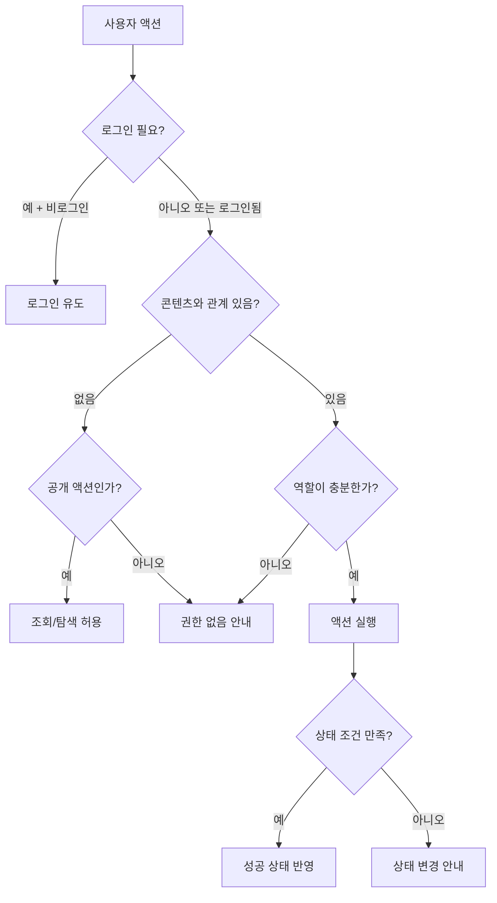

# 권한 정책 PRD

<!-- supporting-doc-status: 2026-05-22 -->

> 문서 상태: **보조 문서**. 기능별 현재 계약, source trace, Gap/Risk 판단은 [PRD_MIGRATION_STATUS.md](../PRD_MIGRATION_STATUS.md)와 각 기능 PRD를 우선한다. 이 문서는 인벤토리, 정책, QA, 기획 운영 기준을 보조하며, 기능 세부 판단은 [FEATURE_PRD_STANDARD.md](../FEATURE_PRD_STANDARD.md) 기준으로 재확인한다.

이 문서는 기능을 빠뜨리지 않는 것만큼 중요한 "누가 할 수 있는가"를 검산하기 위한 문서다. 같은 화면이라도 비로그인, 일반 사용자, 참가자, 호스트, 클럽 관리자, 크리에이터에게 보이는 버튼과 허용 액션이 다르다.

## 역할 정의

| 역할 | 설명 | 대표 진입 |
|---|---|---|
| 게스트 | 로그인하지 않은 사용자 | 홈, 검색, 일부 상세 공유 링크 |
| 로그인 사용자 | 인증은 되었지만 특정 콘텐츠와 관계가 없는 사용자 | 홈, 검색, 프로필, 지갑 |
| 참가자 | 이벤트에 신청/참석/대기 중인 사용자 | 이벤트 상세, 체크인, 리뷰, 정산 |
| 호스트 | 이벤트를 만든 사용자 | 이벤트 생성/관리, 신청 승인, 정산 |
| 클럽 비회원 | 클럽에 아직 속하지 않은 사용자 | 클럽 발견/상세 |
| 클럽 멤버 | 클럽에 가입한 사용자 | 게시판, 댓글, 사진첩, 클럽 이벤트 |
| 클럽 관리자 | 멤버 관리 권한을 가진 사용자 | 멤버, 공지, 게시판 관리 |
| 클럽 소유자 | 클럽의 최상위 책임자 | 삭제, 소유권 이전, 기금 인출 |
| 플랜 크리에이터 | 플랜을 작성하고 판매하는 사용자 | 플랜 에디터, 마켓 아이템 관리 |
| 플랜 구매자 | 플랜을 구매해 보유한 사용자 | 컬렉션, 플랜 미리보기, 이벤트 생성 |
| 데이팅 사용자 | 본인 인증 후 데이팅을 이용하는 사용자 | 후보자, 매칭, 채팅, 만남 |
| 신고자 | 부적절한 대상에 신고를 접수하는 사용자 | 리뷰/프로필/콘텐츠의 신고 액션 |

## 권한 판단 흐름



## 영역별 권한 요약

| 영역 | 게스트 | 로그인 사용자 | 관계자/소유자 | 관리자급 |
|---|---|---|---|---|
| 인증 & 온보딩 | 가입/로그인 | 온보딩/태그/로그아웃 | 본인 계정 관리 | 해당 없음 |
| 홈 피드 | 일부 조회 | 추천/카드 진입 | 동일 | 해당 없음 |
| 이벤트 | 목록/상세 일부 | 신청/위시 | 참가자 체크인, 호스트 관리 | 해당 없음 |
| 클럽 | 발견/상세 일부 | 가입 신청 | 멤버 활동 | 관리자/소유자 운영 |
| 검색 | 일부 검색 | 기록/저장 검색 | 동일 | 해당 없음 |
| 결제 & 지갑 | 불가 | 본인 지갑/결제 | 호스트 수익 | 해당 없음 |
| 모임 정산 | 불가 | 본인 관련 조회 | 참가자 납부, 호스트 생성/확인 | 해당 없음 |
| 플랜 마켓 | 탐색 일부 | 구매/컬렉션 | 크리에이터 작성/판매 | 해당 없음 |
| 데이팅 | 불가 | 인증 전 제한 | 매칭/채팅/차단 | 해당 없음 |
| 캘린더 | 제한적 공개 조회 | 본인 일정/가용성 | 타인 공개 가용성 | 해당 없음 |
| 리뷰 & 신고 | 일부 조회 | 작성/신고 | 본인 리뷰 수정/삭제 | 운영 검토는 별도 |
| 알림 | 불가 | 본인 알림/설정 | 동일 | 해당 없음 |
| 프로필 & 설정 | 불가 | 본인 데이터 관리 | 동일 | 해당 없음 |
| 위치 & 길찾기 | 제한적 | 길찾기 일부 | 참석자 위치 공유 | 호스트 이벤트 단위 제어 |

## 이벤트 권한 매트릭스

| 액션 | 게스트 | 로그인 사용자 | 신청자 | 참석자 | 대기자 | 호스트 |
|---|:-:|:-:|:-:|:-:|:-:|:-:|
| 이벤트 목록/공개 상세 보기 | O | O | O | O | O | O |
| 비공개/작성중 상세 보기 |  |  |  |  |  | O |
| 참석 신청 |  | O |  |  |  |  |
| 신청 취소 |  |  | O |  |  |  |
| 참석 취소 |  |  |  | O | O |  |
| 신청 승인/거절 |  |  |  |  |  | O |
| 정원/대기열 관리 |  |  |  |  |  | O |
| QR 토큰 표시 |  |  |  | O |  |  |
| QR 스캔/수동 체크인 |  |  |  |  |  | O |
| 사진 업로드 |  |  |  | O |  | O |
| 이벤트 수정/취소/공지 |  |  |  |  |  | O |
| 리뷰 작성 |  |  |  | O |  | 조건부 |

## 클럽 권한 매트릭스

| 액션 | 게스트 | 비회원 | 대기자/초대자 | 멤버 | 관리자 | 소유자 |
|---|:-:|:-:|:-:|:-:|:-:|:-:|
| 클럽 발견/공개 상세 | O | O | O | O | O | O |
| 가입 신청 |  | O |  |  |  |  |
| 초대 수락/거절 |  |  | O |  |  |  |
| 게시글/댓글 작성 |  |  |  | O | O | O |
| 자기 글/댓글 수정·삭제 |  |  |  | O | O | O |
| 게시판/공지 관리 |  |  |  |  | O | O |
| 멤버 역할 변경/추방 |  |  |  |  | O | O |
| 차단 관리 |  |  |  |  | O | O |
| 클럽 수정 |  |  |  |  | O | O |
| 클럽 삭제/소유권 이전 |  |  |  |  |  | O |
| 기금 조회 |  |  |  | O | O | O |
| 기금 인출 |  |  |  |  |  | O |

## 결제와 정산 권한 매트릭스

| 액션 | 일반 사용자 | 이벤트 참가자 | 호스트 | 클럽 소유자 |
|---|:-:|:-:|:-:|:-:|
| 본인 지갑 조회 | O | O | O | O |
| 포인트 충전/결제수단 관리 | O | O | O | O |
| 이벤트 참가비 결제 | 조건부 | O | 조건부 |  |
| 환불 요청/결과 확인 | O | O | O | O |
| 모임 정산 생성 |  |  | O |  |
| 정산 항목 편집 |  |  | O |  |
| 분담금 납부 |  | O | 조건부 |  |
| 계좌이체 확인/상각 |  |  | O |  |
| 미납자 리마인드 |  |  | O |  |
| 정산 이의제기 |  | 조건부 | 조건부 |  |
| 클럽 기금 인출 |  |  |  | O |

유료 승인제 이벤트에서 일반 사용자의 참가비 결제는 "호스트 승인 후 결제 대기 상태"일 때만 허용한다. 승인 전 결제, 거절 후 결제, 결제 기한 만료 후 결제는 모두 차단해야 한다.

정산 이의제기는 정산이 신청(활성화)된 이후부터만 가능하다 — 준비 중(DRAFT) 정산에는 서버가 이의 생성을 거부하고 앱도 버튼을 숨긴다(2026-06-05, 호스트 본인 share 이의는 상태와 무관하게 불가). 모임 정산 열람 자격은 "참석 확정자 ∪ 해당 정산의 분담금/송금 당사자 ∪ 호스트"다 — 참석을 취소했어도 내 돈이 걸려 있으면 본인 정산을 볼 수 있다(2026-06-05 확장). 준비 중 정산은 참가자에게 총액·상태·내 분담금만 보이는 미리보기 수위로 차등 노출된다.

## 플랜 마켓 권한 매트릭스

| 액션 | 게스트 | 로그인 사용자 | 크리에이터 | 구매자 |
|---|:-:|:-:|:-:|:-:|
| 마켓 탐색 | O | O | O | O |
| 아이템 상세 보기 | O | O | O | O |
| 플랜 작성/편집 |  | O | O |  |
| 플랜 발행 |  |  | O |  |
| 마켓 상품 등록/수정/중지 |  |  | O |  |
| 아이템/번들 구매 |  | O | O | O |
| 컬렉션 보기 |  | O | O | O |
| 구매 플랜으로 이벤트 생성 |  |  | 조건부 | O |
| 구매 후 리뷰 작성 |  |  | 조건부 | O |

## 데이팅 권한 매트릭스

| 액션 | 비로그인 | 로그인 미인증 | 인증 완료 | 매칭 사용자 | 차단 관계 |
|---|:-:|:-:|:-:|:-:|:-:|
| 데이팅 진입 |  | 제한 | O | O | 제한 |
| 프로필 작성 |  |  | O | O | 제한 |
| 후보자 보기 |  |  | O | O | 제외 |
| 좋아요/패스 |  |  | O | O |  |
| 매칭 목록 보기 |  |  | O | O | 제한 |
| 채팅 |  |  |  | O | 차단 |
| 만남 제안 |  |  |  | O | 차단 |
| 차단/해제 |  |  | O | O | O |

## 위치 권한 매트릭스

| 액션 | 비참석자 | 참석자 | 호스트 | OS 위치 권한 없음 |
|---|:-:|:-:|:-:|:-:|
| 이벤트 장소 보기 | 조건부 | O | O | O |
| 길찾기 | 조건부 | O | O | 저장 주소만 가능 |
| 위치 공유 켜기 |  | O | 조건부 | 불가 |
| 위치 공유 중지 |  | O | O | O |
| 참석자 위치 조회 |  | O | O | 제한 |
| 이벤트 단위 위치 공유 비활성화 |  |  | O | O |

## 권한 검토 체크리스트

```text
[ ] 비로그인 사용자가 이 화면을 볼 수 있는가?
[ ] 로그인했지만 관계 없는 사용자가 할 수 있는 액션은 무엇인가?
[ ] 소유자/작성자/호스트 본인이 대상일 때 금지해야 할 액션이 있는가?
[ ] 관리자급 권한과 소유자 권한을 구분했는가?
[ ] 차단/탈퇴/삭제/비활성 사용자 상태를 고려했는가?
[ ] 같은 사용자가 여러 역할을 동시에 가질 때 우선순위가 있는가?
[ ] 화면 진입 후 권한이 바뀌면 어떻게 갱신하는가?
[ ] 권한 없음은 버튼 숨김, 비활성, 에러 중 무엇으로 표현하는가?
```

## PRD 수용 기준

- 모든 주요 액션은 비로그인, 로그인, 관계자, 소유자/관리자 역할별 결과가 정의되어야 한다.
- 권한 없음은 숨김, 비활성, 로그인 유도, 접근 불가 안내 중 하나로 일관되게 표현되어야 한다.
- 여러 역할을 동시에 가진 사용자의 우선순위를 정의해야 한다.

## v4.5 W1~W7 신규 endpoint 권한 매트릭스 (2026-05-22)

> updated: 2026-05-22. 본 절은 `docs/plan/event-extensions/PLAN.md` v4.5의 W1~W7 슬라이스에서 신설되는 endpoint의 권한 결정을 추적한다. 실제 enforcement는 `community_api/src/main/java/com/endside/community/event/auth/EventAuthorizationService.java` 신규 빈에서 단일화한다 (D12 결정 — 기존 `EventService.validateOwnership` private helper를 별도 빈으로 추출).

### EventAuthorizationService 신규 빈 (D12)

| 메서드 | 의미 | 호출자 |
|---|---|---|
| `assertHostOrCoHost(eventId, userId)` | 호스트 또는 공동호스트만 통과 | capacity/transport/carpool/bus/prepayment host endpoints |
| `assertMemberSelf(eventId, userId, targetUserId)` | 본인만 통과 | prepayment 결제·취소, carpool offer 생성 |
| `assertAttendingOrApproved(eventId, userId)` | ATTENDING 또는 APPROVED_PENDING_PAYMENT만 통과 | 카풀 탑승 요청, 버스 좌석 점유 |

기존 EventService 호출은 그대로 유지하되, 내부적으로 새 빈에 위임한다. 신규 facade(`EventPrepaymentService`, `EventCarpoolService`, `EventBusService`, `EventCapacitySettingsService`)는 처음부터 새 빈만 호출한다 (P1#1 해결).

### W1 — 정원 초과 허용

| Endpoint | Method | 허용 역할 | 빈 호출 | 비고 |
|---|---|---|---|---|
| `/events/{id}/capacity-settings` | PATCH | HOST, COHOST | `assertHostOrCoHost` | DRAFT + OPEN 상태에서 호출 가능 (Q7). baseCapacity, overcapacityAllowed, hardCapacityLimit 갱신. |

### W2~W3 — 참가 선입금

| Endpoint | Method | 허용 역할 | 빈 호출 | 비고 |
|---|---|---|---|---|
| `/events/{id}/prepayment/wallet-pay` | POST | Member(self) | `assertMemberSelf` | APPROVED_PENDING_PAYMENT 상태에서만. WALLET 즉시 차감 + ATTENDING 전이. |
| `/events/{id}/prepayment/bank-declare` | POST | Member(self) | `assertMemberSelf` | 참가자가 입금했다고 신고. event_payment.declared_at 갱신, 72 알림. |
| `/events/{id}/prepayment/cancel` | POST | Member(self) | `assertMemberSelf` | 결제 전 취소 — event_payment.status=CANCELED. |
| `/events/{id}/applications/{appId}/bank-confirm` | POST | HOST, COHOST | `assertHostOrCoHost` | 호스트가 입금 확인. event_payment.status=PAID → application ATTENDING. 73 알림. |
| `/events/{id}/applications/{appId}/bank-reject` | POST | HOST, COHOST | `assertHostOrCoHost` | 호스트가 입금 미확인 처리. 74 알림. |
| `/events/{id}/host/payments` | GET | HOST, COHOST | `assertHostOrCoHost` | 호스트 결제 보고서 6 섹션 (W3). |

### W4 — 교통 모드 베이스

| Endpoint | Method | 허용 역할 | 빈 호출 | 비고 |
|---|---|---|---|---|
| `/events/{id}/transport/config` | PUT | HOST, COHOST | `assertHostOrCoHost` | mode 전이 (NONE/CARPOOL/BUS). DRAFT only hard delete, OPEN immutable (§3.2). |

### W5 — 카풀 운영

| Endpoint | Method | 허용 역할 | 빈 호출 | 비고 |
|---|---|---|---|---|
| `/events/{id}/carpool/offer` | POST | Member(ATTENDING 또는 APPROVED) | `assertAttendingOrApproved` | 운전자가 offer 등록. event_carpool_offer.status=OFFERED. |
| `/events/{id}/carpool/offers/{oid}/decision` | POST | HOST, COHOST | `assertHostOrCoHost` | 호스트가 confirm/reject. 77/78 알림. |
| `/events/{id}/carpool/passengers/{pid}/assignment` | PUT | HOST, COHOST | `assertHostOrCoHost` | 탑승자 배정/해제. 79/80 알림. swap 시 `event_carpool_assignment_log` 기록. |
| `/events/{id}/carpool/passengers` | GET | HOST(all rows), Member(본인 row만) | `assertHostOrCoHost` 분기 | 호스트는 전체, 일반 멤버는 본인 1건. |

### W6 — 차량 레이아웃 카탈로그

| Endpoint | Method | 허용 역할 | 빈 호출 | 비고 |
|---|---|---|---|---|
| `/vehicle-layouts/active` | GET | Authenticated | (인증만) | 호스트가 버스 생성 시 활성 레이아웃 read-only 조회. |
| `/admin/v1/manage/vehicle-layouts` | POST | Admin | Admin 인증 | 관리자 카탈로그 생성. 1차 출시는 admin API만 (Q5 — 관리자 UI는 후속 슬라이스). |
| `/admin/v1/manage/vehicle-layouts/{id}` | PUT/DELETE | Admin | Admin 인증 | 동일. soft delete 권장. |
| `/admin/v1/manage/vehicle-layouts/{id}/seats` | PUT | Admin | Admin 인증 | 좌석 JSON 갱신. |

### W7 — 이벤트 측 버스 운영

| Endpoint | Method | 허용 역할 | 빈 호출 | 비고 |
|---|---|---|---|---|
| `/events/{id}/buses` | POST | HOST, COHOST | `assertHostOrCoHost` | 버스 인스턴스 생성 (vehicle_layout 참조). |
| `/events/{id}/buses/{bid}` | PUT/DELETE | HOST, COHOST | `assertHostOrCoHost` | 버스 메타 변경/제거. OPEN 이후 좌석 점유 발생 시 제한. |
| `/events/{id}/buses/{bid}/seats/{seatNo}` | PUT | HOST, COHOST, 또는 self if `allow_self_swap=true` | `assertHostOrCoHost` 또는 `assertMemberSelf` | FREE 모드는 self 점유 가능. FIXED_BY_HOST는 호스트만. FIRST_COME은 첫 시도자 자동 배정 후 host override. 81/82 알림. |
| `/events/{id}/buses/{bid}/seats` | GET | ATTENDING 또는 HOST | `assertAttendingOrApproved` 또는 `assertHostOrCoHost` | 호스트는 전체 점유 상태, 참가자는 본인 좌석 + 남은 좌석 카운트. |

### 이벤트 권한 매트릭스 확장 (요약)

| 액션 | 게스트 | 로그인 사용자 | 신청자 | 참석자 | 대기자 | 호스트 |
|---|:-:|:-:|:-:|:-:|:-:|:-:|
| 정원 설정 변경 |  |  |  |  |  | O |
| 참가 선입금 결제 (WALLET) |  |  | 조건부(승인 후) |  |  |  |
| 계좌이체 입금 신고 |  |  | 조건부(승인 후) |  |  |  |
| 계좌이체 확인/거절 |  |  |  |  |  | O |
| 교통 모드 설정 |  |  |  |  |  | O |
| 카풀 offer 등록 |  |  |  | O | (대기는 보통 제외) |  |
| 카풀 offer 확정/거절 |  |  |  |  |  | O |
| 카풀 탑승자 배정 |  |  |  |  |  | O |
| 버스 인스턴스 생성/수정 |  |  |  |  |  | O |
| 버스 좌석 점유 (FREE 모드) |  |  |  | O |  | O |
| 버스 좌석 변경 (FIXED) |  |  |  |  |  | O |

조건부 항목:
- 참가 선입금 결제는 `application.status = APPROVED_PENDING_PAYMENT`일 때만 허용. 승인 전/거절 후/만료 후/이미 결제 완료 상태에서는 차단.
- 카풀 offer는 본인이 운전자여야 하며 본인 application이 ATTENDING 또는 APPROVED_PENDING_PAYMENT여야 함.
- 버스 좌석 점유는 `event_bus.assignment_mode=FREE` 또는 호스트일 때만. 좌석 변경(swap)은 `allow_self_swap` 설정 따름.

### 권한 enforcement 후속 (1차 범위 외)

- **관리자 SPA** — `/admin/v1/manage/vehicle-layouts/*`의 UI 구현은 후속 슬라이스. 1차는 admin API + 직접 INSERT.
- **EventAuthorizationService 캐시** — viewer context 배치 조회 시 권한 캐싱은 성능 모니터링 후 후속.
- **공동호스트(COHOST) 역할 enum** — 현재 host 단일 필드. 공동호스트 다중화는 별도 PRD.

## v5.0 delta 신규 권한 (2026-06-05)

### EventCoHost Permission Flag 5종 (Wave E-1)

> 소스: `EventCoHost.java:38-55`, `EventCoHostController.java:31`

공동호스트는 이제 기능별 개별 권한 플래그를 부여받는다. PATCH `/api/v1/events/{eventId}/co-hosts/{coHostUserId}/permissions` (호스트만 호출 가능).

| 플래그 | 컬럼 | 기본값 | 의미 |
|---|---|---|---|
| `canManageAttendance` | `can_manage_attendance` | false | 수동 체크인·참석자 강제 제거·대기열 수동 승급. Gap: 노쇼 확정/뒤집기(`EventNoShowService`)는 이 flag를 미체크하는 불일치 존재. |
| `canModerateMessages` | `can_moderate_messages` | false | 타 사용자 이벤트 메시지 삭제(콘텐츠 모더레이션) |
| `canSendAnnouncement` | `can_send_announcement` | **true** | 공지 일괄 발송 (기존 동작 보존 — 기본 true) |
| `canHandleRefundIssue` | `can_handle_refund_issue` | false | 환불 처리(은행 환불 확인 등) |
| `canResolveDispute` | `can_resolve_dispute` | false | 분쟁 처리 가능 여부 |

이벤트 권한 매트릭스 확장 (공동호스트):

| 액션 | 호스트 | 공동호스트 (flag 충족 시) |
|---|---|---|
| 수동 체크인·참석자 제거 | O | `canManageAttendance=true` 시만 |
| 메시지 삭제 모더레이션 | O | `canModerateMessages=true` 시만 |
| 공지 일괄 발송 | O | 기본 허용 (`canSendAnnouncement` 기본 true) |
| 환불 처리 | O | `canHandleRefundIssue=true` 시만 |
| 분쟁 처리 | O | `canResolveDispute=true` 시만 |

### 분쟁 케이스 Visibility별 접근 권한

> 소스: `Visibility.java`, `DisputeCaseDetailVo.ActorPermissionFlags`

**정책 의도 (4종 분류)**

| Visibility | 열람 가능 역할 (정책 목표) |
|---|---|
| `PARTIES` | 신고자(reporterUserId), 피신고자(targetUserId), 소유 호스트(ownerHostUserId) |
| `HOST_ONLY` | 소유 호스트(ownerHostUserId), CS/운영팀 |
| `CS_ONLY` | CS/운영팀만 (admin API 전용) |
| `PUBLIC_SUMMARY` | 인증된 모든 사용자 (요약 정보만) |

**현재 구현**: public detail 조회 시 CS_ONLY 항목 제거 필터만 적용. HOST_ONLY를 소유 호스트에게만 노출하거나 PARTIES를 당사자로 제한하는 역할별 분기 builder는 미구현(Gap — 향후 구현 필요).

**ActorPermissionFlags** (서버가 케이스별로 내려주는 동적 권한 flag):

| 플래그 | 의미 | 비고 |
|---|---|---|
| `canResolveDispute` | 분쟁 처리 권한 | 호스트/CS |
| `canEscalateToCs` | CS 에스컬레이션 권한 | — |
| `canSendNote` | 타임라인 노트 추가 | — |
| `canModerateMessages` | 메시지 숨김/삭제 | — |
| `canHandleRefundIssue` | 환불 처리 | — |
| `canManageAttendance` | 노쇼 관리 | — |
| `canApproveAppeal` | 이의 승인/거절 | **Gap**: 공개 API endpoint 없음. admin API 소유만. flag는 UI gating용이지만 호스트/공동호스트가 appeal을 UPHELD/REJECTED로 전이하는 공개 endpoint 미구현. |

### 노쇼 확정/뒤집기 권한 (Gap 포함)

| 액션 | 권한 | Gap |
|---|---|---|
| 노쇼 확정(confirm, confirmBatch) | 호스트·cohost·클럽 운영진(canCreateEvent) | `EventNoShowService.validateCheckInManager()`가 `cohost.canManageAttendance` flag를 체크하지 않음 — `existsByEventIdAndUserId`로만 판단. 체크인 관리 권한 없는 cohost가 노쇼 확정/뒤집기 가능한 불일치. |
| 노쇼 뒤집기(overturn) | 호스트·cohost·클럽 운영진 또는 SYSTEM(id=0) | 동일 Gap |
| 참가자 소명(appeal) | **본인(row.userId)만** | 호스트/관리자 소명 불가 |

### 클럽 강퇴(kick)/차단(ban) 권한 + 사유코드 의무

> 소스: `ClubController`, `ClubMemberPermissionController`

| 액션 | 허용 역할 | 사유코드 |
|---|---|---|
| 멤버 강퇴(kick) | 관리자, 소유자 (자기 자신·소유자 보호) | **필수 — 별도 enum `ClubKickReasonCode`(5값), 누락 시 `CLUB_KICK_REASON_REQUIRED` 400** |
| 멤버 차단(ban) | 관리자, 소유자 | **필수 — 별도 enum `ClubBanReasonCode`(7값), 누락 시 `CLUB_BAN_REASON_REQUIRED` 400** |
| 강퇴/차단 이의제기 | **본인(강퇴/차단 당사자)만** | RS-002 P3-C: `CLUB_MEMBERSHIP_ACTION:{id}`로 분쟁 union 진입. 제3자 이의 생성 차단(`FORBIDDEN`, `DisputeAppealService.java:126`). |

> 사유코드는 `ApplicationRejectReasonCode`와 무관한 별도 enum으로 구현 완료. `ClubKickReasonCode`/`ClubBanReasonCode` controller level 필수 강제 적용됨.
