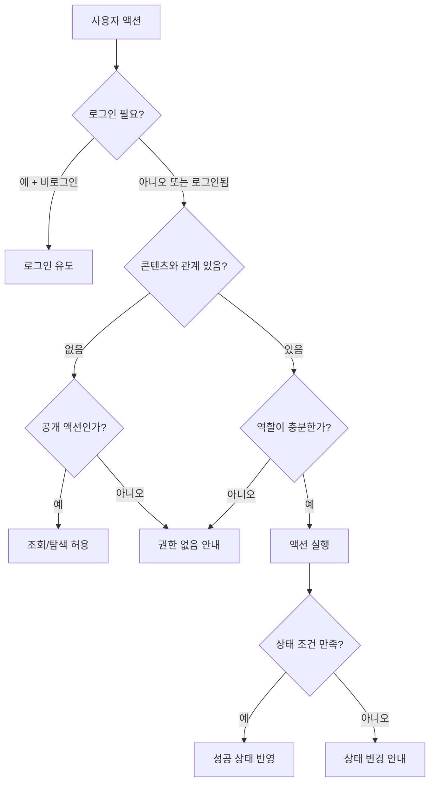

# 권한 정책 PRD

<!-- supporting-doc-status: 2026-05-22 -->

> 문서 상태: **보조 문서**. 기능별 현재 계약, source trace, Gap/Risk 판단은 [PRD_MIGRATION_STATUS.md](../PRD_MIGRATION_STATUS.md)와 각 기능 PRD를 우선한다. 이 문서는 인벤토리, 정책, QA, 기획 운영 기준을 보조하며, 기능 세부 판단은 [FEATURE_PRD_STANDARD.md](../FEATURE_PRD_STANDARD.md) 기준으로 재확인한다.

이 문서는 기능을 빠뜨리지 않는 것만큼 중요한 "누가 할 수 있는가"를 검산하기 위한 문서다. 같은 화면이라도 비로그인, 일반 사용자, 참가자, 호스트, 클럽 관리자, 크리에이터에게 보이는 버튼과 허용 액션이 다르다.

## 역할 정의

| 역할 | 설명 | 대표 진입 |
|---|---|---|
| 게스트 | 로그인하지 않은 사용자 | 홈, 검색, 일부 상세 공유 링크 |
| 로그인 사용자 | 인증은 되었지만 특정 콘텐츠와 관계가 없는 사용자 | 홈, 검색, 프로필, 지갑 |
| 참가자 | 이벤트에 신청/참석/대기 중인 사용자 | 이벤트 상세, 체크인, 리뷰, 정산 |
| 호스트 | 이벤트를 만든 사용자 | 이벤트 생성/관리, 신청 승인, 정산 |
| 클럽 비회원 | 클럽에 아직 속하지 않은 사용자 | 클럽 발견/상세 |
| 클럽 멤버 | 클럽에 가입한 사용자 | 게시판, 댓글, 사진첩, 클럽 이벤트 |
| 클럽 관리자 | 멤버 관리 권한을 가진 사용자 | 멤버, 공지, 게시판 관리 |
| 클럽 소유자 | 클럽의 최상위 책임자 | 삭제, 소유권 이전, 기금 인출 |
| 플랜 크리에이터 | 플랜을 작성하고 판매하는 사용자 | 플랜 에디터, 마켓 아이템 관리 |
| 플랜 구매자 | 플랜을 구매해 보유한 사용자 | 컬렉션, 플랜 미리보기, 이벤트 생성 |
| 데이팅 사용자 | 본인 인증 후 데이팅을 이용하는 사용자 | 후보자, 매칭, 채팅, 만남 |
| 신고자 | 부적절한 대상에 신고를 접수하는 사용자 | 리뷰/프로필/콘텐츠의 신고 액션 |

## 권한 판단 흐름


```mermaid
flowchart TD
    A["사용자 액션"] --> B{"로그인 필요?"}
    B -->|"예 + 비로그인"| C["로그인 유도"]
    B -->|"아니오 또는 로그인됨"| D{"콘텐츠와 관계 있음?"}
    D -->|"없음"| E{"공개 액션인가?"}
    E -->|"예"| F["조회/탐색 허용"]
    E -->|"아니오"| G["권한 없음 안내"]
    D -->|"있음"| H{"역할이 충분한가?"}
    H -->|"예"| I["액션 실행"]
    H -->|"아니오"| G
    I --> J{"상태 조건 만족?"}
    J -->|"예"| K["성공 상태 반영"]
    J -->|"아니오"| L["상태 변경 안내"]
```

## 영역별 권한 요약

| 영역 | 게스트 | 로그인 사용자 | 관계자/소유자 | 관리자급 |
|---|---|---|---|---|
| 인증 & 온보딩 | 가입/로그인 | 온보딩/태그/로그아웃 | 본인 계정 관리 | 해당 없음 |
| 홈 피드 | 일부 조회 | 추천/카드 진입 | 동일 | 해당 없음 |
| 이벤트 | 목록/상세 일부 | 신청/위시 | 참가자 체크인, 호스트 관리 | 해당 없음 |
| 클럽 | 발견/상세 일부 | 가입 신청 | 멤버 활동 | 관리자/소유자 운영 |
| 검색 | 일부 검색 | 기록/저장 검색 | 동일 | 해당 없음 |
| 결제 & 지갑 | 불가 | 본인 지갑/결제 | 호스트 수익 | 해당 없음 |
| 모임 정산 | 불가 | 본인 관련 조회 | 참가자 납부, 호스트 생성/확인 | 해당 없음 |
| 플랜 마켓 | 탐색 일부 | 구매/컬렉션 | 크리에이터 작성/판매 | 해당 없음 |
| 데이팅 | 불가 | 인증 전 제한 | 매칭/채팅/차단 | 해당 없음 |
| 캘린더 | 제한적 공개 조회 | 본인 일정/가용성 | 타인 공개 가용성 | 해당 없음 |
| 리뷰 & 신고 | 일부 조회 | 작성/신고 | 본인 리뷰 수정/삭제 | 운영 검토는 별도 |
| 알림 | 불가 | 본인 알림/설정 | 동일 | 해당 없음 |
| 프로필 & 설정 | 불가 | 본인 데이터 관리 | 동일 | 해당 없음 |
| 위치 & 길찾기 | 제한적 | 길찾기 일부 | 참석자 위치 공유 | 호스트 이벤트 단위 제어 |

## 이벤트 권한 매트릭스

| 액션 | 게스트 | 로그인 사용자 | 신청자 | 참석자 | 대기자 | 호스트 |
|---|:-:|:-:|:-:|:-:|:-:|:-:|
| 이벤트 목록/공개 상세 보기 | O | O | O | O | O | O |
| 비공개/작성중 상세 보기 |  |  |  |  |  | O |
| 참석 신청 |  | O |  |  |  |  |
| 신청 취소 |  |  | O |  |  |  |
| 참석 취소 |  |  |  | O | O |  |
| 신청 승인/거절 |  |  |  |  |  | O |
| 정원/대기열 관리 |  |  |  |  |  | O |
| QR 토큰 표시 |  |  |  | O |  |  |
| QR 스캔/수동 체크인 |  |  |  |  |  | O |
| 사진 업로드 |  |  |  | O |  | O |
| 이벤트 수정/취소/공지 |  |  |  |  |  | O |
| 리뷰 작성 |  |  |  | O |  | 조건부 |

## 클럽 권한 매트릭스

| 액션 | 게스트 | 비회원 | 대기자/초대자 | 멤버 | 관리자 | 소유자 |
|---|:-:|:-:|:-:|:-:|:-:|:-:|
| 클럽 발견/공개 상세 | O | O | O | O | O | O |
| 가입 신청 |  | O |  |  |  |  |
| 초대 수락/거절 |  |  | O |  |  |  |
| 게시글/댓글 작성 |  |  |  | O | O | O |
| 자기 글/댓글 수정·삭제 |  |  |  | O | O | O |
| 게시판/공지 관리 |  |  |  |  | O | O |
| 멤버 역할 변경/추방 |  |  |  |  | O | O |
| 차단 관리 |  |  |  |  | O | O |
| 클럽 수정 |  |  |  |  | O | O |
| 클럽 삭제/소유권 이전 |  |  |  |  |  | O |
| 기금 조회 |  |  |  | O | O | O |
| 기금 인출 |  |  |  |  |  | O |

## 결제와 정산 권한 매트릭스

| 액션 | 일반 사용자 | 이벤트 참가자 | 호스트 | 클럽 소유자 |
|---|:-:|:-:|:-:|:-:|
| 본인 지갑 조회 | O | O | O | O |
| 포인트 충전/결제수단 관리 | O | O | O | O |
| 이벤트 참가비 결제 | 조건부 | O | 조건부 |  |
| 환불 요청/결과 확인 | O | O | O | O |
| 모임 정산 생성 |  |  | O |  |
| 정산 항목 편집 |  |  | O |  |
| 분담금 납부 |  | O | 조건부 |  |
| 계좌이체 확인/상각 |  |  | O |  |
| 미납자 리마인드 |  |  | O |  |
| 정산 이의제기 |  | 조건부 | 조건부 |  |
| 클럽 기금 인출 |  |  |  | O |

유료 승인제 이벤트에서 일반 사용자의 참가비 결제는 "호스트 승인 후 결제 대기 상태"일 때만 허용한다. 승인 전 결제, 거절 후 결제, 결제 기한 만료 후 결제는 모두 차단해야 한다.

정산 이의제기는 정산이 신청(활성화)된 이후부터만 가능하다 — 준비 중(DRAFT) 정산에는 서버가 이의 생성을 거부하고 앱도 버튼을 숨긴다(2026-06-05, 호스트 본인 share 이의는 상태와 무관하게 불가). 모임 정산 열람 자격은 "참석 확정자 ∪ 해당 정산의 분담금/송금 당사자 ∪ 호스트"다 — 참석을 취소했어도 내 돈이 걸려 있으면 본인 정산을 볼 수 있다(2026-06-05 확장). 준비 중 정산은 참가자에게 총액·상태·내 분담금만 보이는 미리보기 수위로 차등 노출된다.

## 플랜 마켓 권한 매트릭스

| 액션 | 게스트 | 로그인 사용자 | 크리에이터 | 구매자 |
|---|:-:|:-:|:-:|:-:|
| 마켓 탐색 | O | O | O | O |
| 아이템 상세 보기 | O | O | O | O |
| 플랜 작성/편집 |  | O | O |  |
| 플랜 발행 |  |  | O |  |
| 마켓 상품 등록/수정/중지 |  |  | O |  |
| 아이템/번들 구매 |  | O | O | O |
| 컬렉션 보기 |  | O | O | O |
| 구매 플랜으로 이벤트 생성 |  |  | 조건부 | O |
| 구매 후 리뷰 작성 |  |  | 조건부 | O |

## 데이팅 권한 매트릭스

| 액션 | 비로그인 | 로그인 미인증 | 인증 완료 | 매칭 사용자 | 차단 관계 |
|---|:-:|:-:|:-:|:-:|:-:|
| 데이팅 진입 |  | 제한 | O | O | 제한 |
| 프로필 작성 |  |  | O | O | 제한 |
| 후보자 보기 |  |  | O | O | 제외 |
| 좋아요/패스 |  |  | O | O |  |
| 매칭 목록 보기 |  |  | O | O | 제한 |
| 채팅 |  |  |  | O | 차단 |
| 만남 제안 |  |  |  | O | 차단 |
| 차단/해제 |  |  | O | O | O |

## 위치 권한 매트릭스

| 액션 | 비참석자 | 참석자 | 호스트 | OS 위치 권한 없음 |
|---|:-:|:-:|:-:|:-:|
| 이벤트 장소 보기 | 조건부 | O | O | O |
| 길찾기 | 조건부 | O | O | 저장 주소만 가능 |
| 위치 공유 켜기 |  | O | 조건부 | 불가 |
| 위치 공유 중지 |  | O | O | O |
| 참석자 위치 조회 |  | O | O | 제한 |
| 이벤트 단위 위치 공유 비활성화 |  |  | O | O |

## 권한 검토 체크리스트

```text
[ ] 비로그인 사용자가 이 화면을 볼 수 있는가?
[ ] 로그인했지만 관계 없는 사용자가 할 수 있는 액션은 무엇인가?
[ ] 소유자/작성자/호스트 본인이 대상일 때 금지해야 할 액션이 있는가?
[ ] 관리자급 권한과 소유자 권한을 구분했는가?
[ ] 차단/탈퇴/삭제/비활성 사용자 상태를 고려했는가?
[ ] 같은 사용자가 여러 역할을 동시에 가질 때 우선순위가 있는가?
[ ] 화면 진입 후 권한이 바뀌면 어떻게 갱신하는가?
[ ] 권한 없음은 버튼 숨김, 비활성, 에러 중 무엇으로 표현하는가?
```

## PRD 수용 기준

- 모든 주요 액션은 비로그인, 로그인, 관계자, 소유자/관리자 역할별 결과가 정의되어야 한다.
- 권한 없음은 숨김, 비활성, 로그인 유도, 접근 불가 안내 중 하나로 일관되게 표현되어야 한다.
- 여러 역할을 동시에 가진 사용자의 우선순위를 정의해야 한다.

## 이벤트 선입금·교통 endpoint 권한 매트릭스 (2026-07-29 현재 소스)

> 현재 근거는 각 Controller/Service와 전역 Security 설정이다. 삭제된 event-extensions 계획은 현재 권한 계약이 아니다. 공통 권한 빈의 실제 경로는 `community_api/src/main/java/com/endside/community/event/service/EventAuthorizationService.java`다.

### EventAuthorizationService 실제 공개 메서드

| 메서드 | 의미 | 호출자 |
|---|---|---|
| `assertHost(Event, userId)` | 주 호스트만 통과 | 일부 event 운영 서비스 |
| `assertHostOrCoHost(Event, userId)` | 주 호스트 또는 공동호스트만 통과 | transport/carpool/bus/prepayment host endpoint |

`assertMemberSelf`, `assertAttendingOrApproved`, eventId overload는 존재하지 않는다. 참가자 본인·참석 상태는 각 도메인 서비스가 application/attendance row를 직접 검증한다.

### W1 — 정원 초과 허용

| Endpoint | Method | 허용 역할 | 빈 호출 | 비고 |
|---|---|---|---|---|
| `/events/{id}/capacity-settings` | PATCH | HOST, COHOST | `assertHostOrCoHost` | DRAFT + OPEN 상태에서 호출 가능 (Q7). baseCapacity, overcapacityAllowed, hardCapacityLimit 갱신. |

### W2~W3 — 참가 선입금

| Endpoint | Method | 허용 역할 | 빈 호출 | 비고 |
|---|---|---|---|---|
| `/events/{id}/prepayment/wallet` | POST | 해당 application의 사용자 | service의 application user 일치 검증 | APPROVED_PENDING_PAYMENT에서 WALLET 즉시 차감 + APPROVED/ATTENDING 전이 |
| `/events/{id}/prepayment/bank-declare` | POST | 해당 application의 사용자 | service의 application user 일치 검증 | BANK_TRANSFER PENDING 생성. 72는 이벤트 주 호스트 한 명에게만 전송 |
| `/events/{id}/applications/{appId}/bank-confirm` | POST | HOST, COHOST | `assertHostOrCoHost` | 호스트가 입금 확인. event_payment.status=PAID → application ATTENDING. 73 알림. |
| `/events/{id}/applications/{appId}/bank-reject` | POST | HOST, COHOST | `assertHostOrCoHost` | 호스트가 입금 미확인 처리. 74 알림. |
| `/events/{id}/applications/{appId}/refund-wallet` | POST | 결제 사용자 또는 HOST/COHOST | participant-or-host 분기 | 정책 카탈로그 기반 WALLET 환불 |
| `/events/{id}/applications/{appId}/refund-bank-confirm` | POST | HOST/COHOST 또는 club OWNER/`EVENT_REFUND_MANAGER` | refund manager 분기 | 외부 BANK 환불 완료 표시, 증빙 최대 5건 |

`POST /prepayment/cancel`, `GET /host/payments` endpoint는 없다. 참가 취소는 `DELETE /api/v1/events/{eventId}/apply` facade를 따른다. 운영자 강제환불은 인증 public API가 아니라 `X-Internal-Token`으로 보호된 `POST /api/internal/event-payments/{paymentId}/force-refund`를 admin API가 호출한다.

환불 정책 조회도 전역 `anyRequest().authenticated()` 대상이다. `GET /api/v1/refund-policy-templates`는 permitAll이 아니다. 다만 다음 authorization Gap이 있다.

- `POST .../refund-preview`: Controller가 actor를 log만 하고 service에 전달하지 않아 applicationId 기반 IDOR 후보
- `GET .../no-show-refund`: principal이 없고 path eventId도 service에서 무시해 actor authorization/event scoping 누락

### W4 — 교통 모드 베이스

| Endpoint | Method | 허용 역할 | 빈 호출 | 비고 |
|---|---|---|---|---|
| `/events/{id}/transport` | GET | Authenticated | 전역 Security만 | event 존재·참가 자격 service gate 없음 |
| `/events/{id}/transport/config` | PUT | HOST, COHOST | `assertHostOrCoHost` | mode 변경은 DRAFT only hard delete. `allowsSelfTransport` 단독 변경에는 status gate 없음 |

### W5 — 카풀 운영

| Endpoint | Method | 허용 역할 | 빈 호출 | 비고 |
|---|---|---|---|---|
| `/events/{id}/carpool/offers` | GET | HOST/COHOST 또는 ATTENDING | service 직접 검사 | full offer 목록과 driver/location 노출 |
| `/events/{id}/carpool/passengers` | GET | HOST/COHOST=전체, 그 외 인증 사용자=본인 row/빈 목록 | service 분기 | 일반 사용자에는 별도 ATTENDING 검사 없음 |
| `/events/{id}/carpool/offer` | POST | ATTENDING | attendance 직접 검사 | OPEN + CARPOOL mode, 이벤트당 운전자 1건 |
| `/events/{id}/carpool/offers/{oid}/decision` | POST | HOST/COHOST | `assertHostOrCoHost` | CONFIRMED/REJECTED만 허용. 77/78 생산 알림은 없음 |
| `/events/{id}/carpool/offers/{oid}/report` | POST | 운전자가 아닌 ATTENDING | attendance·eventId 직접 검사 | mode/status 가드 없이 공통 ReportService 위임 |
| `/events/{id}/carpool/passenger` | PUT | ATTENDING | attendance 직접 검사 | CARPOOL mode, 사용자 row upsert |
| `/events/{id}/carpool/passengers/{pid}/assignment` | PUT | HOST/COHOST | `assertHostOrCoHost` | `offerId` null이면 해제. event lock/정원 검사. assignment log·79/80 알림은 없음 |

### W6 — 차량 레이아웃 카탈로그

| Endpoint | Method | 허용 역할 | 빈 호출 | 비고 |
|---|---|---|---|---|
| `/vehicle-layouts/active` | GET | Authenticated | (인증만) | 호스트가 버스 생성 시 활성 레이아웃 read-only 조회. |
| `/vehicle-layouts/{id}/seats` | GET | Authenticated | (인증만) | inactive layout도 조회, 없는 ID는 빈 목록 |
| `/admin/v1/manage/vehicle-layouts` | GET/POST | `MANAGE_EVENT` Admin | principal privilege 검사 | 목록/생성 |
| `/admin/v1/manage/vehicle-layouts/{id}` | GET/PUT | `MANAGE_EVENT` Admin | principal privilege 검사 | 상세/메타 수정. DELETE 없음 |
| `/admin/v1/manage/vehicle-layouts/{id}/seats` | POST | `MANAGE_EVENT` Admin | principal privilege 검사 | 좌석맵 전체 교체 |
| `/admin/v1/manage/vehicle-layouts/{id}/active` | PATCH | `MANAGE_EVENT` Admin | principal privilege 검사 | active 토글 |

### W7 — 이벤트 측 버스 운영

| Endpoint | Method | 허용 역할 | 빈 호출 | 비고 |
|---|---|---|---|---|
| `/events/{id}/buses` | GET | Authenticated | 전역 Security만 | event 존재·역할 service gate 없음 |
| `/events/{id}/buses` | POST | HOST, COHOST | `assertHostOrCoHost` | 버스 인스턴스 생성 (vehicle_layout 참조). |
| `/events/{id}/buses/{bid}/seats` | GET | HOST/COHOST 또는 ATTENDING/WAITING | service 직접 검사 | 일반 사용자는 타인 `userId`만 null 마스킹 |
| `/events/{id}/buses/{bid}/seats/{seatNo}?userId=` | PUT | HOST/COHOST, 또는 `allowSelfSwap=true && userId=actor` | service 분기 | assignmentMode·참석 자격·lockedByHost 미검사. 진짜 swap/unassign·FIRST_COME 자동배정·81/82 알림 없음 |

버스 메타 PUT/DELETE endpoint는 없다.

### 이벤트 권한 매트릭스 확장 (요약)

| 액션 | 게스트 | 로그인 사용자 | 신청자 | 참석자 | 대기자 | 호스트 |
|---|:-:|:-:|:-:|:-:|:-:|:-:|
| 정원 설정 변경 |  |  |  |  |  | O |
| 참가 선입금 결제 (WALLET) |  |  | 조건부(승인 후) |  |  |  |
| 계좌이체 입금 신고 |  |  | 조건부(승인 후) |  |  |  |
| 계좌이체 확인/거절 |  |  |  |  |  | O |
| 교통 모드 설정 |  |  |  |  |  | O |
| 카풀 offer 등록 |  |  |  | O | (대기는 보통 제외) |  |
| 카풀 offer 확정/거절 |  |  |  |  |  | O |
| 카풀 탑승자 배정 |  |  |  |  |  | O |
| 버스 인스턴스 생성 |  |  |  |  |  | O |
| 버스 좌석 조회 |  |  |  | O | O | O |
| 버스 좌석 user 지정 |  | 조건부 self |  | 조건부 self | 조건부 self | O |

조건부 항목:
- 참가 선입금 결제는 `application.status = APPROVED_PENDING_PAYMENT`일 때만 허용. 승인 전/거절 후/만료 후/이미 결제 완료 상태에서는 차단.
- 카풀 offer는 `EventAttendance.status=ATTENDING`이어야 한다. `APPROVED_PENDING_PAYMENT`만으로는 허용되지 않는다.
- non-host 버스 좌석 지정은 `allowSelfSwap=true`와 `userId=actor`만 검사한다. assignment mode·ATTENDING/WAITING·lockedByHost는 현재 PUT gate에 포함되지 않는다.

### 현재 권한 Gap

- transport GET과 bus list GET은 인증만 요구하며 event 존재·참가 관계를 service에서 확인하지 않는다.
- bus self PUT은 참석 자격·assignment mode·locked seat 검사가 없다.
- 카풀 passenger GET과 report는 다른 카풀 endpoint보다 mode/참석 gate가 느슨하다.
- 카풀 결정·탑승선택·배정·신고와 버스 생성·좌석 지정에는 이벤트 상태 gate가 없어 CLOSED/CANCELED 이후에도 쓰기가 가능하다.
- `allowsSelfTransport=false`를 카풀 SELF/DRIVER 선택과 대조하는 consumer가 없어 권한·정책 토글이 inert하다.
- refund preview/no-show refund는 actor/eventId scoping이 빠진 IDOR 후보다.
- 차량 레이아웃 admin API는 구현돼 있지만 전용 권한 회귀 테스트는 찾지 못했다.

## v5.0 delta 신규 권한 (2026-06-05)

### EventCoHost Permission Flag 5종 (Wave E-1)

> 소스: `EventCoHost.java:38-55`, `EventCoHostController.java:31`

공동호스트는 이제 기능별 개별 권한 플래그를 부여받는다. PATCH `/api/v1/events/{eventId}/co-hosts/{coHostUserId}/permissions` (호스트만 호출 가능).

| 플래그 | 컬럼 | 기본값 | 의미 |
|---|---|---|---|
| `canManageAttendance` | `can_manage_attendance` | false | 수동 체크인·참석자 강제 제거·대기열 수동 승급·노쇼 확정/뒤집기. `EventAttendanceManagerGuard`가 체크인과 노쇼에 같은 기준을 적용한다. |
| `canModerateMessages` | `can_moderate_messages` | false | 타 사용자 이벤트 메시지 삭제(콘텐츠 모더레이션) |
| `canSendAnnouncement` | `can_send_announcement` | **true** | 공지 일괄 발송 (기존 동작 보존 — 기본 true) |
| `canHandleRefundIssue` | `can_handle_refund_issue` | false | 환불 처리(은행 환불 확인 등) |
| `canResolveDispute` | `can_resolve_dispute` | false | 분쟁 처리 가능 여부 |

이벤트 권한 매트릭스 확장 (공동호스트):

| 액션 | 호스트 | 공동호스트 (flag 충족 시) |
|---|---|---|
| 수동 체크인·참석자 제거 | O | `canManageAttendance=true` 시만 |
| 메시지 삭제 모더레이션 | O | `canModerateMessages=true` 시만 |
| 공지 일괄 발송 | O | 기본 허용 (`canSendAnnouncement` 기본 true) |
| 환불 처리 | O | `canHandleRefundIssue=true` 시만 |
| 분쟁 처리 | O | `canResolveDispute=true` 시만 |

### 분쟁 케이스 Visibility별 접근 권한

> 소스: `Visibility.java`, `DisputeCaseDetailVo.ActorPermissionFlags`

**정책 의도 (4종 분류)**

| Visibility | 열람 가능 역할 (정책 목표) |
|---|---|
| `PARTIES` | 신고자(reporterUserId), 피신고자(targetUserId), 소유 호스트(ownerHostUserId) |
| `HOST_ONLY` | 소유 호스트(ownerHostUserId), CS/운영팀 |
| `CS_ONLY` | CS/운영팀만 (admin API 전용) |
| `PUBLIC_SUMMARY` | 인증된 모든 사용자 (요약 정보만) |

**현재 구현**: public detail 조회 시 CS_ONLY 항목 제거 필터만 적용. HOST_ONLY를 소유 호스트에게만 노출하거나 PARTIES를 당사자로 제한하는 역할별 분기 builder는 미구현(Gap — 향후 구현 필요).

**ActorPermissionFlags** (서버가 케이스별로 내려주는 동적 권한 flag):

| 플래그 | 의미 | 비고 |
|---|---|---|
| `canResolveDispute` | 분쟁 처리 권한 | 호스트/CS |
| `canEscalateToCs` | CS 에스컬레이션 권한 | — |
| `canSendNote` | 타임라인 노트 추가 | — |
| `canModerateMessages` | 메시지 숨김/삭제 | — |
| `canHandleRefundIssue` | 환불 처리 | — |
| `canManageAttendance` | 노쇼 관리 | — |
| `canApproveAppeal` | 이의 승인/거절 | **Gap**: 공개 API endpoint 없음. admin API 소유만. flag는 UI gating용이지만 호스트/공동호스트가 appeal을 UPHELD/REJECTED로 전이하는 공개 endpoint 미구현. |

### 노쇼 확정/뒤집기 권한

> 2026-07-29 current source: `EventNoShowService`와 `CheckInService`가 `EventAttendanceManagerGuard`를 공유한다. 과거 cohost flag 미검사 Gap은 해소됐다.

| 액션 | 권한 | 서버 가드 |
|---|---|---|
| 노쇼 확정(confirm, confirmBatch) | 호스트·`canManageAttendance=true` cohost·클럽 OWNER·`EVENT_ATTENDANCE_MANAGER` 보유자·`role.canCreateEvent()` fallback | flag 없는 cohost는 `EVENT_CO_HOST_PERMISSION_DENIED`, 그 외 무권한자는 `EVENT_NOT_OWNER` |
| 노쇼 뒤집기(overturn) | 위와 동일, 내부 SYSTEM/CS actor(id=0)는 가드 우회 | 회원 뒤집기는 기존 체크인이 없을 때 `NOSHOW_OVERTURN` 정정 체크인 생성 |
| 참가자 소명(appeal) | **party owner만** — 회원 row는 본인, 게스트 row는 예매 소유자 | canonical `EVENT_NO_SHOW:{noShowId}` + 확정 후 7일 이내 |

### 클럽 강퇴(kick)/차단(ban) 권한 + 사유코드 의무

> 소스: `ClubController`, `ClubMemberPermissionController`

| 액션 | 허용 역할 | 사유코드 |
|---|---|---|
| 멤버 강퇴(kick) | 관리자, 소유자 (자기 자신·소유자 보호) | **필수 — 별도 enum `ClubKickReasonCode`(5값), 누락 시 `CLUB_KICK_REASON_REQUIRED` 400** |
| 멤버 차단(ban) | 관리자, 소유자 | **필수 — 별도 enum `ClubBanReasonCode`(7값), 누락 시 `CLUB_BAN_REASON_REQUIRED` 400** |
| 강퇴/차단 이의제기 | **본인(강퇴/차단 당사자)만** | RS-002 P3-C: `CLUB_MEMBERSHIP_ACTION:{id}`로 분쟁 union 진입. 제3자 이의 생성 차단(`FORBIDDEN`, `DisputeAppealService.java:126`). |

> 사유코드는 `ApplicationRejectReasonCode`와 무관한 별도 enum으로 구현 완료. `ClubKickReasonCode`/`ClubBanReasonCode` controller level 필수 강제 적용됨.

## v6.0 접근권한 감사 교정 (2026-07-02)

> 2026-06-30~07-02 전수 감사(21개 도메인·4개 웨이브)에서 확정·교정한 사항. 상세 근거는 `docs/audit/access-control-2026-06-30/` 참조. 각 항목에 대응하는 도메인 PRD가 있는 경우 해당 도메인 PRD를 상세 계약의 최종 권위로 한다.

### (a) 이벤트 서버 능력플래그 — 클라 단일소스 소비

이벤트 도메인의 권한 판정 방식을 전환했다. 기존에는 클라이언트가 `myRole`, `coHostUserIds` 등 원자 데이터에서 권한 boolean을 각 화면마다 각자 재계산(ad-hoc)했다. 교정 후 서버가 **뷰어별 능력플래그 11종**(이벤트 관리, 편집, 출석관리, 공지발송, 참석자열람, 신청승인, 체크인, 메시지삭제, 환불처리, 분쟁처리, 정원관리)을 계산해 EventVo에 포함해 내려준다. 클라이언트는 이 플래그만 소비하고 로컬 재계산을 하지 않는다.

이 변경은 `ActorPermissionFlags`(분쟁 도메인의 골든 표준)를 이벤트로 확산한 것으로, 공동호스트 플래그 불일치·드리프트·과(過)노출 다수를 일관 해소한다. 이벤트 라우트 가드도 이 플래그 기반으로 재정렬됐다. 기존 5종(v5.0)의 공동호스트 권한 플래그(canManageAttendance 등)는 이 시스템 안에서 그대로 유지된다.

**2026-07-29 실측 완료**: 정원 관리 능력플래그 `canManageCapacity`가 서버 `EventVo`와 `EventViewerContextService`에 추가되었고, Flutter `EventVo`·`eventPermissionProvider`·상세 화면·route guard가 동일 값을 직접 소비한다. 계산식은 기본 정원 설정 서비스의 실제 가드와 같은 `host ∪ any co-host ∪ club member(role.canCreateEvent = ADMIN/OWNER)`다. 단, 별도 고급 초과정원 endpoint `PATCH /events/{id}/capacity-settings`는 아직 host/co-host만 허용하므로 이 capability가 모든 정원 관련 endpoint를 포괄한다고 해석하면 안 된다.

### (b) 강제환불 (AdminRefund) — ADMIN 전용 강제 (S1 핫픽스)

강제환불·이의처리 경로 전체에 **ADMIN 역할**을 요구하도록 교정했다.

- URL 매처 수준: 강제환불 및 환불이의·마켓 분쟁 관리 엔드포인트에 `hasRole("ADMIN")` 매처 추가.
- 서비스 수준: 강제환불 처리(force/uphold/evidence)와 환불 승인(asOperator) 메서드에 서비스단 ADMIN 단언을 추가(심층방어 2중).
- 예외: 스케줄러 자동 처리(actorUserId=0)는 내부 sentinel로 처리하며 ADMIN 단언 범위에서 제외.

환불 분쟁 조회(getOpenDisputes/getDisputeVo) 역시 서비스단 ADMIN 단언을 추가해 조회 경로도 심층방어했다.

### (c) 클럽 수정 / 대기신청 열람 / 운영 통계 / 출금이력

| 항목 | 변경 전 | 변경 후 |
|---|---|---|
| 클럽 기본정보 수정 | 소유자 전용(서버가 PRD보다 엄격) | **관리자∪소유자** (서버가 이 PRD 매트릭스에 정합) |
| 클럽 삭제·소유권 이전 | 소유자만 | 소유자만 (유지) |
| 대기 신청자(APPLY 상태) 명단 열람 | 전 멤버 | **운영진(staff) 전용** |
| 멤버 1인당 기부·출석 통계 조회 | 멤버십만 확인 | **운영진 전용** |
| 클럽 이벤트 통계 조회 | 멤버십만 확인 | **운영진 전용** |
| 기금 출금이력 조회 (은행계좌·실명 포함) | 멤버십만 확인 | **소유자 전용** |
| 클럽 권한플래그 콘솔 저장 | 누락된 플래그가 조용히 삭제(silent revocation) | 알 수 없는 비트를 라운드트립 보존하여 silent revocation 방지 |

> 초대(INVITE) 상태 신청자 명단은 멤버 이상 열람 가능(유지).

### (d) 경고·제재 직무분리 (SoD)

경고·제재 파이프라인의 검토 역할과 제재 역할을 분리했다.

| 역할(권한 플래그) | 허용 액션 |
|---|---|
| `WARNING_REVIEWER` | 경고 신고·이의 열람, 검토 결정, 경고 분쟁 케이스 상세 열람(당사자 아닌 경우) |
| `SANCTION_PROPOSER` | 제재 부과(`apply`) · 제재 해제(`revoke`) — FORCED_REMOVE 제외 |
| `OWNER` | FORCED_REMOVE 포함 모든 제재 처리 (SANCTION_PROPOSER∪OWNER 조합도 처리 가능) |

교정 전에는 `SANCTION_PROPOSER`가 플래그만 정의되고 강제가 없어 WARNING_REVIEWER가 제재까지 처리했다. 교정 후 두 역할은 독립 — 검토와 제재를 모두 하려면 두 권한을 모두 보유해야 한다.

경고 분쟁 케이스(`WARNING_REPORT`/`WARNING_APPEAL`) 상세 열람은 전 멤버 허용에서 **WARNING_REVIEWER(∨OWNER) 또는 해당 케이스 당사자**로 조였다.

### (e) 마일리지 권한 독립 위임

마일리지 도메인의 세 권한 플래그를 실제 권한 경계로 연결했다.

| 플래그 | 허용 액션 | 교정 전 |
|---|---|---|
| `REWARD_MANAGER` | 포인트 지급·차감·되돌림·제안승인 | dead flag (강제 없음) |
| `BADGE_AWARD_MANAGER` | 배지 부여·회수 | dead flag (MILEAGE_MANAGER가 배지 쓰기 포함) |
| `MILEAGE_MANAGER` | 관리 설정·조회 (포인트·배지 쓰기 제외) | 배지 부여/회수까지 포함(과대권한) |

세 플래그는 독립 — 배지 부여권만 위임하거나 포인트 지급권만 위임하는 세분 위임이 가능하다. 두 쓰기 권한이 모두 필요하면 두 플래그를 모두 부여해야 한다.

멤버 self-view(원장·프로필카드·영수증)에서 처리 스태프 신원(actorId 등)을 은닉하는 정책은 경고 도메인과 동일하게 적용됐다. 상세는 `privacy_safety_policy_prd.md` v6.0 절 참조.

### (f) 플랜·마켓 읽기 게이트

| 항목 | 변경 전 | 변경 후 |
|---|---|---|
| 유료 플랜 전체 블록 열람 | 로그인 사용자 누구나(PUBLISHED) | **작성자∪구매자**만. 비구매자는 미리보기(샘플 3개)만 가능. |
| 플랜 메타데이터 조회 | 상태 무관(DRAFT/HIDDEN/DELETED 포함) | DELETED → 플랜 없음 처리, 비PUBLISHED·비작성자 → 접근 거부 |
| 번들 구매 | 자기 아이템 포함 번들 구매 가능 | 포함 아이템 원작자이면 번들 구매 차단(자기구매 방지, 아이템 단품과 동일 정책 통일) |
| 아이템 심사 엔드포인트 | 역할 가드 불완전 | ADMIN 전용 매처 추가 |
| 판매자 구매 버튼 | ON_SALE 아이템 판매자에게도 "구매하기" 노출 | 판매자에게 버튼 숨김 |

**정기모임(RegularMeeting)**: DRAFT 또는 발행 전 취소(CANCELED, 미발행) 상태의 상세·세션 조회는 **호스트 전용**으로 게이트됐다. 비호스트 직접 조회 시 NOT_FOUND 반환.

### (g) 정산 이의·환불 조회 게이트

| 항목 | 변경 전 | 변경 후 |
|---|---|---|
| 정산 이의 목록 열람 | 모임 참가자 누구나 | **모임 생성자·호스트**만 |
| 환불 분쟁 처리 서비스단 | URL 가드만 (서비스단 미검증) | 서비스단 ADMIN 단언 추가 (심층방어) |
| 정산 전체 이체 매트릭스(who-owes-whom) | 참가자 전원 노출 | **전체 투명성 유지(의도)** — n빵 정산의 설계상 공개. 결함 아님. |

### (h) 소셜 로그인 토큰 앱귀속 검증

소셜 로그인 시 발급 앱을 검증하도록 추가했다.

| 제공자 | 검증 방식 |
|---|---|
| 카카오 | `/v1/user/access_token_info` app_id 검증 |
| 애플 | ID 토큰 `setExpectedAudience` 검증 |
| 구글 | 기존 `setAudience` 검증 유지 |

운영 설정(`KAKAO_APP_ID`/`APPLE_CLIENT_ID`)이 있으면 강제 검증하고, 없으면 경고 후 스킵(단계적 롤아웃). 이 변경은 타사 앱 발급 소셜 토큰으로 계정을 생성·로그인하는 시나리오를 차단하는 OAuth 표준 심층방어다.
