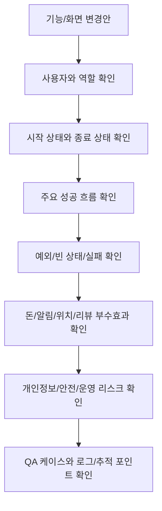
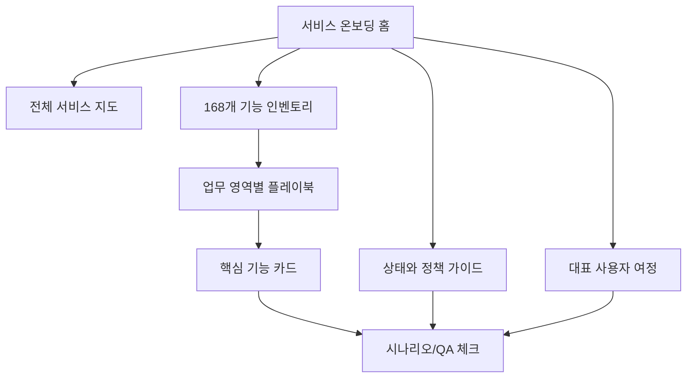
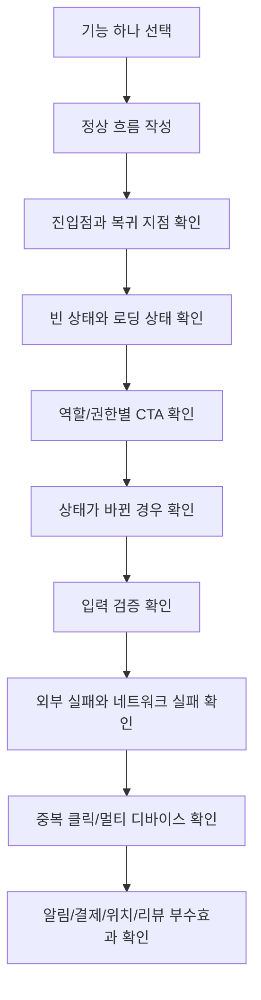

# 기획 QA 정책

<!-- supporting-doc-status: 2026-05-18 -->

> 문서 상태: **보조 문서**. 기능별 현재 계약, source trace, Gap/Risk 판단은 [PRD_MIGRATION_STATUS.md](../PRD_MIGRATION_STATUS.md)와 각 기능 PRD를 우선한다. 이 문서는 인벤토리, 정책, QA, 기획 운영 기준을 보조하며, 기능 세부 판단은 [FEATURE_PRD_STANDARD.md](../FEATURE_PRD_STANDARD.md) 기준으로 재확인한다.

이 문서는 새 화면, 새 정책, 기존 기능 변경을 검토할 때 사용하는 마지막 점검표다. 기능이 많을수록 "주 흐름"은 기억하지만 상태, 돈, 알림, 권한, 개인정보, 외부 실패를 놓치기 쉽다.

## 전체 점검 흐름



## 1. 사용자와 역할

| 체크 | 질문 |
|---|---|
| 주 사용자 | 이 기능을 가장 자주 쓰는 사람은 누구인가 |
| 보조 사용자 | 같은 기능의 결과를 받는 사람은 누구인가 |
| 금지 사용자 | 버튼을 보거나 실행하면 안 되는 사람은 누구인가 |
| 복합 역할 | 호스트이면서 참가자, 클럽 관리자이면서 일반 멤버 같은 경우가 있는가 |
| 비정상 계정 | 차단, 탈퇴 예약, 비활성, 미인증 상태 사용자는 어떻게 되는가 |

## 2. 시작 상태와 종료 상태

| 체크 | 질문 |
|---|---|
| 시작 상태 | 사용자가 이 화면에 들어오기 전에 반드시 만족해야 하는 조건은 무엇인가 |
| 성공 종료 | 성공 후 어떤 상태/화면/데이터가 바뀌는가 |
| 실패 종료 | 실패 후 사용자가 다시 시도할 수 있는가 |
| 중간 이탈 | 입력 중 뒤로가기, 앱 종료, 네트워크 끊김 후 재진입은 어떻게 되는가 |
| 상태 갱신 | 다른 기기나 다른 사용자의 액션으로 상태가 바뀌면 어떻게 반영하는가 |

## 3. 빈 상태와 에러 상태

| 화면 상태 | 반드시 정해야 할 것 |
|---|---|
| 최초 로딩 | 스켈레톤, 스피너, 빈 화면 중 무엇을 쓰는가 |
| 데이터 없음 | 사용자가 다음에 할 수 있는 액션이 있는가 |
| 일부 실패 | 다른 섹션은 보여줄 수 있는가 |
| 전체 실패 | 재시도 버튼이 있는가 |
| 권한 없음 | 로그인 유도, 접근 불가, 이전 화면 복귀 중 무엇인가 |
| 만료/삭제 | 대상이 사라졌거나 만료되었을 때 문구는 무엇인가 |

## 4. 돈이 움직이는 기능

| 체크 | 질문 |
|---|---|
| 잔액 부족 | 충전으로 보낼 것인가, 자동충전을 시도할 것인가 |
| 결제수단 없음 | 결제수단 등록 화면으로 보낼 것인가 |
| 결제 성공 | 거래내역, 잔액, 원래 기능 상태가 모두 갱신되는가 |
| 결제 실패 | 사용자에게 PG 실패인지 잔액 부족인지 구분해서 보이는가 |
| 환불 | 환불 조건, 환불 시점, 환불 금액, 원거래 연결이 명확한가 |
| 중복 결제 | 같은 버튼을 여러 번 누르거나 콜백이 중복 도착해도 안전한가 |
| 정산 | 호스트 돈과 참가자 돈, 클럽 기금이 섞이지 않는가 |

## 5. 알림이 나가는 기능

| 체크 | 질문 |
|---|---|
| 수신자 | 누가 받아야 하는가 |
| 제외자 | 본인에게도 보내는가, 보내지 않는가 |
| 트리거 | 어떤 상태 전이에 알림이 나가는가 |
| 문구 | 사용자가 다음 행동을 바로 이해할 수 있는가 |
| 설정 반영 | 카테고리 꺼짐나 방해금지 시간에 걸리면 어떻게 되는가 |
| 딥링크 | 알림을 눌렀을 때 어디로 가는가 |
| 실패 | 푸시 실패해도 앱 내 알림함에는 남는가 |

## 6. 위치와 개인정보

| 체크 | 질문 |
|---|---|
| 명시적 동의 | 위치, 프로필, 데이터 내보내기, 삭제는 사용자가 명확히 동의했는가 |
| 중지 동선 | 위치 공유, 알림, 노출, 구독을 끄는 경로가 있는가 |
| 보관 기간 | 위치나 데이터 추출 파일은 언제까지 보관되는가 |
| 노출 범위 | 타인에게 보이는 정보와 본인에게만 보이는 정보가 구분되는가 |
| 민감 상태 | 차단, 신고, 신뢰점수, 데이팅 인증 상태가 과도하게 노출되지 않는가 |

## 7. 리뷰, 신고, 신뢰점수

| 체크 | 질문 |
|---|---|
| 작성 자격 | 실제 참석자, 구매자, 매칭 사용자 등 자격을 확인했는가 |
| 중복 방지 | 같은 대상에 여러 번 리뷰/신고할 수 있는가 |
| 수정/삭제 | 작성자가 바꿀 수 있는 범위와 횟수는 무엇인가 |
| 운영 접수 | 신고 후 사용자가 결과를 어떻게 인지하는가 |
| 신뢰 영향 | 리뷰, 노쇼, 신고, 차단이 점수에 반영되는가 |
| 공개/비공개 | 공개 리뷰와 비공개 취향 평가를 구분했는가 |

## 8. 외부 시스템 의존

| 외부 시스템 | 실패 시 확인할 것 |
|---|---|
| 소셜 로그인 앱 연동 모듈 | 사용자가 취소, 토큰 검증 실패, 연동 제공자 오류 |
| 이메일 발송 | 발송 실패, 만료 링크, 재발송 제한 |
| PG/결제 | 결제 중 이탈, 콜백 지연, 중복 콜백, 승인 실패 |
| 푸시 알림 | OS 권한 거부, 토큰 만료, 다중 기기 |
| 지도/지오코딩 | 권한 거부, 시스템 연동 장애, 주소 없음, 외부 지도 앱 미설치 |
| 파일 업로드 | 업로드용 임시 주소 실패, 업로드 실패, 삭제 실패 |

## 9. 중복, 동시성, 멀티 디바이스

| 상황 | 예시 | 검토 포인트 |
|---|---|---|
| 중복 클릭 | 신청 버튼 연타, 결제 버튼 연타 | 버튼 잠금, 멱등 처리, 실패 복구 |
| 동시 상태 변경 | 정원 마지막 자리, 대기열 승격 | 최신 상태 재조회, 안내 문구 |
| 멀티 디바이스 | 한 기기에서 로그아웃, 다른 기기에서 호출 | 토큰/세션 상태 동기화 |
| 관리자와 사용자 동시 액션 | 호스트가 취소하는 중 참가자가 결제 | 우선순위, 환불, 알림 |
| 외부 콜백 지연 | PG 성공 후 앱 복귀 전 서버 처리 지연 | pending 화면, 재조회 |

## 10. 기능별 레드 플래그

| 영역 | 레드 플래그 |
|---|---|
| 인증 | 마지막 로그인 수단 제거, 미인증 사용자 홈 진입, 토큰 갱신 무한 루프 |
| 홈/검색 | 비로그인과 로그인 결과 차이, 부분 실패, 캐시로 오래된 CTA 노출 |
| 이벤트 | 정원/대기열/승인/결제가 한 버튼에 섞이는 경우 |
| 클럽 | 관리자와 소유자 권한 혼동, 차단 시 환불/멤버십 정리 누락 |
| 결제 | 결제 성공과 기능 성공이 분리되는 경우 |
| 정산 | 작성중 상태인데 참가자에게 납부 요청이 보이는 경우 |
| 플랜 | 작성물, 판매상품, 구매 보유물이 섞이는 경우 |
| 데이팅 | 차단 후 채팅/매칭이 남아 있는 경우 |
| 캘린더 | 반복 일정 일부만 삭제하는 UI가 있는데 서버 정책이 단일 삭제인 경우 |
| 리뷰 | 미참석자 리뷰, 자기 신고, 중복 신고 |
| 알림 | 푸시 권한이 없는데 앱 내 알림도 없는 것처럼 보이는 경우 |
| 프로필 | 삭제 예약과 즉시 비활성화 문구 혼동 |
| 위치 | opt-in 없이 위치가 보이거나, opt-out 후 마커가 남는 경우 |

## 11. PRD 작성 전 최종 질문

```text
1. 이 기능은 어느 20개 업무 영역 중 어디에 속하는가?
2. 168개 기능 인벤토리 중 기존 기능의 확장인가, 신규 기능인가?
3. 주 사용자와 금지 사용자는 누구인가?
4. 시작 상태와 성공 종료 상태는 무엇인가?
5. 실패했을 때 사용자는 다음에 무엇을 할 수 있는가?
6. 돈, 알림, 위치, 캘린더, 리뷰/신뢰 중 움직이는 것이 있는가?
7. 빈 상태와 권한 없음 상태를 정의했는가?
8. 외부 시스템 실패를 정의했는가?
9. 중복 클릭과 멀티 디바이스를 정의했는가?
10. QA가 바로 테스트할 수 있는 시나리오 이름을 5개 이상 썼는가?
```

## 12. Notion 운영 권장 구조



처음부터 168개 기능 카드를 모두 상세화할 필요는 없다. 다만 168개 인벤토리는 반드시 유지하고, 실제 PRD나 QA가 시작되는 기능부터 카드 상세를 채우는 방식이 누락을 가장 적게 만든다.

## 시나리오 커버리지 기준

원문에는 기능별 시나리오가 총 1134개 있다. 이 문서는 그 시나리오를 전부 다시 복사하는 대신, 기획자가 새 기능이나 화면을 검토할 때 어떤 종류의 시나리오를 빠뜨리면 안 되는지 검산하는 기준표다.

## 커버리지 원칙

모든 기능 카드는 최소한 다음 8개 범주를 기준으로 검토한다.

| 범주 | 질문 | 예시 |
|---|---|---|
| 정상 흐름 | 사용자가 기대한 대로 성공하는가 | 회원가입 완료, 이벤트 신청 성공, 정산 납부 완료 |
| 진입/복귀 | 어디서 들어오고 어디로 돌아가는가 | 홈 카드, 알림 딥링크, 백버튼 복귀 |
| 빈 상태 | 데이터가 없을 때 자연스러운가 | 리뷰 없음, 검색 결과 없음, 등록 기기 없음 |
| 권한/역할 | 이 사용자가 이 액션을 할 수 있는가 | 비호스트 정산 생성 차단, 타인 리뷰 수정 차단 |
| 상태 불일치 | 화면을 보는 사이 상태가 바뀌면? | 정원 마감, 이미 취소된 이벤트, 만료된 토큰 |
| 입력 검증 | 값이 부족하거나 잘못되면? | 비밀번호 약함, 금액 범위 초과, 시간 역전 |
| 실패/복구 | 네트워크나 외부 시스템이 실패하면? | PG 실패, SMTP 실패, 지도 시스템 연동 장애 |
| 중복/동시성 | 같은 액션을 반복하거나 여러 기기에서 하면? | 중복 신청, 토큰 동시 갱신, 일괄 승인 충돌 |

## 시나리오 검산 흐름



## 단위별 시나리오 수

| 영역 | 기능 수 | 시나리오 수 | 기능당 평균 | 보강 시 우선 확인할 시나리오 |
|---|---:|---:|---:|---|
| 01 인증 & 온보딩 | 8 | 82 | 10.3 | 토큰, 메일, 소셜 앱 연동 모듈, 계정 상태 |
| 02 홈 피드 | 5 | 38 | 7.6 | 부분 실패, 캐시, 비로그인, 카드 라우팅 |
| 03 이벤트 | 12 | 111 | 9.3 | 정원, 승인, 유료 승인제, 결제, 대기열, 체크인 |
| 04 클럽 | 16 | 189 | 11.8 | 권한, 멤버십, 게시판, 기금, 구독 |
| 05 검색 | 5 | 41 | 8.2 | 입력 전/입력 중/결과, 필터, 기록 |
| 06 결제 & 지갑 | 10 | 71 | 7.1 | PG 실패, 잔액 부족, 유료 승인제 승인 후 결제, 환불, 자동충전 |
| 07 모임 정산 | 10 | 84 | 8.4 | 작성중/진행중, 납부, 이체 확인, 이의 |
| 08 플랜 마켓 | 13 | 107 | 8.2 | 초안/발행, 구매 중복, 컬렉션, 리뷰 |
| 09 프라이빗 데이팅 | 8 | 70 | 8.8 | 인증, 매칭, 채팅, 만남, 차단 |
| 10 캘린더 | 5 | 40 | 8.0 | 라우팅, 반복, 충돌, 공개 범위 |
| 11 리뷰 & 신고 | 6 | 39 | 6.5 | 작성 자격, 중복, 자기 신고, 신뢰점수 |
| 12 알림 | 6 | 38 | 6.3 | 권한, 카테고리, 방해금지, 토큰 |
| 13 프로필 & 설정 | 7 | 35 | 5.0 | 데이터 내보내기, 삭제/비활성화, 주소 |
| 14 위치 & 길찾기 | 6 | 42 | 7.0 | opt-in/out, 위치 권한, 외부 지도 |

## 단위별 필수 시나리오 범주

| 영역 | 정상 | 빈 상태 | 권한 | 상태 변화 | 입력 검증 | 외부 실패 | 중복/동시성 | 부수효과 |
|---|:-:|:-:|:-:|:-:|:-:|:-:|:-:|:-:|
| 01 인증 & 온보딩 | O | O | O | O | O | O | O | O |
| 02 홈 피드 | O | O | O | O |  | O | O | O |
| 03 이벤트 | O | O | O | O | O | O | O | O |
| 04 클럽 | O | O | O | O | O | O | O | O |
| 05 검색 | O | O | O | O | O | O | O | O |
| 06 결제 & 지갑 | O | O | O | O | O | O | O | O |
| 07 모임 정산 | O | O | O | O | O | O | O | O |
| 08 플랜 마켓 | O | O | O | O | O | O | O | O |
| 09 프라이빗 데이팅 | O | O | O | O | O | O | O | O |
| 10 캘린더 | O | O | O | O | O | O | O | O |
| 11 리뷰 & 신고 | O | O | O | O | O | O | O | O |
| 12 알림 | O | O | O | O | O | O | O | O |
| 13 프로필 & 설정 | O | O | O | O | O | O | O | O |
| 14 위치 & 길찾기 | O | O | O | O | O | O | O | O |

## 핵심 여정별 빠뜨리기 쉬운 시나리오

### 가입/인증

| 시나리오 | 왜 중요한가 |
|---|---|
| 이메일 인증 전 로그인 | 사용자는 가입했다고 생각하지만 서비스 진입이 막힐 수 있음 |
| 인증 메일 재발송 제한 | 스팸/남용 방지와 UX 대기 안내가 함께 필요 |
| 소셜 가입 후 추가정보 미입력 이탈 | 가입은 됐지만 추천 불가능 상태가 될 수 있음 |
| 토큰 만료 중 여러 요청 동시 발생 | 사용자가 갑자기 로그아웃되는 것처럼 보일 수 있음 |
| 마지막 로그인 수단 해제 시도 | 계정 잠김을 막아야 함 |

### 이벤트/클럽 참여

| 시나리오 | 왜 중요한가 |
|---|---|
| 정원이 찬 직후 신청 | 리스트에서는 가능해 보였지만 상세에서는 실패할 수 있음 |
| 대기열 자동 승격 | 사용자 행동 없이 상태가 바뀌므로 알림과 CTA 갱신이 필요 |
| 호스트가 자기 이벤트에 신청 | 권한상 막아야 하며 메시지가 명확해야 함 |
| 이벤트 취소 후 유료 참가자 환불 | 돈과 알림이 동시에 움직임 |
| 유료 승인제 이벤트의 승인 후 결제 | 승인, 정원 예약, 결제, 참석 확정이 분리됨 |
| 클럽 멤버 추방/차단 | 게시글, 이벤트, 구독, 환불까지 영향 가능 |

### 결제/정산

| 시나리오 | 왜 중요한가 |
|---|---|
| 결제수단 등록 후 PG 콜백 실패 | 사용자는 완료했다고 생각할 수 있음 |
| 자동충전 실패 후 원래 결제 실패 | 실패 원인을 두 단계로 설명해야 함 |
| 승인제 유료 이벤트에서 미승인 사용자가 결제 시도 | 돈을 먼저 받으면 거절/환불 리스크가 생김 |
| 정산 활성화 전 항목 부족 | 참가자에게 잘못된 납부 요청을 보내면 안 됨 |
| 계좌이체 후 호스트 미확인 | 참가자는 냈다고 생각하지만 시스템은 미완료일 수 있음 |
| 이의제기 수락/기각 | 금액, 상태, 알림, 감사로그가 함께 바뀜 |

### 데이팅/위치/안전

| 시나리오 | 왜 중요한가 |
|---|---|
| 미인증 사용자의 데이팅 진입 | 안전 신뢰의 출발점 |
| 상호 좋아요 직후 한쪽이 차단 | 매칭/채팅 상태 cascade가 필요 |
| 만남 제안 후 일정/장소 변경 | 캘린더와 위치 안내에 영향 |
| 위치 권한 영구 거부 | 앱 안 CTA만으로 해결되지 않고 OS 설정이 필요 |
| 위치 공유 자동 만료 | 사용자가 계속 보인다고 오해하지 않게 해야 함 |

### 리뷰/신고/신뢰

| 시나리오 | 왜 중요한가 |
|---|---|
| 미참석자의 리뷰 작성 | 평판 조작을 막아야 함 |
| 중복 리뷰/중복 신고 | 운영 큐와 점수 왜곡 방지 |
| 본인 신고 | 악용과 오류를 막아야 함 |
| 리뷰 수정/삭제 후 신뢰점수 | 점수가 언제 재계산되는지 명확해야 함 |
| 데이터 부족한 취향 프로필 | 빈 차트보다 설명 있는 빈 상태가 필요 |

## 기능 카드 작성 전 체크

```text
기능 ID:
기능명:

[ ] 정상 성공 흐름이 있다.
[ ] 사용자가 들어오는 진입점이 2개 이상이면 모두 적었다.
[ ] 빈 상태, 로딩, 전체 실패, 부분 실패를 구분했다.
[ ] 비로그인/로그인/소유자/관리자/대상자 권한이 구분됐다.
[ ] 상태가 화면 진입 후 바뀌는 경우를 적었다.
[ ] 입력값 범위와 필수값을 적었다.
[ ] 외부 시스템 실패를 적었다.
[ ] 중복 클릭, 재시도, 멀티 디바이스를 적었다.
[ ] 돈, 알림, 캘린더, 위치, 리뷰/신뢰 영향이 있는지 확인했다.
```
