# 상태 정책 PRD

<!-- supporting-doc-status: 2026-05-22 -->

> 문서 상태: **보조 문서 + W2/W3 event_payment 상태머신 + APPROVED_PENDING_PAYMENT 진입 조건 통합 (2026-05-22)**. 기능별 현재 계약, source trace, Gap/Risk 판단은 [PRD_MIGRATION_STATUS.md](../PRD_MIGRATION_STATUS.md)와 각 기능 PRD를 우선한다. 이 문서는 인벤토리, 정책, QA, 기획 운영 기준을 보조하며, 기능 세부 판단은 [FEATURE_PRD_STANDARD.md](../FEATURE_PRD_STANDARD.md) 기준으로 재확인한다.

이 문서는 화면 설명보다 상태 판단이 중요한 기능만 모은다. 기획자가 버튼 노출, 문구, 알림, 예외 처리를 결정할 때 먼저 확인해야 하는 문서다.

## 1. 이벤트 상태

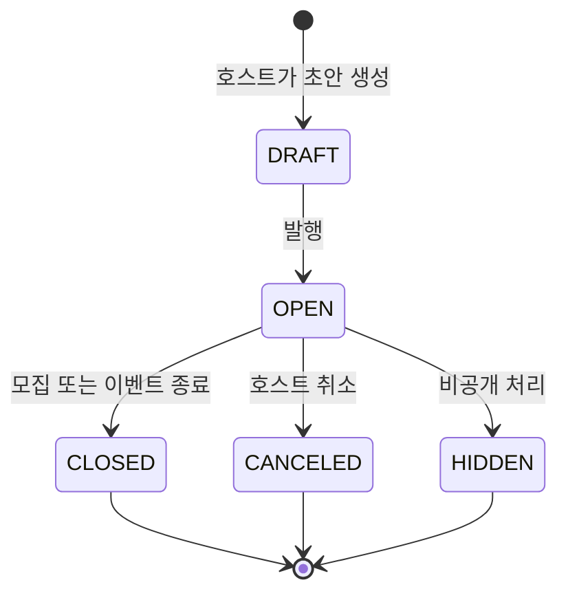
```mermaid
stateDiagram-v2
    [*] --> DRAFT: 호스트가 초안 생성
    DRAFT --> OPEN: 발행
    OPEN --> CLOSED: 모집 또는 이벤트 종료
    OPEN --> CANCELED: 호스트 취소
    OPEN --> HIDDEN: 비공개 처리
    CLOSED --> [*]
    CANCELED --> [*]
    HIDDEN --> [*]
```

| 상태 | 사용자에게 보이는 의미 | 주요 허용 액션 |
|---|---|---|
| `DRAFT` | 아직 공개되지 않은 작성중 이벤트 | 호스트 편집, 발행 |
| `OPEN` | 모집 또는 참여 가능한 이벤트 | 참가자 신청/취소, 호스트 운영 |
| `CLOSED` | 모집 또는 이벤트가 종료된 상태 | 리뷰, 사진첩, 정산 등 후속 흐름 |
| `CANCELED` | 취소된 이벤트 | 취소 안내, 환불/알림 후속 처리 |
| `HIDDEN` | 일반 노출에서 제외된 이벤트 | 관리자/호스트 정책에 따름 |

## 2. 이벤트 신청과 참석 상태

이벤트에는 "신청 심사"와 "참석 확정/대기"가 함께 존재할 수 있다.

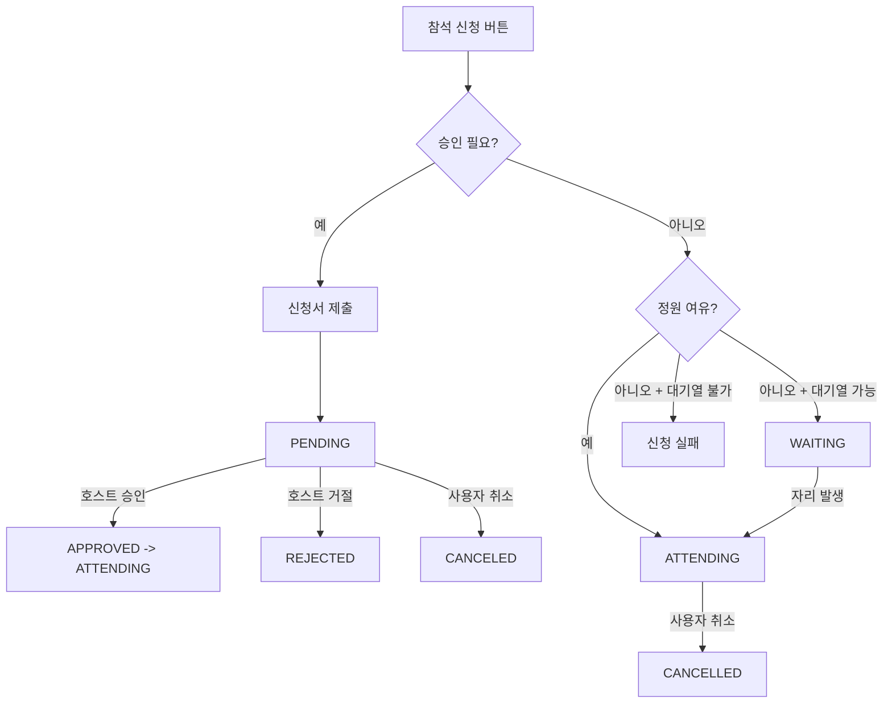
```mermaid
flowchart TD
    A["참석 신청 버튼"] --> B{"승인 필요?"}
    B -->|"예"| C["신청서 제출"]
    C --> D["PENDING"]
    D -->|"호스트 승인"| E["APPROVED -> ATTENDING"]
    D -->|"호스트 거절"| F["REJECTED"]
    D -->|"사용자 취소"| G["CANCELED"]

    B -->|"아니오"| H{"정원 여유?"}
    H -->|"예"| I["ATTENDING"]
    H -->|"아니오 + 대기열 가능"| J["WAITING"]
    H -->|"아니오 + 대기열 불가"| K["신청 실패"]
    J -->|"자리 발생"| I
    I -->|"사용자 취소"| L["CANCELLED"]
```

| 구분 | 상태 | 의미 |
|---|---|---|
| 신청서 | `PENDING` | 호스트 검토 전 |
| 신청서 | `APPROVED` | 신청 승인 |
| 신청서 | `REJECTED` | 신청 거절 |
| 신청서 | `CANCELED` | 신청자가 취소 |
| 참석 | `ATTENDING` | 참석 확정 |
| 참석 | `WAITING` | 대기열에 있음 |
| 참석 | `CANCELLED` | 참석이 취소됨 |

기획 주의점:

- `CANCELED`와 `CANCELLED`가 함께 등장한다. 신청서 상태는 `CANCELED`, 참석 상태는 `CANCELLED`로 다룬다.
- 사용자는 "신청 완료", "심사중", "대기중", "참석 확정"을 구분해서 봐야 한다.
- 대기열 승격은 사용자 행동 없이 시스템이 바꿀 수 있으므로 알림이 필요하다.
- 유료 승인제 이벤트는 "승인됨"과 "참석 확정"이 다르다. 승인 후 결제 대기 상태를 별도 표시하고, 결제 성공 후에만 참석 확정으로 보아야 한다.

### 유료 승인제 권장 상태

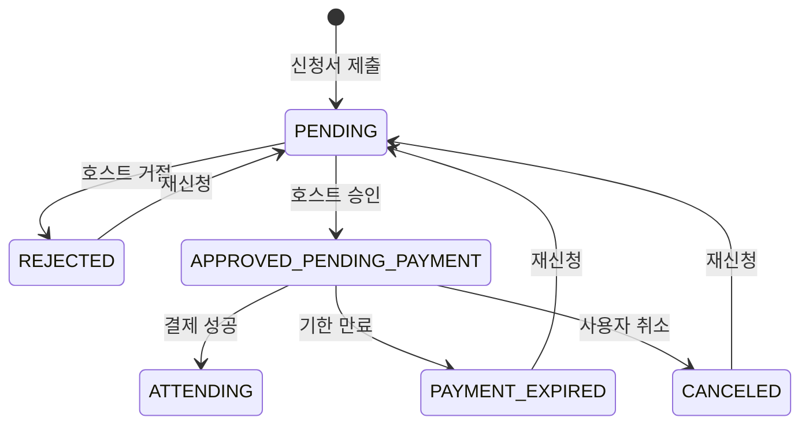
```mermaid
stateDiagram-v2
    [*] --> PENDING: 신청서 제출
    PENDING --> REJECTED: 호스트 거절
    PENDING --> APPROVED_PENDING_PAYMENT: 호스트 승인
    APPROVED_PENDING_PAYMENT --> ATTENDING: 결제 성공
    APPROVED_PENDING_PAYMENT --> PAYMENT_EXPIRED: 기한 만료
    APPROVED_PENDING_PAYMENT --> CANCELED: 사용자 취소
    REJECTED --> PENDING: 재신청
    PAYMENT_EXPIRED --> PENDING: 재신청
    CANCELED --> PENDING: 재신청
```

| 상태 | 의미 | 허용 액션 |
|---|---|---|
| `APPROVED_PENDING_PAYMENT` | 호스트는 승인했지만 결제 전 | 참가자 결제, 사용자 취소, 기한 만료 |
| `PAYMENT_EXPIRED` | 승인 후 결제 기한 만료 | 재신청, 상세 안내 |
| `ATTENDING` | 결제까지 완료된 참석 확정 | 취소/환불, 체크인, 위치 공유, 리뷰 |

> **2026-05-22 W2 갱신**: 서버 enum `ApplicationStatus.APPROVED_PENDING_PAYMENT, PAYMENT_EXPIRED`가 추가되었다. 단, 본 정책은 **선입금 활성 이벤트(`EventPrepayment.prepaymentRequired=true`)에 한해서만 적용된다**. 선입금 미활성 유료 이벤트(legacy `event.price > 0 && !prepaymentRequired`)는 기존 PENDING → APPROVED + ATTENDING 흐름 그대로 유지되며 후속 보강 대상이다.

### 2.1 `APPROVED_PENDING_PAYMENT` 진입 조건 명문화 (W2)

`ApplicationStatus.APPROVED_PENDING_PAYMENT`는 다음 두 진입점에서만 발생한다(F03-05 §2.0).

| 진입점 | 조건 | 동작 |
|---|---|---|
| `ApplicationService.apply` | `EventPrepayment.prepaymentRequired=true` + `approvalRequired=false` (자동 승인 + 선입금 활성) | `Application.status=APPROVED_PENDING_PAYMENT + paymentDueAt=now()+(policy.paymentDeadlineHours \|\| 24h)`. capacity 미점유(D4). 알림 71 (after-commit) |
| `ApplicationService.approveApplication` | `EventPrepayment.prepaymentRequired=true` + 호스트가 `PENDING` application을 승인 | 동일하게 `APPROVED_PENDING_PAYMENT + paymentDueAt` 전이. `ApplicationApprovedEvent` 미발행 — 캘린더 sync는 결제 확정 시점에 1회만 |

진입 후 허용 액션:

| 액션 | 결과 상태 |
|---|---|
| 참가자 WALLET 결제 성공 | `APPROVED + ATTENDING + capacity++ + event_payment.PAID` |
| 참가자 BANK_TRANSFER 신고 → 호스트 확인 | 동일 (분개 없음, D5) |
| 참가자 자가 취소 (`DELETE .../apply`) | `event_payment` 상태별 분기(F03-05 §2.6), 종료 상태는 `Application=CANCELED` 또는 `REFUND_REQUESTED 진행` |
| `paymentDueAt < now()` 스케줄러 트리거 | `Application=PAYMENT_EXPIRED`, `event_payment(PENDING→CANCELED)`. capacity 변화 없음 |
| 호스트 이벤트 취소 (`EventService.cancelEvent`) | facade가 결제 상태별 환불 진행 후 `Application=CANCELED` |

`PAYMENT_EXPIRED` 재신청은 active `event_payment` 행이 없을 때만 허용. 있으면 `PAYMENT_PENDING` 에러.

### 2.2 `event_payment` 상태머신 (W2 신규)

선입금 결제는 별도 row(`event_payment`, application당 active 1건, D6)로 추적된다. 본 상태머신은 `Application` 상태와 1:0..1로 결합되며, 두 상태를 함께 봐야 사용자에게 정확한 액션바를 표시할 수 있다.

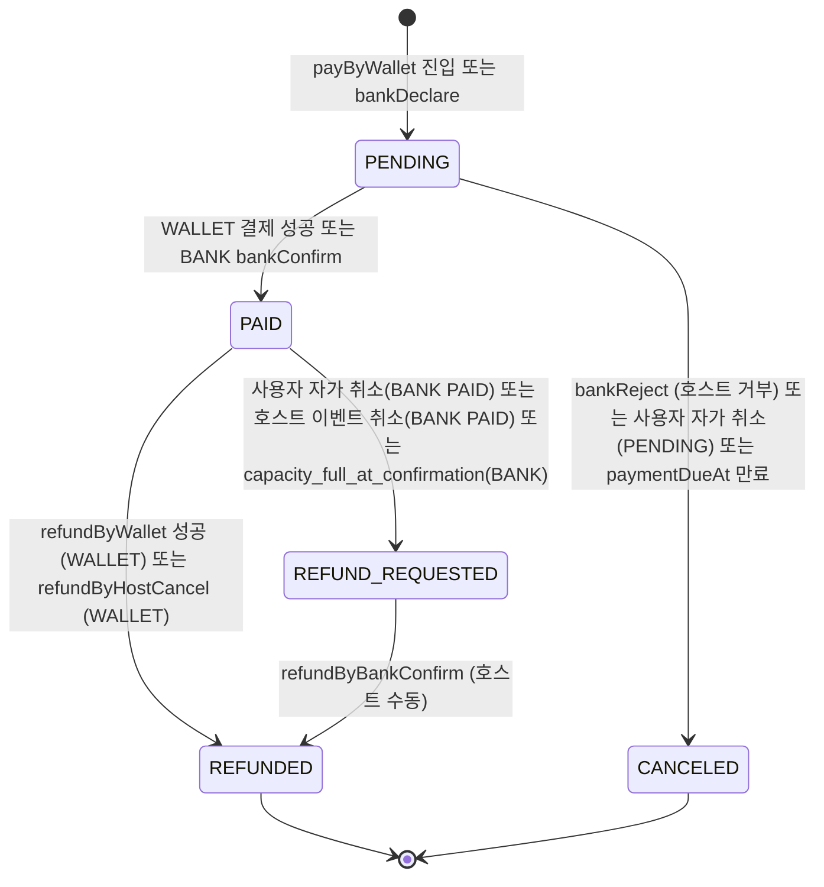
```mermaid
stateDiagram-v2
    [*] --> PENDING: payByWallet 진입 또는 bankDeclare
    PENDING --> PAID: WALLET 결제 성공 또는 BANK bankConfirm
    PENDING --> CANCELED: bankReject (호스트 거부) 또는 사용자 자가 취소(PENDING) 또는 paymentDueAt 만료
    PAID --> REFUND_REQUESTED: 사용자 자가 취소(BANK PAID) 또는 호스트 이벤트 취소(BANK PAID) 또는 capacity_full_at_confirmation(BANK)
    PAID --> REFUNDED: refundByWallet 성공 (WALLET) 또는 refundByHostCancel (WALLET)
    REFUND_REQUESTED --> REFUNDED: refundByBankConfirm (호스트 수동)
    REFUNDED --> [*]
    CANCELED --> [*]
```

| 상태 | 의미 | 분개 영향 | UI 라벨 |
|---|---|---|---|
| `PENDING` | 결제 시도 중 또는 BANK 입금 신고 후 호스트 확인 대기 | 분개 없음 | "결제 대기 중" / "입금 확인 대기 중" |
| `PAID` | 결제 완료 | WALLET → `recordPayment` 분개 1건. BANK → 분개 없음(D5) | "결제 완료" — 액션바는 "참석 확정" |
| `REFUND_REQUESTED` | 환불 진행 필요 (BANK 사용자 취소 또는 호스트 이벤트 취소 또는 capacity full) | WALLET 환불 시점에 분개. BANK는 분개 없음 | "환불 요청됨 — 호스트 처리 대기" |
| `REFUNDED` | 환불 완료 | WALLET 환불 분개(`recordRefund`). BANK는 분개 없음 | "환불 완료" |
| `CANCELED` | 결제 미진행 종료 (PENDING에서 호스트 거부 / 만료 / 사용자 취소) | 분개 없음 | "결제 취소됨 — 재시도 가능" |

상태 전이는 다음 가드를 따른다:

- `event` row 잠금 → `application` row 잠금 → `event_payment` row 잠금 순서(§0.4) 필수
- `Event.status=OPEN`만 결제·BANK 확인 허용. `CANCELED`는 모든 결제 facade 차단. `CLOSED`는 BANK 거부만 허용(이벤트 종료 후에도 입금 미확인 가능).
- `Application.status=APPROVED_PENDING_PAYMENT`만 결제 진입 허용.
- `active_application_id` STORED + UNIQUE로 PENDING/PAID/REFUND_REQUESTED 동시 1건만 허용 (D6).

기획 주의점:

- 사용자 화면에는 `Application.status` 단독이 아니라 `event_payment.status`와 결합한 라벨이 필요하다. 예: `Application=APPROVED_PENDING_PAYMENT` + `event_payment=PENDING(BANK_TRANSFER)`는 "입금 확인 대기"로, 같은 application에 결제 row가 없으면 "결제 필요"로 표시한다.
- 호스트 화면(`host_participation_payment_pending_screen.dart`)은 `event_payment.status=PENDING(BANK_TRANSFER)`만 노출한다. confirm 응답이 `REFUND_REQUESTED`로 오면 capacity 초과 → 환불 안내 라벨로 전환.
- `REFUNDED → [*]` 종료 후에는 `active_application_id`가 NULL이 되어 같은 application에 신규 PENDING 진입이 다시 가능하다. 단, `Application` 자체가 `CANCELED`로 전이된 경우는 신규 신청이 필요.

## 3. 프라이빗 모임 단계

프라이빗 이벤트는 일반 이벤트와 별도 단계가 있다.

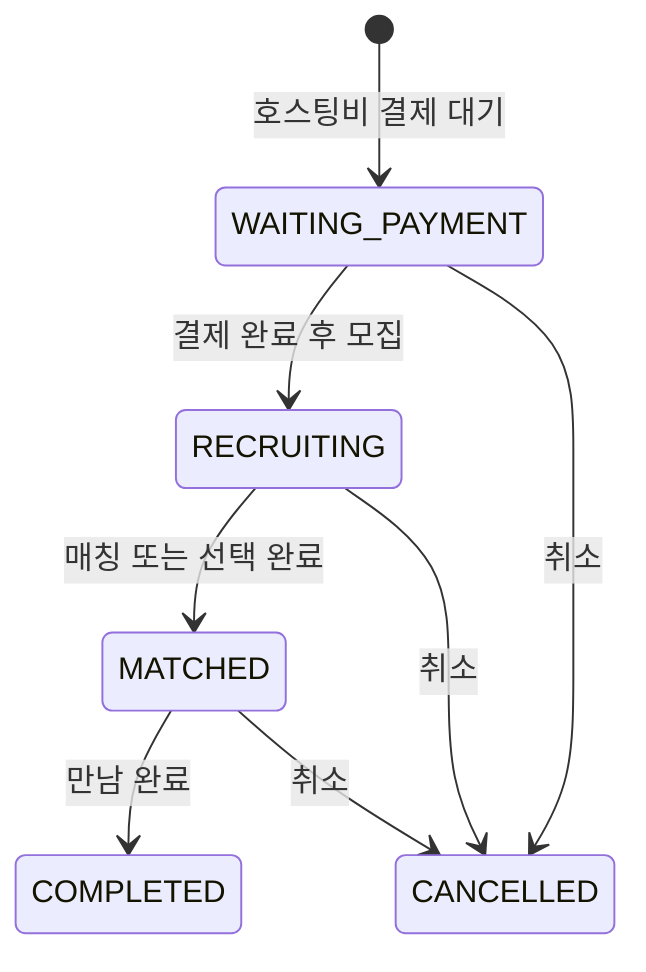
```mermaid
stateDiagram-v2
    [*] --> WAITING_PAYMENT: 호스팅비 결제 대기
    WAITING_PAYMENT --> RECRUITING: 결제 완료 후 모집
    RECRUITING --> MATCHED: 매칭 또는 선택 완료
    MATCHED --> COMPLETED: 만남 완료
    WAITING_PAYMENT --> CANCELLED: 취소
    RECRUITING --> CANCELLED: 취소
    MATCHED --> CANCELLED: 취소
```

기획 주의점:

| 단계 | 확인할 것 |
|---|---|
| 결제 대기 | 결제 실패/이탈 시 재진입 문구 |
| 모집중 | 신청자 노출, 선택 기준, 마감 기준 |
| 매칭됨 | 상대에게 어떤 정보가 공개되는지 |
| 완료 | 리뷰, 신고, 신뢰점수와의 연결 |

## 4. 모임 정산 상태

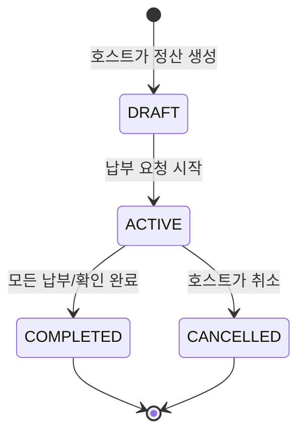
```mermaid
stateDiagram-v2
    [*] --> DRAFT: 호스트가 정산 생성
    DRAFT --> ACTIVE: 납부 요청 시작
    ACTIVE --> COMPLETED: 모든 납부/확인 완료
    ACTIVE --> CANCELLED: 호스트가 취소
    COMPLETED --> [*]
    CANCELLED --> [*]
```

| 상태 | 사용자에게 보이는 의미 | 호스트 액션 | 참가자 액션 |
|---|---|---|---|
| `DRAFT` | 호스트가 작성 중인 정산 — 참가자에게는 **미리보기**로 보인다 | 항목 편집, 참여자 조정, 활성화 | 미리보기 조회만(총액·상태·내 분담금) — 항목 상세·영수증·타인 몫 비공개, 납부·이의제기 불가, 알림 없음 (2026-06-05 정식화) |
| `ACTIVE` | 납부 진행중 | 독촉, 마감 연장, 이체 확인, 취소 | 분담금 확인, 납부, 이의제기 |
| `COMPLETED` | 정산 완료 | 내역 조회 | 내역 조회 |
| `CANCELLED` | 정산 취소 | 내역 조회 | 환불/취소 안내 확인 |

기획 주의점:

- 정산 생성만으로 참가자에게 알림이 가면 안 된다. 일반적으로 진행중 전환 시 납부 알림이 의미 있다.
- 포인트 납부는 즉시 반영되지만, 계좌이체는 호스트 확인이 필요하다.
- 이의제기와 감사로그는 돈의 분쟁을 줄이기 위한 장치다.

## 5. 호스트 정산금 상태

호스트가 받을 수익/정산금은 모임 정산과 별개로 다음 흐름을 가진다.

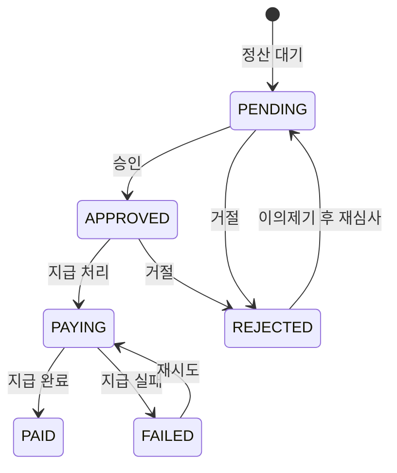
```mermaid
stateDiagram-v2
    [*] --> PENDING: 정산 대기
    PENDING --> APPROVED: 승인
    APPROVED --> PAYING: 지급 처리
    PAYING --> PAID: 지급 완료
    PAYING --> FAILED: 지급 실패
    FAILED --> PAYING: 재시도
    PENDING --> REJECTED: 거절
    APPROVED --> REJECTED: 거절
    REJECTED --> PENDING: 이의제기 후 재심사
```

| 상태 | 의미 | 사용자 액션 |
|---|---|---|
| `PENDING` | 검토 또는 대기 중 | 기다림 |
| `APPROVED` | 지급 승인됨 | 상태 확인 |
| `PAYING` | 실제 지급 처리 중 | 상태 확인 |
| `PAID` | 지급 완료 | 상세/영수 확인 |
| `FAILED` | 지급 실패 | 재시도 또는 고객센터 |
| `REJECTED` | 지급 거절 | 이의제기 가능 |

## 6. 플랜과 마켓 상품 상태

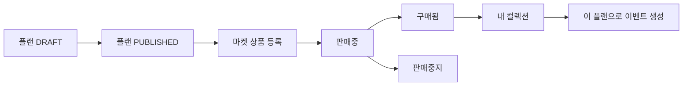
```mermaid
flowchart LR
    A["플랜 DRAFT"] --> B["플랜 PUBLISHED"]
    B --> C["마켓 상품 등록"]
    C --> D["판매중"]
    D --> E["구매됨"]
    D --> F["판매중지"]
    E --> G["내 컬렉션"]
    G --> H["이 플랜으로 이벤트 생성"]
```

기획 주의점:

- 플랜 초안은 크리에이터의 편집 대상이고, 마켓 상품은 구매자의 구매 대상이다.
- 구매자는 구매 후 컬렉션에서 활용한다.
- 이미 구매한 상품, 일부 중복 번들, 잔액 부족은 구매 바텀시트에서 명확히 분기해야 한다.

## 7. 데이터 내보내기와 계정 삭제

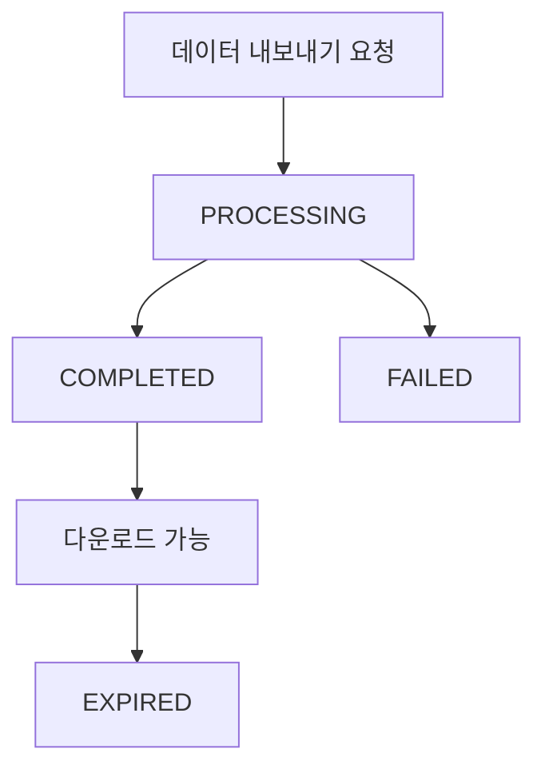
```mermaid
flowchart TD
    A["데이터 내보내기 요청"] --> B["PROCESSING"]
    B --> C["COMPLETED"]
    B --> D["FAILED"]
    C --> E["다운로드 가능"]
    E --> F["EXPIRED"]
```

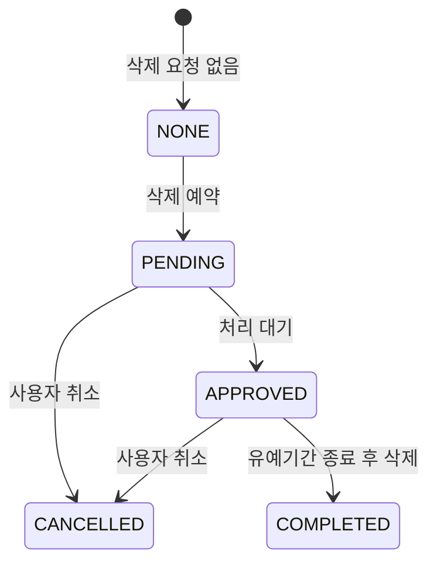
```mermaid
stateDiagram-v2
    [*] --> NONE: 삭제 요청 없음
    NONE --> PENDING: 삭제 예약
    PENDING --> APPROVED: 처리 대기
    PENDING --> CANCELLED: 사용자 취소
    APPROVED --> CANCELLED: 사용자 취소
    APPROVED --> COMPLETED: 유예기간 종료 후 삭제
```

기획 주의점:

- 데이터 내보내기는 즉시 파일을 주는 기능이 아니라 비동기 요청이다.
- 계정 삭제 예약은 유예기간과 취소 동선이 중요하다.
- 즉시 비활성화는 삭제 예약과 사용자 영향이 다르므로 별도 문구가 필요하다.

## 8. 위치 공유 상태

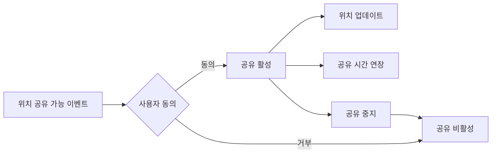
```mermaid
flowchart LR
    A["위치 공유 가능 이벤트"] --> B{"사용자 동의"}
    B -->|"동의"| C["공유 활성"]
    B -->|"거부"| D["공유 비활성"]
    C --> E["위치 업데이트"]
    C --> F["공유 시간 연장"]
    C --> G["공유 중지"]
    G --> D
```

기획 주의점:

- 위치 공유는 항상 opt-in으로 다뤄야 한다.
- 중지 버튼과 프라이버시 대시보드가 함께 있어야 사용자가 통제권을 가진다.
- 이벤트 종료 후 위치 데이터 보관/삭제 정책을 화면 문구와 맞춰야 한다.

## 9. 알림 수신 정책

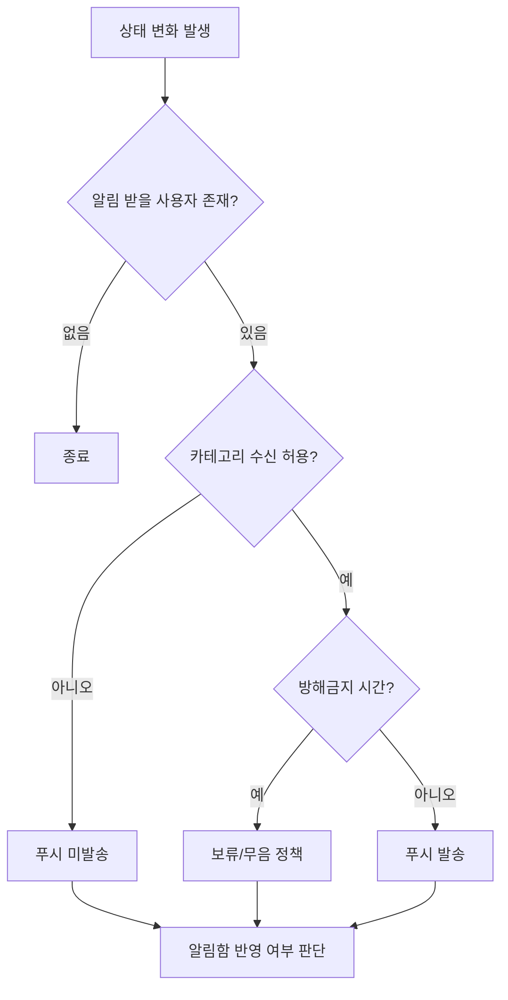
```mermaid
flowchart TD
    A["상태 변화 발생"] --> B{"알림 받을 사용자 존재?"}
    B -->|"없음"| C["종료"]
    B -->|"있음"| D{"카테고리 수신 허용?"}
    D -->|"아니오"| E["푸시 미발송"]
    D -->|"예"| F{"방해금지 시간?"}
    F -->|"예"| G["보류/무음 정책"]
    F -->|"아니오"| H["푸시 발송"]
    E --> I["알림함 반영 여부 판단"]
    G --> I
    H --> I
```

기획 주의점:

- 알림은 "무엇을 보낼까"보다 "누가 받아야 하는가"가 먼저다.
- 결제/정산 알림은 마케팅 알림보다 중요도가 높다.
- OS 권한 거부 상태에서는 인앱 알림함과 권한 회복 배너를 함께 고려해야 한다.

## PRD 수용 기준

- 모든 상태 전이는 사용자에게 보이는 문구, 허용 액션, 알림 여부가 함께 정의되어야 한다.
- 상태 변경 후 이전 화면의 CTA가 오래된 상태를 보여주지 않아야 한다.
- 취소, 만료, 삭제, 차단 상태는 성공 상태와 별도의 복구 동선을 가져야 한다.

## 10. v4.5 W1~W7 신규 상태머신 (2026-05-22)

> updated: 2026-05-22. 본 절은 `docs/plan/event-extensions/PLAN.md` v4.5의 W2~W7에서 도입되는 신규 상태머신과 기존 Application 상태머신의 확장을 추적한다. 본문 §2(이벤트 신청과 참석 상태)의 "유료 승인제 권장 상태"는 v4.5에서 정식 enum으로 반영되며, 본 절이 그 enforcement를 명문화한다.

### 10.1 Application 상태머신 확장 — APPROVED_PENDING_PAYMENT / PAYMENT_EXPIRED 정식화

기존 §2.유료 승인제 권장 상태에서 "현재 서버 enum에는 `APPROVED_PENDING_PAYMENT`, `PAYMENT_EXPIRED`가 없다"고 표시한 항목이 v4.5 W2a에서 enum 정식 추가된다.

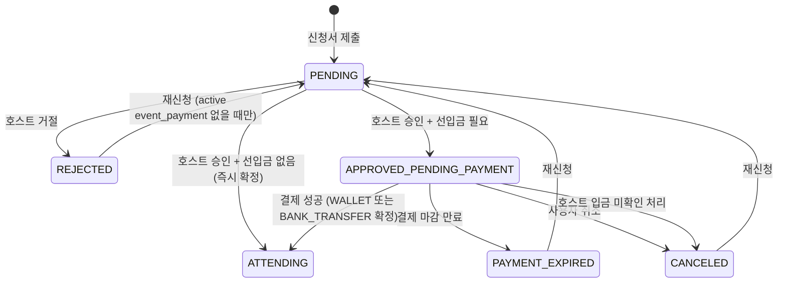
```mermaid
stateDiagram-v2
    [*] --> PENDING: 신청서 제출
    PENDING --> REJECTED: 호스트 거절
    PENDING --> APPROVED_PENDING_PAYMENT: 호스트 승인 + 선입금 필요
    PENDING --> ATTENDING: 호스트 승인 + 선입금 없음 (즉시 확정)
    APPROVED_PENDING_PAYMENT --> ATTENDING: 결제 성공 (WALLET 또는 BANK_TRANSFER 확정)
    APPROVED_PENDING_PAYMENT --> PAYMENT_EXPIRED: 결제 마감 만료
    APPROVED_PENDING_PAYMENT --> CANCELED: 사용자 취소
    APPROVED_PENDING_PAYMENT --> CANCELED: 호스트 입금 미확인 처리
    REJECTED --> PENDING: 재신청 (active event_payment 없을 때만)
    PAYMENT_EXPIRED --> PENDING: 재신청
    CANCELED --> PENDING: 재신청
```

| 상태 | 의미 | 허용 액션 | 관련 event_payment 상태 |
|---|---|---|---|
| `APPROVED_PENDING_PAYMENT` | 호스트 승인 + 결제 대기 (정원 점유 없음 — D4) | 참가자 결제, 사용자 취소, 만료, 호스트 거절 | PENDING |
| `PAYMENT_EXPIRED` | 결제 마감 시간 지남 | 재신청 가능 | CANCELED (만료 스케줄러) |
| `ATTENDING` | 결제까지 완료된 참석 확정 (정원 점유) | 취소/환불(REFUND_REQUESTED), 체크인 | PAID |

재신청 게이트: `PAYMENT_EXPIRED → PENDING` 전이는 **active event_payment가 없을 때만** 허용 (orphan payment 방지).

### 10.2 event_payment 상태머신 (신규 — W2a/W2b/W3)

선입금 결제 라이프사이클의 단일 진실 테이블. application과 1:1 적극 대응 (uk_event_payment_active).

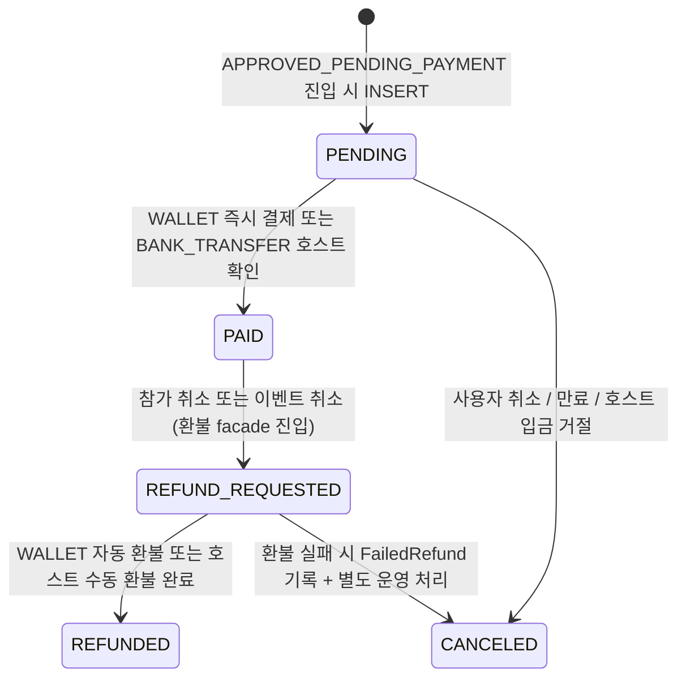
```mermaid
stateDiagram-v2
    [*] --> PENDING: APPROVED_PENDING_PAYMENT 진입 시 INSERT
    PENDING --> PAID: WALLET 즉시 결제 또는 BANK_TRANSFER 호스트 확인
    PENDING --> CANCELED: 사용자 취소 / 만료 / 호스트 입금 거절
    PAID --> REFUND_REQUESTED: 참가 취소 또는 이벤트 취소 (환불 facade 진입)
    REFUND_REQUESTED --> REFUNDED: WALLET 자동 환불 또는 호스트 수동 환불 완료
    REFUND_REQUESTED --> CANCELED: 환불 실패 시 FailedRefund 기록 + 별도 운영 처리
```

| 상태 | 의미 | application 영향 | 알림 |
|---|---|---|---|
| `PENDING` | 결제 대기 (active 1건 제약) | APPROVED_PENDING_PAYMENT 유지 | 71 EVENT_PREPAYMENT_REQUIRED |
| `PAID` | 결제 완료 | ATTENDING으로 전이 | 73 (BANK 확인 시) |
| `REFUND_REQUESTED` | 환불 진행 중 | (별도) | 83 (BANK일 때 호스트에게) |
| `REFUNDED` | 환불 완료 | (별도) | 76 EVENT_PREPAYMENT_REFUNDED |
| `CANCELED` | 결제 안 됨 / 거절 / 만료 | PAYMENT_EXPIRED/CANCELED 등 | 74/75 |

**Lock 순서**: 모든 결제·환불·취소 facade는 `event → application → event_payment` 순으로 PESSIMISTIC_WRITE 잠금 (PLAN §0.4 — 전역 deadlock 방지).

**회계 분개**: WALLET 결제는 `AccountingLedgerService`로 즉시 분개. BANK_TRANSFER는 호스트 확인 시점에만 분개. 환불은 별도 라인 (D5). 호스트 정산 보고서 영향은 6 섹션 (PLAN §2.8).

### 10.3 event_carpool_offer 상태머신 (신규 — W5)

운전자가 등록하는 카풀 offer 라이프사이클.

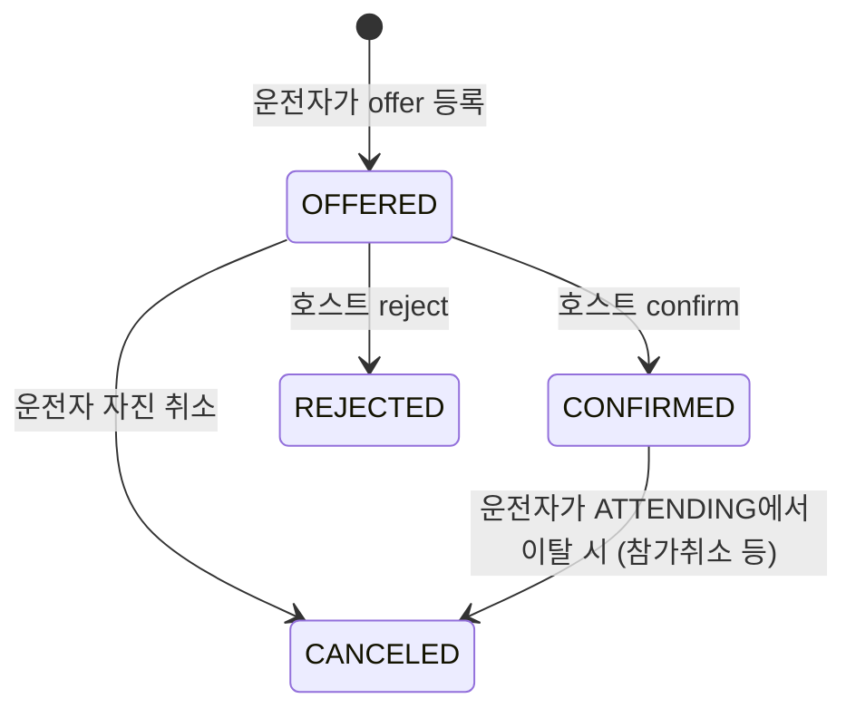
```mermaid
stateDiagram-v2
    [*] --> OFFERED: 운전자가 offer 등록
    OFFERED --> CONFIRMED: 호스트 confirm
    OFFERED --> REJECTED: 호스트 reject
    OFFERED --> CANCELED: 운전자 자진 취소
    CONFIRMED --> CANCELED: 운전자가 ATTENDING에서 이탈 시 (참가취소 등)
```

| 상태 | 의미 | 탑승자 배정 가능 여부 | 알림 |
|---|---|---|---|
| `OFFERED` | 호스트 검토 전 | 불가 | (없음) |
| `CONFIRMED` | 호스트 확정 — 운전자 자격 부여 | 가능 | 77 CARPOOL_OFFER_CONFIRMED |
| `REJECTED` | 호스트 거절 | 불가 | 78 CARPOOL_OFFER_REJECTED |
| `CANCELED` | 취소됨 (자진/이탈) | 배정 자동 해제 + 80 알림 fanout | 80 (탑승자 측) |

CONFIRMED → CANCELED 전이 시: 해당 offer에 배정된 모든 `event_carpool_passenger.offer_id`를 NULL로 되돌리고 탑승자에게 80 알림. `event_carpool_assignment_log`에 swap 사유 기록.

### 10.4 event_transport_config.mode 전이 정책 (신규 — W4, §3.2 / [F03-14](../02_feature_prds/03_event/F03-14_event-transport-mode_prd.md))

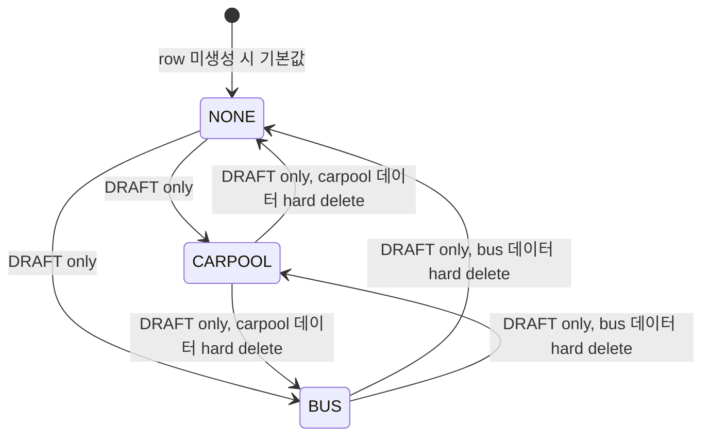
```mermaid
stateDiagram-v2
    [*] --> NONE: row 미생성 시 기본값
    NONE --> CARPOOL: DRAFT only
    NONE --> BUS: DRAFT only
    CARPOOL --> NONE: DRAFT only, carpool 데이터 hard delete
    CARPOOL --> BUS: DRAFT only, carpool 데이터 hard delete
    BUS --> NONE: DRAFT only, bus 데이터 hard delete
    BUS --> CARPOOL: DRAFT only, bus 데이터 hard delete
```

| 현재 이벤트 상태 | 허용 mode 전이 | 비고 |
|---|---|---|
| DRAFT (`published_at IS NULL`) | NONE ↔ CARPOOL ↔ BUS | 이전 mode의 carpool/bus 데이터를 **hard delete** (`EventTransportService.changeMode`). 알림·감사 없음 |
| OPEN | **mode immutable** | `mode` 필드 변경 시 400/409 `MODE_CHANGE_NOT_ALLOWED`. `allowsSelfTransport` 등 mode-internal 토글만 허용 |
| CLOSED/CANCELED/HIDDEN | 변경 금지 | 종료 후 mode는 read-only |

**D2 — 택일 원칙**: CARPOOL과 BUS 동시 운영 불가. 한 이벤트는 한 mode만.

**OPEN에서 변경 가능한 mode-internal 토글**:
- `event_transport_config.allows_self_transport` ([F03-14](../02_feature_prds/03_event/F03-14_event-transport-mode_prd.md))
- `event_bus.allow_self_swap` (좌석 배정자 0명일 때만, 후속 endpoint)
- `event_bus.assignment_mode` (좌석 배정자 0명일 때만, 후속 endpoint — `BUS_NOT_EMPTY` 가드)
- carpool offer 결정 / passenger 배정 등 mode 내부 운영 흐름은 OPEN에서도 항상 가능

DRAFT 상태에서만 hard delete가 안전한 이유: OPEN 이후에는 참가자가 offer 등록·좌석 점유·신청을 한 상태이므로, mode 변경 시 사용자에게 손실이 발생. 후속 정책으로 "OPEN에서 NONE으로의 강제 전환 + 모든 운송 데이터 무효화"는 별도 호스트 액션(`disableTransport`)으로 분리 검토.

### 10.5 event_bus 좌석 점유 모델 (신규 — W7 / [F03-16](../02_feature_prds/03_event/F03-16_event-bus-charter_prd.md))

`event_bus.assignment_mode` 3종에 따라 좌석 점유 상태머신이 분기.

| assignment_mode | 좌석 row 생성 | 좌석 배정 권한 | `allow_self_swap=true` 효과 | 비고 |
|---|---|---|---|---|
| `FREE` | **미생성** (인원 카운트만) | (좌석 없음) | 무효 | `GET seats` 빈 배열. `passengerCount`는 APPROVED 수 추정 |
| `FIXED_BY_HOST` | prepopulate | 호스트만 | 참가자가 **본인 좌석만** swap 가능 | 호스트가 미리 배치 |
| `FIRST_COME` | prepopulate | 호스트는 항상. 참가자는 `allow_self_swap=true`일 때 본인 선택 | 참가자 본인 좌석 선택 허용 | `SELECT ... FOR UPDATE SKIP LOCKED LIMIT 1` 자동 배정 가능 |

좌석별 `event_bus_seat`의 점유 상태머신:

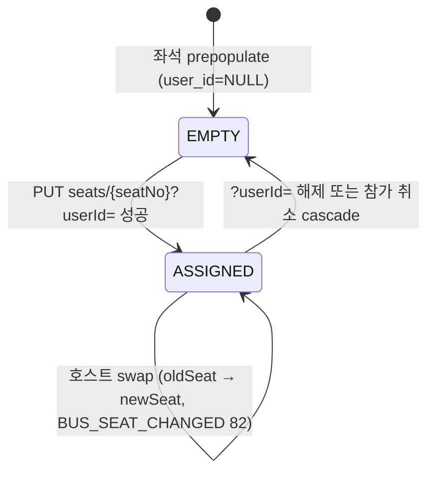
```mermaid
stateDiagram-v2
    [*] --> EMPTY: 좌석 prepopulate (user_id=NULL)
    EMPTY --> ASSIGNED: PUT seats/{seatNo}?userId= 성공
    ASSIGNED --> ASSIGNED: 호스트 swap (oldSeat → newSeat, BUS_SEAT_CHANGED 82)
    ASSIGNED --> EMPTY: ?userId= 해제 또는 참가 취소 cascade
```

**동시성 가드**:
- `event_bus` parent row `FOR UPDATE` 잠금 → seat row `FOR UPDATE` (lock 순서 일관)
- `UNIQUE(event_id, user_id)` 비정규화로 한 이벤트에서 한 사용자가 동시 두 좌석 배정 불가 → `DataIntegrityViolationException` catch → `USER_ALREADY_SEATED_IN_EVENT` 변환
- `event_bus.eventId != pathEventId` 시 400 (E2E S4-7)
- 최대 3대 (`MAX_BUSES_PER_EVENT=3`) — service-level 가드
- `assignment_mode`/`allow_self_swap` 변경은 **좌석 배정자 0명**일 때만 허용 — 후속 endpoint에서 `BUS_NOT_EMPTY` 가드

알림: 좌석 배정 시 `BUS_SEAT_ASSIGNED`(81), 호스트 swap 시 `BUS_SEAT_CHANGED`(82) — payload에 `oldSeat/newSeat`.

### 10.6 후속 (1차 범위 외)

- 환불 비율 정책 (시간대별 100/50/0%) — `EventPaymentRefundService`에서 `refundRatio` 계산 로직 추가.
- WalletRefundExecutor 분리 — W2b에서 인터페이스만 정의, 구현은 후속.
- 카풀 swap 로그 분석 — `event_carpool_assignment_log` 기반 호스트 운영 리포트.
- BUS_FIRST_COME 모드의 자동 배정 SLA — 신청 시 즉시 배정 vs 배치성 배정 결정 필요.

## 11. 2026-06-05 신규 상태기계 (v5.0 delta)

> 본 절은 2026-06-05 기준 추가된 상태기계를 정책 차원에서 요약한다. 전체 enum 전이도와 원천 도메인 매핑은 `08_state_transitions.md §10~16`을 참조한다.

### 11.1 ApplicationStatus — 전체 7값으로 갱신

기존 §2에서 `APPROVED_PENDING_PAYMENT`, `PAYMENT_EXPIRED`는 "현재 서버 enum에 없다"고 기술했으나 실제로 구현 완료됨. 추가로 `CANCEL_PENDING_REFUND`가 정식 추가됨.

전체 7값: `PENDING, APPROVED, APPROVED_PENDING_PAYMENT, PAYMENT_EXPIRED, REJECTED, CANCELED, CANCEL_PENDING_REFUND`.

정책 포인트:
- `CANCEL_PENDING_REFUND`는 정원을 hold하고 노쇼 통계에서 제외된다 (`CheckInService.pendingRefundUserIds` 필터).
- 거절(REJECTED) 시 `ApplicationRejectReasonCode`(7종) 필수 지정. 미지정 시 400.
- 승인 경로의 `CapacityService.createAttendanceFromApplication`에서 `EventApplyRestrictionGuard` 재검사 실행.

### 11.2 NoShowStatus — 신규

`CONFIRMED → APPEALED → OVERTURNED` 전이. 상세는 `08_state_transitions.md §11`.

정책 포인트:
- OVERTURNED 상태에서 제재 카운트에서 제외 (`countRecentNoShows` CONFIRMED+APPEALED 합산, OVERTURNED 제외).
- appeal 기한 미구현(v1 Gap). 무기한 소명 가능.
- `cohost.canManageAttendance` flag 미체크 Gap 존재 (노쇼 확정/뒤집기 권한 불일치).

### 11.3 UnifiedDisputeStatus — 신규

`OPEN, IN_REVIEW, RESOLVED, CLOSED, ESCALATED` 5값. legal hold: OPEN/IN_REVIEW/ESCALATED 상태에서 evidence 삭제 차단, 파일 정리는 RESOLVED/CLOSED 후 1년. 원천 도메인 매핑 전체는 `08_state_transitions.md §12`.

정책 포인트:
- admin API가 USER_DISPUTE 전이를 소유한다. 공개 API는 생성(POST /me/dispute-cases)과 이의(POST /me/.../appeals)만 노출.
- DisputeCaseRetentionScheduler(매일 05:00): terminal 상태 1년 후 evidence S3+metadata 정리.
- DisputeSlaExceededScheduler(매일 06:00): 7일 초과 OPEN/IN_REVIEW/ESCALATED 케이스에 HIGH severity 운영알림.

### 11.4 DisputeAppealStatus — 신규

`PENDING → UPHELD / REJECTED / CLOSED` 4값. PENDING만 본인 철회 가능. admin 인용/기각은 공개 endpoint 없음(Gap). 상세는 `08_state_transitions.md §13`.

### 11.5 RescheduleResponseStatus — 신규

`PENDING, ACCEPTED, DECLINED, AUTO_ACCEPTED, WITHDRAWN` 5값. DECLINED 시 `RefundFaultCategory.RESCHEDULE_DECLINED`(100% 환불) 자동 취소 트리거. 상세는 `08_state_transitions.md §14`.

### 11.6 TransferStatus — 전체 8값으로 갱신

기존 6값에 `BANK_AWAITING_CONFIRM`, `SUPERSEDED` 추가. limbo 상태(BANK_AWAITING_CONFIRM/PENDING_MANUAL_REFUND) 자동 만료 금지. 상세는 `08_state_transitions.md §15`.

### 11.7 DateBlockStatus — 신규

`BLOCKED, UNBLOCKED` 2값. hard delete → soft transition으로 이력 보존. 안전신고 연동 및 legal hold. 상세는 `08_state_transitions.md §16`.
