# 상태 정책 PRD

<!-- supporting-doc-status: 2026-05-22 -->

> 문서 상태: **보조 문서 + W2/W3 event_payment 상태머신 + APPROVED_PENDING_PAYMENT 진입 조건 통합 (2026-05-22)**. 기능별 현재 계약, source trace, Gap/Risk 판단은 [PRD_MIGRATION_STATUS.md](../PRD_MIGRATION_STATUS.md)와 각 기능 PRD를 우선한다. 이 문서는 인벤토리, 정책, QA, 기획 운영 기준을 보조하며, 기능 세부 판단은 [FEATURE_PRD_STANDARD.md](../FEATURE_PRD_STANDARD.md) 기준으로 재확인한다.

이 문서는 화면 설명보다 상태 판단이 중요한 기능만 모은다. 기획자가 버튼 노출, 문구, 알림, 예외 처리를 결정할 때 먼저 확인해야 하는 문서다.

## 1. 이벤트 상태

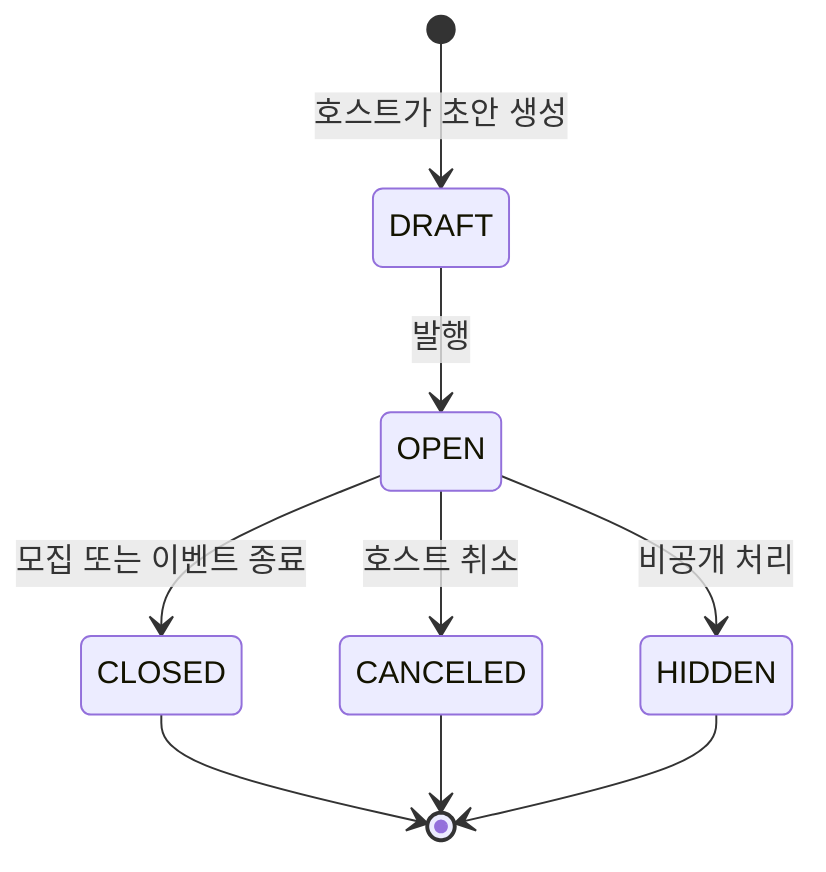

| 상태 | 사용자에게 보이는 의미 | 주요 허용 액션 |
|---|---|---|
| `DRAFT` | 아직 공개되지 않은 작성중 이벤트 | 호스트 편집, 발행 |
| `OPEN` | 모집 또는 참여 가능한 이벤트 | 참가자 신청/취소, 호스트 운영 |
| `CLOSED` | 모집 또는 이벤트가 종료된 상태 | 리뷰, 사진첩, 정산 등 후속 흐름 |
| `CANCELED` | 취소된 이벤트 | 취소 안내, 환불/알림 후속 처리 |
| `HIDDEN` | 일반 노출에서 제외된 이벤트 | 관리자/호스트 정책에 따름 |

## 2. 이벤트 신청과 참석 상태

이벤트에는 "신청 심사"와 "참석 확정/대기"가 함께 존재할 수 있다.

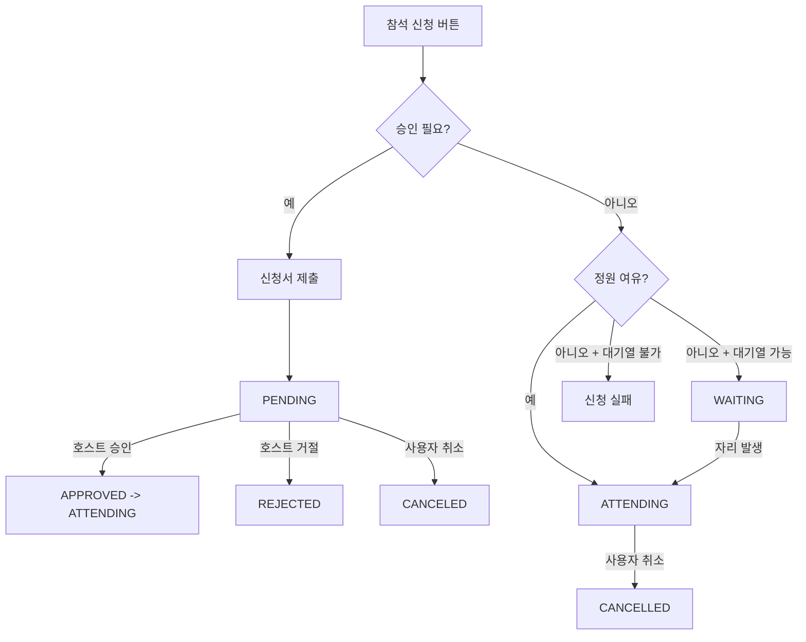

| 구분 | 상태 | 의미 |
|---|---|---|
| 신청서 | `PENDING` | 호스트 검토 전 |
| 신청서 | `APPROVED` | 신청 승인 |
| 신청서 | `REJECTED` | 신청 거절 |
| 신청서 | `CANCELED` | 신청자가 취소 |
| 참석 | `ATTENDING` | 참석 확정 |
| 참석 | `WAITING` | 대기열에 있음 |
| 참석 | `CANCELLED` | 참석이 취소됨 |

기획 주의점:

- `CANCELED`와 `CANCELLED`가 함께 등장한다. 신청서 상태는 `CANCELED`, 참석 상태는 `CANCELLED`로 다룬다.
- 사용자는 "신청 완료", "심사중", "대기중", "참석 확정"을 구분해서 봐야 한다.
- 대기열 승격은 사용자 행동 없이 시스템이 바꿀 수 있으므로 알림이 필요하다.
- 유료 승인제 이벤트는 "승인됨"과 "참석 확정"이 다르다. 승인 후 결제 대기 상태를 별도 표시하고, 결제 성공 후에만 참석 확정으로 보아야 한다.

### 유료 승인제 권장 상태

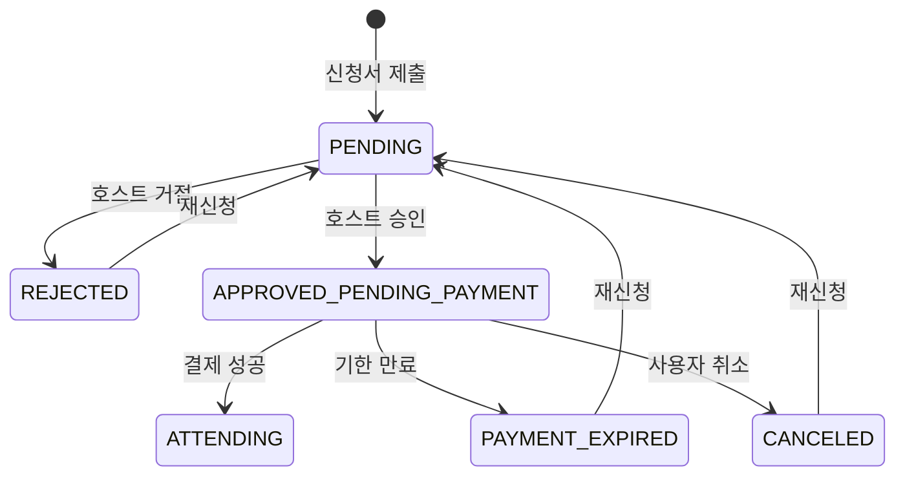

| 상태 | 의미 | 허용 액션 |
|---|---|---|
| `APPROVED_PENDING_PAYMENT` | 호스트는 승인했지만 결제 전 | 참가자 결제, 사용자 취소, 기한 만료 |
| `PAYMENT_EXPIRED` | 승인 후 결제 기한 만료 | 재신청, 상세 안내 |
| `ATTENDING` | 결제까지 완료된 참석 확정 | 취소/환불, 체크인, 위치 공유, 리뷰 |

> **2026-05-22 W2 갱신**: 서버 enum `ApplicationStatus.APPROVED_PENDING_PAYMENT, PAYMENT_EXPIRED`가 추가되었다. 단, 본 정책은 **선입금 활성 이벤트(`EventPrepayment.prepaymentRequired=true`)에 한해서만 적용된다**. 선입금 미활성 유료 이벤트(legacy `event.price > 0 && !prepaymentRequired`)는 기존 PENDING → APPROVED + ATTENDING 흐름 그대로 유지되며 후속 보강 대상이다.

### 2.1 `APPROVED_PENDING_PAYMENT` 진입 조건 명문화 (W2)

`ApplicationStatus.APPROVED_PENDING_PAYMENT`는 다음 두 진입점에서만 발생한다(F03-05 §2.0).

| 진입점 | 조건 | 동작 |
|---|---|---|
| `ApplicationService.apply` | `EventPrepayment.prepaymentRequired=true` + `approvalRequired=false` (자동 승인 + 선입금 활성) | `Application.status=APPROVED_PENDING_PAYMENT + paymentDueAt=...`. attendance/currentCapacity는 없지만 pending party size를 용량 판정에 논리 hold. 알림 71 (after-commit) |
| `ApplicationService.approveApplication` | `EventPrepayment.prepaymentRequired=true` + 호스트가 `PENDING` application을 승인 | 동일하게 `APPROVED_PENDING_PAYMENT + paymentDueAt` 전이. `ApplicationApprovedEvent` 미발행 — 캘린더 sync는 결제 확정 시점에 1회만 |

진입 후 허용 액션:

| 액션 | 결과 상태 |
|---|---|
| 참가자 WALLET 결제 성공 | `APPROVED + ATTENDING + capacity++ + event_payment.PAID` |
| 참가자 BANK_TRANSFER 신고 → 호스트 확인 | 동일 (분개 없음, D5) |
| 참가자 자가 취소 (`DELETE .../apply`) | `event_payment` 상태별 분기(F03-05 §2.6), 종료 상태는 `Application=CANCELED` 또는 `REFUND_REQUESTED 진행` |
| `paymentDueAt < now()` 스케줄러 트리거 | `Application=PAYMENT_EXPIRED`, capacity 변화 없음. 현재 PENDING `event_payment` 취소는 빠져 있음 |
| 호스트 이벤트 취소 (`EventService.cancelEvent`) | facade가 결제 상태별 환불 진행 후 `Application=CANCELED` |

`PAYMENT_EXPIRED` 재신청은 active `event_payment` 행이 없을 때만 허용. 있으면 `PAYMENT_PENDING` 에러.

### 2.2 `event_payment` 상태머신 (W2 신규)

선입금 결제는 별도 `event_payment` row로 추적된다. `purpose=INITIAL`의 active 결제만 application당 1건이고 `GUEST_INCREMENT`는 다건 허용이므로 전체 관계는 1:0..N이다. Application과 결제 상태를 함께 봐야 정확한 액션을 표시할 수 있다.

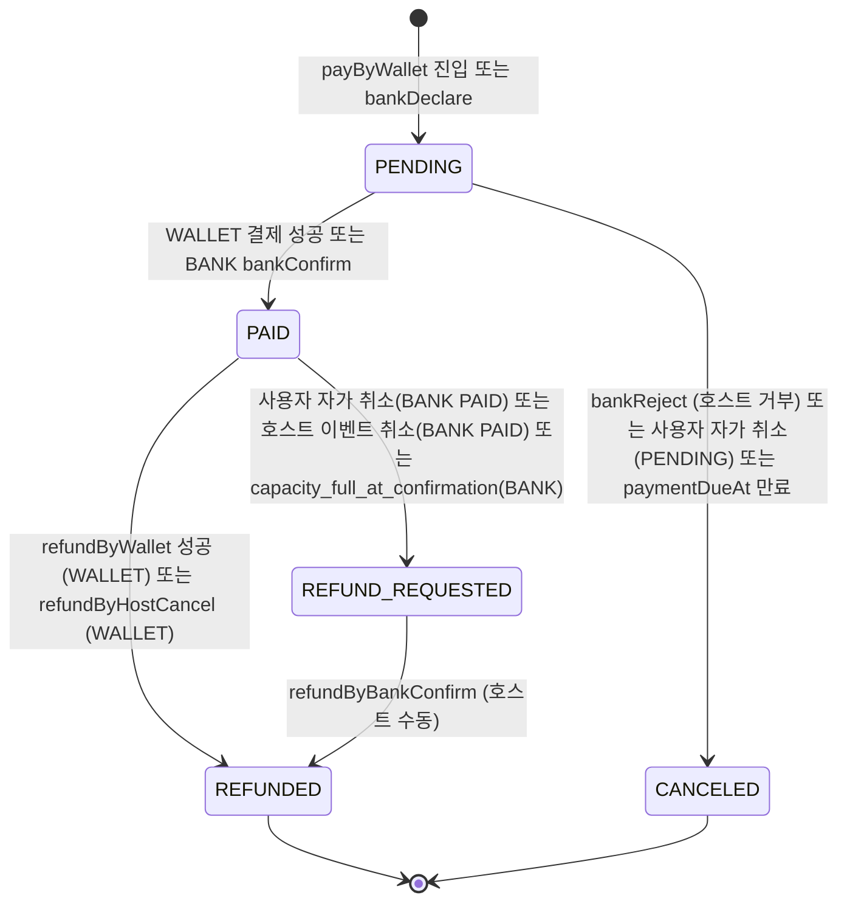

| 상태 | 의미 | 분개 영향 | UI 라벨 |
|---|---|---|---|
| `PENDING` | 결제 시도 중 또는 BANK 입금 신고 후 호스트 확인 대기 | 분개 없음 | "결제 대기 중" / "입금 확인 대기 중" |
| `PAID` | 결제 완료 | WALLET → `recordPayment` 분개 1건. BANK → 분개 없음(D5) | "결제 완료" — 액션바는 "참석 확정" |
| `REFUND_REQUESTED` | 환불 진행 필요 (BANK 사용자 취소 또는 호스트 이벤트 취소 또는 capacity full) | WALLET 환불 시점에 분개. BANK는 분개 없음 | "환불 요청됨 — 호스트 처리 대기" |
| `REFUNDED` | 환불 완료 | WALLET 환불 분개(`recordRefund`). BANK는 분개 없음 | "환불 완료" |
| `CANCELED` | 결제 미진행 종료 (호스트 거부 / 사용자 취소 등) | 분개 없음 | "결제 취소됨 — 재시도 가능". 현재 payment 만료 자동 취소는 미구현 |

상태 전이는 다음 가드를 따른다:

- `event` row 잠금 → `application` row 잠금 → `event_payment` row 잠금 순서(§0.4) 필수
- `Event.status=OPEN`만 결제·BANK 확인 허용. `CANCELED`는 모든 결제 facade 차단. `CLOSED`는 BANK 거부만 허용(이벤트 종료 후에도 입금 미확인 가능).
- `Application.status=APPROVED_PENDING_PAYMENT`만 결제 진입 허용.
- `active_application_id` STORED + UNIQUE로 PENDING/PAID/REFUND_REQUESTED 동시 1건만 허용 (D6).

기획 주의점:

- 사용자 화면에는 `Application.status` 단독이 아니라 `event_payment.status`와 결합한 라벨이 필요하다. 예: `Application=APPROVED_PENDING_PAYMENT` + `event_payment=PENDING(BANK_TRANSFER)`는 "입금 확인 대기"로, 같은 application에 결제 row가 없으면 "결제 필요"로 표시한다.
- 현재 호스트 신청 관리 UI는 `community_app/lib/presentation/event/screens/application_list_screen.dart`의 **결제 대기** 탭(`Application.status=APPROVED_PENDING_PAYMENT`)까지 구현한다. 전용 호스트 결제대기 화면은 없고 카드가 `event_payment.method/status`를 받지 않으므로, `PENDING(BANK_TRANSFER)` 전용 표시·bank confirm/reject와 confirm 결과의 `REFUND_REQUESTED` 라벨 전환은 현재 UI에 없다.
- `REFUNDED → [*]` 종료 후에는 `active_application_id`가 NULL이 되어 같은 application에 신규 PENDING 진입이 다시 가능하다. 단, `Application` 자체가 `CANCELED`로 전이된 경우는 신규 신청이 필요.

## 3. 프라이빗 모임 단계

프라이빗 이벤트는 일반 이벤트와 별도 단계가 있다.

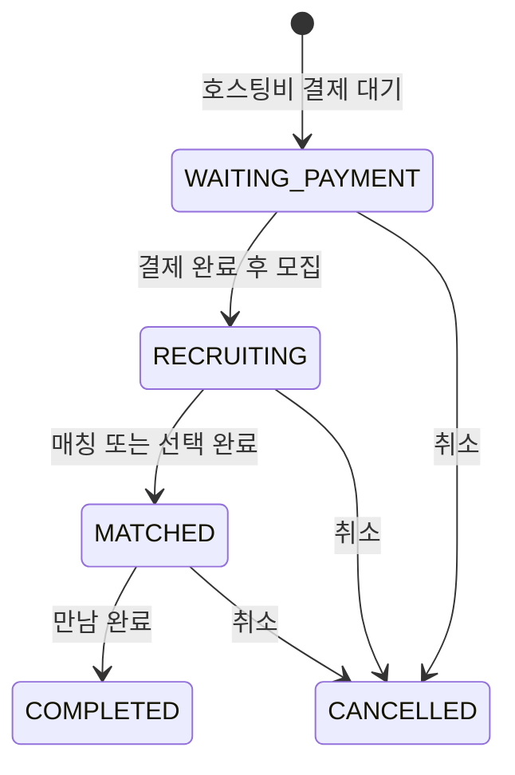

기획 주의점:

| 단계 | 확인할 것 |
|---|---|
| 결제 대기 | 결제 실패/이탈 시 재진입 문구 |
| 모집중 | 신청자 노출, 선택 기준, 마감 기준 |
| 매칭됨 | 상대에게 어떤 정보가 공개되는지 |
| 완료 | 리뷰, 신고, 신뢰점수와의 연결 |

## 4. 모임 정산 상태

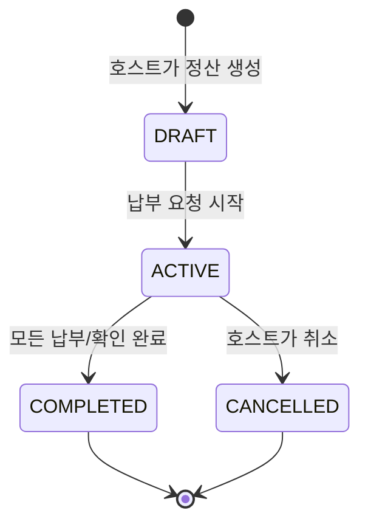

| 상태 | 사용자에게 보이는 의미 | 호스트 액션 | 참가자 액션 |
|---|---|---|---|
| `DRAFT` | 호스트가 작성 중인 정산 — 참가자에게는 **미리보기**로 보인다 | 항목 편집, 참여자 조정, 활성화 | 미리보기 조회만(총액·상태·내 분담금) — 항목 상세·영수증·타인 몫 비공개, 납부·이의제기 불가, 알림 없음 (2026-06-05 정식화) |
| `ACTIVE` | 납부 진행중 | 독촉, 마감 연장, 이체 확인, 취소 | 분담금 확인, 납부, 이의제기 |
| `COMPLETED` | 정산 완료 | 내역 조회 | 내역 조회 |
| `CANCELLED` | 정산 취소 | 내역 조회 | 환불/취소 안내 확인 |

기획 주의점:

- 정산 생성만으로 참가자에게 알림이 가면 안 된다. 일반적으로 진행중 전환 시 납부 알림이 의미 있다.
- 포인트 납부는 즉시 반영되지만, 계좌이체는 호스트 확인이 필요하다.
- 이의제기와 감사로그는 돈의 분쟁을 줄이기 위한 장치다.

## 5. 호스트 정산금 상태

호스트가 받을 수익/정산금은 모임 정산과 별개로 다음 흐름을 가진다.

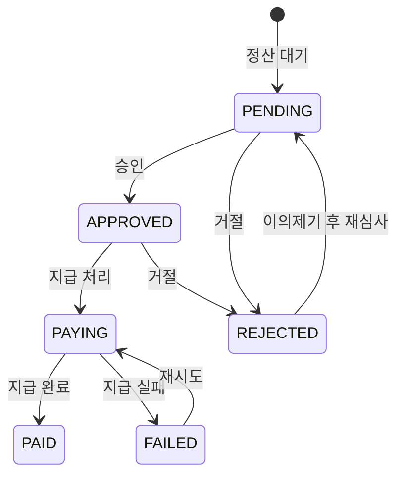

| 상태 | 의미 | 사용자 액션 |
|---|---|---|
| `PENDING` | 검토 또는 대기 중 | 기다림 |
| `APPROVED` | 지급 승인됨 | 상태 확인 |
| `PAYING` | 실제 지급 처리 중 | 상태 확인 |
| `PAID` | 지급 완료 | 상세/영수 확인 |
| `FAILED` | 지급 실패 | 재시도 또는 고객센터 |
| `REJECTED` | 지급 거절 | 이의제기 가능 |

## 6. 플랜과 마켓 상품 상태

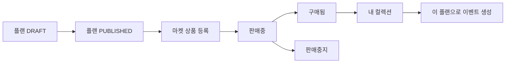

기획 주의점:

- 플랜 초안은 크리에이터의 편집 대상이고, 마켓 상품은 구매자의 구매 대상이다.
- 구매자는 구매 후 컬렉션에서 활용한다.
- 이미 구매한 상품, 일부 중복 번들, 잔액 부족은 구매 바텀시트에서 명확히 분기해야 한다.

## 7. 데이터 내보내기와 계정 삭제

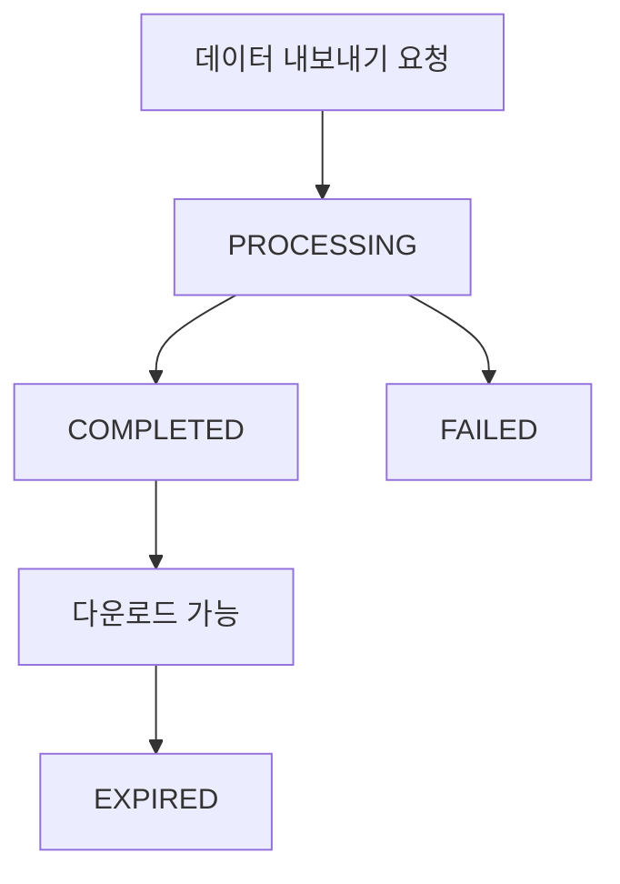

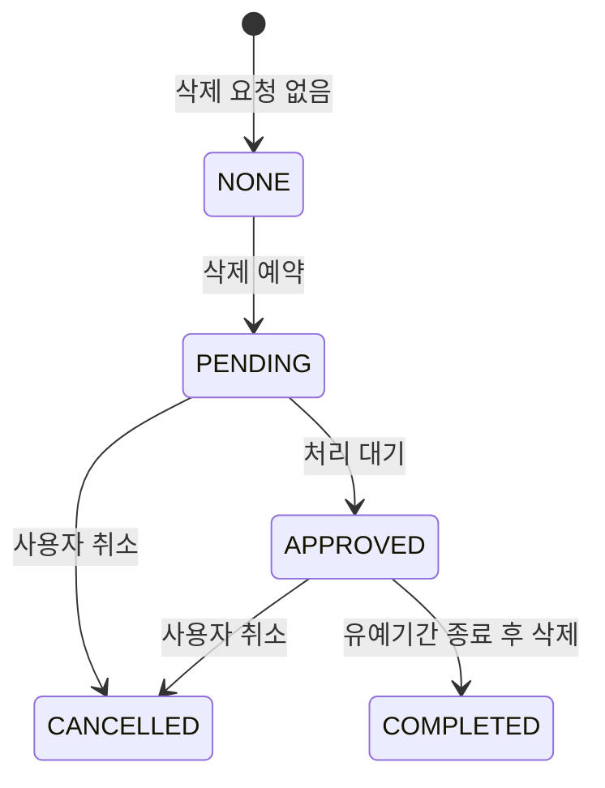

기획 주의점:

- 데이터 내보내기는 즉시 파일을 주는 기능이 아니라 비동기 요청이다.
- 계정 삭제 예약은 유예기간과 취소 동선이 중요하다.
- 즉시 비활성화는 삭제 예약과 사용자 영향이 다르므로 별도 문구가 필요하다.

## 8. 위치 공유 상태

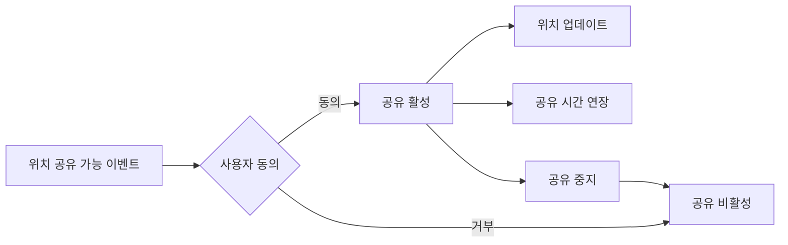

기획 주의점:

- 위치 공유는 항상 opt-in으로 다뤄야 한다.
- 중지 버튼과 프라이버시 대시보드가 함께 있어야 사용자가 통제권을 가진다.
- 이벤트 종료 후 위치 데이터 보관/삭제 정책을 화면 문구와 맞춰야 한다.

## 9. 알림 수신 정책

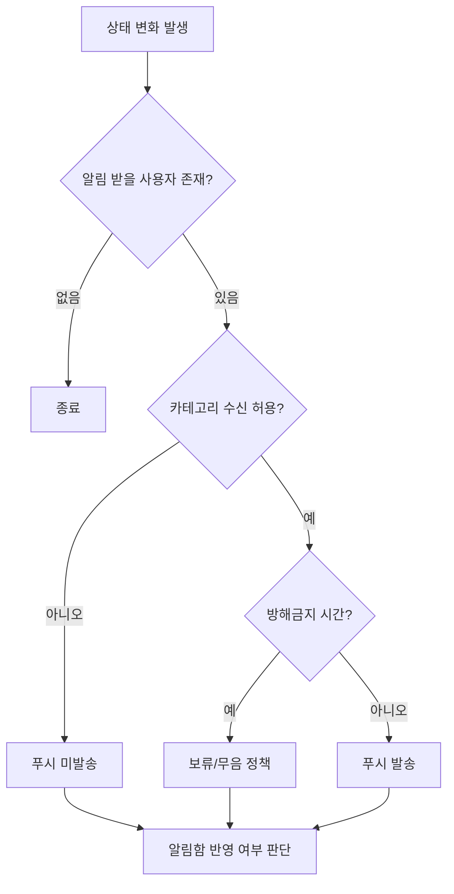

기획 주의점:

- 알림은 "무엇을 보낼까"보다 "누가 받아야 하는가"가 먼저다.
- 결제/정산 알림은 마케팅 알림보다 중요도가 높다.
- OS 권한 거부 상태에서는 인앱 알림함과 권한 회복 배너를 함께 고려해야 한다.

## PRD 수용 기준

- 모든 상태 전이는 사용자에게 보이는 문구, 허용 액션, 알림 여부가 함께 정의되어야 한다.
- 상태 변경 후 이전 화면의 CTA가 오래된 상태를 보여주지 않아야 한다.
- 취소, 만료, 삭제, 차단 상태는 성공 상태와 별도의 복구 동선을 가져야 한다.

## 10. 이벤트 선입금·교통 상태머신 (2026-07-29 현재 소스)

> 현재 `ApplicationStatus`, 결제/교통 enum, Service, DDL과 테스트를 기준으로 한다. 삭제된 event-extensions 계획의 예정 전이는 구현으로 간주하지 않는다.

### 10.1 Application 상태머신 — 결제와 Attendance 분리

`ApplicationStatus`의 실제 7값은 `PENDING, APPROVED, APPROVED_PENDING_PAYMENT, PAYMENT_EXPIRED, REJECTED, CANCELED, CANCEL_PENDING_REFUND`다. `ATTENDING`은 Application 상태가 아니라 별도 `EventAttendance.status`다.

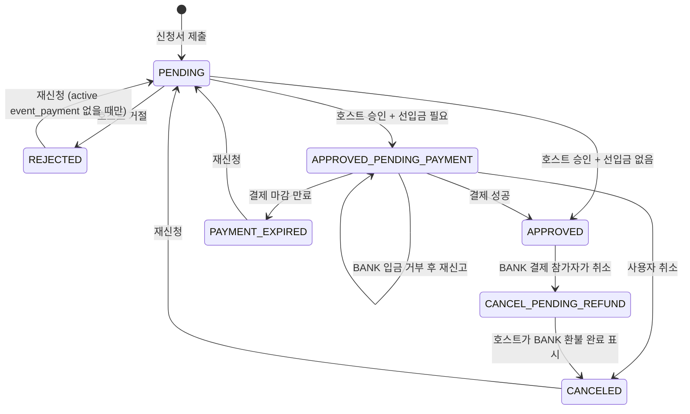

| 상태 | 의미 | 허용 액션 | 관련 event_payment 상태 |
|---|---|---|---|
| `APPROVED_PENDING_PAYMENT` | 승인 + 결제 대기 | 결제, 취소, 만료, BANK 재신고 | active payment가 없거나 BANK PENDING |
| `PAYMENT_EXPIRED` | 결제 마감 시간 지남 | 재신청 | 현재 scheduler는 application만 bulk update하여 PENDING payment가 남을 수 있음 |
| `APPROVED` | 결제 또는 무료 승인 완료 | 취소/환불, 참석 row 기반 체크인 | PAID일 수 있음 |
| `CANCEL_PENDING_REFUND` | BANK 취소 후 외부 환불 확인 대기 | 호스트 환불 완료 표시 | REFUND_REQUESTED, capacity hold |

결제 성공 시 Application은 `APPROVED`가 되고 별도 `EventAttendance(ATTENDING)`가 생성된다. 현재 만료 bulk update는 payment 취소와 만료 event 발행을 하지 않아 orphan active payment 위험이 있다.

### 10.2 event_payment 상태머신

`EventPaymentPurpose = INITIAL | GUEST_INCREMENT`다. `uk_event_payment_active`는 status가 `PENDING/PAID/REFUND_REQUESTED`인 **INITIAL**만 application당 1건으로 제한하며, 게스트 증분 결제는 다건을 허용한다.

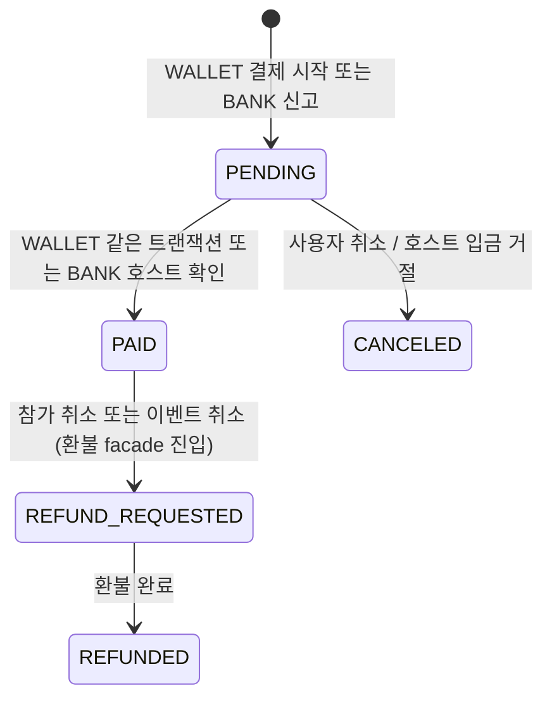

| 상태 | 의미 | application 영향 | 알림 |
|---|---|---|---|
| `PENDING` | WALLET 처리 중 또는 BANK 신고 대기 | APPROVED_PENDING_PAYMENT | 71은 application event, 72는 BANK 신고 event |
| `PAID` | 결제 완료 | APPROVED + 별도 ATTENDING | BANK 확인은 73, WALLET은 기존 `PAYMENT_COMPLETED` |
| `REFUND_REQUESTED` | 환불 진행 중 | BANK 사용자 취소면 CANCEL_PENDING_REFUND | 83은 최초 전이가 아니라 기본 3일 후 escalation |
| `REFUNDED` | 환불 완료 | CANCELED 정리 가능 | 76 |
| `CANCELED` | 결제 미진행 종료/입금 거부 | BANK reject에서는 APPROVED_PENDING_PAYMENT 유지 | 74 |

**만료 Gap**: `ApplicationPaymentExpiryScheduler`는 application만 bulk update한다. PENDING payment를 CANCELED로 바꾸지 않고 `ApplicationPaymentExpiredEvent`도 발행하지 않아 75 listener는 dead wiring이다.

**회계 분개**: WALLET 결제·환불만 ledger에 기록한다. BANK_TRANSFER는 확인·환불까지 전 과정이 off-ledger다.

### 10.3 event_carpool_offer 상태 값과 실제 전이

운전자가 등록하는 카풀 offer 라이프사이클.

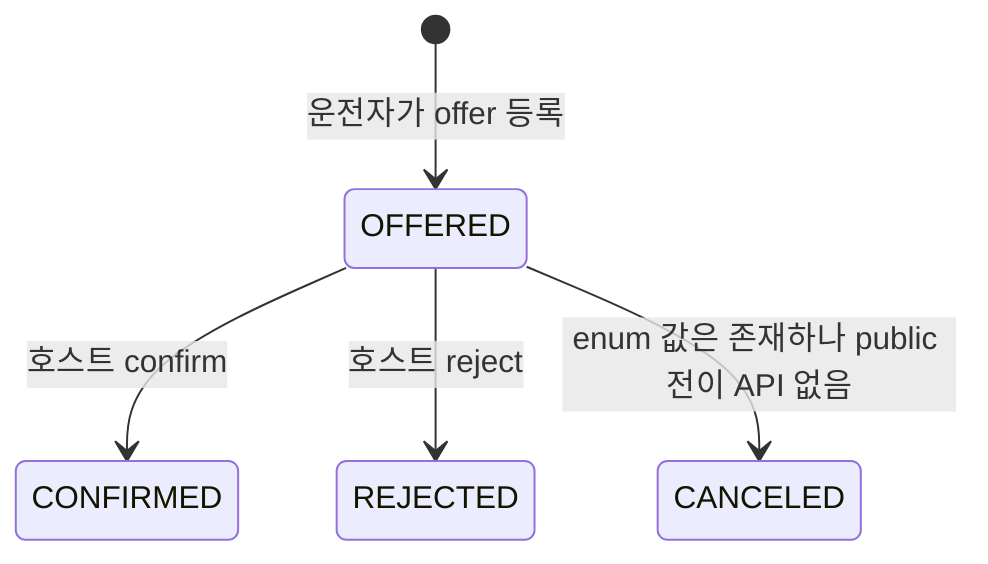

| 상태 | 의미 | 탑승자 배정 가능 여부 | 알림 |
|---|---|---|---|
| `OFFERED` | 호스트 검토 전 | 불가 | (없음) |
| `CONFIRMED` | 호스트 확정 — 배정 대상 | 가능 | 77 enum만 있고 생산 알림 없음 |
| `REJECTED` | 호스트 거절 | 불가 | 78 enum만 있고 생산 알림 없음 |
| `CANCELED` | enum 값 | 불가 | public cancel/cascade 구현 없음 |

현재 decision 서비스는 입력을 CONFIRMED/REJECTED로 제한하지만 기존 status를 검사하지 않아 재결정할 수 있다. offer 취소, 참석 이탈 cascade, 탑승자 자동 해제, 77~80 알림, `event_carpool_assignment_log` insert는 구현되어 있지 않다.

### 10.4 event_transport_config.mode 전이 정책 ([F03-14](../02_feature_prds/03_event/F03-14_event-transport-mode_prd.md))

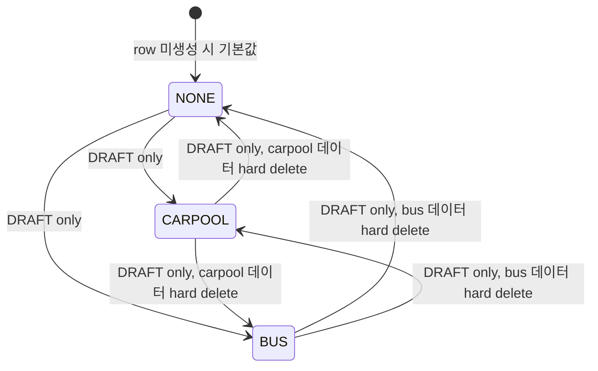

| 현재 이벤트 상태 | 허용 mode 전이 | 비고 |
|---|---|---|
| DRAFT (`published_at IS NULL`) | NONE ↔ CARPOOL ↔ BUS | 이전 mode의 carpool/bus 데이터를 **hard delete** (`EventTransportService.changeMode`). 알림·감사 없음 |
| OPEN | **mode immutable** | mode 변경 시 `INVALID_EVENT_STATUS`. `allowsSelfTransport` 단독 변경은 허용 |
| CLOSED/CANCELED/HIDDEN | mode 변경 금지 | 그러나 현재 서비스는 `allowsSelfTransport` 단독 변경을 허용하는 Gap이 있음 |

**D2 — 택일 원칙**: CARPOOL과 BUS 동시 운영 불가. 한 이벤트는 한 mode만.

버스의 `allowSelfSwap`·`assignmentMode`를 수정하는 endpoint는 없다. mode 내부 카풀·버스 write는 각 서비스의 개별 상태 검사를 따르며, 일관된 OPEN gate가 있는 것은 아니다.

### 10.5 event_bus 좌석 점유 모델 ([F03-16](../02_feature_prds/03_event/F03-16_event-bus-charter_prd.md))

`event_bus.assignment_mode` 3종에 따라 좌석 점유 상태머신이 분기.

| assignment_mode | 좌석 row 생성 | 좌석 배정 권한 | `allow_self_swap=true` 효과 | 비고 |
|---|---|---|---|---|
| `FREE` | **미생성** | target seat가 없어 PUT 사용 불가 | 무효 | GET seats 빈 배열 |
| `FIXED_BY_HOST` | selectable seat prepopulate | Host/CoHost, 또는 `allowSelfSwap=true` self | target user 덮어쓰기 | service는 assignmentMode를 검사하지 않음 |
| `FIRST_COME` | selectable seat prepopulate | FIXED_BY_HOST와 같은 PUT | target user 덮어쓰기 | 이름과 달리 자동 배정·SKIP LOCKED 없음 |

좌석별 `event_bus_seat`의 점유 상태머신:

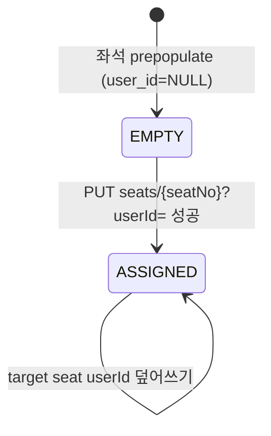

**실제 동시성/제약**:

- add/assign은 event row를 잠가 같은 이벤트 write를 직렬화한다. seat row 전용 `FOR UPDATE`와 `SKIP LOCKED`는 없다.
- `UNIQUE(event_id, user_id)`가 중복을 막지만 위반은 `USER_ALREADY_SEATED_IN_EVENT`가 아닌 일반 `INVALID_REQUEST`로 변환된다.
- `userId`는 primitive long이라 null unassign이 불가능하고, 기존 사용자 좌석을 먼저 비우지 않아 좌석 이동이 unique 위반이 될 수 있다.
- self 요청은 참석/대기 자격, assignmentMode, `lockedByHost`를 검사하지 않는다.
- 좌석 변경 log는 기록하지만 81~82 생산 알림은 없다.

### 10.6 현재 상태 Gap

- 만료 application과 PENDING payment를 같은 트랜잭션에서 정리하고 75 event를 발행해야 한다.
- 카풀 decision 선행상태, cancel/cascade, assignment log, 77~80 알림이 없다. register는 assignedOfferId를 정리하지 않고 assign과 경합하면 lost update 가능하다.
- `allowsSelfTransport` terminal-state 변경이 가능하고 SELF/DRIVER 선택에 소비되지 않는 inert flag다.
- carpool decide/register/assign/report와 bus add/assign은 event status 가드가 없어 CLOSED/CANCELED에서도 mutation할 수 있다.
- 버스 FIRST_COME 자동 배정, 진짜 swap/unassign, locked seat·참석 자격 검사, 81~82 알림이 없다.
- Flutter에는 transport/bus 운영 화면이 없고 카풀 신고 route도 인앱 navigation caller가 없다.

## 11. 2026-06-05 신규 상태기계 (v5.0 delta)

> 본 절은 2026-06-05 기준 추가된 상태기계를 정책 차원에서 요약한다. 전체 enum 전이도와 원천 도메인 매핑은 `08_state_transitions.md §10~16`을 참조한다.

### 11.1 ApplicationStatus — 전체 7값으로 갱신

기존 §2에서 `APPROVED_PENDING_PAYMENT`, `PAYMENT_EXPIRED`는 "현재 서버 enum에 없다"고 기술했으나 실제로 구현 완료됨. 추가로 `CANCEL_PENDING_REFUND`가 정식 추가됨.

전체 7값: `PENDING, APPROVED, APPROVED_PENDING_PAYMENT, PAYMENT_EXPIRED, REJECTED, CANCELED, CANCEL_PENDING_REFUND`.

정책 포인트:
- `CANCEL_PENDING_REFUND`는 정원을 hold하고 노쇼 통계에서 제외된다 (`CheckInService.pendingRefundUserIds` 필터).
- 거절(REJECTED) 시 `ApplicationRejectReasonCode`(7종) 필수 지정. 미지정 시 400.
- 승인 경로의 `CapacityService.createAttendanceFromApplication`에서 `EventApplyRestrictionGuard` 재검사 실행.

### 11.2 NoShowStatus — 신규

`CONFIRMED → APPEALED → OVERTURNED` 전이. 상세는 `08_state_transitions.md §11`.

정책 포인트:
- OVERTURNED 상태에서 제재 카운트에서 제외 (`countRecentNoShows` CONFIRMED+APPEALED 합산, OVERTURNED 제외).
- appeal 기한 미구현(v1 Gap). 무기한 소명 가능.
- `cohost.canManageAttendance` flag 미체크 Gap 존재 (노쇼 확정/뒤집기 권한 불일치).

### 11.3 UnifiedDisputeStatus — 신규

`OPEN, IN_REVIEW, RESOLVED, CLOSED, ESCALATED` 5값. legal hold: OPEN/IN_REVIEW/ESCALATED 상태에서 evidence 삭제 차단, 파일 정리는 RESOLVED/CLOSED 후 1년. 원천 도메인 매핑 전체는 `08_state_transitions.md §12`.

정책 포인트:
- admin API가 USER_DISPUTE 전이를 소유한다. 공개 API는 생성(POST /me/dispute-cases)과 이의(POST /me/.../appeals)만 노출.
- DisputeCaseRetentionScheduler(매일 05:00): terminal 상태 1년 후 evidence S3+metadata 정리.
- DisputeSlaExceededScheduler(매일 06:00): 7일 초과 OPEN/IN_REVIEW/ESCALATED 케이스에 HIGH severity 운영알림.

### 11.4 DisputeAppealStatus — 신규

`PENDING → UPHELD / REJECTED / CLOSED` 4값. PENDING만 본인 철회 가능. admin 인용/기각은 공개 endpoint 없음(Gap). 상세는 `08_state_transitions.md §13`.

### 11.5 RescheduleResponseStatus — 신규

`PENDING, ACCEPTED, DECLINED, AUTO_ACCEPTED, WITHDRAWN` 5값. DECLINED 시 `RefundFaultCategory.RESCHEDULE_DECLINED`(100% 환불) 자동 취소 트리거. 상세는 `08_state_transitions.md §14`.

### 11.6 TransferStatus — 전체 8값으로 갱신

기존 6값에 `BANK_AWAITING_CONFIRM`, `SUPERSEDED` 추가. limbo 상태(BANK_AWAITING_CONFIRM/PENDING_MANUAL_REFUND) 자동 만료 금지. 상세는 `08_state_transitions.md §15`.

### 11.7 DateBlockStatus — 신규

`BLOCKED, UNBLOCKED` 2값. hard delete → soft transition으로 이력 보존. 안전신고 연동 및 legal hold. 상세는 `08_state_transitions.md §16`.
