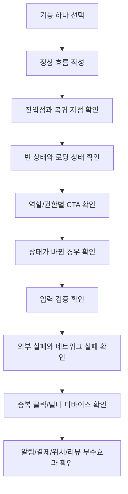

# 시나리오 커버리지 PRD

<!-- supporting-doc-status: 2026-05-18 -->

> 문서 상태: **보조 문서**. 기능별 현재 계약, source trace, Gap/Risk 판단은 [PRD_MIGRATION_STATUS.md](../PRD_MIGRATION_STATUS.md)와 각 기능 PRD를 우선한다. 이 문서는 인벤토리, 정책, QA, 기획 운영 기준을 보조하며, 기능 세부 판단은 [FEATURE_PRD_STANDARD.md](../FEATURE_PRD_STANDARD.md) 기준으로 재확인한다.

원문에는 기능별 시나리오가 총 987개 있다. 이 문서는 그 시나리오를 전부 다시 복사하는 대신, 기획자가 새 기능이나 화면을 검토할 때 어떤 종류의 시나리오를 빠뜨리면 안 되는지 검산하는 기준표다.

## 커버리지 원칙

모든 기능 카드는 최소한 다음 8개 범주를 기준으로 검토한다.

| 범주 | 질문 | 예시 |
|---|---|---|
| 정상 흐름 | 사용자가 기대한 대로 성공하는가 | 회원가입 완료, 이벤트 신청 성공, 정산 납부 완료 |
| 진입/복귀 | 어디서 들어오고 어디로 돌아가는가 | 홈 카드, 알림 딥링크, 백버튼 복귀 |
| 빈 상태 | 데이터가 없을 때 자연스러운가 | 리뷰 없음, 검색 결과 없음, 등록 기기 없음 |
| 권한/역할 | 이 사용자가 이 액션을 할 수 있는가 | 비호스트 정산 생성 차단, 타인 리뷰 수정 차단 |
| 상태 불일치 | 화면을 보는 사이 상태가 바뀌면? | 정원 마감, 이미 취소된 이벤트, 만료된 토큰 |
| 입력 검증 | 값이 부족하거나 잘못되면? | 비밀번호 약함, 금액 범위 초과, 시간 역전 |
| 실패/복구 | 네트워크나 외부 시스템이 실패하면? | PG 실패, SMTP 실패, 지도 시스템 연동 장애 |
| 중복/동시성 | 같은 액션을 반복하거나 여러 기기에서 하면? | 중복 신청, 토큰 동시 갱신, 일괄 승인 충돌 |

## 시나리오 검산 흐름



## 단위별 시나리오 수

| 영역 | 기능 수 | 시나리오 수 | 기능당 평균 | 보강 시 우선 확인할 시나리오 |
|---|---:|---:|---:|---|
| 01 인증 & 온보딩 | 8 | 82 | 10.3 | 토큰, 메일, 소셜 앱 연동 모듈, 계정 상태 |
| 02 홈 피드 | 5 | 38 | 7.6 | 부분 실패, 캐시, 비로그인, 카드 라우팅 |
| 03 이벤트 | 12 | 111 | 9.3 | 정원, 승인, 유료 승인제, 결제, 대기열, 체크인 |
| 04 클럽 | 16 | 189 | 11.8 | 권한, 멤버십, 게시판, 기금, 구독 |
| 05 검색 | 5 | 41 | 8.2 | 입력 전/입력 중/결과, 필터, 기록 |
| 06 결제 & 지갑 | 10 | 71 | 7.1 | PG 실패, 잔액 부족, 유료 승인제 승인 후 결제, 환불, 자동충전 |
| 07 모임 정산 | 10 | 84 | 8.4 | 작성중/진행중, 납부, 이체 확인, 이의 |
| 08 플랜 마켓 | 13 | 107 | 8.2 | 초안/발행, 구매 중복, 컬렉션, 리뷰 |
| 09 프라이빗 데이팅 | 8 | 70 | 8.8 | 인증, 매칭, 채팅, 만남, 차단 |
| 10 캘린더 | 5 | 40 | 8.0 | 라우팅, 반복, 충돌, 공개 범위 |
| 11 리뷰 & 신고 | 6 | 39 | 6.5 | 작성 자격, 중복, 자기 신고, 신뢰점수 |
| 12 알림 | 6 | 38 | 6.3 | 권한, 카테고리, 방해금지, 토큰 |
| 13 프로필 & 설정 | 7 | 35 | 5.0 | 데이터 내보내기, 삭제/비활성화, 주소 |
| 14 위치 & 길찾기 | 6 | 42 | 7.0 | opt-in/out, 위치 권한, 외부 지도 |

## 단위별 필수 시나리오 범주

| 영역 | 정상 | 빈 상태 | 권한 | 상태 변화 | 입력 검증 | 외부 실패 | 중복/동시성 | 부수효과 |
|---|:-:|:-:|:-:|:-:|:-:|:-:|:-:|:-:|
| 01 인증 & 온보딩 | O | O | O | O | O | O | O | O |
| 02 홈 피드 | O | O | O | O |  | O | O | O |
| 03 이벤트 | O | O | O | O | O | O | O | O |
| 04 클럽 | O | O | O | O | O | O | O | O |
| 05 검색 | O | O | O | O | O | O | O | O |
| 06 결제 & 지갑 | O | O | O | O | O | O | O | O |
| 07 모임 정산 | O | O | O | O | O | O | O | O |
| 08 플랜 마켓 | O | O | O | O | O | O | O | O |
| 09 프라이빗 데이팅 | O | O | O | O | O | O | O | O |
| 10 캘린더 | O | O | O | O | O | O | O | O |
| 11 리뷰 & 신고 | O | O | O | O | O | O | O | O |
| 12 알림 | O | O | O | O | O | O | O | O |
| 13 프로필 & 설정 | O | O | O | O | O | O | O | O |
| 14 위치 & 길찾기 | O | O | O | O | O | O | O | O |

## 핵심 여정별 빠뜨리기 쉬운 시나리오

### 가입/인증

| 시나리오 | 왜 중요한가 |
|---|---|
| 이메일 인증 전 로그인 | 사용자는 가입했다고 생각하지만 서비스 진입이 막힐 수 있음 |
| 인증 메일 재발송 제한 | 스팸/남용 방지와 UX 대기 안내가 함께 필요 |
| 소셜 가입 후 추가정보 미입력 이탈 | 가입은 됐지만 추천 불가능 상태가 될 수 있음 |
| 토큰 만료 중 여러 요청 동시 발생 | 사용자가 갑자기 로그아웃되는 것처럼 보일 수 있음 |
| 마지막 로그인 수단 해제 시도 | 계정 잠김을 막아야 함 |

### 이벤트/클럽 참여

| 시나리오 | 왜 중요한가 |
|---|---|
| 정원이 찬 직후 신청 | 리스트에서는 가능해 보였지만 상세에서는 실패할 수 있음 |
| 대기열 자동 승격 | 사용자 행동 없이 상태가 바뀌므로 알림과 CTA 갱신이 필요 |
| 호스트가 자기 이벤트에 신청 | 권한상 막아야 하며 메시지가 명확해야 함 |
| 이벤트 취소 후 유료 참가자 환불 | 돈과 알림이 동시에 움직임 |
| 유료 승인제 이벤트의 승인 후 결제 | 승인, 정원 예약, 결제, 참석 확정이 분리됨 |
| 클럽 멤버 추방/차단 | 게시글, 이벤트, 구독, 환불까지 영향 가능 |

### 결제/정산

| 시나리오 | 왜 중요한가 |
|---|---|
| 결제수단 등록 후 PG 콜백 실패 | 사용자는 완료했다고 생각할 수 있음 |
| 자동충전 실패 후 원래 결제 실패 | 실패 원인을 두 단계로 설명해야 함 |
| 승인제 유료 이벤트에서 미승인 사용자가 결제 시도 | 돈을 먼저 받으면 거절/환불 리스크가 생김 |
| 정산 활성화 전 항목 부족 | 참가자에게 잘못된 납부 요청을 보내면 안 됨 |
| 계좌이체 후 호스트 미확인 | 참가자는 냈다고 생각하지만 시스템은 미완료일 수 있음 |
| 이의제기 수락/기각 | 금액, 상태, 알림, 감사로그가 함께 바뀜 |

### 데이팅/위치/안전

| 시나리오 | 왜 중요한가 |
|---|---|
| 미인증 사용자의 데이팅 진입 | 안전 신뢰의 출발점 |
| 상호 좋아요 직후 한쪽이 차단 | 매칭/채팅 상태 cascade가 필요 |
| 만남 제안 후 일정/장소 변경 | 캘린더와 위치 안내에 영향 |
| 위치 권한 영구 거부 | 앱 안 CTA만으로 해결되지 않고 OS 설정이 필요 |
| 위치 공유 자동 만료 | 사용자가 계속 보인다고 오해하지 않게 해야 함 |

### 리뷰/신고/신뢰

| 시나리오 | 왜 중요한가 |
|---|---|
| 미참석자의 리뷰 작성 | 평판 조작을 막아야 함 |
| 중복 리뷰/중복 신고 | 운영 큐와 점수 왜곡 방지 |
| 본인 신고 | 악용과 오류를 막아야 함 |
| 리뷰 수정/삭제 후 신뢰점수 | 점수가 언제 재계산되는지 명확해야 함 |
| 데이터 부족한 취향 프로필 | 빈 차트보다 설명 있는 빈 상태가 필요 |

## 기능 카드 작성 전 체크

```text
기능 ID:
기능명:

[ ] 정상 성공 흐름이 있다.
[ ] 사용자가 들어오는 진입점이 2개 이상이면 모두 적었다.
[ ] 빈 상태, 로딩, 전체 실패, 부분 실패를 구분했다.
[ ] 비로그인/로그인/소유자/관리자/대상자 권한이 구분됐다.
[ ] 상태가 화면 진입 후 바뀌는 경우를 적었다.
[ ] 입력값 범위와 필수값을 적었다.
[ ] 외부 시스템 실패를 적었다.
[ ] 중복 클릭, 재시도, 멀티 디바이스를 적었다.
[ ] 돈, 알림, 캘린더, 위치, 리뷰/신뢰 영향이 있는지 확인했다.
```
